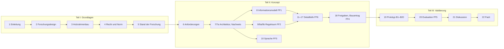

# 1 Einleitung

Status: Entwurf v0.1 (27.09.2026). Zahlen und Befunde tragen den Status [V] (an der Primärquelle geprüft) oder [U] (unsicher). Die Recherchedokumentation liegt in `../recherche/`, das Literaturverzeichnis in `literatur/lit-*.bib`. Das Zielbild, auf das sich dieses Kapitel stützt, steht in `../00-zielbild.md`.

## 1.1 Problemstellung

### 1.1.1 Ein wachsendes Segment mit einem Prozess aus der Zeit vor dem Modell

Der Fertigbau ist im deutschen Ein- und Zweifamilienhausbau kein Nischensegment mehr. Im Jahr 2025 entfielen 26,5 % der genehmigten Ein- und Zweifamilienhäuser auf Fertighäuser, das sind 13.473 von 50.755 Gebäuden. In Bayern lag die Quote mit 27,5 % noch höher; dort wurden 3.633 Fertighäuser genehmigt, 19 % mehr als im Vorjahr [@bdf2026quote] [V]. Der Branchenverband deutet den Anstieg als Zeichen, dass der Fertigbau schneller aus der Baukrise findet als der konventionelle Bau [@bdf2026baugenehmigungen]. Das Jahr davor war schwach: 2024 wurden 15,5 % weniger Wohngebäude aus Fertigteilen errichtet als 2023 [@destatis2025fertigteilbau] [V].

In der Fertigung ist der Holzfertigbau weit industrialisiert. Wandanlagen, Abbundmaschinen und Roboter verarbeiten Maschinendaten, die aus einem Werkplanungsmodell stammen [@heinzmann2022automatisierung]. Der Weg zu diesem Werkplanungsmodell ist dagegen kaum industrialisiert. Er folgt heute in der Regel der Kette

> Beratung → Entwurf → Vertrag → Bemusterung → Bauantrag → Werkplanung → Fertigung → Montage

(Kapitel 3.4). An jedem Übergang wechseln die zuständige Person und das Werkzeug, und an fast jedem Übergang entsteht die Information neu. Drei Probleme folgen daraus: Planungsschleifen, Medienbrüche und ein wachsender Engpass an Fachkräften. Sie verstärken sich gegenseitig.

### 1.1.2 Planungsschleifen

Ein Fertighauskunde formuliert seine Wünsche nicht in einem Modell, sondern im Gespräch mit dem Vertrieb. Der Vertrieb übersetzt sie in einen Planstand, der Kunde prüft ihn, formuliert neue Wünsche, und es entsteht der nächste Planstand. Jede Schleife bindet Personal, verzögert den Vertrag und erhöht das Risiko, dass eine Änderung erst spät, im ungünstigsten Fall nach Fertigungsbeginn, bekannt wird.

Die Bauforschung belegt die Wirkung solcher Änderungen gut, allerdings überwiegend für den konventionellen Bau:

- In 359 Projekten der CII-Datenbank lagen die direkten Kosten der Nacharbeit „oft bei rund 5 %“ der Baukosten. Hauptquellen waren auftraggeberseitige Änderungen und Planungsfehler [@hwang2009measuring] [V].
- In 161 australischen Projekten waren vom Auftraggeber veranlasste Änderungen und ein unwirksamer IT-Einsatz der Planer signifikante Treiber der Nacharbeit [@love2004determinants] [V].
- Späte Änderungen senken die Arbeitsproduktivität stärker als frühe; das zeigt eine Auswertung von 162 Projekten [@ibbs2005impact] [V].
- Im vorgefertigten Holzbau stören späte Kundenänderungen die Produktion unmittelbar [@stehn2002integrated]. Eine britische Fallstudie aus dem modernen Methodenbau beziffert den Effekt: Eine Brandschutzänderung 13 Wochen nach Fertigungsbeginn kostete vier Wochen Verzug [@mubashar2026unlocking] [V].
- In einem Review über 39 empirische Studien zum Modulbau steht „fehlerhafte Planung und Änderungen“ auf Rang 7 von 30 kritischen Risikofaktoren, weil der Fertigungsplan nach dem Start praktisch keine Änderungen mehr zulässt [@wuni2019critical] [V].

Die Zahlen sind mit Vorsicht zu lesen. Love und Smith zeigen, dass die berichteten Nacharbeitskosten je nach Definition zwischen unter 1 % und über 20 % liegen und dass Werbezahlen von Herstellern nicht als Beleg taugen [@love2018unpacking] [V]. Für den Gegenstand dieser Arbeit wiegt ein zweiter Befund schwerer: **Für deutsche Fertighaushersteller gibt es keine veröffentlichten Zahlen** zur Anzahl der Planstände je Projekt, zum Zeitanteil des Vertriebs für Planänderungen oder zur Änderungsquote nach Vertragsschluss (Recherchen 07 und 23). Die einzige begutachtete Quelle mit Daten eines deutschen Herstellers umfasst 16 Projekte [@schoenwitz2012nature]. Die Ausgangswerte muss diese Arbeit deshalb selbst erheben (Kapitel 20.3).

Dass sich Schleifen verkürzen lassen, ist dagegen für angrenzende Branchen belegt. In 14 technikorientierten Unternehmen sank die Angebotsdurchlaufzeit nach Einführung eines Produktkonfigurators im Mittel um 85,5 % [@haug2011impact] [V]. Bei einem Pumpenhersteller sank sie von 9,5 auf 3,4 Tage, der Personalaufwand um 75 % [@kristjansdottir2018return] [V]. Beide Befunde betreffen das Angebot, nicht die genehmigungsfähige Planung eines Gebäudes. Ob sie sich auf ein Produkt mit Grundstücksbezug, Bauordnungsrecht und Werkvertragshaftung übertragen lassen, ist offen und Gegenstand von FF5.

### 1.1.3 Medienbrüche

Der zweite Befund betrifft die Informationskette. Heute modelliert jede Rolle das Haus in ihrem eigenen Werkzeug neu:

| Rolle | Tätigkeit heute | Medienbruch |
|---|---|---|
| Vertrieb | zeichnet den Kundenwunsch, rechnet Preis und Wohnfläche nach | Skizze oder Vertriebs-CAD → Angebot |
| Architekt oder Zimmerermeister | überträgt den Entwurf in eine genehmigungsfähige Planung | Vertriebsplan → Bauvorlage |
| Tragwerksplaner, Energieberater | tippen Geometrie und Aufbauten in Statik- und Energiesoftware ab | Plan → Rechenmodell |
| Werkplanung | modelliert das Haus für die Fertigung erneut | Bauvorlage → Werkplanungsmodell → Maschinendaten |

Die Brüche haben technische und rechtliche Ursachen. Technisch verlieren IFC-Austauschvorgänge zwischen Autorenwerkzeugen nachweislich Semantik: GlobalIds, Namen und Bauteilklassen gehen verloren oder werden umgedeutet [@pazlar2008interoperability; @ma2006testing; @jeong2009benchmark]. Verbreitete Holzbau-CAD-Systeme exportieren nur bis IFC4, nicht IFC 4.3 (Recherche 06) [V]. Abbundanlagen und Wandlinien lesen kein IFC, sondern BTLx und herstellerspezifische Formate wie WUP [@btlx23]. Rechtlich verlangt Bayern die Bauvorlagen als PDF; ein IFC-Modell kann über XBau nur als Anlage übermittelt werden [@dbauv2026; @bayDigitalisierungEntwurf2026] [V]. Zugleich verlangt § 13 BauVorlV, dass alle Bauvorlagen untereinander übereinstimmen [@bauvorlv]. Jeder Medienbruch ist damit auch ein Risiko für genau diese Übereinstimmung.

Das Schweizer Projekt BIMwood hat die Schnittstelle zwischen Planung und Holzbauunternehmen untersucht [@tum2023bimwood; @geier2022bimwood]. Die Schnittstelle zwischen Bauherr und Planung, an der die Planungsschleifen entstehen, ist dort nicht Gegenstand. Wie groß der Gewinn einer durchgängigen Kette sein kann, zeigen zwei Befunde aus der Vorfertigung: 3D-Parametrik sparte im Betonfertigteilbau 15 bis 41 % der Stunden für die Zeichnungserstellung [@sacks2008impact], und eine parametrische Plattform eines schwedischen Holzbauherstellers modelliert auftragsspezifische Anschlüsse zwanzigmal schneller als zuvor [@thajudeen2022supporting] [V].

> **Beispiel 1.1 (eine Änderung, sieben Folgen).** Die Kundin sagt: „Das Bad oben einen Meter größer, Richtung Süden.“ In einem Holzrahmenhaus mit Satteldach berührt diese Änderung mindestens die folgenden Größen:
>
> 1. Wohnfläche und Preis (Vertrieb),
> 2. die Wandhöhe der Südfassade und damit die Abstandsfläche nach Art. 6 BayBO, falls sich die Außenwand verschiebt (Kapitel 4.3.1),
> 3. den spezifischen Transmissionswärmeverlust H'T (Energieberatung),
> 4. die Lastabtragung der Deckenbalken (Tragwerksplanung),
> 5. die Lage der Abwasser-Fallleitung DN 100 und ihre Durchdringung der Holzbalkendecke (Beispiel B15),
> 6. das Ständerraster und die Elementierung der Wandtafeln (Werkplanung),
> 7. die Maschinendaten für Abbund und Wandanlage.
>
> Heute prüfen diese Folgen bis zu fünf Personen in fünf Programmen nacheinander. Im Zielbild ist die Änderung eine einzige Operation am Modell. Die Prüfungen laufen sofort, und was unzulässig ist, lehnt das System mit Begründung und Alternative ab. Die Aufzählung ist schematisch und keine Messung. Sie zeigt, warum eine Planungsschleife im Holzrahmenbau nicht eine, sondern viele Folgeprüfungen auslöst.

### 1.1.4 Fachkräftemangel

Der dritte Befund verschärft die beiden ersten. Im dritten Quartal 2025 kamen in den Berufen der Bauplanung auf 100 Arbeitslose 306 offene Stellen [@ingmonitor2025] [V]. Nach dem Kompetenzzentrum Fachkräftesicherung waren 2025 rechnerisch 78,2 % der Expertenstellen in der Bauplanung nicht besetzbar, und das Institut der deutschen Wirtschaft beziffert die Lücke auf rund 10.000 Bauplaner (beide Werte laut Recherche 07 [V]; ein Eintrag im Literaturverzeichnis steht noch aus). Jede Stunde, die Architekten, Ingenieure und Werkplaner mit dem Abtippen von Informationen verbringen, die bereits an anderer Stelle vorliegen, fehlt für Prüfung, Gestaltung und Beratung.

Daraus folgt nicht, dass Software Fachleute ersetzen soll oder darf. Das Bauordnungsrecht bindet den Bauantrag an eine namentlich benannte bauvorlageberechtigte Person (Art. 61 BayBO) [@baybo2026] [V]. Die Rechtsprechung verlangt vom Entwurfsverfasser eine dauerhaft genehmigungsfähige Planung, unabhängig vom Verschulden [@bgh2002genehmigungsplanung] [V]. Außerdem zeigen Feldstudien, dass KI-Unterstützung ungleich wirkt: Sie hebt die Produktivität weniger erfahrener Kräfte stärker als die der erfahrensten [@brynjolfsson2025generative], und bei Aufgaben außerhalb ihrer Fähigkeitsgrenze lagen Berater mit KI im Mittel 19 Prozentpunkte seltener richtig als ohne [@dellacqua2026navigating] [V]. Ein System, das den Fachkräftemangel lindern soll, muss die knappe Fachkompetenz deshalb auf Prüfung und Freigabe konzentrieren, statt sie durch eine Maschine zu ersetzen, deren Grenzen der Nutzer nicht sieht.

### 1.1.5 Zwischenbefund: ein Integrationsproblem

Die Bausteine einer durchgängigen Kette existieren:

- ein offenes Datenmodell mit Entitäten für Kosten, Freigaben, Genehmigung, Bemusterung, Fertigungsteile und Montage: IFC 4.3, genormt als ISO 16739-1:2024 [@iso2024ifc] (Recherche 06),
- eine maschinenlesbare Sprache für Informationsanforderungen: IDS 1.0 [@bsi2024ids],
- ein öffentlicher Validierungsdienst für Schema und normative Regeln [@bsiValidation],
- ein offenes Austauschformat für den Abbund mit einer quelloffenen Implementierung [@btlx23; @compastimber],
- Regeln aus Gesetz, Norm und Handwerk, die sich formalisieren lassen (Kapitel 4).

Was fehlt, ist ihre **Integration** in eine Kette, in der ein Laie innerhalb eines formalisierten Regelraums entwirft und in der jede nachgelagerte Rolle auf demselben Modell weiterarbeitet. Die Problemstellung dieser Arbeit ist deshalb nicht in erster Linie ein Problem fehlender Grundlagentechnik, sondern ein Problem der Integration, der Formalisierung und der Verantwortungszuordnung. Diese Einschätzung ist als These 1 formuliert (Abschnitt 1.3.3) und wird in Kapitel 21 überprüft.

## 1.2 Zielsetzung und Why

### 1.2.1 Der Golden Circle als Ordnungsrahmen

Das Zielbild der Arbeit (`../00-zielbild.md`) ist nach dem Golden Circle aufgebaut: zuerst der Zweck (Why), dann die Prinzipien (How), dann der Endzustand (What). Diese Ordnung ist kein methodisches Instrument im engeren Sinn. Sie erfüllt aber eine Funktion, die für ein Design-Science-Vorhaben wesentlich ist: Sie trennt das zu lösende Problem von der gewählten Lösung und macht die Gestaltungsprinzipien begründbar (Kapitel 2.2).

### 1.2.2 Why

Der Zweck der Arbeit lässt sich in einem Satz fassen:

> **Fertighauskunden entwerfen ihr Haus selbst, innerhalb der Regeln der Firma.**

Damit kann sich jede Rolle wieder auf ihre eigentliche Arbeit konzentrieren:

| Rolle | Heute | Im Zielbild |
|---|---|---|
| Kunde | wartet auf Planstände, formuliert Wünsche über Dritte | entwirft selbst, sieht Kosten und Folgen sofort |
| Vertrieb | zeichnet, rechnet nach, trägt Änderungen hin und her | berät und verkauft |
| Architekt | setzt Kundenwünsche in Pläne um | gestaltet Hausmodelle und Regelraum, prüft Abweichungen, zeichnet als bauvorlageberechtigte Person |
| Ingenieur | tippt Geometrie für Statik und Energie ab | definiert Bemessungsregeln, prüft und zeichnet Nachweise |
| Werk | bekommt Pläne, modelliert für die Fertigung neu | bekommt ein freigegebenes Modell, leitet Maschinendaten ab |

Kurz: **Niemand tippt etwas ab, was schon im Modell steht.**

Der Zweck hat eine Nutzer- und eine Unternehmensseite. Auf der Nutzerseite zeigt die Forschung zur Mass Customization, dass Laien im Hausbau vor allem Grundriss und Kosten steuern wollen, weniger die Oberflächen [@kwiecinski2019customers; @puusepp2017enabling]. Dass sich Wohnbedürfnisse verschieben, belegt die BBSR-Studie „Funktionswandel des Wohnens“: 84 % der Befragten, die zu Hause arbeiten können, nutzen das Homeoffice, aber nur die Hälfte hält die eigene Wohnung dafür für geeignet [@wegener2024funktionswandel] [V]. Genau solche Bedürfnisse lassen sich schlecht über Dritte vermitteln und gut im eigenen Entwurf ausdrücken. Auf der Unternehmensseite beschreibt die Forschung zu Nutzer-Toolkits das Prinzip, Entwurfsaufgaben innerhalb eines definierten Lösungsraums auf den Kunden zu verlagern [@vonhippel2001user; @randall2007user]. Der Lösungsraum ist dabei der entscheidende Begriff. Er wird in dieser Arbeit als **Regelraum** formalisiert (FF2).

Das Leitbild ist eine ernsthafte, an die deutsche Bauwirtschaft angebundene Version des Baumodus eines bekannten Lebenssimulationsspiels. Es ist ein Hausplaner ohne Lebenssimulation: Jede Fliese, jede Farbe und jedes Möbel ist ein realer, bestellbarer und normkonformer Artikel.

### 1.2.3 How: Gestaltungsprinzipien

Aus dem Zweck leitet das Zielbild zehn Prinzipien ab. Fünf davon prägen das Forschungsdesign unmittelbar:

1. **Ein Modell ist die Wahrheit.** Pro freigegebenem Projektstand gibt es genau ein IFC-Modell. Versionen, Prüfregeln und signierte Dokumente stehen standardkonform daneben (ISO 19650 [@iso19650], IDS, `IfcDocumentReference`).
2. **Nur der Standard, keine Eigenbauten.** Schema IFC4X3_ADD2, keine Proxy-Elemente, eigene Daten nur in eigenen Property Sets.
3. **Andere Formate sind Ableitungen.** BTLx, WUP, GAEB, XBau und PDF-Bauvorlagen werden erzeugt, nie von Hand bearbeitet und sind über GlobalIds zum Modell rückverfolgbar.
4. **Die KI versteht, der Code entscheidet.** Ein Sprachmodell erkennt nur die Absicht und liefert Wahrscheinlichkeiten. Werte, Regeln, Statik und Kosten berechnet deterministischer Code.
5. **Menschen unterschreiben, was das Gesetz verlangt.** Jede rechtlich geforderte Freigabe steht als `IfcApproval` im Modell und ist einer namentlich benannten Person zugeordnet.

Hinzu kommen zwei Prinzipien, die die Qualität des Ergebnisses betreffen: **Assistieren statt bevormunden** (Empfehlungen aus der Architekturpsychologie mit Begründung und Evidenzgrad, Kapitel 9b) und **Alles wird rechnerisch und grafisch nachgewiesen** (Kapitel 7a).

### 1.2.4 What: Endzustand und Erfolgskriterien

Der Endzustand ist ein Durchlauf von der Idee bis zur Übergabe, in dem dasselbe Modell nacheinander Entwurf, Angebot, Vertrag, Bemusterung, Bauantrag, Nachweise, Fertigung, Montage und Hausakte trägt (Zielbild, Abschnitt 3). Das Zielbild formuliert dafür sechs messbare Erfolgskriterien. Sie sind zugleich die Brücke zur Evaluation in Kapitel 20:

| Nr. | Erfolgskriterium | Prüfbar durch |
|---|---|---|
| E1 | Ein Kunde erreicht ohne Mitarbeiter einen zulässigen, kalkulierten Entwurf. | Nutzerstudie (Aufgabenerfolg, Regelverstöße) |
| E2 | Zwischen Vertrag und Werk wird kein einziges Mal neu modelliert oder abgetippt. | Prozessanalyse, Abdeckungsmatrix |
| E3 | Jede freigegebene Version besteht den Validation Service und alle Firmen-IDS. | technische Evaluation |
| E4 | Die Bauvorlagen nach BauVorlV entstehen vollständig aus dem Modell. | technische und analytische Evaluation |
| E5 | BTLx und WUP entstehen vollständig aus dem Modell. | technische Evaluation |
| E6 | Durchlaufzeit Vertrag → Produktionsfreigabe und Anzahl der Planstände sinken messbar. | Vorher-nachher-Messung beim Praxispartner |

E6 hat keinen öffentlichen Vergleichswert (Abschnitt 1.1.2). Den Ausgangswert muss der Praxispartner aus CRM und CAD-Historie liefern.

## 1.3 Forschungslücke, Forschungsfragen und Thesen

### 1.3.1 Forschungslücke

Die Forschungslücke wurde nicht vorausgesetzt, sondern aus der systematischen Recherche abgeleitet (Kapitel 2.3). Grundlage sind zwei Übersichten zum Forschungsstand (`literatur/lit-A-acc-bim.md`, `literatur/lit-B-vorfertigung-ki.md`), zwei Vergleichsmatrizen vergleichbarer Arbeiten (Recherchen 11 und 12), drei Lückenrecherchen (21, 23, 27) und drei Runden Schneeballverfahren (24 bis 26 und 28). Tabelle 1.1 ordnet den Befund nach den Gliedern der angestrebten Kette.

**Tabelle 1.1: Glieder der Kette, nächste Arbeiten und verbleibende Lücke**

| Glied der Kette | Nächste gefundene Arbeiten | Was fehlt |
|---|---|---|
| Laie entwirft selbst | partizipativer Hausentwurf [@kwiecinski2023interactive]; Constraint-Checking statt -Solving [@khalili2016development]; Laien-Konfigurator bis zu Pre-cut-Daten [@shafiee2025enhancing] | keine Sprachsteuerung; eine Fertigungsebene nur bei Shafiee et al., dort für eine Garage, ohne IFC und ohne Bauantrag |
| Sprache → Modell | Text2BIM [@du2026text2bim]; Sprach-zu-BIM-Rahmen [@lee2024generalized]; Intent-und-Slot-Zerlegung für BIM [@wei2025texttostructure] | Systeme enden in frühen Phasen oder richten sich an Fachleute; alle Korpora englisch oder chinesisch; von 61 BIM-LLM-Studien sind 70,5 % technisch, aber nur 44,3 % industriell validiert [@park2026bimllm] |
| Herstellerregelraum formalisiert | Produktplattformen [@jensen2012configuration]; Design Platform mit Austauschanforderungen [@popovic2021configuration]; Holzbauregeln im Konfigurator [@kwiecinski2016wood]; Fertigbarkeitsprüfung im Entwurf [@an2020bimbased; @cao2022ontologybased] | nur Ausschnitte (Treppe, Raster, Baugruppe), kein vollständiger Holzrahmenbau-Regelraum eines realen Herstellers |
| Baurecht *während* der Generierung | Grammatik mit Wohnungsbaurecht [@duarte2001customizing]; eine Regelsprache zum Prüfen und Erzeugen [@sydora2020rulebased]; Holzrahmen „nach Code“ [@abushwereb2019knowledge]; Prüfung von Kundenänderungen [@niemeijer2009checkmate; @niemeijer2011constraint] | keine deutsche Landesbauordnung; die Regelprüfung ist überwiegend nachgelagert [@eastman2009automatic; @amor2021promise] |
| Offenes Modell bis zum Verbindungsmittel | Produktarchitekturmodell für Vorfertigung [@ramaji2017product]; Werkstattpläne für Holzrahmenpaneele [@alwisy2019bim]; Holzbauteilkatalog [@timbim2024] | kein IFC-4.3-Modell bis Ständer und Schraube; mehrgeschossiger Holzbau weicht auf andere Datenmodelle aus [@orozco2023codesign] |
| Prüfung per IDS | IDM mit Property Sets für Vorfertigung [@rojaswettling2023idm] | kein IDS-Gate zwischen Konfiguration, Bauantrag und Fertigung |
| Bauantrag | Modellierungsrichtlinie [@bimbauantrag2020]; MBO2BIM [@mbo2bim2023]; Machbarkeitsstudie NRW [@nrw2026bimbauantrag]; CHEK [@chek2024d22] | keine BayBO-spezifische Richtlinie; keine Arbeit leitet Bauvorlagen aus einem Konfigurator ab |
| Maschinendaten | Werkstattpläne [@alwisy2019bim]; robotische Holzrahmenfertigung [@adel2018design] | kein BTLx oder WUP aus einem Laienentwurf |
| Detailtiefe TGA und Dach im Holzbau | Luftkanäle im Tafelbau [@baradaran2022parametric]; Dachgeometrie über Straight Skeleton [@aichholzer1995novel; @kelly2011interactive] | kein Routing, das Holzbauregeln kennt; kein Abbund aus der Dachgeometrie |
| Evaluation | Laienzufriedenheit [@kwiecinski2019customers]; Genauigkeit gegenüber manueller Arbeitsvorbereitung [@wang2019automatic] | nirgends Laien-Evaluation **und** Messung der Baubarkeit zusammen |
| Verantwortung und Nachvollziehbarkeit | Erklärbarkeit institutionalisierter Regelprüfung [@cheung2026institutionalizing]; Sicht der Regulierer [@fuchs2025challenge] | kein Provenienzkonzept für Modelle aus KI-gestützten Entwurfsprozessen; keine Abbildung deutscher Freigabepflichten im Modell |

Aus der Tabelle und den Lückenlisten der beiden Übersichten ergeben sich fünf Forschungslücken. Sie sind so formuliert, dass jede einer Forschungsfrage zugeordnet werden kann.

- **L1 Durchgängigkeit.** Keine dokumentierte Arbeit führt einen Laienentwurf in einem offenen Datenmodell bis zu Bauvorlagen und Maschinendaten. Die Einzelglieder haben Vorläufer, die Kette als Ganzes nicht (→ FF1).
- **L2 Generative statt nur prüfende Nutzung formalisierter Vorschriften.** Es fehlt eine Regelbasis, die denselben Entwurf zugleich beschränkt und nachprüfbar belegt, für deutsches, versioniertes Recht („compliance by construction“) (→ FF2).
- **L3 Deutschsprachige, deterministische Sprachschnittstelle.** Es fehlen Architektur und Evaluation einer Schnittstelle, in der das Sprachmodell nur interpretiert und ein symbolischer Kern über Gültigkeit entscheidet, für gesprochenes Deutsch und Bauvokabular [@garcez2023neurosymbolic; @ji2023hallucination] (→ FF3).
- **L4 Verantwortung im Modell.** Offen ist, wie rechtlich geforderte Freigaben, die Grenze zwischen Vorschlag der Maschine und Entscheidung des Menschen sowie die Herkunft jeder Modelleigenschaft im Modell selbst nachvollziehbar werden (→ FF4).
- **L5 Empirie und Detailtiefe im deutschen Fertighaus.** Vertriebs-, Bemusterungs- und Änderungsprozesse deutscher Hersteller sind wissenschaftlich kaum erfasst [@lessing2015industrialised; @barlow2003choice; @thuesen2011efficient], und für holzbaugerechte TGA, Dachabbund und Reifegrade aus einem Modell fehlen generative Verfahren [@abualdenien2019metamodel] (→ FF5, FF6).

Die regionale Lückenrecherche bestätigt den Befund für das Umfeld dieser Arbeit. An der TH Rosenheim und am ift Rosenheim wird zu Robotik in der Wandfertigung und zu BIM-gestützten Schallschutzprognosen geforscht; das deutschsprachige Standardwerk zur Holzbau-Automatisierung stammt von dort [@heinzmann2022automatisierung]. Ein Projekt zu Kundenkonfiguration, Laienentwurf oder zur Kette Entwurf → Bauantrag wurde nicht gefunden (Recherche 21). Die nächsten deutschen Präzedenzfälle sind ein wissensbasierter BIM-Wohnungskonfigurator [@eisfeld2022variowohnen] und eine regelbasierte Wandelement-Generierung bis zum Nagelbild [@fraunhoferipa0000designchain]. Beide decken je ein Teilstück ab.

Auch das Schneeballverfahren hat die Lücke nicht geschlossen. In drei Runden wurden 11.541 Datensätze gesichtet und 455 Aufnahmen verbucht, die 450 eindeutigen neuen Einträgen entsprechen (Kapitel 2.3.7). Die nächstgelegenen neuen Funde verbinden höchstens drei Glieder der Kette, etwa ein Cloud-Konfigurator mit IFC und Produktkatalogen [@wang2024cloud] oder ein noch nicht begutachteter Rahmen für sprachgesteuerten, regelbewussten Entwurf [@pang2026natural].

Die Neuheitsbehauptung ist deshalb vorsichtig zu formulieren. **Nach dem dokumentierten Stand der Recherche ist keine Arbeit bekannt, die (1) Laien per Sprache (2) in einem vollständig formalisierten Holzrahmenbau-Regelraum eines realen Herstellers deterministisch entwerfen lässt, daraus (3) ein IFC-4.3-Modell bis zu Ständer und Verbindungsmittel erzeugt, es (4) per IDS gegen Bauordnung und Herstellerregeln prüft und (5) aus ihm sowohl Bauvorlagen als auch Maschinendaten ableitet.** Die Einschränkung „nach dem dokumentierten Stand“ ist ernst gemeint: Die dritte Schneeballrunde musste abgebrochen werden, und eine Sättigung der Suche ist nicht nachgewiesen (Kapitel 2.3.7).

### 1.3.2 Forschungsfragen

Aus den fünf Lücken leiten sich sechs Forschungsfragen ab. FF1 bis FF3 betreffen die Gestaltung des Artefakts, FF4 seine rechtliche Einbettung, FF5 seine Wirkung und FF6 seine Reichweite.

- **FF1 Informationsmodell:** Lässt sich die Informationskette eines Holzrahmenbau-Fertighauses von der Kundenidee über Vertrag, Bauantrag und Nachweise bis zur Fertigung standardkonform in einem IFC-4.3-Modell abbilden? Wo liegen die Grenzen, und wie werden sie ohne proprietäre Erweiterung überbrückt?
- **FF2 Regelraum:** Wie lassen sich öffentlich-rechtliche Regeln, Normen, Handwerksregeln und Herstellerregeln so formalisieren, dass sie einen Laienentwurf in Echtzeit begrenzen und das Ergebnis maschinell prüfbar machen (IDS)?
- **FF3 Sprachschnittstelle:** Wie wird gesprochene deutsche Sprache zuverlässig in deterministische Modelländerungen übersetzt? Welche Aufgaben übernimmt das Sprachmodell, welche der Code?
- **FF4 Verantwortung:** Welche Freigaben verlangt das deutsche Recht, und wie werden sie im Modell nachvollziehbar abgebildet?
- **FF5 Wirkung:** Welche Wirkung hat das System auf Durchlaufzeit, Planungsschleifen, Fehlerquote und die Arbeitsteilung zwischen Kunde, Vertrieb, Architekt, Ingenieur und Werk?
- **FF6 Detailtiefe:** Wie werden Bemusterung, Technische Gebäudeausrüstung (Elektro, Netzwerk, Lüftung, Heizung, Trinkwasser kalt/warm, Abwasser, Licht, PV) sowie Dach und Fassade mit allen Details und Einbauteilen regelbasiert erzeugt? Die drei Reifegrade präsentationsfertig, prüffertig und ausführungsfertig sollen dabei aus demselben Modell entstehen.

**Tabelle 1.2: Forschungsfragen, Lücken und Hauptkapitel**

| FF | Lücke | Art der Frage | Hauptkapitel | Evaluationsform (Kapitel 2.4) |
|---|---|---|---|---|
| FF1 | L1 | Gestaltung, Machbarkeit | 8, 11, 17, 18 | technisch, analytisch |
| FF2 | L2 | Gestaltung, Formalisierung | 4, 9, 9a, 7a | technisch, analytisch |
| FF3 | L3 | Gestaltung, Architektur | 7.1, 10 | technisch, empirisch |
| FF4 | L4 | Rechtsbefund, Abbildung | 4, 7a, 18 | analytisch, empirisch (Experten) |
| FF5 | L5 | Wirkung | 20 | empirisch (geplant) |
| FF6 | L5 | Reichweite, Detailtiefe | 9b, 11–16 | technisch, analytisch |

### 1.3.3 Thesen

Die Arbeit vertritt drei Thesen. Sie werden als widerlegbare Behauptungen formuliert, damit die Evaluation sie tatsächlich prüfen kann.

**These 1: Keine neue Grundlagentechnik nötig.** Für den Holzrahmenbau im Wohnungsbau existieren alle nötigen Bausteine: Datenstandard, Regeln, Kennwerte und Rechenkerne. Der Beitrag der Arbeit ist ihre **Integration** in ein standardkonformes Informationsmodell.
*Widerlegt wäre die These,* wenn ein Glied der Kette nur mit einer neu zu entwickelnden Grundlagentechnik oder nur mit einer proprietären Schemaerweiterung geschlossen werden könnte. Die Abdeckungsmatrix (Kapitel 20.2) weist für jede Zelle aus, ob ein vorhandener Baustein genügt.

**These 2: Der Regelraum ist entscheidend, nicht die KI.** Qualität und Haftbarkeit des Ergebnisses hängen an der Formalisierung der Regeln, nicht am Sprachmodell.
*Widerlegt wäre die These,* wenn ein Austausch des Intent-Modells die Zulässigkeit der erzeugten Entwürfe verändert, obwohl der Regelraum gleich bleibt. Gestützt wird sie von der juristischen Unterscheidung zwischen automatisierten Systemen mit festen, nachvollziehbaren Regeln und autonomen Systemen, bei denen Zurechnungslücken entstehen [@wilhelmi2020haftung].

**These 3: IFC 4.3 trägt die Kette bis zur Werkplanung vollständig.** Maschinendaten und Einreichungsformate lassen sich verlustfrei und automatisch ableiten, sind aber immer Ableitungen.
*Widerlegt wäre die These,* wenn eine für Bauantrag oder Fertigung notwendige Information nicht schemakonform im Modell abgelegt werden kann oder wenn die Ableitung Informationen verliert, die das Zielformat verlangt. Recherche 06 nennt bereits Grenzen, etwa das Fehlen einer Vertragsentität und das Fehlen von Maschinendaten im Schema [V]. Kapitel 8.6 prüft, ob sie sich standardkonform überbrücken lassen.

## 1.4 Abgrenzung

### 1.4.1 Gebäudetypen

Die Arbeit behandelt **alle Wohngebäudetypen** vom Einfamilienhaus bis zum Geschosswohnungsbau in Holz, also die Gebäudeklassen 1 bis 5. Referenzfall bleibt das freistehende Einfamilienhaus der Gebäudeklasse 1, weil es den größten Teil des Fertighausmarkts ausmacht und die meisten Beispiele trägt. Die anderen Typen gehen als **Regeldeltas** gegenüber diesem Referenzfall ein (Kapitel 9a). Die Gebäudeklasse ist dabei der wichtigste, aber nicht der einzige Schalter; eigene Schwellen gelten etwa für die Zahl der Wohnungen und für die Höhe (Recherche 14) [V].

| Typ | Gebäudeklasse (typisch) | Wesentliche Deltas gegenüber dem Referenzfall |
|---|---|---|
| Einfamilienhaus, freistehend | 1 | Referenz; Bauvorlageberechtigung auch für Zimmerermeister (Art. 61 Abs. 3 BayBO) |
| Einfamilienhaus mit Einliegerwohnung, Zweifamilienhaus | 1 (freistehend) oder 2 | zwei Nutzungseinheiten: Schallschutz zwischen den Wohnungen wird Pflicht, zwei Rettungswege je Wohnung |
| Doppelhaushälfte | 2 | Gebäudeabschlusswand; Haustrennwand mit erhöhten Schallschutzanforderungen; einseitig angebaut, daher Zimmerermeister noch bauvorlageberechtigt |
| Reihenmittelhaus | 2 (bei Höhe über 7 m: 4) | beidseitig angebaut: Zimmerermeister **nicht** bauvorlageberechtigt |
| Mehrfamilienhaus | 3–4 | ab drei Wohnungen barrierefreie Erreichbarkeit eines Geschosses, ab vier Wohnungen Architekt oder Listen-Ingenieur; in GK 4 Prüfsachverständiger für Standsicherheit |
| Geschosswohnungsbau in Holz | 4–5 | HolzBauRL [@holzbaurl2024]: hochfeuerhemmende bzw. feuerbeständige Bauteile; Prüfsachverständige für Standsicherheit ab GK 4, für Brandschutz ab GK 5; Aufzug bei Höhe über 13 m |

Die Zuordnung in der Tabelle ist typisierend. Die Gebäudeklasse folgt im Einzelfall aus Höhe, Zahl und Fläche der Nutzungseinheiten und der Frage, ob das Gebäude freisteht [@baybo2026]. Deshalb darf das System den Gebäudetyp nicht als Etikett wählen lassen, sondern muss ihn als Merkmalsvektor aus dem Modell ableiten. Merkmale, die sich nicht deterministisch entscheiden lassen, etwa ob zwei Gebäudehälften ein Doppelhaus bilden, verlangen eine menschliche Freigabe (Recherche 14) [V/U]. Kapitel 4 behandelt den Rechtsrahmen am Referenzfall der Gebäudeklassen 1 bis 3; die Verschärfungen für GK 4 und 5 stehen in Kapitel 9a.

### 1.4.2 Bauweise

Gegenstand ist der **Holzbau mit Schwerpunkt Holzrahmenbau** (Holztafelbau), also die Bauweise, in der die meisten deutschen Fertighäuser entstehen. Die Informationsmodellierung reicht bis zu Ständer, Beplankung, Dämmung, Folie und Verbindungsmittel. Massivholzbauweisen und Holzmodulbau werden nur so weit berücksichtigt, wie sie im Geschosswohnungsbau andere Regelprofile auslösen. Massivbau, Mischbauweisen und Stahlbau sind nicht Gegenstand.

### 1.4.3 Raum und Zeit

**Bayern ist das Referenzbundesland.** Dafür sprechen vier Gründe:

1. Bayern hat eine überdurchschnittliche Fertigbauquote [@bdf2026quote].
2. Das Fallbeispiel der Arbeit, der Fertighaushersteller Regnauer, hat seinen Sitz in Bayern (Kapitel 3.5).
3. Das bayerische Recht hat Eigenheiten, die eine Formalisierung besonders fordern, etwa die fortgeltende Vollgeschossdefinition von 2007, die Typengenehmigung nach Art. 73a und das Unternehmen als Entwurfsverfasser nach Art. 61 Abs. 6 BayBO (Kapitel 4.3).
4. Bayern verfügt mit der DBauV über einen digitalen Bauantrag [@dbauv2026] und plant die ausschließlich digitale Einreichung [@bayDigitalisierungEntwurf2026].

Die Übertragbarkeit auf andere Länder wird in Kapitel 21.3 diskutiert. Sie ist konstruktiv angelegt: Das Regelwerk ist in Profile geschichtet, und ein Landesprofil lässt sich austauschen, ohne dass sich das Informationsmodell ändert.

**Die Rechtslage ist auf den 27.09.2026 datiert.** Das betrifft besonders drei Regelwerke, die kurz vor oder nach diesem Datum wirksam werden: das Gebäudemodernisierungsgesetz, das seit dem 29.07.2026 gilt [@gmodg2026], die Transparenzpflichten der KI-Verordnung seit dem 02.08.2026 [@aiact2024] und das modernisierte Produkthaftungsrecht, nach dem Software ab dem 09.12.2026 als Produkt gilt [@prodhaftg2026; @eu2024produkthaftungsrl]. Weil Regeln sich ändern, versteht die Arbeit Zulässigkeit stets als „zulässig nach Profil *P* in Version *v*“ (Kapitel 4.5).

### 1.4.4 Was nicht Gegenstand ist

- **Keine Rechtsberatung.** Rechtliche Abschnitte sind Befunde zur Rechtslage mit Paragrafennachweis.
- **Kein Ersatz menschlicher Verantwortung.** Das System erzeugt prüffähige Vorschläge und Nachweise. Unterschriften und Freigaben leisten die gesetzlich berechtigten Personen.
- **Keine Ausführungsstatik.** Das Tragwerksmodul liefert eine Vorbemessung nach Eurocode 5 mit deutschem Nationalem Anhang (Kapitel 15.2). Den Standsicherheitsnachweis erstellen gelistete Tragwerksplaner.
- **Kein eigenes Sprachmodell.** Das Intent-Modell ist ein austauschbarer Baustein. Im Prototyp B6 ist es durch einen Stub mit festen Wahrscheinlichkeiten ersetzt, damit der deterministische Teil isoliert geprüft werden kann.
- **Kein Bestand und kein Nichtwohnbau.** Umbau, Sanierung und Nichtwohngebäude sind ausgeschlossen.
- **Keine Normtexte.** Normwerte werden als Kennwerte mit Normverweis implementiert, nicht als kopierte Texte oder Tabellen [@urhg5] (Kapitel 4.9).
- **Keine internen Herstellerdaten.** Aufbauten, Preise und Werkssoftware des Praxispartners sind nicht öffentlich. Die Beispiele arbeiten mit gekennzeichneten Beispielwerten (Kapitel 3.5).

## 1.5 Aufbau der Arbeit

Die Arbeit hat drei Teile. Ihr Aufbau folgt dem Prozessmodell der Design Science Research (Kapitel 2.2): Teil I identifiziert das Problem und begründet die Ziele, Teil II entwirft das Artefakt, Teil III demonstriert und evaluiert es.

**Teil I: Grundlagen.** Nach dieser Einleitung beschreibt **Kapitel 2** das Forschungsdesign: den Rahmen der Design Science Research, die Recherchemethodik mit ihren Zahlen, das Evaluationsdesign und die Gütekriterien. **Kapitel 3** führt in Holzrahmenbau und Fertighausindustrie ein und stellt den Praxispartner vor. **Kapitel 4** ordnet den rechtlichen und normativen Rahmen nach der Funktion, die eine Regel im System übernimmt, und führt die Regelklassen R1 bis R4 ein. **Kapitel 5** stellt den Stand der Forschung und Technik dar und schließt mit der Vergleichsmatrix und den Forschungslücken, die in Abschnitt 1.3.1 zusammengefasst sind.

**Teil II: Konzept.** **Kapitel 6** leitet die Anforderungen ab. **Kapitel 7** beschreibt die Systemarchitektur mit der Trennung von Sprachmodell und Rechenkern, **Kapitel 7a** die rechnerische und grafische Nachweisführung. **Kapitel 8** entwickelt das Informationsmodell auf Basis von IFC 4.3 (FF1), **Kapitel 9** den Regelraum (FF2), ergänzt um typabhängige Regelprofile für alle Wohngebäudetypen (**9a**) und um die Assistenz aus der Architekturpsychologie (**9b**). **Kapitel 10** beschreibt die Sprachschnittstelle (FF3). Die **Kapitel 11 bis 17** behandeln die Detailtiefe (FF6): Reifegrade, Bemusterung und Innenausbau, Technische Gebäudeausrüstung mit Routing, Dach und Fassade, Grundstücksentwässerung (**14a**), Baustellenlogistik (**14b**), Fachmodule, 3D-Präsentation und Fertigung. **Kapitel 18** bildet Freigaben und Bauantrag ab (FF4).

**Teil III: Validierung.** **Kapitel 19** stellt den Prototyp und die Beispiele B1 bis B20 vor. **Kapitel 20** evaluiert technisch, analytisch und empirisch (FF5). **Kapitel 21** beantwortet die Forschungsfragen, prüft die Thesen und benennt Grenzen und Übertragbarkeit. **Kapitel 22** schließt mit Fazit und Ausblick.

Die Anhänge enthalten das Quellenverzeichnis der Recherche, das Literaturverzeichnis, Beispielcode und Ergebnisse, den Fragenkatalog an den Praxispartner und ein Glossar.

---

## Verwendete Keys

abualdenien2019metamodel, abushwereb2019knowledge, adel2018design, aichholzer1995novel, aiact2024, alwisy2019bim, amor2021promise, an2020bimbased, baradaran2022parametric, barlow2003choice, bayDigitalisierungEntwurf2026, baybo2026, bauvorlv, bdf2026baugenehmigungen, bdf2026quote, bgh2002genehmigungsplanung, bimbauantrag2020, brynjolfsson2025generative, bsi2024ids, bsiValidation, btlx23, cao2022ontologybased, chek2024d22, cheung2026institutionalizing, compastimber, dbauv2026, dellacqua2026navigating, destatis2025fertigteilbau, du2026text2bim, duarte2001customizing, eastman2009automatic, eisfeld2022variowohnen, eu2024produkthaftungsrl, fraunhoferipa0000designchain, fuchs2025challenge, garcez2023neurosymbolic, geier2022bimwood, gmodg2026, haug2011impact, heinzmann2022automatisierung, holzbaurl2024, hwang2009measuring, ibbs2005impact, ingmonitor2025, iso19650, iso2024ifc, jensen2012configuration, jeong2009benchmark, ji2023hallucination, kelly2011interactive, khalili2016development, kristjansdottir2018return, kwiecinski2016wood, kwiecinski2019customers, kwiecinski2023interactive, lee2024generalized, lessing2015industrialised, love2004determinants, love2018unpacking, ma2006testing, mbo2bim2023, mubashar2026unlocking, niemeijer2009checkmate, niemeijer2011constraint, nrw2026bimbauantrag, orozco2023codesign, pang2026natural, park2026bimllm, pazlar2008interoperability, popovic2021configuration, prodhaftg2026, puusepp2017enabling, ramaji2017product, randall2007user, rojaswettling2023idm, sacks2008impact, schoenwitz2012nature, shafiee2025enhancing, stehn2002integrated, sydora2020rulebased, thajudeen2022supporting, thuesen2011efficient, timbim2024, tum2023bimwood, urhg5, vonhippel2001user, wang2019automatic, wang2024cloud, wegener2024funktionswandel, wei2025texttostructure, wilhelmi2020haftung, wuni2019critical

**Key-Prüfung:** siehe Ende von `02-forschungsdesign.md` bzw. Ergebnis unten (wird nach dem Python-Check eingetragen).
