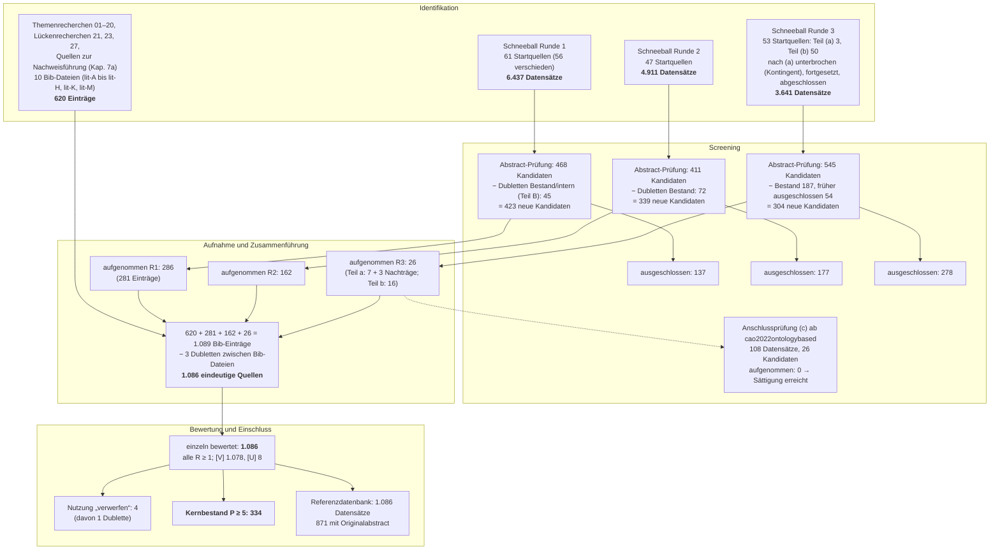

# 2 Forschungsdesign

Status: Entwurf v0.2 (27.09.2026). Zahlen zur Recherche stammen aus `literatur/quellen-master.csv`, `literatur/quellen-bewertung.csv`, `literatur/bewertung/STATISTIK.md`, `literatur/bewertung/KAPPA.md`, `literatur/referenzdatenbank/README.md` und den Schneeballprotokollen `../recherche/24`, `25`, `26` und `28`. Zahlen zu den Prototypen stammen aus `beispiele/README.md`, `beispiele/ergebnisse.md` und `beispiele/NACHWEIS.md`. Das Recherche-Protokoll steht in `02a-review-protokoll.md`.

## 2.0 Einordnung

Die Arbeit will ein Problem der Praxis lösen und dabei verallgemeinerbares Wissen erzeugen. Sie entwirft Artefakte, prüft sie und leitet daraus Aussagen über Wirksamkeit und Grenzen ab. Dieses Kapitel legt offen, in welchem Rahmen das geschieht (2.1, 2.2), wie die Literatur erschlossen wurde und wie belastbar diese Erschließung ist (2.3), wie die Artefakte evaluiert werden (2.4) und an welchen Kriterien sich die Arbeit messen lassen muss (2.5). Dabei gilt: **Befund und Bewertung werden getrennt.** Wo eine Zahl gemessen ist, steht sie mit ihrer Quelle; wo sie geschätzt, unvollständig oder nur sekundär belegt ist, ist das gesagt.

## 2.1 Design Science Research als Rahmen

### 2.1.1 Erkenntnisziel

Die verhaltenswissenschaftliche Forschung fragt, was wahr ist; die gestaltungsorientierte Forschung fragt, was wirksam ist. March und Smith haben diese Unterscheidung für die Informationstechnik begründet. Sie nennen vier Typen von Artefakten, nämlich Konstrukte, Modelle, Methoden und Instanziierungen, und zwei Forschungsaktivitäten, *build* und *evaluate* [@march1995design]. Hevner et al. stellen die Design Science Research (DSR) gleichrangig neben die verhaltenswissenschaftliche Forschung und formulieren sieben Leitlinien für ihre Durchführung [@hevner2004design].

Die Fragestellung dieser Arbeit ist gestaltungsorientiert. FF1 bis FF3 und FF6 fragen, *wie* sich Informationsmodell, Regelraum und Sprachschnittstelle gestalten lassen, FF4, wie sich Rechtspflichten im Modell abbilden lassen. Auch die Wirkungsfrage FF5 bezieht sich auf ein Artefakt, das erst entworfen werden muss. Für das Bauwesen ist die Einordnung als Design Science nicht neu; Voordijk begründet sie für das Construction Management epistemologisch [@voordijk2009construction]. Eine aktuelle Einführung mit Fallbeispielen geben vom Brocke, Hevner und Maedche [@vombrocke2020introduction].

### 2.1.2 Die sieben Leitlinien und ihre Umsetzung

Die Leitlinien von Hevner et al. dienen als Prüfliste für das Forschungsdesign (Tabelle 2.1).

**Tabelle 2.1: Leitlinien nach Hevner et al. [@hevner2004design] und ihre Umsetzung**

| Leitlinie | Anforderung | Umsetzung in dieser Arbeit | Ort |
|---|---|---|---|
| 1 Artefakt | Das Ergebnis ist ein zweckgerichtetes Artefakt. | Informationsmodell, Regelraum, Nachweis-Framework, Prototypen B1–B20 | Teil II, Kap. 19 |
| 2 Problemrelevanz | Das Problem ist für die Praxis bedeutsam. | Fertigbauquote, Planungsschleifen, Medienbrüche, Fachkräftemangel | Kap. 1.1 |
| 3 Evaluation | Nutzen, Qualität und Wirksamkeit werden rigoros gezeigt. | technisch, analytisch und empirisch nach FEDS | 2.4, Kap. 20 |
| 4 Forschungsbeitrag | Der Beitrag ist klar und überprüfbar. | Integration in einer Kette; Designprinzipien; Thesen mit Widerlegungskriterien | Kap. 1.3, 21 |
| 5 Rigor | Konstruktion und Evaluation stützen sich auf gesicherte Methoden. | systematische Recherche mit 1.086 Quellen; IFC 4.3, IDS 1.0; Testverfahren | 2.3, Kap. 20.1 |
| 6 Suchprozess | Der Entwurf ist eine Suche im Lösungsraum. | Iterationen zwischen Recherche, Beispiel und Korrektur des Zielbilds | 2.2.3 |
| 7 Kommunikation | Ergebnisse erreichen Fachwelt und Praxis. | Dissertation, lauffähige Beispiele, Nachweishefte für Prüfer ohne Codekenntnis | Kap. 7a, 19, Anhang C |

### 2.1.3 Art des Beitrags

Gregor und Hevner ordnen DSR-Beiträge nach der Reife von Problem und Lösung: *Improvement* (neue Lösung, bekanntes Problem), *Invention* (neue Lösung, neues Problem), *Exaptation* (bekannte Lösung, neues Problem) und *Routine Design*. Zugleich unterscheiden sie drei Abstraktionsebenen: situierte Instanziierungen (Ebene 1), entstehende Designtheorie aus Konstrukten, Methoden, Modellen und Designprinzipien (Ebene 2) und ausgereifte Designtheorie (Ebene 3) [@gregor2013positioning].

Die Arbeit ist überwiegend eine **Exaptation**. Wissensbasierte Konfiguration, Regelprüfung auf IFC-Basis, IDS, Intent-Erkennung und BTLx-Export sind bekannt. Neu ist das Problemfeld: der Laienentwurf vorgefertigter Holzrahmenhäuser unter deutschem Bau- und Werkvertragsrecht mit einer durchgängigen Datenkette. Das entspricht These 1 (Kapitel 1.3.3). Anteile von **Improvement** hat die Arbeit dort, wo sie für bekannte Probleme neue Lösungen entwickelt, etwa die Nachweisführung mit Rückverfolgbarkeit zu IFC-GUID und Regelwerksversion (Kapitel 7a).

Die Beiträge liegen auf den Ebenen 1 und 2. Die Prototypen sind Instanziierungen. Die Regeltaxonomie R1 bis R5, die Reifegrade P/R/A, das Datenmodell des Nachweises und die Architekturprinzipien („Die KI versteht, der Code entscheidet“; „Andere Formate sind nur Ableitungen“) bilden eine entstehende Designtheorie. Eine ausgereifte Designtheorie beansprucht die Arbeit nicht.

### 2.1.4 Artefakte dieser Arbeit

Tabelle 2.2 ordnet die Artefakte nach der Typologie von March und Smith [@march1995design].

**Tabelle 2.2: Artefakte, Typ und Evaluation**

| Artefakt | Typ | Inhalt | FF | Kapitel | Evaluation |
|---|---|---|---|---|---|
| **Informationsmodell** | Modell | IFC4X3_ADD2 für alle Phasen; Klassenmapping des Holzrahmenbaus; Schichtenmodell und Einzelteile; Grenzen und Überbrückung | FF1, FF6 | 8, 11 | technisch, analytisch |
| **Regelraum** | Konstrukte, Modell | Regelklassen R1 Entwurfsgrenzen, R2 Informationsanforderungen, R3 Verantwortung, R4 Form (Kap. 4.1), R5 Empfehlungen (Kap. 9b); Schichtung vom Gesetz bis zur Herstellerregel; versionierte, typabhängige Profile | FF2, FF4 | 4, 9, 9a, 9b | technisch, analytisch, Experten |
| **Nachweis-Framework** | Methode, Instanziierung | Regel mit Fassung, Eingaben mit Herkunft, Formeln, Ergebnis, Grenzwert, Rundung, Unsicherheit, Grafik, Hash, Bezug zu IFC-GUID | FF2, FF4 | 7a | technisch (50 Tests), Experten |
| **Architektur** | Designprinzipien | Trennung von Absichtserkennung und Rechenkern; Parametermodell → IFC-Generator → Prüfschicht → Ableitungen; deterministische GUIDs, Audit-Trail | FF3, FF4 | 7 | technisch, analytisch |
| **Prototypen B1–B20** | Instanziierungen | lauffähige, deterministische Beispiele mit Tests (Tabelle 2.3) | FF1–FF6 | 19 | technisch |

**Tabelle 2.3: Stand der Prototypen (27.09.2026)**

| Nr. | Inhalt | FF | Stand | Tests |
|---|---|---|---|---:|
| B1 | Holzrahmen-Wandelement in IFC4X3_ADD2, deterministische GUIDs, 2.393 Entitäten, 176 Verbindungsmittel | FF1 | lauffähig | 13 |
| B2, B3 | IDS-Profil mit 11 Spezifikationen; U-Wert nach DIN EN ISO 6946 | FF2, FF6 | lauffähig | 6 |
| B4, B5 | Abstandsflächen nach Art. 6 BayBO; Treppenlauf-Solver nach DIN 18065 | FF2 | lauffähig | 6 |
| B6, B7 | deterministische Sprachpipeline (Intent-Modell als Stub); BTLx-Export mit compas_timber | FF3, FF1 | lauffähig | 23 |
| N | Nachweis-Framework, nachgerüstet für B1–B5: 7 Nachweishefte, 32 Nachweise | FF2, FF4 | lauffähig | 50 |
| B14 | Fußbodenaufbau: gleiche Fertigfußbodenhöhe bei unterschiedlichen Belägen | FF6 | lauffähig | 18 |
| B15 | Abwasserleitung DN 100 durch Holzbalkendecke und Ständerwand | FF6 | lauffähig | 10 |
| B16 | Fliesen als 3D-Einzelobjekte mit Verschnitt und Reststücken | FF6 | lauffähig | 15 |
| B17 | Grundstücksentwässerung mit Rigolenbemessung | FF6 | lauffähig | 20 |
| B18 | Kranplanung; Montageplan als `IfcWorkSchedule` | FF6 | lauffähig | 15 |
| B19 | Schallschutz gegen Außenlärm mit Grundrissvariante | FF6 | lauffähig | 16 |
| B20 | Wärmepumpe nach DIN ISO 9613-2 und TA Lärm mit Rasterlärmkarte | FF6 | lauffähig | 17 |
| B8–B13 | Routing, Wand-WC, glTF, Fliesen als Auswahl, EFH → ZFH, Grundriss-Assistenz | FF1, FF2, FF6 | geplant | – |
| – | Walmdach über Straight Skeleton | FF6 | geplant | – |
| **Summe** | | | | **209** |

Eine Unstimmigkeit ist offen zu benennen: Die Gliederung führt das Walmdach als „B7 (geplant)“, im Verzeichnis `beispiele/` ist B7 aber der BTLx-Export. Die Nummerierung wird vor der Abgabe vereinheitlicht.

### 2.1.5 Abgrenzung zu verwandten Ansätzen

**Action Design Research** verschränkt Entwicklung, Intervention und Evaluation in einer Organisation [@sein2011action]. Das setzt voraus, dass das Artefakt beim Praxispartner eingesetzt wird; für den Entwurf ist das nicht gegeben, weil dessen interne Daten nicht offenliegen. **Design Research Methodology** gliedert Forschung in Research Clarification, Descriptive Study I, Prescriptive Study und Descriptive Study II [@blessing2009drm]. Ihre Stärke, die empirische Erhebung der Ausgangslage, übernimmt die Arbeit als Ergänzung: Die Erhebung der Ausgangswerte beim Praxispartner entspricht einer Descriptive Study I, die Vorher-nachher-Messung einer Descriptive Study II. Rahmen bleibt das Prozessmodell von Peffers et al., weil es den Artefaktzyklus und seine Kommunikation am klarsten strukturiert.

## 2.2 Vorgehen: Problem, Ziele, Artefakt, Demonstration, Evaluation, Kommunikation

### 2.2.1 Die sechs Aktivitäten

Peffers et al. operationalisieren DSR in sechs Aktivitäten und lassen vier Einstiegspunkte zu: problemzentriert, zielzentriert, entwicklungszentriert und durch Kunde oder Kontext angestoßen [@peffers2007design]. Diese Arbeit ist **zielzentriert** eingestiegen. Am Anfang stand ein Zielbild mit Zweck, Prinzipien und Endzustand, dessen Annahmen zunächst Prüfmarker trugen (`../00-zielbild.md`, Version 0.1). Erst danach wurden Problem und Handlungsdruck belegt (Recherche 07). Das Zielbild ist deshalb als Hypothese über eine gute Lösung zu lesen, nicht als Beobachtung.

**Tabelle 2.4: Aktivitäten nach Peffers et al. und ihre Umsetzung**

| Aktivität | Leitfrage | Umsetzung | Kapitel |
|---|---|---|---|
| 1 Problemidentifikation | Welches Problem besteht, und warum ist es relevant? | Planungsschleifen, Medienbrüche, Fachkräftemangel; Forschungslücke | 1, 3, 5 |
| 2 Ziele der Lösung | Was soll eine Lösung leisten? | Why, Prinzipien, Erfolgskriterien E1–E6; harte Grenzen aus Recht und Norm | 1.2, 4, 6 |
| 3 Entwurf und Entwicklung | Wie sieht das Artefakt aus? | Architektur, Informationsmodell, Regelraum, Sprache, Detailtiefe, Freigaben | 7–18 |
| 4 Demonstration | Löst es das Problem an einem Beispiel? | Beispiele B1–B20, Nachweishefte | 19 |
| 5 Evaluation | Wie gut löst es das Problem? | technisch, analytisch, empirisch | 20 |
| 6 Kommunikation | Wer muss davon erfahren? | Dissertation, Beispielcode, Nachweishefte, Fragenkatalog an den Praxispartner | 21, 22, Anhänge |

### 2.2.2 Evaluation in jeder Aktivität

Sonnenberg und vom Brocke kritisieren, dass das Muster „erst bauen, dann evaluieren“ zu spät prüft. Sie schlagen vier Evaluationsaktivitäten vor, zwei vor und zwei nach der Konstruktion [@sonnenberg2012evaluations]; für die Wahl der Methoden beschreiben sie wiederverwendbare Evaluationsmuster [@sonnenberg2012patterns]. Die Arbeit übernimmt diese Gliederung:

| Aktivität | Zeitpunkt | Gegenstand | Umsetzung |
|---|---|---|---|
| EVAL1 | ex ante | Ist das Problem richtig identifiziert und relevant? | Belege für den Handlungsdruck (1.1); Forschungslücke (1.3.1) |
| EVAL2 | ex ante | Ist der Entwurf geeignet? | Abgleich mit Rechtsrahmen und Normen (Kap. 4); Abdeckungsmatrix auf Schemaebene |
| EVAL3 | ex post, artifiziell | Funktioniert die Instanziierung? | Tests, Validierung, Handrechnungen, Fehlerinjektion |
| EVAL4 | ex post, naturalistisch | Wirkt das Artefakt im Einsatz? | Experteninterviews, Nutzerstudie, Kennzahlen (geplant) |

### 2.2.3 Iteration statt Wasserfall

Die Aktivitäten wurden nicht linear durchlaufen; mehrfach hat eine spätere eine frühere korrigiert.

- **Recherche korrigiert Zielbild.** Das Zielbild nannte für die Holzfeuchte 18 %. DIN 68800-2 verlangt aber 20 %; die 18 % stammen aus RAL-GZ 422. Beide Werte erscheinen deshalb in verschiedenen Regelprofilen (Kapitel 4.4). Ebenso zeigte die Schemaprüfung, dass `IfcTransportElement` einen Kran oder Aufzug bezeichnet, für Fahrzeuge aber `IfcVehicle` vorgesehen ist (Recherche 06).
- **Evaluation korrigiert Recherche.** Die Einzelbewertung zeigte, dass FF4 und FF5 zunächst schwach belegt waren, und löste zwei Lückenrecherchen aus (2.3.3).
- **Demonstration korrigiert Entwurf** (Beispiel 2.1).

> **Beispiel 2.1 (Determinismus als Befund der Demonstration).** Das Prinzip „Ein Modell ist die Wahrheit“ setzt voraus, dass dieselbe Eingabe dasselbe Modell erzeugt; nur dann lassen sich Nachweise über einen Hash an eine Modellversion binden.
>
> Die erste Fassung von B1 nutzte die Hilfsfunktionen von `ifcopenshell.api`. Mit vier Werten für `PYTHONHASHSEED` entstanden vier Dateien mit vier verschiedenen SHA-256-Werten, weil mehrere Funktionen über Python-Mengen iterieren. Daraus folgte eine Architekturregel: Beziehungen, Einheiten und Platzierungen werden direkt und in fester Reihenfolge angelegt. Seither ist die Datei byte-identisch, auch über getrennte Prozesse mit den Hash-Seeds 1 und 4711 (SHA-256 `5a796ea7…b478b`), und ein Test sichert das ab.
>
> Der Befund stand weder in der Literatur noch in der Dokumentation der Bibliothek. Erst die Demonstration hat eine Anforderung sichtbar gemacht, die im Entwurf implizit geblieben war.

## 2.3 Recherchemethodik

### 2.3.1 Anleitungen und Anspruch

Die Recherche folgt den Richtlinien für systematische Literaturreviews in der Softwaretechnik [@kitchenham2007guidelines], dem Schneeballverfahren [@wohlin2014guidelines] und dem Berichtsstandard PRISMA 2020 [@page2021prisma]. PRISMA ist für Übersichtsarbeiten zu Interventionen entwickelt und wird hier **sinngemäß** angewandt, weil das Feld Wissenschaft, Normen, Gesetze, Rechtsprechung und Technik verbindet. Übernommen werden die Transparenz der Schritte, die Zahlen je Schritt und das Flussdiagramm; nicht übernommen werden Risk-of-Bias-Bewertungen und Metaanalysen.

Das Protokoll (`02a-review-protokoll.md`) stellt zwei Ansprüche: eine **vollständige systematische Erschließung** ohne Vorwissen über bestimmte Autoren oder Schulen, ausdrücklich auch für Architekturpsychologie und regionale Forschung, und eine **Einzelbewertung jeder Quelle** auf ihre Passung. Eine Quelle zählt nicht, weil sie gefunden wurde, sondern weil ihr Beitrag zu einer Forschungsfrage begründet ist.

### 2.3.2 Quellenarten und Verifikationsregeln

Das Protokoll unterscheidet vier Quellenarten mit je eigenem Prüfweg (Tabelle 2.5).

**Tabelle 2.5: Quellenarten, Prüfweg und Bestand (bewertete Quellen)**

| Art | Beispiele | Prüfweg | Anzahl | davon Kernbestand |
|---|---|---|---:|---:|
| W – Wissenschaft, begutachtet | Journal, Konferenz, Dissertation | DOI über Crossref bzw. Verlag oder Repositorium | 874 | 197 |
| N – Norm, Gesetz, Rechtsprechung | BayBO, DIN, BGH-Urteile, Drucksachen | amtliche Fundstelle bzw. Normgeber | 101 | 91 |
| G – graue Literatur | Forschungsberichte, Leitfäden, Verbandsmitteilungen | Primärquelle beim Herausgeber | 99 | 37 |
| T – Technik | Software, Datenstandards, Datensätze | Repository, Lizenzdatei, Spezifikation | 12 | 9 |
| **Summe** | | | **1.086** | **334** |

Jeder Befund trägt eine von zwei Kennzeichnungen. **[V] verifiziert** heißt: Autor, Jahr, Titel und Fundstelle sind an einer Primärquelle geprüft, bei Normen und Gesetzen einschließlich der Fassung zum Stichtag. **[U] unsicher** heißt: Die Existenz ist belegt, aber eine Teilangabe ist offen, etwa Band, Ausgabe oder eine Zahl aus einem Sekundärzitat; der Grund steht im `note`-Feld. Von den 1.086 bewerteten Quellen tragen 1.078 [V] und 8 [U]. Quellen, deren Existenz nicht belegt werden konnte, stehen nicht im Literaturverzeichnis. Sie sind in den Recherchedokumenten als „nicht verifizierte Hinweise“ geführt und werden nie zitiert, etwa Herstellerangaben zur Zeitersparnis in der Werkplanung (Recherche 23).

Die Prüfung hat auch den Bestand korrigiert: Vornamen, Herausgeber- statt Autorenschaft, DOIs der Journal- statt der Tagungsfassung, amtliche Vollzitate. Jede Korrektur ist mit altem und neuem Wert und Prüfweg dokumentiert (`literatur/KORREKTUREN.md`).

### 2.3.3 Suchstrategie und Ablauf

Die Recherche verlief in drei Strängen:

1. **Themenrecherchen 01 bis 20**, abgeleitet aus FF1 bis FF6, darunter zwei Vergleichsmatrizen vergleichbarer Arbeiten (Recherchen 11 und 12).
2. **Lückenrecherchen**: Recherche 21 zu regionaler Holzbauforschung, deutschsprachiger Architekturpsychologie und Methodenstandards; Recherche 23 zu FF4 und FF5, weil zu diesem Zeitpunkt nur 12 Quellen FF4 und 24 Quellen FF5 mit Relevanz ≥ 2 trugen; Recherche 27 zu frei zugänglichen juristischen Quellen für FF4; dazu eine gezielte Recherche zu Mess-, Rundungs- und Darstellungsnormen für die Nachweisführung (Kapitel 7a, `lit-M`).
3. **Schneeballverfahren** in drei Runden ab dem Kernbestand (2.3.7).

Suchräume waren Crossref und OpenAlex, Verlagsportale (Elsevier, Springer, Taylor & Francis, ASCE, MDPI), Repositorien (mediaTUM, ETH Research Collection, DiVA, arXiv), amtliche Portale (gesetze-bayern.de, gesetze-im-internet.de, EUR-Lex, Parlamentsdokumentation) sowie Normgeber, Verbände und Hersteller. Die Masterliste ist in acht Schritten gewachsen; jeder Schritt wurde über DOI und normalisierten Titel gegen den Bestand abgeglichen (Tabelle 2.6).

**Tabelle 2.6: Wachstum der Masterliste**

| Schritt | Quelle | neu | Stand |
|---|---|---:|---:|
| 1 | Themenrecherchen 01–20, Lückenrecherche 21 (`lit-A` bis `lit-G`: 465 Einträge, 3 Dubletten) | 462 | 462 |
| 2 | Lückenrecherche 23 (`lit-H`) | 68 | 530 |
| 3 | Schneeball Runde 1 (`lit-I-schneeball-a`, `-b`) | 281 | 811 |
| 4 | Schneeball Runde 2 (`lit-J`) | 162 | 973 |
| 5 | juristische Lückenrecherche 27 (`lit-K`) | 74 | 1.047 |
| 6 | Schneeball Runde 3, Teil (a) (`lit-L`) | 7 | 1.054 |
| 7 | Quellen zur Nachweisführung, Kapitel 7a (`lit-M`) | 13 | 1.067 |
| 8 | Schneeball Runde 3, Teil (b) und drei Nachträge zu Teil (a) (`lit-L`) | 19 | **1.086** |

Der im Protokoll genannte Ausgangsstand von 393 Einträgen bezeichnet den Stand vor der Zusammenführung der Themenrecherchen und ist überholt.

### 2.3.4 Ein- und Ausschlusskriterien

**Eingeschlossen** werden Quellen, die mindestens eine Forschungsfrage mit Relevanz ≥ 1 berühren, existent und prüfbar sind und bei Normen und Gesetzen in der zum 27.09.2026 geltenden Fassung vorliegen oder historisch begründet sind, etwa die Vollgeschossdefinition der BayBO bis 2007. **Ausgeschlossen** werden nicht verifizierbare Quellen und Sekundärquellen, wenn eine Primärquelle existiert. Im Schneeballverfahren galt die strengere Schwelle Relevanz ≥ 2; ausgeschlossen wurden dort außerdem nicht begutachtete Preprints, Vorfassungen erfasster Arbeiten und Funde, die nur ein bereits belegtes Argument wiederholen („redundant“). Pseudowissenschaftliche Aussagen werden nie als Beleg zitiert, sondern erscheinen nur als Gegenstand der Abgrenzung (Kapitel 9b).

### 2.3.5 Einzelbewertung der Passung

Jede Quelle erhält eine Zeile in `literatur/quellen-bewertung.csv` (Protokoll 2a.5):

- **Relevanz** je Forschungsfrage von 0 bis 3: 0 keine, 1 Kontext, 2 stützt ein Argument, 3 trägt ein zentrales Argument oder liefert einen übernehmbaren Baustein;
- **Qualität** A bis D: A Übersichtsarbeit, Metaanalyse oder geltendes Recht bzw. Norm; B begutachtete Einzelstudie oder Dissertation; C graue Literatur; D Tradition oder Meinung ohne empirische Prüfung;
- **Übertragbarkeit** auf Bayern, Holzbau und Fertighaus: 0 nicht, 1 mit Anpassung, 2 direkt;
- **Nutzung**: übernehmen, adaptieren, abgrenzen, Kontext, verwerfen;
- **Begründung** in ein bis drei Sätzen und **Verwendungsort**.

Daraus folgen zwei Kennzahlen:

$$R = \max(\mathit{ff}_1, \ldots, \mathit{ff}_6), \qquad P = R + \text{Übertragbarkeit} + Q, \quad Q \in \{A: 2;\ B: 1{,}5;\ C: 1;\ D: 0\}$$

Quellen mit P ≥ 5 bilden den **Kernbestand**. Er ist Ausgangspunkt des Schneeballverfahrens und wird im Text vertieft diskutiert.

> **Beispiel 2.2 (Bewertung zweier Quellen).** *Eastman et al. 2009* [@eastman2009automatic] liefert die Vier-Stufen-Architektur der Regelprüfung (Regelinterpretation, Modellvorbereitung, Ausführung, Bericht): FF2 = 3, Qualität A, Übertragbarkeit 1, also P = 3 + 1 + 2 = **6**, Kernbestand, „übernehmen“.
>
> *Kwieciński und Słyk 2023* [@kwiecinski2023interactive] beschreiben ein generatives System für den partizipativen Einfamilienhausentwurf, das Nutzerentscheidungen gegen formalisierte Regeln prüft. Erstbewertung FF2 = 2, FF5 = 2, Qualität B, Übertragbarkeit 1, also P = 2 + 1 + 1,5 = **4,5**, knapp nicht im Kernbestand. Die blinde Zweitbewertung setzte FF2 = 3 und kam auf P = 5,5.
>
> Eine Stufe in einer einzigen Forschungsfrage entscheidet also über den Kernbestand. Abschnitt 2.3.9 misst, wie oft das vorkommt.

### 2.3.6 Ergebnis der Einzelbewertung

Alle 1.086 Quellen sind einzeln bewertet. Alle erfüllen R ≥ 1: 286 haben R = 1, 666 R = 2 und 134 R = 3. **334 Quellen bilden den Kernbestand.** Unter den 26 Funden der dritten Schneeballrunde waren vier im Screening nur nach Titel, Venue und Referenzliste eingestuft, weil kein Abstract zugänglich war. Auch bei der Einzelbewertung fand sich über OpenAlex, die Verlagsseite und Semantic Scholar kein Abstract. Sie tragen deshalb die Nutzung „Kontext“ und liegen mit P = 4,5 außerhalb des Kernbestands. Eine weitere Quelle fiel nach Lektüre des Abstracts von Relevanz 2 auf 1.

**Tabelle 2.7: Qualität, Nutzung und Übertragbarkeit (n = 1.086)**

| Qualität | Anzahl | Nutzung | Anzahl | Übertragbarkeit | Anzahl |
|---|---:|---|---:|---|---:|
| A | 172 | übernehmen | 168 | 2 direkt | 271 |
| B | 782 | adaptieren | 411 | 1 mit Anpassung | 790 |
| C | 125 | Kontext | 446 | 0 nicht | 25 |
| D | 7 | abgrenzen | 57 | | |
| | | verwerfen | 4 | | |

Unter den vier verworfenen Quellen ist eine Dublette: Die KI-Verordnung stand unter zwei Keys im Bestand; zitiert wird nur einer.

**Tabelle 2.8: Relevanz je Forschungsfrage (Anzahl Quellen)**

| | FF1 | FF2 | FF3 | FF4 | FF5 | FF6 |
|---|---:|---:|---:|---:|---:|---:|
| Relevanz ≥ 2 | 135 | 242 | 78 | 122 | 158 | 204 |
| davon Relevanz 3 | 17 | 34 | 7 | 28 | 19 | 30 |

Drei Befunde folgen daraus:

1. **Die Lückenrecherchen haben gewirkt.** FF4 stieg von 12 auf 122 Quellen mit Relevanz ≥ 2, FF5 von 24 auf 158. 82 der 122 FF4-Quellen stammen aus den Recherchen 23 und 27, 44 davon sind Gesetze, Gesetzesmaterialien oder Rechtsprechung.
2. **FF3 ist am schwächsten belegt**: 78 Quellen stützen die Sprachschnittstelle, 7 tragen sie. Das ist teils ein Befund über das Feld, denn deutschsprachige Arbeiten zur Intent-Erkennung im Hausentwurf fehlen (Kapitel 1.3.1).
3. **Die meisten Quellen sind mit Anpassung übertragbar** (790). Direkt übertragbar sind vor allem Gesetze, Normen und deutsche Studien.

**Referenzdatenbank.** Masterliste, Einzelbewertung, Zweitbewertung und Abstracts führt ein Skript (`literatur/referenzdatenbank.py`) zu einer Referenzdatenbank zusammen. Sie besteht aus drei Dateien: einer SQLite-Datenbank mit den Tabellen Quellen, Bewertung, Zweitbewertung und Abstract sowie Sichten für den Kernbestand und für Quellen ohne Abstract; einem BibTeX-Export für Zotero, JabRef oder Citavi, der Abstract, Schlagworte (Q-ID, Relevanz je Forschungsfrage, Nutzung, Qualität, Kernbestand) und die Begründung der Passung enthält; und einem CSL-JSON-Export für Zotero und Pandoc. Abstracts stehen nur im Originaltext, nie selbst formuliert, und jeder Datensatz nennt seine Herkunft (OpenAlex, Crossref, Verlag, Repositorium, PubMed, arXiv oder amtliche Quelle) mit URL. Für **871 der 1.086 Quellen** liegt ein Originalabstract vor, bei Normen und Gesetzen der amtliche Kurzinhalt oder Anwendungsbereich. Ohne Abstract sind 215 Quellen: 84 graue Literatur, 86 wissenschaftliche Quellen (meist Bücher oder Arbeiten, für die weder OpenAlex noch der Verlag einen Abstract liefern), 33 Normen ohne frei zugänglichen Kurzinhalt und 12 Softwarewerkzeuge. Der Open-Access-Status stammt aus OpenAlex: 428 Quellen sind nicht frei zugänglich, 140 gold, 139 green, 136 hybrid, 73 bronze und 10 diamond; 91 sind frei zugängliche amtliche Texte, bei 69 ist der Status unbekannt. Volltexte liegen nicht im Repository; frei zugängliche Fassungen sind nur verlinkt.

**Nachträge.** Fehlende Abstracts wurden in zwei Nachtragsrunden gezielt nachgesucht: für 155 wissenschaftliche Quellen, von denen 74 einen Abstract erhielten, und für 96 Normen, Gesetze und Urteile, von denen 63 einen Leitsatz oder amtlichen Kurzinhalt erhielten. Die übrigen sind mit Grund vermerkt, etwa „Buch ohne Abstract“. In die Masterliste nachgetragen wurden außerdem drei Kandidaten aus Runde 3, Teil (a). Sie waren zunächst als nicht verifizierbar ausgeschlossen und sind nach dem Crossref-Abgleich aufgenommen (2.3.7).

### 2.3.7 Schneeballverfahren

**Verfahren.** Je Startquelle werden Referenzen (rückwärts) und zitierende Arbeiten (vorwärts) gesichtet, zuerst nach Titel, dann nach Abstract [@wohlin2014guidelines]. Zitationsdaten stammen aus OpenAlex, die Verifikation aus Crossref. Generische Anwendungen in fremden Domänen, etwa Regelextraktion für chinesische Tunnelnormen, erhalten höchstens Relevanz 1.

**Startmengen.** Runde 1 startete in Teil A mit 23 Quellen für FF1, FF2 und FF4 und in Teil B mit 38 Quellen für FF3, FF5 und FF6: Kernbestand, Art W und entweder Relevanz 3 oder Relevanz ≥ 2 bei P ≥ 6. Fünf Startquellen gehörten zu beiden Teilen. Runde 2 startete mit den 47 Kernbestandsquellen der Art W, die Runde 1 neu gefunden hatte. Runde 3 war gezielt: die drei Relevanz-3-Funde der Runde 2 (Teil a) und 50 Funde aus den Clustern Sprache und Konfiguration (FF3) sowie Regelprüfung und Bauantrag (FF2/FF4), die in Runde 2 noch überdurchschnittlich geliefert hatten (Teil b).

**Tabelle 2.9: Kennzahlen der drei Schneeballrunden**

| Kennzahl | R1 Teil A | R1 Teil B | **R1 gesamt** | **R2** | R3 Teil (a) | R3 Teil (b) | **R3 gesamt** | Anschluss (c) |
|---|---:|---:|---:|---:|---:|---:|---:|---:|
| Startquellen | 23 | 38 | 61 (56 verschieden) | 47 | 3 | 50 | 53 | 1 |
| Datensätze gesichtet (roh) | 2.800 | 3.637 | 6.437 | 4.911 | 193 | 3.448 | 3.641 | 108 |
| Kandidaten zur Abstract-Prüfung | 211 | 257 | 468 | 411 | 49 | 496 | 545 | 26 |
| davon Dubletten zum Bestand | 99 ¹ | 42 | – | 72 | 20 | 167 | 187 (34,3 %) | 10 |
| davon in früherer Runde ausgeschlossen | – | – | – | – | 2 | 52 | 54 | 2 |
| neue Kandidaten | 211 | 212 | 423 | 339 | 27 | 277 | 304 | 14 |
| ausgeschlossen nach Abstract | 100 | 37 | 137 | 177 | 17 | 261 | 278 | 14 |
| **aufgenommen** | 111 | 175 | **286** | **162** | 10 ² | 16 | **26** | **0** |
| davon Relevanz 3 | 10 | 19 | 29 (10,1 %) | 3 (1,9 %) | 1 | 0 | 1 (3,8 %) | 0 |
| Rohquote aufgenommen / gesichtet | 4,0 % | 4,8 % | **4,4 %** | **3,3 %** | 5,2 % | 0,46 % | **0,71 %** | 0 % |
| Trefferquote aufgenommen / neue Kandidaten | 52,6 % | 82,5 % | 67,6 % | 47,8 % | 37,0 % | 5,8 % | 8,6 % | 0 % |

¹ In Teil A wurden Bestandsdubletten und 410 rundeninterne Dubletten schon vor dem Titel-Screening entfernt; die 211 Kandidaten sind alle neu. In Teil B und den Runden 2 und 3 sind die Rohzahlen „gesichtet“ rundenintern nicht bereinigt. In Teil B kommen zu den 42 Bestandsdubletten 3 interne. In Runde 3 zählt Teil (a) die Kandidaten je Startquelle, Teil (b) eindeutig (17 Mehrfachtreffer); die Quoten ändern sich dadurch um weniger als 0,1 Prozentpunkte.

² 7 Aufnahmen und 3 Nachträge: Die drei zunächst als nicht verifizierbar ausgeschlossenen Kandidaten sind nach dem Crossref-Abgleich aufgenommen. Ohne sie läge die Rohquote von Teil (a) bei 3,6 %.

Fünf Quellen fanden beide Teile der Runde 1; sie stehen nur einmal im Verzeichnis. Die 286 Aufnahmen entsprechen deshalb 281 Einträgen. Über die drei Runden wurden **14.989 Datensätze gesichtet und 469 neue Einträge aufgenommen**; die Anschlussprüfung (c) sichtete weitere 108 Datensätze ohne Aufnahme. Ausgeschlossen wurden in Runde 2 177 Kandidaten: 102 wegen Relevanz < 2 oder anderer Forschungsfrage, 49 als redundant, 10 als Vorfassung, 9 als nicht verifizierbar, 4 Preprints und 3 nicht begutachtete Hochschulschriften. In Runde 3 waren es 278: 217 wegen Relevanz < 2, 37 als redundant, 15 als Vorfassung, Tagungsfassung oder Preprint und 9 als nicht verifizierbar. Die Preprints sind als Hinweise festgehalten und werden nach einer Begutachtung erneut geprüft.

**Abbruchkriterium und Abweichung vom Protokoll.** Das Protokoll sah vor, das Verfahren zu beenden, wenn eine Runde keine neue Quelle mit Relevanz ≥ 2 mehr liefert (2a.3 Nr. 3). Bei einem so breiten Feld ist das praktisch unerreichbar; Runde 2 lieferte noch 162 solcher Quellen. Für Runde 2 wurde das Kriterium deshalb ersetzt: Die Aufnahmequote liegt deutlich unter Runde 1, **und** keine neue Quelle erreicht Relevanz 3. Für Runde 3 wurde es präzisiert: keine neue Relevanz-3-Quelle **und** eine Rohquote unter 2 %, also unter der Hälfte von Runde 1. Kommt doch eine Relevanz-3-Quelle hinzu, wird nur von ihr aus weitergesucht. Diese Änderungen sind eine **Abweichung vom Protokoll**. Sie sind in den Recherchen 26 und 28 begründet.

**Sättigung.**

- **Runde 2 ist nicht gesättigt.** Die Rohquote sank nur um ein Viertel (4,4 % → 3,3 %), und drei neue Quellen erreichten Relevanz 3: eine Zerlegung von Nutzeranfragen in Intent und Slots für BIM [@wei2025texttostructure], eine automatische Fertigbarkeitsprüfung von Holzrahmen-Baugruppen [@an2020bimbased] und ein automatischer Entwässerungsentwurf im Tafelbau [@zhang2022bimbased]. Der Ertrag an Relevanz-3-Funden brach aber um 90 % ein, und der Anteil redundanter Funde und Vorfassungen verfünffachte sich etwa (3,5 % → 17,4 %). Cluster mit Quoten zwischen 1,1 und 3,2 % (Dach, Schall und Licht, Wirkung, Informationsmodell allgemein) wurden nicht weiter verfolgt.
- **Runde 3 lief in zwei Abschnitten.** Nach den Abfragen für die drei Relevanz-3-Startquellen (Teil a) war das Kontingent des Suchdienstes erschöpft (HTTP 402 am 27.09.2026). Alle anderen Wege zu Zitationsdaten waren durch die Netzwerkkonfiguration gesperrt (HTTP 403). Die Runde wurde deshalb unterbrochen. Nach dem Aufladen des Kontingents wurde sie mit den übrigen 50 Startquellen fortgesetzt (Teil b). Nach der Abbruchregel folgte eine Anschlussprüfung ab dem einzigen Relevanz-3-Fund aus Teil (a) (Teil c).
- **Teil (a) allein war nicht gesättigt.** Die Rohquote lag mit 5,2 % über 2 %, und mit einer ontologiebasierten Fertigbarkeitsprüfung für den Holztafelbau kam eine Relevanz-3-Quelle hinzu [@cao2022ontologybased]. Mit 193 Datensätzen war die Basis aber klein.
- **Teil (b) erfüllt beide Bedingungen.** Keine neue Quelle erreicht Relevanz 3, die Rohquote liegt bei 0,46 %. Die beiden Cluster, die in Runde 2 noch über dem Durchschnitt lagen, fallen deutlich ab: Sprache und Konfiguration (FF3) von 9,6 % auf 0,86 %, Regelprüfung und Bauantrag (FF2/FF4) von 6,6 % auf 0,29 %. Ein Drittel der Kandidaten sind Bestandsdubletten, mehr als die Hälfte (54 %) Wiederholungen. Die 16 Aufnahmen bestätigen und verfeinern vorhandene Argumente, etwa zu Genehmigungsverfahren im europäischen Vergleich [@fauth2024investigating], zur Zuverlässigkeit sprachmodellgenerierter BIM-Skripte [@alwashah2026reliable] und zur Diagnose unvereinbarer Kundenwünsche im Konfigurator [@felfernig2011personalized]. Eine neue Argumentlinie eröffnen sie nicht.
- **Die Anschlussprüfung (c) liefert keine Aufnahme.** Ab `cao2022ontologybased` wurden 108 Datensätze gesichtet. Von 26 Kandidaten waren 12 Bestand oder früher ausgeschlossen. Alle 14 neuen wurden ausgeschlossen, 13 wegen Relevanz < 2 und einer als redundant (Rohquote 0 %). Die Linie der Fertigbarkeitsprüfung im Entwurf ist damit ausgeschöpft.

**Folge.** Die Suche ist **nach dem Kriterium gesättigt**, und das Schneeballverfahren ist mit Runde 3 und der Anschlussprüfung abgeschlossen. Über alle drei Runden fällt die Rohquote von 4,4 % über 3,3 % auf 0,71 %, die Trefferquote je neuem Kandidaten von 67,6 % über 47,8 % auf 8,6 % und die Zahl der Relevanz-3-Funde von 29 über 3 auf 1. Eine vierte Runde ist nicht nötig. Das strenge Ursprungskriterium des Protokolls („keine neue Quelle mit Relevanz ≥ 2“) ist mit 26 Aufnahmen weiterhin nicht erfüllt; an seine Stelle tritt die oben begründete Abbruchregel. Ein Vorbehalt bleibt für FF4: Juristische Literatur wie Kommentare zur BayBO oder Aufsätze zur Haftung des Entwurfsverfassers steht nicht in den Zitationsnetzen. Diese Lücke ist eine Aufgabe der Rechtsrecherche (2.3.10) und kein Mangel der Sättigung. Der Vorbehalt „nach dem dokumentierten Stand“ für die Neuheitsbehauptung (Kapitel 1.3.1) betrifft damit vor allem diese juristische Literatur.

### 2.3.8 PRISMA-Flussdiagramm

Abbildung 2.1 fasst die Recherche in Anlehnung an PRISMA 2020 zusammen [@page2021prisma]. Die Themen- und Lückenrecherchen liefern Einträge, die nach Einzelprüfung direkt aufgenommen wurden; das Schneeballverfahren liefert Datensätze, die zweistufig gesichtet wurden.

*Abbildung 2.1: Flussdiagramm der Recherche in Anlehnung an PRISMA 2020. In Runde 1 Teil A wurden 99 Bestandsdubletten und 410 rundeninterne Dubletten vor dem Titel-Screening entfernt (Tabelle 2.9, Fußnote 1). Die Anschlussprüfung (c) folgt der Abbruchregel und liefert keine Einträge; sie gehört nicht zu Runde 3 im engeren Sinn.*

### 2.3.9 Beurteilerübereinstimmung

**Anlage.** Das Protokoll sah für den Kernbestand eine unabhängige Zweitbewertung vor (2a.7). Umgesetzt wurde eine **blinde Zweitbewertung an 80 Quellen**, 50 aus dem Kernbestand und 30 aus der Peripherie, gezogen per Zufall mit festem Startwert und ohne Einsicht in die Erstbewertung. Gemessen wurde Cohens κ [@cohen1960coefficient], für ordinale Merkmale mit quadratischen Gewichten, eingeordnet nach Landis und Koch [@landis1977measurement]. Das Skript liegt in `literatur/bewertung/kappa.py`.

**Tabelle 2.10: Beurteilerübereinstimmung (n = 80)**

| Merkmal | Skala | κ | Einordnung | exakt gleich |
|---|---|---:|---|---:|
| Kernbestand (P ≥ 5) | nominal | 0,76 | erheblich | 89 % |
| Nutzung | nominal | **0,45** | **mittelmäßig** | **62 %** |
| Qualität | nominal | 0,95 | fast vollkommen | 98 % |
| Gesamtrelevanz R | ordinal, gewichtet | 0,58 | mittelmäßig | 69 % |
| FF1 / FF2 / FF3 | ordinal, gewichtet | 0,84 / 0,83 / 0,86 | fast vollkommen | 78 / 66 / 88 % |
| FF4 / FF5 / FF6 | ordinal, gewichtet | 0,88 / 0,83 / 0,81 | fast vollkommen | 90 / 79 / 66 % |
| Übertragbarkeit | ordinal, gewichtet | 0,78 | erheblich | 89 % |

**Befund.** Relevanz je Forschungsfrage und Qualität werden zuverlässig bewertet. Die Entscheidung über den Kernbestand wich in 9 von 80 Fällen ab. In acht davon lag die Abweichung genau an der Schwelle (P = 4,5 gegenüber 5,5); nur eine algorithmische Arbeit ohne Abstract wurde einmal als Kontext (P = 4,5), einmal als übernehmbarer Baustein (P = 6,5) eingestuft. Dass die Gesamtrelevanz R mit κ = 0,58 schwächer abschneidet als jede einzelne Forschungsfrage, ist kein Widerspruch: R ist ein Maximum über sechs Werte, und eine Abweichung in einer einzigen Frage genügt, um es zu verschieben.

**Schwäche bei der Nutzung.** Das Merkmal Nutzung erreicht nur κ = 0,45; die Bewerter stimmten in 50 von 80 Fällen überein. Die 30 Abweichungen folgen einem Muster:

| Abweichung (beide Richtungen) | Fälle |
|---|---:|
| adaptieren ↔ Kontext | 16 |
| übernehmen ↔ adaptieren | 7 |
| übernehmen ↔ Kontext | 4 |
| mit „abgrenzen“ oder „verwerfen“ | 3 |

Mehr als die Hälfte betrifft die Grenze zwischen „adaptieren“ und „Kontext“. Das Schema sagt, *dass* eine Quelle adaptiert wird, aber nicht, *woran* man eine Adaption erkennt.

**Folge: Schärfung mit Ankerbeispielen.** Die qualitative Inhaltsanalyse gibt jeder Kategorie eine Definition, ein Ankerbeispiel und eine Kodierregel für Grenzfälle [@mayring2022inhaltsanalyse]. Die Arbeit überträgt das auf das Merkmal Nutzung:

1. **Kodierregeln.** „übernehmen“: Ein Baustein (Regel, Kennwert, Algorithmus, Datenstruktur, Instrument) geht unverändert ein. „adaptieren“: Ein Baustein geht mit einer Änderung ein, die in der Begründung benannt ist. „Kontext“: Die Quelle stützt eine Aussage, liefert aber keinen Baustein. „abgrenzen“: Die Arbeit setzt sich ausdrücklich ab.
2. **Ankerbeispiele.** Je Kategorie zwei bis drei eindeutige Fälle aus dem Bestand, etwa die Vier-Stufen-Architektur von Eastman et al. für „übernehmen“ [@eastman2009automatic].
3. **Grenzfallregel.** Ist kein konkreter Baustein benennbar, gilt „Kontext“.
4. **Neubewertung.** Die 30 Abweichungen werden mit dem geschärften Leitfaden im Konsens entschieden; danach wird an einer neuen Stichprobe κ erneut gemessen.

Für die neun abweichenden Kernbestandsentscheidungen ist ein Konsensgespräch bzw. eine Drittbewertung vorgesehen. Zum Stand dieses Kapitels ist beides noch nicht geschehen.

### 2.3.10 Grenzen der Recherche

- **Proxy-Sperren.** Direkte Abfragen an Crossref, OpenAlex, Semantic Scholar, doi.org und einige amtliche Portale wies die Netzwerkkonfiguration der Arbeitsumgebung ab. Metadaten und Zitationsgraphen wurden über einen Suchdienst abgerufen, der die Primärschnittstellen spiegelt; der Prüfweg steht je Quelle im `note`-Feld. Semantic Scholar war nicht nutzbar, ein Abgleich mit einer zweiten Zitationsdatenbank fehlt. Vor der Abgabe ist ein zentraler Crossref-Abgleich aller DOIs vorgesehen.
- **Unterbrechung der dritten Schneeballrunde** (2.3.7): Teil (a) wurde zunächst über die Websuche statt über Crossref verifiziert; der Crossref-Abgleich hat alle sieben Einträge bestätigt. Vier Aufnahmen aus Runde 3 beruhen auf Titel, Venue und Referenzliste, weil kein Abstract zugänglich war. Kleine Startquellen wurden in Teil (b) gemeinsam abgefragt und die Kandidaten nach Thema zugeordnet.
- **Lückenhafte Zitationsdaten.** OpenAlex löste in Runde 2 nur 2.385 von 2.621 gemeldeten Referenzen auf; Tagungsbände ohne DOI fehlen häufig. Bei sehr oft zitierten Startquellen wurde die Vorwärtssuche mit Themenfiltern eingegrenzt.
- **Kostenpflichtige Normen.** DIN-, VDI- und DWA-Volltexte lagen nicht vor. Kennwerte stammen aus amtlichen Verweisen, Entwürfen oder Sekundärquellen und sind entsprechend gekennzeichnet.
- **Keine juristischen Datenbanken.** beck-online und juris waren nicht zugänglich; Aufsätze in BauR, NZBau und ZfBR sowie Kommentare zur BayBO fehlen. Recherche 27 hat die Lücke mit frei zugänglicher Rechtsprechung, Gesetzesmaterialien und Open-Access-Aufsätzen teilweise geschlossen (74 Einträge). Eine Recherche in beck-online bleibt vor der Abgabe nötig.
- **Primärtexte nicht immer erreichbar.** Wo eine Lesart deshalb nicht am Primärtext geprüft ist, trägt der Befund [U], etwa die Behandlung der Giebelfläche in Beispiel B4.
- **Ein Erstbewerter.** Die Zweitbewertung deckt 80 von 1.086 Quellen ab (7,4 %). Einstufungen als „redundant“ sind Ermessensentscheidungen; sie sind in den Anhängen der Recherchen 26 und 28 begründet und lassen sich nachholen.
- **Sprache und Stichtag.** Gesucht wurde auf Deutsch und Englisch; Rechtslage und Bestand sind auf den 27.09.2026 datiert.

## 2.4 Evaluationsdesign

### 2.4.1 Strategie

FEDS ordnet Evaluationen nach Zweck (formativ oder summativ) und Paradigma (artifiziell oder naturalistisch) und unterscheidet vier Strategien: *Quick & Simple*, *Human Risk & Effectiveness*, *Technical Risk & Efficacy* und *Purely Technical* [@venable2016feds]. Die Arbeit wählt **Technical Risk & Efficacy**. Die Strategie passt, wenn das größte Risiko technisch ist und eine naturalistische Evaluation teuer oder erst spät möglich ist. Beides trifft zu: Ob sich die Kette in einem Standard schließen lässt, ist die zentrale Unsicherheit (These 3), und eine Studie mit Bauherren setzt einen Prototyp für ganze Häuser und Daten des Praxispartners voraus. Die Evaluation beginnt deshalb artifiziell und formativ und endet naturalistisch und summativ.

Die Kriterien stammen aus der Taxonomie von Prat et al., die nach den Systemdimensionen Ziel, Umgebung, Struktur, Aktivität und Entwicklung ordnet [@prat2015taxonomy]. Maßgeblich sind hier Wirksamkeit (Ziel), Konsistenz mit Recht und Norm (Umgebung), Vollständigkeit (Struktur), Genauigkeit und Leistung (Aktivität) sowie Robustheit gegenüber Regeländerungen (Entwicklung).

**Tabelle 2.11: Evaluationsepisoden**

| Episode | Paradigma | Zweck | Gegenstand | Stand |
|---|---|---|---|---|
| E-T1 | artifiziell | formativ | Tests der Prototypen | 209 Tests |
| E-T2 | artifiziell | formativ | Schema- und IDS-Validierung, Determinismus | umgesetzt für B1, B2 |
| E-T3 | artifiziell | summativ | Validation Service, Round-Trip in Fremdsoftware, BTLx gegen XSD | geplant (Netz gesperrt) |
| E-A1 | artifiziell | formativ | Abdeckungsmatrix auf Schemaebene | Grundlage in Recherche 06 |
| E-A2 | artifiziell | summativ | Abdeckungsmatrix auf Implementierungsebene | laufend |
| E-E1 | naturalistisch | formativ | Experteninterviews, explorative Fokusgruppen | geplant |
| E-E2 | naturalistisch | summativ | Nutzerstudie mit Laien und Vertrieb | geplant |
| E-E3 | naturalistisch | summativ | Kennzahlen beim Praxispartner, vorher und nachher | geplant |

### 2.4.2 Technische Evaluation

Die technische Evaluation prüft, ob die Instanziierungen tun, was sie sollen, und ob sie es reproduzierbar tun. Die Beispiele umfassen **209 automatisierte Tests**, die in der gepinnten Umgebung (Python 3.11.15, IfcOpenShell und ifctester 0.8.5, `requirements-lock.txt`) alle bestehen (Stand 27.09.2026).

**Tabelle 2.12: Tests je Testdatei**

| Testdatei | Tests | Gegenstand |
|---|---:|---|
| `test_b1_wandelement.py` | 13 | Byte-Identität, GUID-Stabilität, Klassenmapping, Psets, Georeferenz, Volumenprobe, Schema |
| `test_b2_b3.py` | 6 | IDS gegen XSD, IDS-Fall bestanden und fehlerhaft, U-Wert gegen Handrechnung |
| `test_b4_b5.py` | 6 | Wandhöhe und Tiefe, Giebelprofil, Grundstücksszenarien, Treppe, Randfälle |
| `test_b6_b7.py` | 23 | 16 Parser-Fälle, Raumreferenzen, Annahme, Ablehnung, Rückfrage, Determinismus, BTLx |
| `test_nachweis.py` | 50 | Einheiten, Rundung, Hash, Unsicherheit, Rendering, Schema, Nachrüstung |
| `test_b14.py` bis `test_b20.py` | 111 | B14 (18), B15 (10), B16 (15), B17 (20), B18 (15), B19 (16), B20 (17) |
| **Summe** | **209** | |

**Prüfverfahren.** Ein Test ist nur so gut wie sein Orakel, also die Instanz, die das richtige Ergebnis kennt [@barr2015oracle]. Die Arbeit nutzt fünf Arten:

1. **Handrechnung.** Der U-Wert nach DIN EN ISO 6946 beträgt von Hand 0,16253 W/(m²K), im Programm 0,162527 W/(m²K); die Abweichung ist kleiner als 5 · 10⁻⁵.
2. **Geometrische Invarianten.** Für alle 41 Teile des Wandelements stimmt das Volumen der tesselierten Geometrie mit der Mengenangabe `NetVolume` überein (Abweichung < 10⁻⁹ m³), auch beim Ständer mit abgezogener Kerve.
3. **Metamorphe Relationen.** Wo das richtige Ergebnis unbekannt ist, wird geprüft, wie es sich bei einer bekannten Änderung der Eingabe verhalten muss [@segura2016survey]. Ändert sich die Brüstungshöhe von 900 auf 850 mm, müssen Wand, Rasterständer, Schwelle, Rähm und Brüstungsriegel ihre GlobalId behalten.
4. **Fehlerinjektion** (Beispiel 2.3).
5. **Schemavalidierung** mit `ifcopenshell.validate` für Schema und EXPRESS-Regeln; für B1 ohne Meldung.

> **Beispiel 2.3 (Fehlerinjektion in der IDS-Prüfung).** Das Profil `holzrahmenbau.ids` enthält 11 Spezifikationen, etwa „Außenwand: U ≤ 0,20 W/(m²K)“ oder „kein `IfcBuildingElementProxy`“, und ist gegen die IDS-1.0-XSD valide. Die von B1 erzeugte Datei besteht alle 11. In eine Kopie wurden sechs Fehler eingebaut, darunter ein U-Wert von 0,25, ein fehlendes Material an einem von 15 Ständern und ein Schraubendurchmesser von 20 mm an einer von 176 Schrauben.
>
> Die fehlerhafte Datei scheitert an genau den sechs Spezifikationen mit eingebautem Fehler (HRB-01, 03, 05, 08, 09, 11) und besteht die übrigen fünf. Für diese Fehler ist die Prüfung also sensitiv und spezifisch. Die Aussage gilt für die eingebauten Fehler, nicht allgemein.

**Determinismus.** IFC- und BTLx-Dateien sind bei gleicher Eingabe und gleichen Paketversionen byte-identisch (Beispiel 2.1), allerdings nur bei derselben IfcOpenShell-Version, weil die Version im Dateikopf steht. Die IDS-Berichte enthalten die Prüfzeit; verglichen wird dort der Inhalt.

**Noch nicht möglich** waren, weil die Dienste gesperrt waren: der buildingSMART Validation Service [@bsiValidation] mit seinen normativen Regeln, die Prüfung der BTLx-Dateien gegen die XSD und der Abgleich mit dem Primärtext der BayBO.

**Geplante Erweiterungen:**

- **Round-Trip in Fremdsoftware.** Semantikverluste beim IFC-Austausch sind belegt [@pazlar2008interoperability]. Übernommen werden ein GUID-basierter Semantikvergleich [@ma2006testing] und Benchmark-Modelle mit einer Matrix über mehrere Werkzeuge [@jeong2009benchmark]: drei Referenzhäuser, importiert in vier bis fünf Werkzeuge, verglichen je Entitätstyp.
- **Sprachschnittstelle.** Intent-Genauigkeit und Slot-F1 [@tur2011spoken; @weld2022survey] an einem deutschsprachigen Testkorpus; eine Ablation mit und ohne Regelfilter bei der Kandidatenerzeugung prüft These 2 [@kodnongbua2024zeroshot]. Solange das Intent-Modell ein Stub ist, prüft B6 nur Parser, Referenzauflösung und Regelprüfung.
- **Güte der Regelprüfung.** Richtig- und Falsch-positiv-Rate gegen Expertenurteil, mit dreiwertigem Ergebnis „zulässig, unzulässig, unklar“ statt eines binären Urteils [@fuchs2025challenge].

### 2.4.3 Analytische Evaluation: Abdeckungsmatrix

Die analytische Evaluation prüft die Reichweite: Welche Information der Kette liegt in welchem Standardmechanismus, und welche Regelquelle prüft sie? Instrument ist eine **Abdeckungsmatrix** mit drei Achsen: **Phase** (Entwurf, Angebot, Vertrag, Bemusterung, Bauantrag, Nachweise, Fertigung, Montage, Übergabe), **IFC-Mechanismus** (Entität, Beziehung, Property Set oder Ableitung außerhalb des Schemas) und **Regelquelle** (Gesetz, Norm, Handwerk, Hersteller, Kunde) mit Regelklasse R1 bis R5. Jede Zelle erhält einen Wert:

| Wert | Bedeutung |
|---|---|
| ● | schemakonform abgebildet **und** durch ein lauffähiges Beispiel belegt |
| ◐ | schemakonform abbildbar, noch nicht implementiert |
| ○ | im Schema nicht abbildbar; nur als Ableitung oder Dokumentverweis |

Die Matrix ist das Prüfinstrument für die Thesen 1 und 3: These 1 wäre widerlegt, wenn eine Zelle nur mit neuer Grundlagentechnik gefüllt werden könnte, These 3, wenn eine für Bauantrag oder Fertigung notwendige Zelle ○ trüge und sich nicht standardkonform überbrücken ließe. Tabelle 2.13 zeigt einen vorläufigen Auszug. Die Schemaebene stützt sich auf Recherche 06 [V], die Belege auf die Beispiele; die Einstufung ist eine eigene Bewertung.

**Tabelle 2.13: Abdeckungsmatrix, vorläufiger Auszug (27.09.2026)**

| Phase | IFC-Mechanismus | Regelquelle und -klasse | Wert | Beleg bzw. Grenze |
|---|---|---|---|---|
| Entwurf | `IfcSpace`, Referenz über GlobalId | Hersteller (R1: Mindestbreiten) | ● | B6 |
| Entwurf | Abstandsfläche als Ergebnis der Regelmaschine | Gesetz (R1: Art. 6 BayBO) | ● | B4; keine eigene Semantik im Schema, Ergebnis als Nachweis |
| Angebot | `IfcCostSchedule`, `IfcCostItem` mit Gültigkeit | Hersteller | ◐ | Schema trägt `ApplicableDate`/`FixedUntilDate` |
| Vertrag | `IfcApproval`, `IfcDocumentReference` | Gesetz (R4: Art. 249 EGBGB) | ◐ | keine Vertragsentität; signiertes Dokument per Verweis mit Hash |
| Bemusterung | `IfcCoveringType`, `IfcCovering` je Fliese | Kunde, Hersteller | ● | B16 |
| Bauantrag | `IfcMapConversion` auf EPSG:25832 | Gesetz (R2: Lagebezug) | ● | B1 |
| Bauantrag | `IfcPermit`, `IfcActor` | Gesetz (R3: Art. 61 BayBO) | ◐ | Entwurfsverfasser nur als benutzerdefinierte Rolle |
| Nachweise | `Pset_WallCommon.ThermalTransmittance` | Norm (R2: DIN EN ISO 6946) | ● | B3 → B1 |
| Nachweise | Nachweis mit IFC-GUID und Datei-Hash | Gesetz, Norm | ● | Nachweis-Framework, 32 Nachweise |
| Fertigung | `IfcWall` ELEMENTEDWALL aus `IfcMember`, `IfcPlate`, `IfcBuildingElementPart`, `IfcMechanicalFastener`, `IfcVoidingFeature` | Hersteller, Handwerk | ● | B1 |
| Fertigung | Durchdringung, Bohrung, Manschette | Norm, Handwerk | ● | B15 |
| Fertigung | Maschinendaten BTLx / WUP | Hersteller | ○ → Ableitung | BTLx: B7; WUP nicht implementiert, Spezifikation anzufragen |
| Montage | `IfcWorkSchedule`, `IfcTask`, `IfcRelSequence`, `IfcVehicle` | Hersteller | ● | B18 |
| Übergabe | `IfcAsset`, `Pset_Warranty` | Handwerk (QDF: Hausakte) | ◐ | nicht implementiert |

Die vollständige Matrix entsteht in Kapitel 20.2. Der Anteil der Zellen mit ● misst den Fortschritt der Instanziierung, der Anteil mit ○ die Grenzen des Standards.

### 2.4.4 Empirische Evaluation (geplant)

Die empirische Evaluation beantwortet FF5 und die empirischen Teile von FF3 und FF4. Sie ist noch nicht durchgeführt; ihre Messgrößen sind vor der Erhebung festgelegt.

**Experteninterviews.** Befragt werden sechs bis zehn Personen aus Vertrieb, Entwurfs-, Tragwerks- und Werkplanung, möglichst ergänzt um eine bauvorlageberechtigte Person und eine Person aus Bauaufsicht oder Prüfpraxis. Die Interviews folgen dem systematisierenden Experteninterview nach Bogner, Littig und Menz, das Experten als Träger sonst unzugänglichen Praxis- und Prozesswissens befragt [@bogner2014interviews]. Der Leitfaden deckt vier Themen ab: heutiger Prozess mit Schleifen und Medienbrüchen, Beurteilung des Regelraums, Prüfbarkeit der Nachweishefte ohne Codekenntnis sowie Freigabe und Verantwortung. Ausgewertet wird mit der qualitativen Inhaltsanalyse nach Mayring, deduktiv aus den Forschungsfragen und induktiv am Material, mit Definition, Ankerbeispiel und Kodierregel je Kategorie [@mayring2022inhaltsanalyse]. Für die Rekonstruktion von Kausalmechanismen wird das Vorgehen von Gläser und Laudel ergänzt [@glaeser2010experteninterviews], für die softwaregestützte Kodierung die Darstellung von Kuckartz und Rädiker [@kuckartz2024inhaltsanalyse]. Ein Teil des Materials wird doppelt kodiert und mit Cohens κ geprüft. Das Artefakt selbst bewerten explorative und konfirmatorische Fokusgruppen [@tremblay2010focus] sowie Applicability Checks, in denen Praktiker Relevanz und Anwendbarkeit beurteilen [@rosemann2008improving].

**Nutzerstudie.** Laien entwerfen mit dem Prototyp; Vertriebsberater des Praxispartners bilden eine zweite Gruppe. Beide werden getrennt ausgewertet, weil KI-Unterstützung je nach Erfahrung sehr unterschiedlich wirkt [@brynjolfsson2025generative]. Übernommen werden Elemente erprobter Laienstudien im Hausbau: eine standardisierte Aufgabe mit Familie, Grundstück und Orientierung, die Bedingungen „Vorschlag ändern“ gegen „von Null beginnen“ und der Vergleich mit dem Mann-Whitney-Test [@kwiecinski2019customers]. Kontrollgruppen ohne System bzw. mit Katalog folgen randomisierten Studien zu generativer KI [@noy2023experimental] und Konfigurator-Experimenten im niederländischen Wohnungsbau [@swanenburg2016towards]. Zwei Designentscheidungen sind bindend:

- **Aufgaben innerhalb und außerhalb des Regelraums.** Außerhalb der Fähigkeitsgrenze lagen Berater mit KI im Mittel 19 Prozentpunkte seltener richtig [@dellacqua2026navigating]; eine Studie nur mit Aufgaben im Regelraum sähe diesen Effekt nicht.
- **Eingestreute fehlerhafte Vorschläge.** Automation Bias tritt bei Laien wie Experten auf und verschwindet durch Übung allein nicht [@parasuraman2010complacency]. Gemessen wird, welchen Anteil Teilnehmende und Freigebende erkennen.

**Messinstrumente.** Gebrauchstauglichkeit wird nach ISO 9241-11 als Wirksamkeit, Effizienz und Zufriedenheit operationalisiert [@iso2018usability]; ISO 9241-110 dient als Prüfliste der Interaktionsprinzipien [@iso2020interaction].

| Konstrukt | Instrument | Bezugswert |
|---|---|---|
| Wirksamkeit | gelöste Aufgaben, Regelverstöße je Sitzung | ≥ 80 % Aufgabenerfolg (abgeleitet, Recherche 23) |
| Effizienz | Zeit je Aufgabe, Rückfragen | Vergleich mit Kontrollgruppe |
| Zufriedenheit | System Usability Scale [@brooke1996sus] | 68 als Durchschnitt, Normwerte nach [@bangor2008empirical; @lewis2018system]; Ziel ≥ 80 |
| Beanspruchung | NASA-TLX [@hart1988development; @hart2006tlx] | Vergleich der Bedingungen |
| Sprachdialog | Chatbot Usability Scale [@borsci2022chatbot] | Ergänzung zur SUS |
| Freigabequalität | Erkennungsrate eingestreuter Fehler, Zeit je Freigabe | nicht schlechter als Kontrollgruppe |

**Stichprobe.** Die Annahme, fünf Testpersonen genügten, beruht auf einem Modell abnehmender Entdeckungswahrscheinlichkeit [@nielsen1993mathematical; @virzi1992subjects]. Faulkner hat sie an 60 Nutzern mit je 100 Zufallsstichproben geprüft: Fünf Personen fanden im Mittel 85 % der Probleme, einzelne Stichproben nur 55 %; mit zehn Personen waren es mindestens 82 % (Mittel 95 %), mit zwanzig mindestens 95 % (Mittel 98 %) [@faulkner2003beyond]. Geplant sind deshalb **mindestens zehn, möglichst zwanzig Personen je Nutzergruppe**. Für Hypothesentests reicht das nur bei großen Effekten; berichtet werden deshalb Effektstärken mit Konfidenzintervallen.

**Kennzahlen beim Praxispartner.** Die Wirkung auf den Prozess lässt sich nur mit Daten des Praxispartners messen. Recherche 23 hat 14 Messgrößen abgeleitet; die Zielwerte sind konservativ gesetzte Hypothesen (Tabelle 2.14).

**Tabelle 2.14: Zentrale Messgrößen für FF5 (Auswahl)**

| Nr. | Messgröße | Operationalisierung | Literaturanker | Zielwert (Hypothese) |
|---|---|---|---|---|
| M1 | Anfrage → Angebot/Vorentwurf | Kalendertage, Personalstunden | −85,5 % [@haug2011impact]; 9,5 → 3,4 Tage [@kristjansdottir2018return] | ≥ 50 % kürzer |
| M2 | Vertrag → prüffähige Bauvorlage | Stunden Architekt und Ingenieur | −15 bis −41 % Zeichenstunden [@sacks2008impact] | −30 %; Kalenderzeit nur berichten |
| M3 | Planungsschleifen | Planstände zwischen Vorentwurf und Freigabe | [@darocha2016managing; @love2004determinants] | Median −1 je Projekt |
| M4 | Änderungen nach Vertrag | vor/nach Planungsfreeze und Fertigungsstart | [@ibbs2005impact; @mubashar2026unlocking] | ≤ 5 % nach Fertigungsstart |
| M5 | Nacharbeitskosten | % der Auftragssumme, mit und ohne Kundenänderungen | ≈ 5 % [@hwang2009measuring]; < 1 % bis > 20 % [@love2018unpacking] | < 1 % ohne Kundenänderungen |
| M8 | Nachvollziehbarkeit | Anteil der Prüfergebnisse mit Regel-ID, Fassung, Eingangsdaten-Hash; Reproduktion | [@cheung2026institutionalizing] | 100 % |
| M13 | Arbeitsteilung | Stundenanteile je Rolle vorher/nachher | neue Rollen durch Parametrik [@sacks2008impact] | beschreiben |
| M14 | Wirtschaftlichkeit | Rendite nach 1 und 5 Jahren einschl. Regelpflege | [@kristjansdottir2018return] | Schema übernehmen |

Vor der Messung wird festgelegt, ob Kundenänderungen als Nacharbeit zählen, denn davon hängt die Größenordnung ab [@love2018unpacking]. Mängel aus Planung, Werk und Montage werden retrospektiv daraufhin geprüft, welcher Anteil durch IDS- oder Regelprüfung abgefangen worden wäre, nach dem Muster einer Mängelstudie aus der Holzmodulfertigung [@johnsson2009defects].

**Ethik und Datenschutz.** Sprachaufnahmen sind personenbezogene Daten. Aufnahmen erfolgen nur mit informierter Einwilligung aller Beteiligten, auch weil die unbefugte Aufnahme des nichtöffentlich gesprochenen Wortes strafbar ist [@stgb201]. Interviewdaten werden pseudonymisiert.

### 2.4.5 Zuordnung von Forschungsfragen und Evaluation

**Tabelle 2.15: Welche Evaluation beantwortet welche Forschungsfrage?**

| FF | technisch | analytisch | empirisch | Hauptmessgrößen |
|---|---|---|---|---|
| FF1 | Schema, IDS, Determinismus, Round-Trip | Matrix Phase × Mechanismus | Experten (Werkplanung) | Anteil ●/○; Round-Trip-Verluste |
| FF2 | Regeltests, Handrechnung, Fehlerinjektion | Matrix Regelquelle × Klasse | Experten (Regelraum) | Falsch-negativ bei Muss-Regeln = 0; Anteil „unklar“ |
| FF3 | Parser-Tests, Intent-Genauigkeit, Slot-F1, Ablation | – | Nutzerstudie | Genauigkeit, Rückfragen, Chatbot Usability Scale |
| FF4 | Nachweis-Framework (Hash, GUID, Fassung) | Freigabe-Gates | Experten, eingestreute Fehler | M8, Erkennungsrate |
| FF5 | – | – | Nutzerstudie, Kennzahlen | M1–M5, M13, M14, SUS, NASA-TLX |
| FF6 | Tests B14–B20 | Matrix für Gewerke und Reifegrade | Experten (TGA, Dach) | Anteil ● je Gewerk und Reifegrad |

## 2.5 Gütekriterien

Aus dem Gegenstand folgen drei Gütekriterien: Reproduzierbarkeit, Nachvollziehbarkeit und Standardkonformität. Für den empirischen Teil kommen die Kriterien qualitativer und quantitativer Forschung hinzu (Tabelle 2.16).

**Tabelle 2.16: Gütekriterien, Operationalisierung und Stand**

| Kriterium | Operationalisierung | Stand |
|---|---|---|
| **Reproduzierbarkeit** | gepinnte Paketversionen; deterministische GUIDs; Byte-Identität von IFC und BTLx mit SHA-256; fester Startwert auch für die κ-Stichprobe | umgesetzt; Byte-Identität nur bei gleicher IfcOpenShell-Version |
| **Nachvollziehbarkeit** | [V]/[U] je Befund; Prüfweg je Quelle; Begründung je Bewertung; Korrekturliste; Schneeballprotokolle mit Ausschlussgründen; Nachweise mit Regel, Fassung, Eingaben, Formeln und Grafik | umgesetzt; offen: Konsens zu 9 Kernbestandsabweichungen, Schärfung der Nutzung |
| **Standardkonformität** | IFC4X3_ADD2 = ISO 16739-1:2024 [@iso2024ifc]; IDS 1.0 [@bsi2024ids]; keine Proxy-Elemente (IDS-Regel HRB-11); eigene Daten nur in eigenen Property Sets; Validation Service [@bsiValidation] | lokal geprüft; Validation Service ausstehend |
| **Intersubjektivität** | Cohens κ nach Landis und Koch; Kategoriensystem mit Ankerbeispielen | 11 Merkmale gemessen; Nutzung zu schärfen |
| **Regelgeleitetheit** | Ablaufmodell und Kategoriensystem nach Mayring | geplant |
| **Konstruktvalidität** | validierte Instrumente (SUS, NASA-TLX, Chatbot Usability Scale); Definition der Nacharbeit vor der Messung | geplant |
| **Externe Validität** | Trennung von Landes- und Herstellerprofil; Diskussion der Übertragbarkeit | Kapitel 21.3 |

Drei Gefährdungen der Validität sind schon absehbar und werden in Kapitel 21.2 bewertet:

1. **Ein Fall, ein Land.** Regelraum und Kennzahlen beziehen sich auf einen Praxispartner und auf Bayern. Die Profiltrennung macht eine Übertragung konstruktiv möglich, belegt sie aber nicht.
2. **Beispielwerte statt Herstellerdaten.** Aufbauten, λ-Werte und Projektregeln der Beispiele sind gekennzeichnete Beispielwerte. Sie belegen die Machbarkeit der Kette, nicht die Richtigkeit eines konkreten Hauses.
3. **Stub statt Sprachmodell.** Solange das Intent-Modell ein Stub mit festen Wahrscheinlichkeiten ist, sagt B6 nichts über die Güte der Intent-Erkennung. Die Trennung ist gewollt, weil sie den deterministischen Teil isoliert prüfbar macht; für FF3 muss die Evaluation mit einem echten Modell aber nachgeholt werden.

## 2.6 Zwischenfazit

**Design Science Research** gibt den Rahmen: Die Arbeit entwirft Artefakte auf den Ebenen der Instanziierung und der entstehenden Designtheorie und ordnet ihren Beitrag als Exaptation mit Anteilen von Improvement ein. Eine **systematische Recherche** mit 1.086 Quellen, alle einzeln bewertet und 334 im Kernbestand, trägt Problem, Lücke und Entwurf. Das Schneeballverfahren ist nach drei Runden gesättigt und abgeschlossen: Die Rohquote fiel von 4,4 % auf 0,71 %, die Anschlussprüfung lieferte keine Aufnahme. Die Grenzen der Recherche sind benannt: Juristische Literatur liegt außerhalb der Zitationsnetze, und das Merkmal Nutzung muss mit Ankerbeispielen geschärft werden. Das **Evaluationsdesign** nach FEDS beginnt technisch mit 209 Tests, erweitert sich analytisch über die Abdeckungsmatrix und schließt empirisch mit Experteninterviews, Nutzerstudie und Kennzahlen beim Praxispartner. Die technischen und analytischen Episoden sind weit fortgeschritten, die empirischen geplant. Diese Asymmetrie folgt aus der Strategie *Technical Risk & Efficacy* und ist zugleich die wichtigste offene Aufgabe der Arbeit.

---

## Verwendete Keys

alwashah2026reliable, an2020bimbased, bangor2008empirical, barr2015oracle, blessing2009drm, bogner2014interviews, borsci2022chatbot, brooke1996sus, brynjolfsson2025generative, bsi2024ids, bsiValidation, cao2022ontologybased, cheung2026institutionalizing, cohen1960coefficient, darocha2016managing, dellacqua2026navigating, eastman2009automatic, faulkner2003beyond, fauth2024investigating, felfernig2011personalized, fuchs2025challenge, glaeser2010experteninterviews, gregor2013positioning, hart1988development, hart2006tlx, haug2011impact, hevner2004design, hwang2009measuring, ibbs2005impact, iso2018usability, iso2020interaction, iso2024ifc, jeong2009benchmark, johnsson2009defects, kitchenham2007guidelines, kodnongbua2024zeroshot, kristjansdottir2018return, kuckartz2024inhaltsanalyse, kwiecinski2019customers, kwiecinski2023interactive, landis1977measurement, lewis2018system, love2004determinants, love2018unpacking, ma2006testing, march1995design, mayring2022inhaltsanalyse, mubashar2026unlocking, nielsen1993mathematical, noy2023experimental, page2021prisma, parasuraman2010complacency, pazlar2008interoperability, peffers2007design, prat2015taxonomy, rosemann2008improving, sacks2008impact, segura2016survey, sein2011action, sonnenberg2012evaluations, sonnenberg2012patterns, stgb201, swanenburg2016towards, tremblay2010focus, tur2011spoken, venable2016feds, virzi1992subjects, vombrocke2020introduction, voordijk2009construction, wei2025texttostructure, weld2022survey, wohlin2014guidelines, zhang2022bimbased

**Key-Prüfung (Python, 27.09.2026, nach Aktualisierung v0.2):** Alle `[@key]`-Zitate im Text wurden per regulärem Ausdruck extrahiert und gegen die Keys aller `literatur/lit-*.bib` (1087 Keys) abgeglichen. Ergebnis: 83 Zitatstellen, 73 verschiedene Keys, **0 fehlende Keys**.
