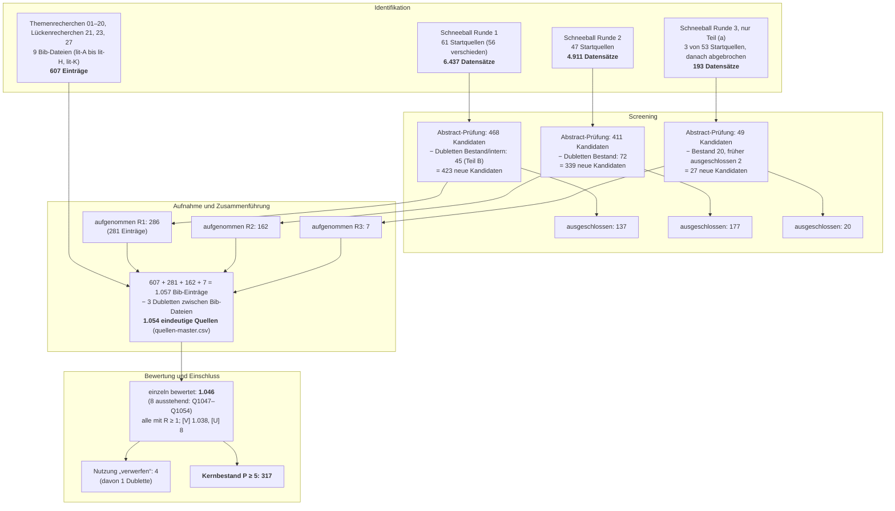

# 2 Forschungsdesign

Status: Entwurf v0.1 (27.09.2026). Zahlen zur Recherche stammen aus `literatur/quellen-master.csv`, `literatur/quellen-bewertung.csv`, `literatur/bewertung/STATISTIK.md`, `literatur/bewertung/KAPPA.md` und den Schneeballprotokollen `../recherche/24`, `25`, `26` und `28`. Zahlen zu den Prototypen stammen aus `beispiele/README.md`, `beispiele/ergebnisse.md` und `beispiele/NACHWEIS.md`. Das Recherche-Protokoll steht in `02a-review-protokoll.md`.

## 2.0 Einordnung

Die Arbeit will ein Problem der Praxis lösen und dabei verallgemeinerbares Wissen erzeugen. Sie entwirft deshalb Artefakte, prüft sie und leitet aus der Prüfung Aussagen über ihre Wirksamkeit und ihre Grenzen ab. Dieses Kapitel legt offen, wie das geschieht. Es beantwortet vier Fragen:

1. In welchem methodischen Rahmen entsteht das Wissen (2.1, 2.2)?
2. Wie wurde die Literatur erschlossen, und wie belastbar ist diese Erschließung (2.3)?
3. Wie werden die Artefakte evaluiert (2.4)?
4. An welchen Kriterien muss sich die Arbeit messen lassen (2.5)?

Ein Grundsatz gilt für das ganze Kapitel: **Befund und Bewertung werden getrennt.** Wo eine Zahl gemessen ist, steht sie mit ihrer Quelle. Wo sie geschätzt, unvollständig oder nur sekundär belegt ist, ist das gesagt.

## 2.1 Design Science Research als Rahmen

### 2.1.1 Erkenntnisziel

Die verhaltenswissenschaftliche Forschung fragt, was wahr ist: Sie erklärt und prognostiziert, wie Menschen und Organisationen mit Technik umgehen. Die gestaltungsorientierte Forschung fragt, was wirksam ist: Sie entwirft Artefakte, die ein Problem lösen, und prüft, wie gut sie es lösen. March und Smith haben diese Unterscheidung für die Informationstechnik begründet. Sie nennen vier Typen von Artefakten, nämlich Konstrukte, Modelle, Methoden und Instanziierungen, und zwei Forschungsaktivitäten, *build* und *evaluate* [@march1995design]. Hevner et al. stellen die Design Science Research (DSR) gleichrangig neben die verhaltenswissenschaftliche Forschung und formulieren sieben Leitlinien für ihre Durchführung [@hevner2004design].

Die Fragestellung dieser Arbeit ist gestaltungsorientiert. FF1 bis FF3 und FF6 fragen, *wie* sich ein Informationsmodell, ein Regelraum und eine Sprachschnittstelle gestalten lassen. FF4 fragt, wie sich Rechtspflichten im Modell abbilden lassen. Nur FF5 ist eine Wirkungsfrage im engeren Sinn, und auch sie bezieht sich auf ein Artefakt, das erst entworfen werden muss. Für das Bauwesen ist die Einordnung als Design Science nicht neu. Voordijk begründet sie für das Construction Management epistemologisch [@voordijk2009construction]. Eine aktuelle Einführung mit Fallbeispielen geben vom Brocke, Hevner und Maedche [@vombrocke2020introduction].

### 2.1.2 Die sieben Leitlinien und ihre Umsetzung

Die Leitlinien von Hevner et al. dienen als Prüfliste für das Forschungsdesign. Tabelle 2.1 zeigt, wie die Arbeit jede Leitlinie erfüllt.

**Tabelle 2.1: Leitlinien nach Hevner et al. [@hevner2004design] und ihre Umsetzung**

| Leitlinie | Anforderung | Umsetzung in dieser Arbeit | Ort |
|---|---|---|---|
| 1 Artefakt | Das Ergebnis ist ein zweckgerichtetes Artefakt. | Informationsmodell, Regelraum, Nachweis-Framework, Prototypen B1–B20 (Abschnitt 2.1.4) | Teil II, Kap. 19 |
| 2 Problemrelevanz | Das Problem ist für die Praxis bedeutsam. | Fertigbauquote, Planungsschleifen, Medienbrüche, Fachkräftemangel, belegt mit Zahlen | Kap. 1.1 |
| 3 Evaluation | Nutzen, Qualität und Wirksamkeit werden rigoros gezeigt. | technisch, analytisch und empirisch nach FEDS | Abschnitt 2.4, Kap. 20 |
| 4 Forschungsbeitrag | Der Beitrag ist klar und überprüfbar. | Integration in einer Kette; Designprinzipien; Neuheitsbehauptung mit Widerlegungskriterien | Kap. 1.3, 21 |
| 5 Rigor | Konstruktion und Evaluation stützen sich auf gesicherte Methoden. | systematische Recherche mit 1.054 Quellen; Standards IFC 4.3, IDS 1.0; Testverfahren | Abschnitt 2.3, Kap. 20.1 |
| 6 Suchprozess | Der Entwurf ist eine Suche im Raum möglicher Lösungen. | Iterationen zwischen Recherche, Beispiel und Korrektur des Zielbilds | Abschnitt 2.2 |
| 7 Kommunikation | Ergebnisse erreichen Fachwelt und Praxis. | Dissertation, lauffähige Beispiele mit Tests, Nachweishefte für Prüfer ohne Codekenntnis | Kap. 7a, 19, Anhang C |

### 2.1.3 Art des Beitrags

Gregor und Hevner ordnen DSR-Beiträge nach der Reife von Problem und Lösung. Sie unterscheiden *Improvement* (neue Lösung für ein bekanntes Problem), *Invention* (neue Lösung für ein neues Problem), *Exaptation* (bekannte Lösung für ein neues Problem) und *Routine Design* (bekannte Lösung für ein bekanntes Problem). Zugleich unterscheiden sie drei Abstraktionsebenen: situierte Instanziierungen (Ebene 1), entstehende Designtheorie aus Konstrukten, Methoden, Modellen und Designprinzipien (Ebene 2) und ausgereifte Designtheorie (Ebene 3) [@gregor2013positioning].

Die Arbeit ist überwiegend als **Exaptation** einzuordnen, mit Anteilen von **Improvement**:

- **Exaptation.** Bekannte Lösungen werden auf ein Problemfeld übertragen, für das sie nicht entwickelt wurden. Dazu gehören wissensbasierte Konfiguration, Regelprüfung auf IFC-Basis, IDS, Intent-Erkennung und BTLx-Export. Das neue Problemfeld ist der Laienentwurf vorgefertigter Holzrahmenhäuser unter deutschem Bau- und Werkvertragsrecht mit einer durchgängigen Datenkette. Diese Einordnung entspricht These 1 (Kapitel 1.3.3): Der Beitrag liegt in der Integration, nicht in neuer Grundlagentechnik.
- **Improvement.** Für einzelne bekannte Probleme entwickelt die Arbeit neue Lösungen, etwa die Nachweisführung mit Rückverfolgbarkeit zu IFC-GUID und Regelwerksversion (Kapitel 7a) oder die Ableitung des Gebäudetyps als Merkmalsvektor (Kapitel 9a).

Die Beiträge liegen auf den Ebenen 1 und 2. Die Prototypen sind Instanziierungen (Ebene 1). Die Regeltaxonomie R1 bis R5, das Schema der Reifegrade P/R/A, das Datenmodell des Nachweises und die Architekturprinzipien („Die KI versteht, der Code entscheidet“; „Andere Formate sind nur Ableitungen“) sind Konstrukte, Modelle und Designprinzipien einer entstehenden Designtheorie (Ebene 2). Eine ausgereifte Designtheorie (Ebene 3) beansprucht die Arbeit nicht.

### 2.1.4 Artefakte dieser Arbeit

Tabelle 2.2 ordnet die Artefakte nach der Typologie von March und Smith [@march1995design]. Sie nennt für jedes Artefakt die Forschungsfrage, den Ort in der Arbeit und die vorgesehene Evaluationsform.

**Tabelle 2.2: Artefakte, Typ und Evaluation**

| Artefakt | Typ | Inhalt | FF | Kapitel | Evaluation |
|---|---|---|---|---|---|
| **Informationsmodell** | Modell | Abbildung aller Phasen in IFC4X3_ADD2: Klassenmapping des Holzrahmenbaus (`IfcWall` ELEMENTEDWALL, `IfcMember` STUD/PLATE, `IfcPlate`, `IfcBuildingElementPart`, `IfcMechanicalFastener`, `IfcVoidingFeature`), doppelte Darstellung als Schichtenmodell und Einzelteile, Phasenabdeckung, Grenzen und Überbrückung | FF1, FF6 | 8, 11 | technisch (Schema, IDS), analytisch (Abdeckungsmatrix) |
| **Regelraum** | Konstrukte und Modell | Taxonomie R1 Entwurfsgrenzen, R2 Informationsanforderungen, R3 Verantwortungsregeln, R4 Formregeln (Kapitel 4.1) und R5 Empfehlungen (Kapitel 9b); Schichtung vom öffentlichen Recht bis zur Herstellerregel; Profile mit Version und Geltungszeitraum; typabhängige Regelprofile | FF2, FF4 | 4, 9, 9a, 9b | technisch (Regeltests), analytisch, empirisch (Experten) |
| **Nachweis-Framework** | Methode und Instanziierung | Datenmodell eines Nachweises: Regel mit Quelle und Fassung, Eingaben mit Einheit und Herkunft, Schritte mit Formel, Ergebnis, Grenzwert, Ausnutzung, Rundung und Unsicherheit, Grafik, Hash, Bezug zu IFC-GUID und Regelwerksversion; JSON-Schema, Markdown, HTML | FF2, FF4 | 7a | technisch (50 Tests), empirisch (Prüfbarkeit durch Experten) |
| **Architektur** | Designprinzipien | neuro-symbolische Trennung von Absichtserkennung und Rechenkern; Parametermodell → IFC-Generator → Prüfschicht → Ableitungen; deterministische GUIDs, Audit-Trail | FF3, FF4 | 7 | technisch, analytisch |
| **Prototypen B1–B20** | Instanziierungen | lauffähige, deterministische Beispiele mit Tests (Tabelle 2.3) | FF1–FF6 | 19 | technisch |

Die Prototypen sind der Teil des Artefakts, der heute ausführbar ist. Tabelle 2.3 zeigt ihren Stand. Die Nummerierung folgt dem Verzeichnis `beispiele/`.

**Tabelle 2.3: Stand der Prototypen (27.09.2026)**

| Nr. | Inhalt | FF | Stand | Tests |
|---|---|---|---|---:|
| B1 | Holzrahmen-Wandelement in IFC4X3_ADD2 mit deterministischen GUIDs, 2.393 Entitäten, 176 Verbindungsmittel | FF1 | lauffähig | 13 |
| B2 | IDS-Profil Holzrahmenbau mit 11 Spezifikationen, Prüfung mit ifctester | FF2 | lauffähig | 6 (mit B3) |
| B3 | U-Wert nach DIN EN ISO 6946 mit inhomogener Schicht | FF2, FF6 | lauffähig | (mit B2) |
| B4 | Abstandsflächen nach Art. 6 BayBO | FF2 | lauffähig | 6 (mit B5) |
| B5 | Treppenlauf-Solver nach DIN 18065 | FF2 | lauffähig | (mit B4) |
| B6 | deterministische Sprachpipeline: Werteparser, Raumreferenz, Intent mit Regelprüfung; Intent-Modell als Stub | FF3 | lauffähig | 23 (mit B7) |
| B7 | BTLx-Export mit compas_timber | FF1 | lauffähig (optional) | (mit B6) |
| N | Nachweis-Framework, nachgerüstet für B1–B5: 7 Nachweishefte, 32 Nachweise | FF2, FF4 | lauffähig | 50 |
| B14 | Fußbodenaufbau-Solver: gleiche Fertigfußbodenhöhe bei unterschiedlichen Belägen | FF6 | lauffähig | 18 |
| B15 | Durchdringung einer Abwasserleitung DN 100 durch Holzbalkendecke und Ständerwand | FF6 | lauffähig | 10 |
| B16 | Fliesen als 3D-Einzelobjekte: Verlegemuster auf mehrfachem Gefälle, Verschnitt, Reststücke | FF6 | lauffähig | 15 |
| B17 | Grundstücksentwässerung: Grundleitung, Schächte, Rigolenbemessung | FF6 | lauffähig | 20 |
| B18 | Kranplanung: Elementgewichte aus IFC, Kranwahl, Montageplan als `IfcWorkSchedule` | FF6 | lauffähig | 15 |
| B19 | Schallschutz gegen Außenlärm mit Grundrissvariante | FF6 | lauffähig | 16 |
| B20 | Wärmepumpe: Schallausbreitung nach DIN ISO 9613-2, Beurteilung nach TA Lärm, Rasterlärmkarte | FF6 | lauffähig | 17 |
| B8–B13 | Routing, Bemusterungsoption Wand-WC, glTF-Export, Fliesen als festgeschriebene Auswahl, Wechsel EFH → ZFH, Grundriss-Assistenz | FF1, FF2, FF6 | geplant | – |
| – | Walmdach über Straight Skeleton mit Deckung, Grat und Kehle | FF6 | geplant | – |
| **Summe** | | | | **209** |

Eine Unstimmigkeit ist offen zu benennen: Die Gliederung führt das Walmdach als „B7 (geplant)“, im Verzeichnis `beispiele/` ist die Nummer B7 aber durch den BTLx-Export belegt. Die Nummerierung wird vor der Abgabe vereinheitlicht.

### 2.1.5 Abgrenzung zu verwandten Ansätzen

Zwei verwandte Ansätze wurden erwogen und nicht als Rahmen gewählt.

- **Action Design Research** verschränkt Entwicklung, Intervention und Evaluation in einer Organisation [@sein2011action]. Dieser Rahmen setzt voraus, dass das Artefakt in der Organisation des Praxispartners eingesetzt und dort weiterentwickelt wird. Das ist für die empirische Phase denkbar, für den Entwurf aber nicht gegeben, weil die internen Daten des Praxispartners nicht offenliegen (Kapitel 1.4.4).
- **Design Research Methodology** aus der Konstruktionsforschung gliedert Forschung in Research Clarification, Descriptive Study I, Prescriptive Study und Descriptive Study II [@blessing2009drm]. Ihre Stärke ist die empirische Erhebung der Ausgangssituation. Diese Stärke übernimmt die Arbeit als Ergänzung: Die Erhebung der Ausgangswerte beim Praxispartner (Kapitel 20.3) entspricht einer Descriptive Study I, die Vorher-nachher-Messung einer Descriptive Study II.

Das Prozessmodell von Peffers et al. bleibt der Rahmen, weil es den Artefaktzyklus und seine Kommunikation am klarsten strukturiert und in der Informationssystemforschung am weitesten verbreitet ist.

## 2.2 Vorgehen: Problem, Ziele, Artefakt, Demonstration, Evaluation, Kommunikation

### 2.2.1 Die sechs Aktivitäten

Peffers et al. operationalisieren DSR in sechs Aktivitäten: Problemidentifikation und Motivation, Definition der Ziele einer Lösung, Entwurf und Entwicklung, Demonstration, Evaluation und Kommunikation. Das Modell lässt vier Einstiegspunkte zu: problemzentriert, zielzentriert, entwicklungszentriert und durch Kunde oder Kontext angestoßen [@peffers2007design].

Diese Arbeit ist **zielzentriert** eingestiegen. Am Anfang stand ein Zielbild, das Zweck, Prinzipien und Endzustand beschrieb (`../00-zielbild.md`, Version 0.1). Seine Annahmen trugen zunächst Prüfmarker. Erst danach wurden Problem und Handlungsdruck mit Belegen unterlegt, etwa durch die Zahlen zu Fertigbauquote und Fachkräftemangel (Recherche 07). Diese Reihenfolge ist legitim, muss aber offengelegt werden: Das Zielbild ist eine Hypothese über eine gute Lösung, keine Beobachtung.

**Tabelle 2.4: Aktivitäten nach Peffers et al. und ihre Umsetzung**

| Aktivität | Leitfrage | Umsetzung | Kapitel |
|---|---|---|---|
| 1 Problemidentifikation | Welches Problem besteht, und warum ist es relevant? | Planungsschleifen, Medienbrüche, Fachkräftemangel; Forschungslücke aus systematischer Recherche | 1, 3, 5 |
| 2 Ziele der Lösung | Was soll eine Lösung leisten? | Why, Prinzipien und Erfolgskriterien E1–E6; Anforderungen; harte Grenzen aus Recht und Norm | 1.2, 4, 6 |
| 3 Entwurf und Entwicklung | Wie sieht das Artefakt aus? | Architektur, Informationsmodell, Regelraum, Sprachschnittstelle, Detailtiefe, Freigaben | 7–18 |
| 4 Demonstration | Löst das Artefakt das Problem an einem Beispiel? | lauffähige Beispiele B1–B20 und Nachweishefte | 19 |
| 5 Evaluation | Wie gut löst es das Problem? | technisch, analytisch, empirisch | 20 |
| 6 Kommunikation | Wer muss davon erfahren? | Dissertation, Beispielcode, Nachweishefte, Fragenkatalog an den Praxispartner | 21, 22, Anhänge |

### 2.2.2 Evaluation in jeder Aktivität

Sonnenberg und vom Brocke kritisieren, dass das Muster „erst bauen, dann evaluieren“ zu spät prüft. Sie schlagen vier Evaluationsaktivitäten vor, zwei vor und zwei nach der Konstruktion [@sonnenberg2012evaluations]. Die Arbeit übernimmt diese Gliederung, weil sie die Rechtfertigung des Problems und des Entwurfs ausdrücklich zur Evaluation zählt.

| Aktivität | Zeitpunkt | Gegenstand | Umsetzung in dieser Arbeit |
|---|---|---|---|
| EVAL1 | ex ante | Ist das Problem richtig identifiziert und relevant? | Belege für den Handlungsdruck (Kap. 1.1); Forschungslücke aus der Recherche (Kap. 1.3.1) |
| EVAL2 | ex ante | Ist der Entwurf geeignet, das Problem zu lösen? | Abgleich der Architektur mit Rechtsrahmen und Normen (Kap. 4); Abdeckungsmatrix auf Schemaebene (Kap. 20.2) |
| EVAL3 | ex post, artifiziell | Funktioniert die Instanziierung? | Tests, Validierung, Handrechnungen, Fehlerinjektion (Kap. 20.1) |
| EVAL4 | ex post, naturalistisch | Wirkt das Artefakt im Einsatz? | Experteninterviews, Nutzerstudie, Kennzahlen beim Praxispartner (Kap. 20.3, geplant) |

Für die Wahl konkreter Methoden je Aktivität beschreiben dieselben Autoren wiederverwendbare Evaluationsmuster [@sonnenberg2012patterns].

### 2.2.3 Iteration statt Wasserfall

Die sechs Aktivitäten sind nicht linear durchlaufen worden. Mehrfach hat eine spätere Aktivität eine frühere korrigiert. Drei Beispiele zeigen, wie diese Rückkopplung aussieht:

- **Recherche korrigiert Zielbild.** Das Zielbild nannte für die Holzfeuchte 18 %. Die Prüfung an der Primärquelle ergab, dass DIN 68800-2 20 % verlangt und die 18 % aus den Güte- und Prüfbestimmungen RAL-GZ 422 stammen. Beide Werte erscheinen deshalb in verschiedenen Regelprofilen (Kapitel 4.4). Ebenso zeigte die Schemaprüfung, dass `IfcTransportElement` einen Kran oder Aufzug bezeichnet und nicht einen LKW; für Fahrzeuge ist `IfcVehicle` vorgesehen (Recherche 06).
- **Demonstration korrigiert Entwurf.** Siehe Beispiel 2.1.
- **Evaluation korrigiert Recherche.** Die Einzelbewertung der Quellen zeigte, dass FF4 und FF5 zunächst schwach belegt waren. Das löste zwei gezielte Lückenrecherchen aus (Abschnitt 2.3.3).

> **Beispiel 2.1 (Determinismus als Befund der Demonstration).** Das Prinzip „Ein Modell ist die Wahrheit“ setzt voraus, dass dieselbe Eingabe dasselbe Modell erzeugt. Nur dann lassen sich Nachweise über einen Hash an eine Modellversion binden.
>
> Die erste Fassung von B1 nutzte die Hilfsfunktionen von `ifcopenshell.api`. Mit vier verschiedenen Werten für `PYTHONHASHSEED` entstanden vier verschiedene Dateien mit vier verschiedenen SHA-256-Werten. Die Ursache: Mehrere Funktionen iterieren über Python-Mengen, deren Reihenfolge vom Hash-Seed abhängt.
>
> Die Konsequenz für den Entwurf war eine Architekturregel: Beziehungen, Einheiten und Platzierungen werden direkt und in fester Listenreihenfolge angelegt. Danach war die Datei byte-identisch, auch über getrennte Prozesse mit den Hash-Seeds 1 und 4711 (SHA-256 `5a796ea7…b478b`). Ein Test sichert diese Eigenschaft seither ab.
>
> Der Befund hätte sich weder aus der Literatur noch aus der Dokumentation der Bibliothek ergeben. Er ist ein typisches Ergebnis des Build-Evaluate-Zyklus: Die Demonstration hat eine Anforderung sichtbar gemacht, die im Entwurf implizit geblieben war.

## 2.3 Recherchemethodik

### 2.3.1 Anleitungen und Anspruch

Die Recherche folgt drei Anleitungen: den Richtlinien für systematische Literaturreviews in der Softwaretechnik [@kitchenham2007guidelines], dem Schneeballverfahren [@wohlin2014guidelines] und dem Berichtsstandard PRISMA 2020 [@page2021prisma]. PRISMA ist für Übersichtsarbeiten zu Interventionen entwickelt. Die Arbeit wendet den Standard **sinngemäß** an, weil ihr Feld Wissenschaft, Normen, Gesetze, Rechtsprechung und Technik verbindet. Übernommen werden die Transparenz der Schritte, die Zahlen je Schritt und das Flussdiagramm; nicht übernommen werden Risk-of-Bias-Bewertungen und Metaanalysen.

Das Protokoll (`02a-review-protokoll.md`) formuliert zwei Ansprüche:

1. **Vollständige systematische Erschließung** ohne Vorwissen über bestimmte Autoren oder Schulen, ausdrücklich auch für die Architekturpsychologie und für Forschung aus dem regionalen Umfeld.
2. **Einzelbewertung jeder Quelle** auf ihre Passung zu den Forschungsfragen. Eine Quelle zählt nicht, weil sie gefunden wurde, sondern weil ihr Beitrag zu einer Forschungsfrage begründet ist.

### 2.3.2 Quellenarten und Verifikationsregeln

Das Feld verlangt, Quellen sehr unterschiedlicher Art gleich streng zu behandeln. Das Protokoll unterscheidet vier Arten mit je eigenem Prüfweg.

**Tabelle 2.5: Quellenarten, Prüfweg und Bestand (bewertete Quellen)**

| Art | Beispiele | Prüfweg | Anzahl | davon Kernbestand |
|---|---|---|---:|---:|
| W – Wissenschaft, begutachtet | Journal, Konferenz, Dissertation | DOI über Crossref bzw. Verlag oder Repositorium | 846 | 190 |
| N – Norm, Gesetz, Rechtsprechung | BayBO, DIN, BGH-Urteile, Drucksachen | amtliche Fundstelle bzw. Ausgabe beim Normgeber | 90 | 81 |
| G – graue Literatur | Forschungsberichte, Leitfäden, Verbandsmitteilungen | Primärquelle beim Herausgeber | 98 | 37 |
| T – Technik | Software, Datenstandards, Datensätze | Repository, Lizenzdatei, Spezifikation | 12 | 9 |
| **Summe** | | | **1.046** | **317** |

Für jeden Befund gilt eine von zwei Kennzeichnungen:

- **[V] verifiziert:** Autor, Jahr, Titel und Fundstelle sind an einer Primärquelle geprüft (Crossref, DataCite, Verlagsseite, Repositorium, amtliche Fundstelle). Bei Normen und Gesetzen gehört die geltende Fassung zum Stichtag dazu.
- **[U] unsicher:** Die Existenz ist belegt, aber eine Teilangabe ist offen, etwa Seitenzahl, Band, Ausgabe oder eine Zahl, die nur aus einem Sekundärzitat stammt. Der Grund steht im `note`-Feld der Bib-Datei.

Von den 1.046 bewerteten Quellen sind 1.038 mit [V] und 8 mit [U] gekennzeichnet. Quellen, deren Existenz nicht belegt werden konnte, stehen nicht im Literaturverzeichnis. Sie sind in den Recherchedokumenten als „nicht verifizierte Hinweise“ geführt und werden nie zitiert. Das betrifft zum Beispiel Herstellerangaben zur Zeitersparnis in der Werkplanung, die ausdrücklich nicht als Beleg dienen (Recherche 23).

Die bibliografische Prüfung hat auch zu Korrekturen am Bestand geführt: Vornamen, Herausgeber- statt Autorenschaft, DOIs der Journal- statt der Tagungsfassung und amtliche Vollzitate von Gesetzen. Alle Korrekturen sind mit altem und neuem Wert und Prüfweg dokumentiert (`literatur/KORREKTUREN.md`).

### 2.3.3 Suchstrategie und Ablauf

Die Recherche verlief in drei Strängen.

1. **Themenrecherchen.** Die Themenfelder sind aus FF1 bis FF6 abgeleitet. Die Recherchen 01 bis 20 decken sie ab, von IFC und BTLx über Recht und Normen bis zu Grundstücksentwässerung und Außenlärm. Zwei Recherchen zu vergleichbaren Arbeiten (11 und 12) stellen die nächsten Arbeiten in Vergleichsmatrizen gegenüber.
2. **Lückenrecherchen.** Sie schließen Lücken, die ohne Vorwissen entstehen würden oder die die Einzelbewertung sichtbar gemacht hat:
   - Recherche 21: regionale Holzbauforschung (TH Rosenheim, ift Rosenheim), deutschsprachige Architekturpsychologie, Methodenstandards;
   - Recherche 23: FF4 und FF5. Anlass war, dass zum damaligen Stand nur 12 Quellen FF4 und nur 24 Quellen FF5 mit Relevanz ≥ 2 trugen;
   - Recherche 27: frei zugängliche juristische Quellen zu FF4 (Rechtsprechung, Gesetzesmaterialien, Open-Access-Aufsätze).
3. **Schneeballverfahren** vorwärts und rückwärts ab dem Kernbestand, in drei Runden (Abschnitt 2.3.7).

Suchräume waren Crossref und OpenAlex, Verlagsportale (Elsevier, Springer, Taylor & Francis, ASCE, MDPI), Repositorien (mediaTUM, ETH Research Collection, DiVA, arXiv), amtliche Portale (gesetze-bayern.de, gesetze-im-internet.de, EUR-Lex, Parlamentsdokumentation) sowie Normgeber, Verbände und Hersteller.

Die Masterliste `quellen-master.csv` ist in sechs Schritten gewachsen. Jeder Schritt wurde gegen den Bestand über DOI und normalisierten Titel auf Dubletten geprüft.

**Tabelle 2.6: Wachstum der Masterliste**

| Schritt | Quelle | neue Einträge | Stand der Masterliste |
|---|---|---:|---:|
| 1 | Themenrecherchen 01–20 und Lückenrecherche 21 (`lit-A` bis `lit-G`, 465 Einträge, 3 Dubletten) | 462 | 462 |
| 2 | Lückenrecherche 23 zu FF4/FF5 (`lit-H`) | 68 | 530 |
| 3 | Schneeball Runde 1 (`lit-I-schneeball-a`, `lit-I-schneeball-b`) | 281 | 811 |
| 4 | Schneeball Runde 2 (`lit-J`) | 162 | 973 |
| 5 | juristische Lückenrecherche 27 (`lit-K`) | 74 | 1.047 |
| 6 | Schneeball Runde 3, Teil (a) (`lit-L`) | 7 | **1.054** |

Das Protokoll nennt als Ausgangsstand 393 Einträge; dieser Wert bezeichnet den Stand vor der Zusammenführung aller Themenrecherchen und ist überholt.

### 2.3.4 Ein- und Ausschlusskriterien

**Eingeschlossen** werden Quellen, die

- mindestens eine Forschungsfrage mit Relevanz ≥ 1 berühren,
- existent und prüfbar sind (Autor, Jahr, Titel, Fundstelle),
- bei Normen und Gesetzen in der zum 27.09.2026 geltenden Fassung vorliegen oder historisch begründet sind, etwa die Vollgeschossdefinition der BayBO in der Fassung bis 2007.

**Ausgeschlossen** werden Quellen, die nicht verifizierbar sind, und Sekundärquellen, wenn eine Primärquelle existiert. Im Schneeballverfahren galt zusätzlich eine strengere Aufnahmeschwelle von Relevanz ≥ 2 in mindestens einer Forschungsfrage. Ausgeschlossen wurden dort außerdem nicht begutachtete Preprints, Vorfassungen bereits erfasster Arbeiten und Funde, die nur ein Argument wiederholen, das eine Bestandsquelle schon trägt („redundant“).

Pseudowissenschaftliche Aussagen, etwa zu Erdstrahlen, werden nicht als Beleg zitiert. Sie erscheinen nur als Gegenstand der Abgrenzung, zum Beispiel bei den Kulturprofilen in Kapitel 9b.

### 2.3.5 Einzelbewertung der Passung

Jede Quelle erhält eine Zeile in `literatur/quellen-bewertung.csv`. Die Felder sind im Protokoll definiert (2a.5):

- **Relevanz je Forschungsfrage** `ff1` bis `ff6` auf einer Skala von 0 bis 3: 0 keine, 1 Kontext, 2 stützt ein Argument, 3 trägt ein zentrales Argument oder liefert einen übernehmbaren Baustein.
- **Qualität** A bis D: A begutachtete Übersichtsarbeit, Metaanalyse oder geltendes Recht bzw. Norm; B begutachtete Einzelstudie oder Dissertation; C graue Literatur oder Herstellerangabe; D Tradition oder Meinung ohne empirische Prüfung.
- **Übertragbarkeit** auf Deutschland bzw. Bayern, Holzbau und Fertighaus: 0 nicht, 1 mit Anpassung, 2 direkt.
- **Nutzung** in der Arbeit: übernehmen, adaptieren, abgrenzen, Kontext, verwerfen.
- **Begründung** in ein bis drei Sätzen und der **Verwendungsort** (Kapitel).

Aus den Feldern werden zwei Kennzahlen berechnet:

$$R = \max(\mathit{ff}_1, \ldots, \mathit{ff}_6)$$

$$P = R + \text{Übertragbarkeit} + Q, \qquad Q \in \{A: 2;\ B: 1{,}5;\ C: 1;\ D: 0\}$$

Quellen mit P ≥ 5 bilden den **Kernbestand**. Er ist Ausgangspunkt des Schneeballverfahrens und wird im Text vertieft diskutiert.

> **Beispiel 2.2 (Bewertung zweier Quellen).**
>
> *Eastman et al. 2009* [@eastman2009automatic]: FF2 = 3, weil die Arbeit die Vier-Stufen-Architektur der Regelprüfung liefert (Regelinterpretation, Modellvorbereitung, Ausführung, Bericht). Qualität A (Übersichtsarbeit), Übertragbarkeit 1 (kein Holzbau- und kein Deutschlandbezug). P = 3 + 1 + 2 = **6**, also Kernbestand, Nutzung „übernehmen“.
>
> *Kwieciński und Słyk 2023* [@kwiecinski2023interactive]: interaktives generatives System für partizipativen Einfamilienhausentwurf, das Nutzerentscheidungen gegen formalisierte Regeln prüft. Erstbewertung FF2 = 2 und FF5 = 2, Qualität B, Übertragbarkeit 1. P = 2 + 1 + 1,5 = **4,5**, also knapp nicht im Kernbestand. Die blinde Zweitbewertung setzte FF2 = 3 und kam auf P = 5,5.
>
> Das zweite Beispiel zeigt die Empfindlichkeit der Schwelle: Eine Stufe Unterschied in einer einzigen Forschungsfrage entscheidet über die Zugehörigkeit zum Kernbestand. Abschnitt 2.3.9 misst, wie oft das vorkommt.

### 2.3.6 Ergebnis der Einzelbewertung

Von den 1.054 Quellen der Masterliste sind 1.046 einzeln bewertet. Acht Bewertungen stehen aus (Q1047 bis Q1054): die sieben Funde der dritten Schneeballrunde und ein Nachtrag der juristischen Lückenrecherche. Alle 1.046 bewerteten Quellen erfüllen das Einschlusskriterium R ≥ 1: 280 haben R = 1, 633 haben R = 2 und 133 haben R = 3. **317 Quellen bilden den Kernbestand.**

**Tabelle 2.7: Qualität, Nutzung und Übertragbarkeit der bewerteten Quellen**

| Qualität | Anzahl | Nutzung | Anzahl | Übertragbarkeit | Anzahl |
|---|---:|---|---:|---|---:|
| A | 157 | übernehmen | 162 | 2 direkt | 260 |
| B | 758 | adaptieren | 396 | 1 mit Anpassung | 761 |
| C | 124 | Kontext | 429 | 0 nicht | 25 |
| D | 7 | abgrenzen | 55 | | |
| | | verwerfen | 4 | | |

Unter den vier verworfenen Quellen ist eine Dublette: Die KI-Verordnung stand unter zwei Keys im Bestand; zitiert wird nur `aiact2024`.

**Tabelle 2.8: Relevanz je Forschungsfrage (Anzahl Quellen)**

| | FF1 | FF2 | FF3 | FF4 | FF5 | FF6 |
|---|---:|---:|---:|---:|---:|---:|
| Relevanz ≥ 2 | 131 | 232 | 72 | 113 | 154 | 199 |
| davon Relevanz 3 | 17 | 33 | 7 | 28 | 19 | 30 |

Drei Befunde lassen sich aus den Tabellen ablesen:

1. **Die Lückenrecherchen haben gewirkt.** FF4 stieg von 12 auf 113 Quellen mit Relevanz ≥ 2, FF5 von 24 auf 154. 81 der 113 FF4-Quellen stammen aus den Lückenrecherchen 23 und 27, 44 davon sind Gesetze, Gesetzesmaterialien oder Rechtsprechung (Art N); 28 Quellen tragen FF4 mit Relevanz 3.
2. **FF3 ist am schwächsten belegt.** Nur 72 Quellen stützen die Sprachschnittstelle, nur 7 tragen sie. Das entspricht dem Befund aus Kapitel 1.3.1, dass deutschsprachige Arbeiten zur Intent-Erkennung im Hausentwurf fehlen. Die Schwäche ist also teils ein Befund über das Feld und nicht nur über die Recherche.
3. **Die Quellenlage ist überwiegend übertragbar mit Anpassung.** 761 von 1.046 Quellen haben die Übertragbarkeit 1. Direkt übertragbar sind vor allem Gesetze, Normen und deutsche Studien; nur 25 Quellen sind nicht übertragbar und dienen der Abgrenzung oder dem Kontext.

### 2.3.7 Schneeballverfahren

**Verfahren.** Das Schneeballverfahren folgt Wohlin [@wohlin2014guidelines]. Je Startquelle werden die Referenzen (rückwärts) und die zitierenden Arbeiten (vorwärts) gesichtet, zuerst nach Titel, dann nach Abstract. Die Zitationsdaten stammen aus OpenAlex, die bibliografische Verifikation aus Crossref, bei Tagungsbänden ohne DOI aus der Verlagsseite. Die Relevanzmaßstäbe sind dieselben wie in der Einzelbewertung. Generische Anwendungen in fremden Domänen, etwa Regelextraktion für chinesische Tunnelnormen, erhalten höchstens Relevanz 1 und werden nicht aufgenommen.

**Startmengen.** Runde 1 startete in zwei Teilen: Teil A mit 23 Startquellen für FF1, FF2 und FF4, Teil B mit 38 Startquellen für FF3, FF5 und FF6. Auswahlregel war jeweils Kernbestand, Quellenart W und entweder Relevanz 3 in einer der drei Forschungsfragen oder Relevanz ≥ 2 bei P ≥ 6. Fünf Startquellen gehörten zu beiden Teilen; es waren also 56 verschiedene. Runde 2 startete mit den 47 Kernbestandsquellen der Art W, die Runde 1 neu gefunden hatte. Runde 3 war gezielt angelegt und umfasste 53 Startquellen: die drei Relevanz-3-Funde der Runde 2 (Teil a) und 50 Funde aus den beiden Clustern, die in Runde 2 noch überdurchschnittlich geliefert hatten, nämlich Sprache und Konfiguration (FF3) sowie Regelprüfung und Bauantrag (FF2/FF4) (Teil b).

**Tabelle 2.9: Kennzahlen der drei Schneeballrunden**

| Kennzahl | R1 Teil A | R1 Teil B | **R1 gesamt** | **R2** | **R3 Teil (a)** |
|---|---:|---:|---:|---:|---:|
| Startquellen | 23 | 38 | 61 (56 verschieden) | 47 | 3 von 53 |
| Datensätze gesichtet (roh) | 2.800 | 3.637 | 6.437 | 4.911 | 193 |
| Kandidaten zur Abstract-Prüfung | 211 | 257 | 468 | 411 | 49 |
| davon Dubletten zum Bestand | 99 ¹ | 42 | – | 72 | 20 (+ 2 früher ausgeschlossen) |
| neue Kandidaten | 211 | 212 | 423 | 339 | 27 |
| ausgeschlossen nach Abstract | 100 | 37 | 137 | 177 | 20 |
| **aufgenommen** | 111 | 175 | **286** | **162** | **7** |
| davon Relevanz 3 | 10 | 19 | 29 (10,1 %) | 3 (1,9 %) | 1 (14 %) |
| Rohquote aufgenommen / gesichtet | 4,0 % | 4,8 % | 4,4 % | 3,3 % | 3,6 % |
| Trefferquote aufgenommen / neue Kandidaten | 52,6 % | 82,5 % | 67,6 % | 47,8 % | 25,9 % |

¹ In Teil A wurden Bestandsdubletten schon auf Listenebene vor dem Titel-Screening entfernt; die 211 Kandidaten sind deshalb alle neu. Zusätzlich wurden 410 rundeninterne Dubletten entfernt. In Teil B und in den Runden 2 und 3 sind die Rohzahlen „gesichtet“ rundenintern nicht bereinigt.

Fünf Quellen wurden in beiden Teilen der Runde 1 gefunden. Sie stehen nur einmal im Literaturverzeichnis (in `lit-I-schneeball-b`). Die 286 Aufnahmen der Runde 1 entsprechen deshalb 281 Einträgen. Über alle drei Runden wurden 11.541 Datensätze gesichtet und 450 neue Einträge aufgenommen.

**Ausschlussgründe.** In Runde 2 wurden 177 Kandidaten ausgeschlossen: 102 wegen Relevanz < 2 oder Zuordnung zu einer anderen Forschungsfrage, 49 als redundant, 10 als Vorfassung, 9 als nicht verifizierbar, 4 als Preprint und 3 als nicht begutachtete Hochschulschrift. In Runde 1 Teil A waren es 100: 83 wegen Relevanz < 2, 8 SSRN-Preprints, 4 Vorfassungen, 4 nicht verifizierbar und eine Hochschulschrift. Die Preprints sind als Hinweise festgehalten und werden nach einer Begutachtung erneut geprüft.

**Abbruchkriterium und Abweichung vom Protokoll.** Das Protokoll sah vor, das Verfahren zu beenden, wenn eine Runde keine neue Quelle mit Relevanz ≥ 2 mehr liefert (2a.3 Nr. 3). Dieses Kriterium ist bei einem so breiten Feld praktisch unerreichbar: Runde 2 lieferte noch 162 solcher Quellen. Für Runde 2 wurde es deshalb durch ein zweiteiliges Kriterium ersetzt: Die Aufnahmequote liegt deutlich unter der von Runde 1, und keine neue Quelle erreicht Relevanz 3. Für Runde 3 wurde es präzisiert: keine neue Relevanz-3-Quelle und eine Rohquote unter 2 %, also unter der Hälfte von Runde 1. Diese Änderungen sind eine Abweichung vom Protokoll. Sie sind in den Recherchen 26 und 28 begründet und werden hier ausdrücklich als solche benannt.

**Sättigung.**

- **Runde 2 ist nicht gesättigt.** Die Rohquote sank von 4,4 % auf 3,3 %, also um ein Viertel und nicht um die Hälfte. Drei neue Quellen erreichten Relevanz 3: eine Zerlegung von Nutzeranfragen in Intent und Slots für BIM [@wei2025texttostructure], eine automatische Fertigbarkeitsprüfung von Holzrahmen-Baugruppen [@an2020bimbased] und ein automatischer Entwässerungsentwurf für Wohngebäude im Tafelbau [@zhang2022bimbased]. Der Ertrag an Relevanz-3-Funden ist gegenüber Runde 1 aber um 90 % eingebrochen, und der Anteil redundanter Funde und Vorfassungen hat sich etwa verfünffacht (von 3,5 % auf 17,4 %). Für Dachgeometrie, Schall und Licht, Wirkung und Evaluation sowie das Informationsmodell allgemein wurde keine weitere Runde durchgeführt, weil die Cluster-Quoten zwischen 1,1 und 3,2 % lagen.
- **Runde 3 wurde nach Teil (a) abgebrochen.** Nach den Abfragen für die drei Relevanz-3-Startquellen war das Kontingent des Suchdienstes erschöpft (HTTP 402 am 27.09.2026). Alle anderen Wege zu Zitationsdaten waren durch die Netzwerkkonfiguration der Arbeitsumgebung gesperrt (HTTP 403). Bearbeitet sind 3 von 53 Startquellen in beide Richtungen. Offen sind 50 Startquellen mit laut OpenAlex rund 1.760 Referenzen und 2.590 Zitierenden.
- **Im bearbeiteten Teil ist die Sättigung nicht erreicht.** Die Rohquote liegt mit 3,6 % über der Schwelle von 2 %, und mit einer ontologiebasierten Fertigbarkeitsprüfung für den Holztafelbau kam eine weitere Relevanz-3-Quelle hinzu [@cao2022ontologybased]. Die Anzeichen einer nahen Sättigung nehmen aber zu: Die Trefferquote je neuem Kandidaten halbierte sich nahezu (47,8 % → 25,9 %), der Anteil der Bestandsdubletten unter den Kandidaten stieg von 17,5 % auf 40,8 %, und der Anteil aller Wiederholungen stieg von 32 % auf 59 %. Mit 193 Datensätzen ist die Basis allerdings klein; eine Aufnahme mehr oder weniger verschiebt die Quote um 0,5 Prozentpunkte.

**Folge.** Die Suche kann **nicht als gesättigt abgeschlossen** gelten. Für FF3 und FF2/FF4 fehlt die Messung ganz. Die Neuheitsbehauptung in Kapitel 1.3.1 ist deshalb unter den Vorbehalt „nach dem dokumentierten Stand“ gestellt. Vor der Abgabe sind Teil (b) der Runde 3 und eine Runde ab `cao2022ontologybased` nachzuholen, sobald der Zugang zu den Zitationsdatenbanken wiederhergestellt ist.

### 2.3.8 PRISMA-Flussdiagramm

Abbildung 2.1 fasst die Recherche nach PRISMA 2020 [@page2021prisma] zusammen. Sie verbindet die beiden Zugänge: Die Themen- und Lückenrecherchen liefern Einträge, die direkt nach Einzelprüfung aufgenommen wurden; das Schneeballverfahren liefert Datensätze, die in zwei Stufen gesichtet wurden.

*Abbildung 2.1: Flussdiagramm der Recherche in Anlehnung an PRISMA 2020. In Runde 1 Teil A wurden 99 Bestandsdubletten und 410 rundeninterne Dubletten bereits vor dem Titel-Screening entfernt (siehe Tabelle 2.9, Fußnote 1).*

Für Leser ohne Mermaid-Darstellung gibt Tabelle 2.10 dieselben Zahlen als Liste.

**Tabelle 2.10: PRISMA-Zahlen als Liste**

| Stufe | Themen-/Lückenrecherchen | Schneeball R1 | Schneeball R2 | Schneeball R3 (a) | Summe |
|---|---:|---:|---:|---:|---:|
| Identifikation (Einträge bzw. Datensätze) | 607 | 6.437 | 4.911 | 193 | – |
| Abstract-Prüfung | – | 468 | 411 | 49 | 928 |
| neue Kandidaten | – | 423 | 339 | 27 | 789 |
| aufgenommen (Einträge) | 607 | 281 | 162 | 7 | 1.057 |
| nach Dublettenabgleich zwischen Bib-Dateien | | | | | **1.054** |
| einzeln bewertet | | | | | **1.046** |
| Kernbestand (P ≥ 5) | | | | | **317** |

### 2.3.9 Beurteilerübereinstimmung

**Anlage.** Das Protokoll sah vor, dass die Passung zunächst von einem Bewerter eingeschätzt und für den Kernbestand unabhängig zweitbewertet wird (2a.7). Umgesetzt wurde eine blinde Zweitbewertung an einer **Stichprobe von 80 Quellen**, davon 50 aus dem Kernbestand und 30 aus der Peripherie, gezogen per Zufall mit festem Startwert. Die Zweitbewertung erfolgte ohne Einsicht in die Erstbewertung. Gemessen wurde die Übereinstimmung mit Cohens κ [@cohen1960coefficient], für ordinale Merkmale mit quadratischen Gewichten. Die Einordnung folgt Landis und Koch [@landis1977measurement]. Das Skript liegt in `literatur/bewertung/kappa.py`.

**Tabelle 2.11: Beurteilerübereinstimmung (n = 80)**

| Merkmal | Skala | κ | Einordnung | exakt gleich |
|---|---|---:|---|---:|
| Kernbestand (P ≥ 5) | nominal | 0,76 | erheblich | 89 % |
| Nutzung | nominal | **0,45** | **mittelmäßig** | **62 %** |
| Qualität | nominal | 0,95 | fast vollkommen | 98 % |
| Gesamtrelevanz R | ordinal, gewichtet | 0,58 | mittelmäßig | 69 % |
| FF1 | ordinal, gewichtet | 0,84 | fast vollkommen | 78 % |
| FF2 | ordinal, gewichtet | 0,83 | fast vollkommen | 66 % |
| FF3 | ordinal, gewichtet | 0,86 | fast vollkommen | 88 % |
| FF4 | ordinal, gewichtet | 0,88 | fast vollkommen | 90 % |
| FF5 | ordinal, gewichtet | 0,83 | fast vollkommen | 79 % |
| FF6 | ordinal, gewichtet | 0,81 | fast vollkommen | 66 % |
| Übertragbarkeit | ordinal, gewichtet | 0,78 | erheblich | 89 % |

**Befund.** Die Relevanz je Forschungsfrage und die Qualität werden zuverlässig bewertet. Die Entscheidung über den Kernbestand ist mit κ = 0,76 erheblich übereinstimmend; in 9 von 80 Fällen wichen die Bewerter ab. In acht dieser neun Fälle lag die Abweichung genau an der Schwelle (P = 4,5 gegenüber 5,5). Nur in einem Fall war sie größer: Eine algorithmische Arbeit zur Straight-Skeleton-Berechnung wurde ohne Abstract einmal als Kontext (P = 4,5), einmal als übernehmbarer Baustein (P = 6,5) eingestuft.

Die gewichteten κ-Werte je Forschungsfrage liegen deutlich über dem κ der Gesamtrelevanz R (0,58), obwohl R aus ihnen berechnet wird. Das ist kein Widerspruch. R ist das Maximum über sechs Werte, und eine Abweichung in einer einzigen Forschungsfrage genügt, um R zu verschieben. Die Maximumbildung verstärkt also kleine Unterschiede.

**Schwäche bei der Nutzung.** Das Merkmal Nutzung erreicht nur κ = 0,45; die Bewerter stimmten in 50 von 80 Fällen überein. Die Analyse der 30 Abweichungen zeigt ein klares Muster:

| Erstbewertung → Zweitbewertung | Fälle |
|---|---:|
| adaptieren ↔ Kontext (beide Richtungen) | 16 |
| übernehmen ↔ adaptieren (beide Richtungen) | 7 |
| übernehmen ↔ Kontext (beide Richtungen) | 4 |
| mit „abgrenzen“ oder „verwerfen“ | 3 |

Mehr als die Hälfte der Abweichungen betrifft also die Grenze zwischen „adaptieren“ und „Kontext“. Das Schema sagt, *dass* eine Quelle adaptiert wird, aber nicht, *woran* man eine Adaption erkennt. Ob eine Quelle, die eine Idee liefert, schon „adaptiert“ oder nur als „Kontext“ genutzt wird, ist ohne Entscheidungsregel eine Ermessensfrage.

**Folge: Schärfung mit Ankerbeispielen.** Für die qualitative Inhaltsanalyse ist das Mittel dafür bekannt: Jede Kategorie erhält eine Definition, ein Ankerbeispiel und eine Kodierregel für Grenzfälle [@mayring2022inhaltsanalyse]. Die Arbeit überträgt dieses Vorgehen auf das Merkmal Nutzung:

1. **Kodierregeln.** „übernehmen“: Ein Baustein (Regel, Kennwert, Algorithmus, Datenstruktur, Messinstrument) geht unverändert in das Artefakt oder die Evaluation ein. „adaptieren“: Ein Baustein geht mit benannter Änderung ein; die Änderung wird im Feld `begruendung` genannt. „Kontext“: Die Quelle begründet eine Aussage, liefert aber keinen Baustein. „abgrenzen“: Die Arbeit setzt sich ausdrücklich von der Quelle ab.
2. **Ankerbeispiele.** Je Kategorie werden zwei bis drei eindeutige Fälle aus dem Bestand als Anker festgelegt, etwa die Vier-Stufen-Architektur von Eastman et al. als Anker für „übernehmen“ [@eastman2009automatic].
3. **Entscheidungsregel für den Grenzfall.** Ist kein konkreter Baustein benennbar, gilt „Kontext“.
4. **Neubewertung.** Die 30 abweichenden Fälle werden mit dem geschärften Leitfaden im Konsensgespräch entschieden. Danach wird eine neue Stichprobe gezogen und κ für die Nutzung erneut gemessen.

Für die neun abweichenden Kernbestandsentscheidungen ist das Konsensgespräch bzw. eine Drittbewertung vorgesehen; das Ergebnis wird in `quellen-bewertung.csv` übernommen und in `KAPPA.md` dokumentiert. Zum Stand dieses Kapitels ist das noch nicht geschehen.

### 2.3.10 Grenzen der Recherche

Die Recherche hat Grenzen, die ihre Aussagekraft einschränken. Sie werden hier gebündelt und in Kapitel 21.2 wieder aufgegriffen.

- **Proxy-Sperren.** Direkte Abfragen an Crossref, OpenAlex, Semantic Scholar, doi.org und einige amtliche Portale wurden von der Netzwerkkonfiguration der Arbeitsumgebung abgewiesen. Metadaten und Zitationsgraphen wurden deshalb über einen Suchdienst abgerufen, der die Primärschnittstellen spiegelt. Der Prüfweg steht bei jeder Quelle im `note`-Feld. Semantic Scholar war gar nicht nutzbar, sodass ein Abgleich mit einer zweiten Zitationsdatenbank fehlt. Vor der Abgabe ist ein zentraler Crossref-Abgleich aller DOIs vorgesehen.
- **Abbruch der dritten Schneeballrunde.** Das Kontingent des Suchdienstes war erschöpft (Abschnitt 2.3.7). Für FF3 und FF2/FF4 ist die Sättigung deshalb nicht gemessen.
- **Lückenhafte Zitationsdaten.** OpenAlex löst Referenzlisten unvollständig auf; in Runde 2 waren es 2.385 von 2.621 gemeldeten Referenzen. Tagungsbände ohne DOI (eCAADe, CAADRIA) fehlen häufig. Bei Startquellen mit sehr vielen Zitierenden wurde die Vorwärtssuche mit Themenfiltern eingegrenzt und ist deshalb nicht erschöpfend.
- **Kostenpflichtige Normen.** Volltexte von DIN-, VDI- und DWA-Normen lagen nicht vor. Kennwerte stammen aus amtlichen Verweisen, Entwürfen oder Sekundärquellen und sind entsprechend gekennzeichnet. Das betrifft zum Beispiel die Einführung von DIN 4102-4 in die Bayerischen Technischen Baubestimmungen [U].
- **Keine juristischen Datenbanken.** beck-online und juris waren nicht zugänglich. Aufsätze in BauR, NZBau und ZfBR sowie Kommentare zur BayBO konnten deshalb nicht ausgewertet werden. Die juristische Lückenrecherche 27 hat diese Lücke mit frei zugänglicher Rechtsprechung, Gesetzesmaterialien und Open-Access-Aufsätzen teilweise geschlossen (74 Einträge). Eine Recherche in beck-online bleibt vor der Abgabe nötig.
- **Primärtexte nicht immer erreichbar.** Einzelne amtliche Portale waren aus der Arbeitsumgebung zeitweise nicht erreichbar. Wo deshalb eine Lesart nicht am Primärtext geprüft ist, trägt der Befund [U], etwa die Behandlung der Giebelfläche in Beispiel B4.
- **Ein Erstbewerter.** Alle 1.046 Quellen wurden von einer Instanz erstbewertet. Die Zweitbewertung deckt 80 Quellen ab (7,6 %). Einstufungen als „redundant“ im Schneeballverfahren sind Ermessensentscheidungen eines Bewerters; sie sind mit Begründung in den Anhängen der Recherchen 26 und 28 dokumentiert und lassen sich nachholen.
- **Sprache und Stichtag.** Gesucht wurde in deutscher und englischer Sprache. Die Rechtslage und der Bestand sind auf den 27.09.2026 datiert.

## 2.4 Evaluationsdesign

### 2.4.1 Strategie

Venable, Pries-Heje und Baskerville bieten mit FEDS einen Rahmen, um die Evaluation eines DSR-Artefakts zu planen. Er ordnet Evaluationen nach zwei Dimensionen: dem Zweck (formativ oder summativ) und dem Paradigma (artifiziell oder naturalistisch). Daraus ergeben sich vier Strategien: *Quick & Simple*, *Human Risk & Effectiveness*, *Technical Risk & Efficacy* und *Purely Technical* [@venable2016feds].

Die Arbeit wählt **Technical Risk & Efficacy**. Die Strategie passt, wenn das größte Risiko technischer Natur ist und eine naturalistische Evaluation mit echten Nutzern teuer oder erst spät möglich ist. Beides trifft zu. Ob sich die Kette in einem Standard überhaupt schließen lässt, ist die zentrale technische Unsicherheit (These 3). Eine Evaluation mit echten Bauherren setzt einen Prototyp voraus, der ganze Häuser erzeugt, und Daten des Praxispartners, die noch nicht vorliegen. Die Strategie beginnt deshalb artifiziell und formativ und geht erst zum Schluss zu naturalistischen, summativen Episoden über.

Die Kriterien für die einzelnen Episoden stammen aus der Taxonomie von Prat et al. Sie ordnet Evaluationskriterien nach den Systemdimensionen Ziel, Umgebung, Struktur, Aktivität und Entwicklung [@prat2015taxonomy]. Für diese Arbeit sind vor allem Wirksamkeit und Gültigkeit (Ziel), Konsistenz mit Menschen, Organisation und Technik, hier vor allem mit Recht und Norm (Umgebung), Vollständigkeit und Einfachheit (Struktur), Genauigkeit und Leistung (Aktivität) sowie Robustheit gegenüber Regeländerungen (Entwicklung) maßgeblich.

**Tabelle 2.12: Evaluationsepisoden**

| Episode | Paradigma | Zweck | Gegenstand | Stand |
|---|---|---|---|---|
| E-T1 | artifiziell | formativ | Unit- und Integrationstests der Prototypen | 209 Tests |
| E-T2 | artifiziell | formativ | Schema- und IDS-Validierung, Determinismus | umgesetzt für B1, B2 |
| E-T3 | artifiziell | summativ | Validation Service, Round-Trip in Fremdsoftware, BTLx gegen XSD | geplant (Netz gesperrt) |
| E-A1 | artifiziell | formativ | Abdeckungsmatrix auf Schemaebene | Grundlage in Recherche 06 |
| E-A2 | artifiziell | summativ | Abdeckungsmatrix auf Implementierungsebene | laufend mit jedem Beispiel |
| E-E1 | naturalistisch | formativ | explorative Experteninterviews und Fokusgruppen | geplant |
| E-E2 | naturalistisch | summativ | Nutzerstudie mit Laien und Vertrieb | geplant |
| E-E3 | naturalistisch | summativ | Kennzahlen beim Praxispartner, vorher und nachher | geplant |

### 2.4.2 Technische Evaluation

Die technische Evaluation prüft, ob die Instanziierungen tun, was sie sollen, und ob sie es reproduzierbar tun. Sie ist die am weitesten fortgeschrittene Evaluationsform.

**Testumfang.** Die Beispiele umfassen **209 automatisierte Tests**, die in der gepinnten Umgebung (Python 3.11.15, IfcOpenShell und ifctester 0.8.5, `requirements-lock.txt`) alle bestehen (Stand 27.09.2026).

**Tabelle 2.13: Tests je Testdatei**

| Testdatei | Tests | Gegenstand |
|---|---:|---|
| `test_b1_wandelement.py` | 13 | Byte-Identität, GUID-Stabilität, Klassenmapping, Layer-Set, Psets, Georeferenz, Volumenprobe, Schemavalidierung |
| `test_b2_b3.py` | 6 | IDS gegen XSD, IDS-Fall bestanden und fehlerhaft, U-Wert gegen Handrechnung |
| `test_b4_b5.py` | 6 | Wandhöhe und Tiefe, Giebelprofil, drei Grundstücksszenarien, Treppe, Randfälle |
| `test_b6_b7.py` | 23 | 16 Parser-Fälle, mehrdeutige Maße, Raumreferenzen, Annahme, Ablehnung, Rückfrage, Determinismus, BTLx |
| `test_nachweis.py` | 50 | Einheiten, Rundung, Hash, Unsicherheit, Rendering, Schema, Nachrüstung, Determinismus |
| `test_b14.py` bis `test_b20.py` | 111 | Fußbodenaufbau (18), Durchdringungen (10), Fliesen (15), Entwässerung (20), Kranplanung (15), Außenlärm (16), Wärmepumpe (17) |
| **Summe** | **209** | |

**Prüfverfahren.** Ein Test ist nur so gut wie sein Orakel, also die Instanz, die das richtige Ergebnis kennt [@barr2015oracle]. Die Arbeit nutzt fünf Arten von Orakeln:

1. **Handrechnung.** Der U-Wert nach DIN EN ISO 6946 wurde von Hand nachgerechnet: U = 0,16253 W/(m²K) von Hand, 0,162527 W/(m²K) im Programm; die Abweichung ist kleiner als 5 · 10⁻⁵.
2. **Invarianten aus der Geometrie.** Für alle 41 Teile des Wandelements ist das aus der tesselierten Geometrie berechnete Volumen gleich der Mengenangabe `NetVolume`, mit einer Abweichung unter 10⁻⁹ m³, auch beim Ständer mit abgezogener Kerve.
3. **Metamorphe Relationen.** Wo das richtige Ergebnis unbekannt ist, lässt sich prüfen, wie sich das Ergebnis bei einer bekannten Änderung der Eingabe verhalten muss [@segura2016survey]. Beispiel: Ändert sich die Brüstungshöhe von 900 auf 850 mm, müssen Wand, Rasterständer, Schwelle, Rähm und Brüstungsriegel ihre GlobalId behalten.
4. **Fehlerinjektion.** Siehe Beispiel 2.3.
5. **Schemavalidierung.** `ifcopenshell.validate` prüft Schema und EXPRESS-Regeln; für B1 meldet es nichts.

> **Beispiel 2.3 (Fehlerinjektion in der IDS-Prüfung).** Das IDS-Profil `holzrahmenbau.ids` enthält 11 Spezifikationen, etwa „Außenwand: U ≤ 0,20 W/(m²K)“, „Ständer tragen ein Material ‚KVH C24…‘“ oder „kein `IfcBuildingElementProxy`“. Es ist gegen die IDS-1.0-XSD valide.
>
> Geprüft werden zwei Dateien. Die von B1 erzeugte Datei besteht alle 11 Spezifikationen. In eine Kopie wurden sechs Fehler eingebaut, darunter ein U-Wert von 0,25, ein entferntes Material an einem von 15 Ständern und ein Schraubendurchmesser von 20 mm an einer von 176 Schrauben.
>
> Ergebnis: Die fehlerhafte Datei scheitert an genau den sechs Spezifikationen mit eingebautem Fehler (HRB-01, 03, 05, 08, 09, 11) und besteht die fünf übrigen. Die Prüfung ist damit für diese Fehler zugleich sensitiv (jeder Fehler wird gefunden) und spezifisch (kein korrekter Teil wird beanstandet). Die Aussage gilt für die sechs eingebauten Fehler und nicht allgemein.

**Determinismus.** Die IFC- und BTLx-Dateien sind bei gleicher Eingabe und gleichen Paketversionen byte-identisch (Beispiel 2.1). Byte-Identität gilt nur bei derselben IfcOpenShell-Version, weil die Version im Dateikopf steht. Die JSON- und HTML-Berichte der IDS-Prüfung enthalten die Prüfzeit und sind deshalb nicht byte-identisch; verglichen wird dort der Inhalt.

**Noch nicht möglich.** Drei Prüfungen waren in der Arbeitsumgebung nicht durchführbar, weil die Dienste gesperrt waren: der buildingSMART Validation Service [@bsiValidation], die Prüfung der BTLx-Dateien gegen die XSD und der Abgleich mit dem Primärtext der BayBO. Geprüft wurde nur lokal mit `ifcopenshell.validate`, also ohne die normativen Gherkin-Regeln des Validation Service. Diese Prüfungen sind Teil der Episode E-T3.

**Geplante Erweiterungen der technischen Evaluation:**

- **Round-Trip in Fremdsoftware.** Die Literatur belegt Semantikverluste beim IFC-Austausch [@pazlar2008interoperability]. Übernommen werden zwei Designs: ein GUID-basierter Semantikvergleich nach dem Import in Autorenwerkzeuge [@ma2006testing] und Benchmark-Modelle mit einer Matrix über mehrere Werkzeuge [@jeong2009benchmark]. Geplant sind drei Referenzhäuser, importiert in vier bis fünf Werkzeuge, mit einem Vergleich je Entitätstyp.
- **Sprachschnittstelle.** Für die Intent-Erkennung werden die etablierten Metriken des Sprachverstehens gemessen, Intent-Genauigkeit und Slot-F1 [@tur2011spoken; @weld2022survey], an einem deutschsprachigen Testkorpus von Kundenäußerungen. Eine Ablation mit und ohne Regelfilter bei der Kandidatenerzeugung prüft These 2 [@kodnongbua2024zeroshot]. Solange das Intent-Modell ein Stub ist, prüft B6 nur den deterministischen Teil: Parser, Referenzauflösung und Regelprüfung.
- **Güte der Regelprüfung.** Richtig-positiv- und Falsch-positiv-Rate gegen das Urteil von Experten, mit einem dreiwertigen Ergebnis „zulässig, unzulässig, unklar“ statt eines binären Urteils [@fuchs2025challenge].

### 2.4.3 Analytische Evaluation: Abdeckungsmatrix

Die analytische Evaluation prüft die Reichweite des Artefakts. Sie beantwortet die Frage, welche Information der Kette in welchem Standardmechanismus abgelegt ist und welche Regelquelle sie prüft. Instrument ist eine **Abdeckungsmatrix** mit drei Achsen:

- **Phase:** Entwurf, Angebot, Vertrag, Bemusterung, Bauantrag, Nachweise, Fertigung, Montage, Übergabe (Zielbild, Abschnitt 3.2);
- **IFC-Mechanismus:** Entität, Beziehung, Property Set oder Ableitung außerhalb des Schemas;
- **Regelquelle** nach der Taxonomie in Kapitel 9.1: Gesetz, Norm, Handwerk, Hersteller, Kunde, jeweils mit der Regelklasse R1 bis R5.

Jede Zelle erhält einen von vier Werten:

| Wert | Bedeutung |
|---|---|
| ● | schemakonform abgebildet **und** durch ein lauffähiges Beispiel belegt |
| ◐ | schemakonform abbildbar, aber noch nicht implementiert |
| ○ | im Schema nicht abbildbar; nur als Ableitung oder Dokumentverweis |
| – | für die Phase nicht relevant |

Die Matrix ist zugleich das Prüfinstrument für These 1 und These 3. These 1 wäre widerlegt, wenn eine Zelle nur mit neuer Grundlagentechnik gefüllt werden könnte. These 3 wäre widerlegt, wenn eine für Bauantrag oder Fertigung notwendige Zelle den Wert ○ trüge und sich nicht standardkonform überbrücken ließe.

Tabelle 2.14 zeigt einen vorläufigen Auszug. Die Einstufung auf Schemaebene stützt sich auf Recherche 06 (am Schema IFC4X3_ADD2 mit IfcOpenShell 0.8.5 geprüft) [V], die Belege auf die Beispiele. Die Einstufung selbst ist eine eigene Bewertung.

**Tabelle 2.14: Abdeckungsmatrix, vorläufiger Auszug (Stand 27.09.2026)**

| Phase | IFC-Mechanismus | Regelquelle und -klasse | Wert | Beleg bzw. Grenze |
|---|---|---|---|---|
| Entwurf | `IfcSpace`, Raumreferenz über GlobalId | Hersteller (R1: Mindestbreiten) | ● | B6 |
| Entwurf | Abstandsfläche als Ergebnis der Regelmaschine | Gesetz (R1: Art. 6 BayBO) | ● | B4; keine eigene Semantik im Schema, Ergebnis als Nachweis |
| Angebot | `IfcCostSchedule`, `IfcCostItem` mit Gültigkeit | Hersteller | ◐ | Schema trägt Preise mit `ApplicableDate`/`FixedUntilDate` |
| Vertrag | `IfcApproval`, `IfcDocumentReference` | Gesetz (R4: Art. 249 EGBGB) | ◐ | keine Vertragsentität; signiertes Dokument per Verweis mit Hash |
| Bemusterung | `IfcCoveringType`, `IfcCovering` je Fliese | Kunde, Hersteller | ● | B16 |
| Bauantrag | `IfcMapConversion` auf EPSG:25832 | Gesetz (R2: Lagebezug) | ● | B1 |
| Bauantrag | `IfcPermit`, `IfcActor` | Gesetz (R3: Art. 61 BayBO) | ◐ | Entwurfsverfasser nur als benutzerdefinierte Rolle |
| Nachweise | `Pset_WallCommon.ThermalTransmittance` | Norm (R2: DIN EN ISO 6946) | ● | B3 → B1 |
| Nachweise | Nachweis mit IFC-GUID und Datei-Hash | Norm, Gesetz | ● | Nachweis-Framework, 32 Nachweise |
| Fertigung | `IfcWall` ELEMENTEDWALL aggregiert aus `IfcMember`, `IfcPlate`, `IfcBuildingElementPart`, `IfcMechanicalFastener`, `IfcVoidingFeature` | Hersteller, Handwerk | ● | B1 |
| Fertigung | Maschinendaten BTLx | Hersteller | ○ → Ableitung | B7; Maschinendaten gibt es im Schema nicht |
| Fertigung | Maschinendaten WUP | Hersteller | ○ → Ableitung | nicht implementiert; Spezifikation beim Hersteller anzufragen |
| Fertigung | Durchdringung, Bohrung, Manschette | Norm, Handwerk | ● | B15 |
| Montage | `IfcWorkSchedule`, `IfcTask`, `IfcRelSequence`, `IfcVehicle` | Hersteller | ● | B18 |
| Übergabe | `IfcAsset`, `Pset_Warranty` | Handwerk (QDF: Hausakte) | ◐ | nicht implementiert |

Die vollständige Matrix entsteht in Kapitel 20.2. Ihr Anteil der Zellen mit ● ist eine Kennzahl für den Fortschritt der Instanziierung, ihr Anteil mit ○ eine Kennzahl für die Grenzen des Standards.

### 2.4.4 Empirische Evaluation (geplant)

Die empirische Evaluation beantwortet FF5 und die empirischen Teile von FF3 und FF4. Sie ist geplant und noch nicht durchgeführt. Das Design ist so festgelegt, dass die Messgrößen vor der Erhebung definiert sind.

**Experteninterviews.** Befragt werden sechs bis zehn Personen aus Vertrieb, Entwurfsplanung, Tragwerksplanung und Werkplanung, möglichst ergänzt um eine bauvorlageberechtigte Person und eine Person aus der Bauaufsicht oder Prüfpraxis. Die Interviews folgen dem Typ des systematisierenden Experteninterviews nach Bogner, Littig und Menz: Experten werden als Träger von Praxis- und Prozesswissen befragt, das anders nicht zugänglich ist [@bogner2014interviews]. Der Leitfaden deckt vier Themen ab:

1. heutiger Prozess mit Planungsschleifen und Medienbrüchen,
2. Beurteilung des Regelraums und seiner Grenzen,
3. Prüfbarkeit der Nachweishefte ohne Codekenntnis,
4. Freigabe und Verantwortung.

Die Auswertung folgt der qualitativen Inhaltsanalyse nach Mayring mit deduktiv aus den Forschungsfragen abgeleiteten und induktiv am Material ergänzten Kategorien [@mayring2022inhaltsanalyse]. Das Kategoriensystem wird mit Definition, Ankerbeispiel und Kodierregel dokumentiert. Für die Extraktion von Kausalmechanismen wird ergänzend das Vorgehen von Gläser und Laudel genutzt [@glaeser2010experteninterviews], für die softwaregestützte Kodierung die Darstellung von Kuckartz und Rädiker [@kuckartz2024inhaltsanalyse]. Ein Teil des Materials wird doppelt kodiert; die Übereinstimmung wird wie bei der Quellenbewertung mit Cohens κ gemessen [@cohen1960coefficient].

Für die Bewertung des Artefakts selbst kommen zwei Formate hinzu: explorative Fokusgruppen zur Verfeinerung und konfirmatorische Fokusgruppen zur Bewertung, jeweils mit festem Ablauf [@tremblay2010focus], sowie Applicability Checks, in denen Praktiker die Relevanz und Anwendbarkeit der Ergebnisse beurteilen [@rosemann2008improving].

**Nutzerstudie.** Laien entwerfen mit dem Prototyp. Vertriebsberater des Praxispartners bilden eine zweite Gruppe. Beide Gruppen werden getrennt ausgewertet, weil die Wirkung von KI-Unterstützung je nach Erfahrung sehr unterschiedlich ausfällt [@brynjolfsson2025generative]. Das Design übernimmt Elemente erprobter Laienstudien im Hausbau: eine standardisierte Aufgabe mit Familie, Grundstück und Orientierung, die Bedingungen „Vorschlag ändern“ gegen „von Null beginnen“ und den Vergleich der Bedingungen mit dem Mann-Whitney-Test [@kwiecinski2019customers]. Ein Vergleich mit einer Kontrollgruppe ohne System folgt dem Muster randomisierter Studien zur Produktivität generativer KI [@noy2023experimental]; eine Katalog-Kontrollgruppe folgt dem Muster von Konfigurator-Experimenten im niederländischen Wohnungsbau [@swanenburg2016towards].

Zwei Designentscheidungen sind für die Aussagekraft wesentlich:

- **Aufgaben innerhalb und außerhalb des Regelraums.** Im Feldexperiment von Dell'Acqua et al. lagen die Teilnehmer mit KI bei Aufgaben außerhalb der Fähigkeitsgrenze im Mittel 19 Prozentpunkte seltener richtig [@dellacqua2026navigating]. Eine Studie, die nur Aufgaben innerhalb des Regelraums enthält, würde diesen Effekt nicht sehen.
- **Eingestreute fehlerhafte Vorschläge.** Automation Bias und Complacency treten bei Laien wie bei Experten auf und lassen sich durch Übung allein nicht beseitigen [@parasuraman2010complacency]. Gemessen wird deshalb, welchen Anteil fehlerhafter Vorschläge die Teilnehmenden und die Freigebenden erkennen.

**Messinstrumente.** Gebrauchstauglichkeit wird nach ISO 9241-11 als Wirksamkeit, Effizienz und Zufriedenheit operationalisiert [@iso2018usability]; die Interaktionsprinzipien nach ISO 9241-110 dienen als Prüfliste [@iso2020interaction].

| Konstrukt | Instrument | Bezugswert |
|---|---|---|
| Wirksamkeit | Anteil gelöster Aufgaben, Regelverstöße je Sitzung | Ziel ≥ 80 % Aufgabenerfolg (abgeleitet, Recherche 23) |
| Effizienz | Zeit je Aufgabe, Anzahl Rückfragen | Vergleich mit Kontrollgruppe |
| Zufriedenheit | System Usability Scale [@brooke1996sus] | Mittelwert 68 als Durchschnitt, Normwerte nach [@bangor2008empirical; @lewis2018system]; Ziel ≥ 80 |
| Beanspruchung | NASA-TLX [@hart1988development; @hart2006tlx] | Vergleich der Bedingungen |
| Sprachdialog | Chatbot Usability Scale [@borsci2022chatbot] | Ergänzung zur SUS für die Sprachschnittstelle |
| Freigabequalität | Erkennungsrate eingestreuter Fehler, Zeit je Freigabe | nicht schlechter als die Kontrollgruppe |

**Stichprobe.** Die verbreitete Annahme, fünf Testpersonen genügten, geht auf ein Modell zurück, nach dem jede weitere Person mit abnehmender Wahrscheinlichkeit neue Probleme findet [@nielsen1993mathematical; @virzi1992subjects]. Faulkner hat sie an 60 Nutzern mit je 100 Zufallsstichproben geprüft: Stichproben mit fünf Personen fanden im Mittel 85 % der Probleme, einzelne aber nur 55 %. Mit zehn Personen waren es mindestens 82 % (im Mittel 95 %), mit zwanzig mindestens 95 % (im Mittel 98 %) [@faulkner2003beyond]. Die Arbeit plant deshalb **mindestens zehn, möglichst zwanzig Personen je Nutzergruppe**. Für Hypothesentests zwischen Bedingungen reicht diese Größe nur für große Effekte; die Ergebnisse werden deshalb mit Effektstärken und Konfidenzintervallen berichtet.

**Kennzahlen beim Praxispartner.** Die Wirkung auf den Prozess (FF5) lässt sich nur mit Daten des Praxispartners messen. Recherche 23 hat dafür 14 Messgrößen abgeleitet. Die Zielwerte sind Hypothesen, die aus der Literatur abgeleitet und bewusst konservativer als die Literaturwerte gesetzt sind. Tabelle 2.15 zeigt die zentralen Messgrößen.

**Tabelle 2.15: Zentrale Messgrößen für FF5 (Auswahl)**

| Nr. | Messgröße | Operationalisierung | Literaturanker | abgeleiteter Zielwert |
|---|---|---|---|---|
| M1 | Durchlaufzeit Anfrage → Angebot/Vorentwurf | Kalendertage und Personalstunden je Projekt | −85,5 % im Mittel [@haug2011impact]; 9,5 → 3,4 Tage [@kristjansdottir2018return] | ≥ 50 % kürzer |
| M2 | Durchlaufzeit Vertrag → prüffähige Bauvorlage | Stunden Architekt und Ingenieur | −15 bis −41 % Zeichenstunden [@sacks2008impact] | Stunden −30 %; Kalenderzeit nur berichten |
| M3 | Planungsschleifen | Anzahl der Planstände zwischen Vorentwurf und Freigabe | [@darocha2016managing; @love2004determinants] | Median −1 Schleife je Projekt |
| M4 | Änderungen nach Vertrag | Anzahl, klassifiziert vor/nach Planungsfreeze und Fertigungsstart | späte Änderungen am schädlichsten [@ibbs2005impact; @mubashar2026unlocking] | ≤ 5 % der Änderungen nach Fertigungsstart |
| M5 | Nacharbeitskosten | direkte Kosten in % der Auftragssumme, mit und ohne Kundenänderungen | ≈ 5 % [@hwang2009measuring]; < 1 % bis > 20 % je nach Definition [@love2018unpacking] | Definition vorab festlegen; < 1 % ohne Kundenänderungen |
| M8 | Nachvollziehbarkeit | Anteil der Prüfergebnisse mit Regel-ID, Fassung und Eingangsdaten-Hash; Reproduktion | [@cheung2026institutionalizing] | 100 % |
| M13 | Arbeitsteilung | Stundenanteile je Rolle, vorher und nachher | neue Rollen durch Parametrik [@sacks2008impact] | beschreiben, kein Zielwert |
| M14 | Wirtschaftlichkeit | Rendite nach 1 und 5 Jahren einschließlich Regelpflege | Kosten-Nutzen-Schema [@kristjansdottir2018return] | Schema übernehmen |

Zwei methodische Vorkehrungen sind bindend. Erstens wird vor der Messung festgelegt, ob Kundenänderungen als Nacharbeit zählen, denn davon hängt die Größenordnung der Kosten ab [@love2018unpacking]. Zweitens werden Mängel in Planung, Werk und Montage retrospektiv daraufhin geprüft, welcher Anteil durch IDS- oder Regelprüfung abgefangen worden wäre; dieses Audit folgt einer Mängelstudie aus der Holzmodulfertigung [@johnsson2009defects].

**Ethik und Datenschutz.** Sprachaufnahmen sind personenbezogene Daten. Aufnahmen erfolgen nur mit informierter Einwilligung aller Beteiligten, auch weil die unbefugte Aufnahme des nichtöffentlich gesprochenen Wortes strafbar ist [@stgb201]. Interviewdaten werden pseudonymisiert ausgewertet.

### 2.4.5 Zuordnung von Forschungsfragen, Evaluation und Messgrößen

**Tabelle 2.16: Welche Evaluation beantwortet welche Forschungsfrage?**

| FF | technisch | analytisch | empirisch | Hauptmessgrößen |
|---|---|---|---|---|
| FF1 | Schema, IDS, Determinismus, Round-Trip | Abdeckungsmatrix Phase × Mechanismus | Experten (Werkplanung) | Anteil ●/○, Round-Trip-Verluste je Entitätstyp |
| FF2 | Regeltests, Handrechnungen, Fehlerinjektion | Abdeckungsmatrix Regelquelle × Klasse | Experten (Regelraum) | Falsch-negativ bei Muss-Regeln = 0; Anteil „unklar“ |
| FF3 | Parser-Tests, Intent-Genauigkeit, Slot-F1, Ablation | – | Nutzerstudie (Sprachdialog) | Genauigkeit, Rückfragen, Chatbot Usability Scale |
| FF4 | Nachweis-Framework (Hash, GUID, Fassung) | Abbildung der Freigabe-Gates | Experten, eingestreute Fehler | M8, Erkennungsrate |
| FF5 | – | – | Nutzerstudie, Kennzahlen beim Praxispartner | M1–M5, M13, M14, SUS, NASA-TLX |
| FF6 | Tests B14–B20 | Abdeckungsmatrix für Gewerke und Reifegrade | Experten (TGA, Dach) | Anteil ● je Gewerk und Reifegrad |

## 2.5 Gütekriterien

Die Arbeit misst sich an drei Gütekriterien, die aus ihrem Gegenstand folgen: Reproduzierbarkeit, Nachvollziehbarkeit und Standardkonformität. Für den empirischen Teil kommen die Gütekriterien qualitativer und quantitativer Forschung hinzu.

**Tabelle 2.17: Gütekriterien, Operationalisierung und Stand**

| Kriterium | Anspruch | Operationalisierung | Stand |
|---|---|---|---|
| **Reproduzierbarkeit** | Dieselbe Eingabe erzeugt dasselbe Ergebnis, auch für Dritte. | gepinnte Paketversionen (`requirements-lock.txt`); deterministische GUIDs; Byte-Identität der IFC- und BTLx-Dateien mit SHA-256; kein Zufall ohne festen Startwert, auch bei der Stichprobe für κ | umgesetzt für B1, B7, Nachweishefte; Grenze: Byte-Identität nur bei gleicher IfcOpenShell-Version |
| **Nachvollziehbarkeit** | Jede Aussage und jede Entscheidung ist auf ihre Grundlage zurückführbar. | Status [V]/[U] je Befund; Prüfweg je Quelle im `note`-Feld; Begründung je Quelle in `quellen-bewertung.csv`; Korrekturliste; Schneeballprotokolle mit Ausschlussgründen; Nachweise mit Regel, Fassung, Eingaben, Formeln und Grafik | umgesetzt; offen: Konsens zu 9 Kernbestandsabweichungen, Schärfung der Nutzung |
| **Standardkonformität** | Das Artefakt nutzt Standards ohne proprietäre Erweiterung. | Schema IFC4X3_ADD2 (= ISO 16739-1:2024) [@iso2024ifc]; IDS 1.0 [@bsi2024ids]; keine Proxy-Elemente (IDS-Regel HRB-11); eigene Daten nur in eigenen Property Sets; Validation Service [@bsiValidation] | lokal geprüft; Validation Service ausstehend |
| **Intersubjektivität** (Recherche, Interviews) | Andere Bewerter kommen zum gleichen Ergebnis. | Cohens κ mit Einordnung nach Landis und Koch; Kategoriensystem mit Ankerbeispielen | κ für 11 Merkmale gemessen; Nutzung zu schärfen |
| **Regelgeleitetheit** (Interviews) | Die Auswertung folgt festen, dokumentierten Regeln. | Ablaufmodell und Kategoriensystem nach Mayring [@mayring2022inhaltsanalyse] | geplant |
| **Konstruktvalidität** (Nutzerstudie) | Die Instrumente messen, was sie messen sollen. | validierte Instrumente (SUS, NASA-TLX, Chatbot Usability Scale); Definition der Nacharbeit vor der Messung | geplant |
| **Externe Validität** | Die Ergebnisse gelten über den Fall hinaus. | Trennung von Landes- und Herstellerprofil; Diskussion der Übertragbarkeit auf andere Hersteller und Länder | Kapitel 21.3 |

Drei Gefährdungen der Validität sind schon jetzt absehbar und werden in Kapitel 21.2 bewertet:

1. **Ein Fall, ein Land.** Regelraum und Kennzahlen beziehen sich auf einen Praxispartner und auf Bayern. Die Profiltrennung macht die Übertragung konstruktiv möglich, belegt sie aber nicht.
2. **Beispielwerte statt Herstellerdaten.** Aufbauten, λ-Werte und Projektregeln in den Beispielen sind gekennzeichnete Beispielwerte. Sie belegen die Machbarkeit der Kette, nicht die Richtigkeit eines konkreten Hauses.
3. **Stub statt Sprachmodell.** Solange das Intent-Modell durch einen Stub mit festen Wahrscheinlichkeiten ersetzt ist, sagt B6 nichts über die Güte der Intent-Erkennung. Diese Trennung ist gewollt, weil sie den deterministischen Teil isoliert prüfbar macht. Für FF3 muss die Evaluation mit einem echten Intent-Modell aber nachgeholt werden.

## 2.6 Zwischenfazit

Das Forschungsdesign verbindet drei Elemente. **Design Science Research** gibt den Rahmen: Die Arbeit entwirft Artefakte auf den Ebenen der Instanziierung und der entstehenden Designtheorie und ordnet ihren Beitrag als Exaptation mit Anteilen von Improvement ein. Eine **systematische Recherche** mit 1.054 Quellen, davon 1.046 einzeln bewertet und 317 im Kernbestand, liefert die Grundlage für Problem, Lücke und Entwurf. Ihre Grenzen sind benannt: Die dritte Schneeballrunde ist abgebrochen, die Sättigung ist nicht nachgewiesen, und das Merkmal Nutzung muss mit Ankerbeispielen geschärft werden. Ein **gestuftes Evaluationsdesign** nach FEDS beginnt technisch mit 209 Tests, erweitert sich analytisch über die Abdeckungsmatrix und schließt empirisch mit Experteninterviews, einer Nutzerstudie und Kennzahlen beim Praxispartner.

Die technischen und analytischen Episoden sind weit fortgeschritten, die empirischen sind geplant. Diese Asymmetrie ist die Folge der gewählten Strategie *Technical Risk & Efficacy* und zugleich die wichtigste offene Aufgabe der Arbeit.

---

## Verwendete Keys

aiact2024, an2020bimbased, bangor2008empirical, barr2015oracle, blessing2009drm, bogner2014interviews, borsci2022chatbot, brooke1996sus, brynjolfsson2025generative, bsi2024ids, bsiValidation, cao2022ontologybased, cheung2026institutionalizing, cohen1960coefficient, darocha2016managing, dellacqua2026navigating, eastman2009automatic, faulkner2003beyond, fuchs2025challenge, glaeser2010experteninterviews, gregor2013positioning, hart1988development, hart2006tlx, haug2011impact, hevner2004design, hwang2009measuring, ibbs2005impact, iso2018usability, iso2020interaction, iso2024ifc, jeong2009benchmark, johnsson2009defects, kitchenham2007guidelines, kodnongbua2024zeroshot, kristjansdottir2018return, kuckartz2024inhaltsanalyse, kwiecinski2019customers, kwiecinski2023interactive, landis1977measurement, lewis2018system, love2004determinants, love2018unpacking, ma2006testing, march1995design, mayring2022inhaltsanalyse, mubashar2026unlocking, nielsen1993mathematical, noy2023experimental, page2021prisma, parasuraman2010complacency, pazlar2008interoperability, peffers2007design, prat2015taxonomy, rosemann2008improving, sacks2008impact, segura2016survey, sein2011action, sonnenberg2012evaluations, sonnenberg2012patterns, stgb201, swanenburg2016towards, tremblay2010focus, tur2011spoken, venable2016feds, virzi1992subjects, voordijk2009construction, vombrocke2020introduction, weld2022survey, wei2025texttostructure, wohlin2014guidelines, zhang2022bimbased

**Key-Prüfung:** wird nach dem Python-Check eingetragen.
