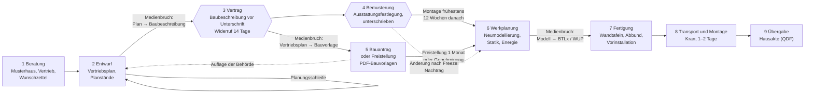

# 3 Holzrahmenbau und Fertighausindustrie

Status: Entwurf v0.1 (27.09.2026). Befunde tragen den Status [V] (an der Primärquelle geprüft oder am Prototyp gemessen) oder [U] (unsicher, Sekundärquelle, Beispielwert oder eigene Bewertung). Zitate beziehen sich auf `literatur/lit-*.bib`; die Schlüssel sind am Ende des Kapitels maschinell geprüft. Die Recherchedokumentation liegt in `../recherche/01`, `04`, `06`, `07`, `09`, `10`, `13`, `14`, `16`, `19` und `21`, die Beispiele in `beispiele/`.

## 3.0 Einordnung und Vorgehen

Kapitel 4 beschreibt die Regeln, die ein Entwurfssystem einhalten muss. Dieses Kapitel beschreibt den Gegenstand, auf den die Regeln wirken: das Holzrahmenbau-Fertighaus als Bauweise, als Industrieprodukt, als Markt und als Prozess. Es beantwortet drei Fragen:

1. Welche Bauteile und Schichten muss ein Informationsmodell enthalten, damit aus ihm Maschinendaten, Nachweise und Montagepläne ableitbar sind?
2. An welchen Stellen des heutigen Prozesses entstehen Informationen neu, und wo legen Fertigung und Vertrag Zeitpunkte fest, nach denen Änderungen teuer werden?
3. Wie weit sind die Hersteller, insbesondere der Praxispartner Regnauer, auf dem Weg zu einem kundengesteuerten Entwurf?

Die Darstellung stützt sich auf drei Arten von Belegen mit unterschiedlicher Belastbarkeit. **Wissenschaftliche Literatur** zum industriellen Hausbau stammt überwiegend aus Schweden, Großbritannien und Japan; der deutsche Markt ist in der begutachteten Literatur auffallend wenig untersucht. **Herstellerunterlagen**, vor allem die Bau- und Leistungsbeschreibung von Regnauer [@regnauerBLB2024], sind Primärquellen für das Fallbeispiel, aber nicht neutral. **Eigene Prototypen** (B1, B7, B14 bis B18) machen Aussagen über Datenstrukturen und Rechenwege überprüfbar; ihre Zahlenwerte sind Beispielwerte, keine Herstellerdaten. Wo sich die Quellen widersprechen, stellt das Kapitel den Widerspruch dar, statt ihn aufzulösen.

## 3.1 Bauweise

Der Holzrahmenbau ist eine Skelettbauweise mit flächiger Aussteifung: Ein Rahmen aus stabförmigen Hölzern trägt die vertikalen Lasten, eine Beplankung aus Platten steift ihn zur Scheibe aus, die Gefache zwischen den Hölzern nehmen die Dämmung auf. Im Fertigbau entsteht dieser Aufbau als geschosshohe Wandtafel im Werk. Für das Informationsmodell folgt daraus eine Eigenschaft, die den Holzrahmenbau vom Mauerwerksbau unterscheidet: **Eine Wand ist kein homogener Körper mit Schichten, sondern eine Baugruppe aus Dutzenden Einzelteilen**, die jeweils eigene Geometrie, eigenes Material und eigene Bearbeitungen haben.

### 3.1.1 Tragendes Gerippe: Ständer, Schwelle, Rähm

Das Gerippe besteht aus drei Bauteilgruppen:

- **Ständer** stehen in einem festen Achsraster, im Beispiel B1 bei 625 mm. Das Raster folgt der Plattenbreite von 1.250 mm, sodass jeder Plattenstoß auf einem Ständer liegt.
- **Schwelle und Rähm** schließen den Rahmen unten und oben ab und verteilen die Lasten.
- **Öffnungshölzer** umgeben Fenster und Türen: Königsständer (durchgehend), Sturzauflagerständer, Sturz, Brüstungsriegel und kurze Füllständer.

Als Material dient im Regelfall Konstruktionsvollholz der Festigkeitsklasse C24. Die Einbaufeuchte ist doppelt geregelt. DIN 68800-2 verlangt in den Gebrauchsklassen 0 bis 3.1 höchstens 20 % [@din68800-2] [V], die Güte- und Prüfbestimmungen RAL-GZ 422 höchstens 18 % [@ral422] [V]. Die Unterscheidung ist in Kapitel 4.6 als Schichtung von Norm und Gütesicherung beschrieben. Regnauer gibt an, ohne chemischen Holzschutz zu bauen [@regnauerBLB2024]; welche Gebrauchsklassen und baulichen Maßnahmen dem zugrunde liegen, ist öffentlich nicht dokumentiert [U].

> **Beispiel 3.1 (Wandelement B1).** Das Parametermodell `beispiele/daten/wandelement.json` beschreibt eine tragende Außenwand von 4,80 × 2,75 m mit einem Fenster von 1,26 × 1,385 m (Brüstung 0,90 m, Sturz 0,20 m). Ständer KVH C24 60/200 mm im 625-mm-Raster, Schwelle und Rähm je 60 mm hoch. Der Generator `b1_wandelement.py` erzeugt daraus nach IFC4X3_ADD2 [V, Prototyp]:
>
> | Bauteilgruppe | Anzahl | IFC-Klasse |
> |---|---:|---|
> | Ständer (Rand-, Raster-, Königs-, Sturzauflager-, Füllständer) und Sturz | 15 | `IfcMember` STUD |
> | Schwelle, Rähm, Brüstungsriegel | 3 | `IfcMember` PLATE |
> | Platten (GKF 4, OSB 4, Holzfaserdämmplatte 2) | 10 | `IfcPlate` SHEET |
> | Gefachdämmung (je Gefach) | 12 | `IfcBuildingElementPart` INSULATION |
> | Dampfbremse | 1 | `IfcBuildingElementPart` USERDEFINED/MEMBRANE |
> | Schrauben 4,0 × 50 mm | 176 | `IfcMechanicalFastener` SCREW |
> | Kerve 40 × 25 mm für ein Leerrohr | 1 | `IfcVoidingFeature` NOTCH |
>
> Die Datei hat 135.927 Bytes und 2.393 Entitäten, besteht `ifcopenshell.validate` mit EXPRESS-Regeln ohne Meldung und ist über getrennte Prozesse byte-identisch reproduzierbar. Für alle 41 Teile stimmt das tessellierte Volumen mit der Mengenangabe `NetVolume` überein (Abweichung < 10⁻⁹ m³).
>
> Das Element wiegt 649,4 kg, also 49,2 kg/m² (B18, aus Volumen × Rohdichte je Material). Den größten Anteil haben die Hölzer (216,3 kg), gefolgt von Holzfaserdämmplatte (123,7 kg), Gipsplatten (114,6 kg), OSB (103,1 kg) und Gefachdämmung (88,8 kg). Die 176 Schrauben wiegen zusammen 0,9 kg.

Das Beispiel zeigt, wie viel Information schon ein einziges, einfaches Wandelement trägt. Ein Einfamilienhaus besteht aus mehreren Dutzend solcher Elemente (Abschnitt 3.2.7).

**Umsetzung:** ANF-03-01 bis ANF-03-03 und ANF-03-07; Datenstrukturen A bis D in Abschnitt 3.7.2.

### 3.1.2 Beplankung und Aussteifung

Die Beplankung erfüllt mehrere Funktionen zugleich. Innen trägt sie die Oberfläche und übernimmt Brandschutz, außen dient sie als Putzträger oder Unterlage der Fassade. Mindestens eine Lage wirkt als aussteifende Scheibe. Die Tragfähigkeit der Scheibe hängt von Plattenwerkstoff, Plattendicke und dem Bild der Verbindungsmittel ab; der Nachweis läuft nach Eurocode 5, dessen neue Generation 2026 erschienen ist, während in Bayern weiter die Fassung 2010-12 mit A2:2014 eingeführt ist [@en1995-2026] [V].

Für die Formalisierung ist ein Befund aus Recherche 04 wichtig: **Eine allgemein bauaufsichtlich zugelassene Referenzwand gibt es nicht** [V]. Die Kennwerte einer Wand ergeben sich aus Tabellenverfahren (DIN 4102-4 für den Brandschutz [@din4102-4], DIN 4109-33 für den Schallschutz [@din4109-33]) oder aus Herstellernachweisen einzelner Plattenwerkstoffe, etwa einem allgemeinen bauaufsichtlichen Prüfzeugnis für Holzfaserplatten bis REI 90 oder einer Zulassung für die Aussteifung [V, Recherche 04]. Maschinenlesbar liegen geprüfte Aufbauten vor allem in dataholz.eu vor: Schichtaufbauten mit Brand-, Schall- und Wärmeschutzkennwerten, als IFC nach Registrierung, als IDS und als bSDD-Klassen, aber ohne Ständer und ohne offene Programmierschnittstelle [@dataholz] [V]. Das Vorgängerprojekt TIMBIM hat die Aggregation einzelner Schichten zu `IfcWall` wieder verworfen, weil Autorensoftware sie nicht umsetzt [@timbim2024] [V]. B1 liefert deshalb beides: das Schichtenset (`IfcMaterialLayerSetUsage`, fünf Schichten, 287,7 mm) und die Aggregation der Einzelteile.

### 3.1.3 Dämmung

Die Gefachdämmung füllt die Räume zwischen den Ständern. Im Fertigbau überwiegen Mineralwolle, Zellulose und Holzfaser; Regnauer setzt auf Holzfaser [@regnauerBLB2024]. Eine außenliegende Holzfaserdämmplatte überdeckt die Ständer und mindert so die Wärmebrückenwirkung des Holzes.

Für den Wärmeschutz ist der **Holzanteil** der wichtigste konstruktive Parameter. B3 rechnet den U-Wert nach DIN EN ISO 6946 mit oberem und unterem Grenzwert. Mit dem rechnerischen Rasteranteil (60 mm Ständer auf 625 mm, 9,6 %) ergibt sich für die verputzte Wand U = 0,163 W/(m²K). Mit dem Holzanteil aus der tatsächlichen Geometrie (22,5 %: Schwelle, Rähm, Sturz und Öffnungshölzer eingerechnet) steigt er auf 0,187 W/(m²K) [V, Prototyp]. Der Unterschied von 15 % zeigt, dass ein Modell, das nur Schichten kennt, den Wärmeschutz systematisch zu günstig bewertet. Das IFC von B1 trägt deshalb den geometrisch ermittelten Wert in `Pset_WallCommon.ThermalTransmittance` (ANF-03-04).

Ab Gebäudeklasse 4 kollidiert die Dämmstoffwahl mit dem Brandschutz. Die in Bayern eingeführte HolzBauRL 2024-09 verlangt für hochfeuerhemmende Bauteile nichtbrennbare Dämmstoffe mit einem Schmelzpunkt von mindestens 1.000 °C [@holzbaurl2024] [V]. Holzfaser- und Zellulosedämmung erfüllen das nicht. Ob die Vitalwand im Objektbau oberhalb von GK 3 überhaupt einsetzbar ist, ist deshalb eine offene Frage an den Hersteller (Abschnitt 3.5.4). Bis zur Antwort lehnt die App brennbare Dämmung in hochfeuerhemmenden Bauteilen ab (ANF-03-08).

### 3.1.4 Luftdichtheit und Feuchteschutz

Die luftdichte Ebene verhindert, dass warme, feuchte Raumluft in die Konstruktion strömt und dort kondensiert. Im Holzrahmenbau übernimmt diese Aufgabe eine Dampfbremsbahn oder eine luftdicht verklebte Plattenlage auf der warmen Seite der Dämmung (DIN 4108-7). In B1 liegt eine feuchtevariable Bahn mit sd = 2,0 m (Beispielwert) zwischen OSB und Gefach.

Jede Durchdringung dieser Ebene ist ein Detail, das geplant, gefertigt und dokumentiert werden muss. B15 zeigt das an einer Hauptlüftung DN 100, die durch luftdichte Ebene und Dach geführt wird: Der Prototyp wählt eine Systemmanschette für Rohre mit 100 bis 120 mm Durchmesser und bildet sie in IFC als Füllung der Öffnung ab (`IfcRelFillsElement`) [V, Prototyp]. Ob die Manschette im Werk oder auf der Baustelle gesetzt wird und welche Systeme ein Hersteller freigibt, gehört zu den Firmenregeln (Recherche 16, Frage 8). Die App erzwingt für jede Durchdringung der luftdichten Ebene eine modellierte Füllung (ANF-03-09).

### 3.1.5 Verbindungsmittel

Verbindungsmittel verbinden Platten mit dem Rahmen, Hölzer untereinander und Elemente miteinander. In der Wandfertigung überwiegen Klammern, Nägel und Schrauben; ihre Abstände bestimmen die Scheibentragfähigkeit. B1 setzt die OSB-Lage mit Spanplattenschrauben 4,0 × 50 mm im Abstand von 150 mm und mit 75 mm Randabstand auf die vertikalen Hölzer. Jede der 176 Schrauben ist als eigenes Objekt mit Typ, Nenndurchmesser und Nennlänge im Modell; ihre Geometrie wird über eine gemeinsame Darstellung referenziert (`IfcMappedItem`) [V, Prototyp].

Herstellerdaten zu Verbindungsmitteln sind uneinheitlich [V, Recherche 01]:

- Einige Hersteller liefern IFC und Bibliotheken für Holzbau-CAD, andere nur Daten über Portale.
- Die Zulassungsdaten (ETA) liegen meist nur als PDF vor.
- Mindestens ein Datensatz steht unter einer Lizenz, die Bearbeitungen ausschließt.

Die Arbeit legt deshalb eine eigene Tabelle aus Typ, Durchmesser, Länge und Zulassung an und nutzt Hersteller-IFC nur zur Darstellung.

### 3.1.6 Installationsebene

Eine Installationsebene ist eine Lattung oder Vorsatzschale raumseitig vor der luftdichten Ebene. In ihr laufen Leitungen, ohne die Dampfbremse zu durchdringen. Ihr Fehlen hat für das Modell drei Folgen:

1. Jede Steckdose und jede Einbauleuchte in der Außenwand durchdringt die luftdichte Ebene und braucht eine luftdichte Dose oder entfällt [U, Recherche 10].
2. Leitungen laufen im Gefach und brauchen Kerven oder Bohrungen in Ständern und Riegeln (in B1 die Kerve 40 × 25 mm).
3. Die Lage jeder Dose muss vor der Wandfertigung feststehen, weil sie werkseitig gebohrt wird (Abschnitt 3.2.6).

Nach der Bau- und Leistungsbeschreibung 10/2024 haben die Innenwände bei Regnauer eine Installationsebene von 40 mm. Für die Außenwand beschreibt sie die Vliesdampfbremse direkt hinter der 25 mm starken Gipslage; eine Installationsebene wird nicht erwähnt [@regnauerBLB2024] [V, Recherche 10]. Dieselbe Unterlage erlaubt Hängeschränke „an jeder Stelle“, was mit der massiven Gipslage plausibel ist. Einbauleuchten unter dem Dach liegen dagegen unmittelbar vor der Dampfbremse [U]. Ob die Außenwand eine Installationsebene hat, ist die erste der offenen Fragen an Regnauer (Abschnitt 3.5.4).

### 3.1.7 Aufbauten und Kennwerte am Beispiel der Regnauer-Vitalwand

Die folgende Tabelle fasst die öffentlich zugänglichen Aufbauten des Praxispartners zusammen. Quellen sind die Herstellerwebseite und die Bau- und Leistungsbeschreibung 10/2024 [@regnauerBLB2024] (Recherchen 04 und 10).

| Bauteil | Aufbau (öffentlich) | Kennwerte laut Hersteller | Status |
|---|---|---|---|
| Vitalwand | Massivholz-Riegel, Holzfaserdämmung, Wanddicke 345 (bis 381) mm; innen 25 mm Gips, Vliesdampfbremse; spanplattenfrei, ohne chemischen Holzschutz | U = 0,128–0,153 W/(m²K); „bis F 60 B“ | [V] Angabe, Riegelstärke widersprüchlich |
| Passivhauswand | Riegel 240 mm | U = 0,12 W/(m²K) | [V] Angabe |
| Thermo-Vitaldach | Pfettendach, 280 mm Holzfaser, 16 mm Holzfaser-Unterdach; Variante „Plus“ 330 mm | U = 0,148 bzw. 0,129 W/(m²K) | [V] Angabe |
| Flachdach | – | U = 0,117 W/(m²K) | [V] Angabe |
| Silence-Decke | Balken 240 mm, 60 mm Jute, 30 mm entkoppelte Schalung, 25 mm Gipsfeuerschutz, Zementestrich | L′n,w = 49 dB „am Bau“; „Deep Silence“ < 46 dB; vertraglich ≤ 52 dB | [V] Angaben, Verhältnis offen |
| Fenster KlimaPlus | Holz-Alu, eigene Fertigung, 11 Alu-Farben | Ug = 0,5 W/(m²K) | [V] Angabe |

Die Angaben enthalten drei Unstimmigkeiten, die für ein regelbasiertes System nicht nebensächlich sind:

1. **Riegelstärke.** Die Vitalwand wird in öffentlichen Quellen mal mit 200 mm, mal mit 300 mm Riegelstärke beschrieben. Die Bau- und Leistungsbeschreibung 10/2024 nennt 200 mm [V, Recherche 10].
2. **Trittschall.** Recherche 04 fand für die Silence-Decke L′n,w = 49 dB am Bau, die Bau- und Leistungsbeschreibung fixiert vertraglich L′n,w ≤ 52 dB. Beide Werte können zugleich stimmen, wenn der eine eine Messung und der andere eine Zusage mit Sicherheitsabstand ist [U]. Welcher Wert in einen Nachweis eingeht, muss der Hersteller festlegen.
3. **Brandschutz.** „Bis F 60 B“ verwendet die Klassenbezeichnung der alten DIN 4102-2. Für welche Variante der Wand der Wert gilt und auf welchem Nachweis er beruht (Tabellenverfahren nach DIN 4102-4 oder Prüfzeugnis), ist nicht angegeben [U].

> **Beispiel 3.2 (Plausibilität der Riegelstärke).** Die U-Werte allein entscheiden den Widerspruch nicht. Mit der Rechenfunktion von B3 (`berechne_uwert`, Beispiel-λ: Holz 0,13, Gefachdämmung 0,038, Holzfaserdämmplatte 0,043, Gips 0,25 W/(mK); Holzanteil 9,6 %; verputzt) ergeben sich für eine Wand mit 25 mm Gips und Dampfbremse:
>
> | Gefach (Riegel) | Holzfaserdämmplatte außen | Dicke ohne Putz | U [W/(m²K)] |
> |---:|---:|---:|---:|
> | 200 mm | 60 mm | 285 mm | 0,164 |
> | 200 mm | 100 mm | 325 mm | 0,142 |
> | 200 mm | 120 mm | 345 mm | 0,133 |
> | 240 mm | 80 mm | 345 mm | 0,134 |
> | 300 mm | 0 mm | 325 mm | 0,149 |
> | 300 mm | 20 mm | 345 mm | 0,138 |
>
> Beide Lesarten erreichen den veröffentlichten Bereich von 0,128 bis 0,153 W/(m²K). Die **Wanddicke** spricht jedoch für 200 mm: Bei 345 mm Gesamtdicke blieben mit 300 mm Riegel und 25 mm Gips nur 20 mm für Putzträgerplatte und Putz. Für eine verputzte Holzfaserfassade ist das kaum ausführbar. Die Rechnung ist eine eigene Plausibilitätsprüfung mit Beispielwerten [U], kein Nachweis des Herstellers, und sie ist nicht als eigenes Beispiel in `beispiele/` abgelegt.

Die Unstimmigkeiten sind kein Vorwurf an den Hersteller. Sie zeigen aber, warum Herstellerregeln im Zielbild **Daten mit Quelle und Version** sein müssen (Zielbild, Prinzip 5): Ein Konfigurator, der mit der falschen Riegelstärke rechnet, erzeugt falsche Elementgewichte, falsche Laibungstiefen und falsche Maschinendaten, ohne dass eine Regelprüfung den Fehler bemerkt. Die App führt solche Werte deshalb mit Quelle und Status und sperrt bei widersprüchlichen Quellen das Gate Werkplanung (ANF-03-05, ANF-03-06).

### 3.1.8 Zwischenergebnis: Abbildung der Bauweise in IFC 4.3

Recherche 01 hat die Bauteile der Holzrahmenwand gegen das Schema IFC4X3_ADD2 geprüft [@iso16739-2024]. Die folgende Tabelle ist die Grundlage des Klassen-Mappings in Kapitel 8.

| Bauteil | IFC-Klasse, PredefinedType | Status |
|---|---|---|
| Wandelement | `IfcWall` + `IfcRelAggregates` + `IfcMaterialLayerSetUsage` | [V] |
| Ständer; Schwelle, Rähm | `IfcMember` STUD; PLATE | [V] |
| Beplankung | `IfcPlate` SHEET | [V] Enum, Zuordnung Konvention |
| Gefachdämmung | `IfcBuildingElementPart` INSULATION | [V] |
| Dampfbremse | `IfcBuildingElementPart` oder `IfcCovering` MEMBRANE | [U] Konvention |
| Kerve, Bohrung, Ausschnitt | `IfcVoidingFeature` NOTCH, HOLE, CUTOUT u. a. | [V] am Prototyp, volumengenau |
| Schraube, Nagel, Klammer | `IfcMechanicalFastener` SCREW, NAIL, STAPLE | [V] |

Maschinendaten kennt IFC nicht. Für Beton gibt es das MVD „IFC4Precast“, für den Holzbau nichts Vergleichbares (Recherche 06) [V]. Die Brücke vom Modell zur Maschine schlagen deshalb abgeleitete Formate, die der nächste Abschnitt beschreibt.

## 3.2 Industrielle Vorfertigung

### 3.2.1 Vorfertigungsgrad und Fertigungsprinzipien

Die Vorfertigung verlagert Arbeit von der Baustelle ins Werk. Das deutschsprachige Standardwerk zur Automatisierung stammt aus Rosenheim. Heinzmann und Karatza ordnen die Fertigung nach Prinzipien (Takt, Linie, Zelle) und Automatisierungsstufen und beschreiben den digitalen Informationsfluss, den die Werkautomatisierung aus der Planung braucht [@heinzmann2022automatisierung]. Eine Literaturübersicht zum Holzrahmenbau setzt den Automatisierungsgrad in Beziehung zu Maschinenausstattung, Betriebsgröße, Standardisierung und Vorfertigungsstufe [@lachance2022automated]. Zwei Einschränkungen prägen das Feld:

- **Losgröße 1.** Holzbau ist Auftragsfertigung mit stark variierenden Bauteilen. Eine Vollautomatisierung ist deshalb selten sinnvoll; Forschung zur Mensch-Roboter-Kooperation setzt auf die Verbindung von Maschinenpräzision und handwerklichem Wissen [@kyjanek2020mrk].
- **Daten statt Mechanik.** In zwei schwedischen Einfamilienhauswerken entsprechen 8 von 15 identifizierten Bausteinen einer „Smart Factory“ denen der Industrie 4.0 anderer Branchen [@vestin2020smart]. Das österreichische Projekt „Fertighausbau 4.0“ beschreibt für die Variantenfließfertigung inkonsistente Datenbestände und einen hohen Anteil manueller Arbeit [@holzkompetenzzentrum2021fertighausbau].

Die Frage, ob Vorfertigung wirtschaftlich überlegen ist, beantwortet die Literatur differenziert. Ein Kostenvergleich zweier Einfamilienhäuser fand den Modulbau nur geringfügig günstiger als den Tafelbau; der Tafelbau hat Vorteile bei Transport und Gerät [@lopez2016analysis]. Die Arbeitsproduktivität britischer Tafelbauer war mit der kontinentaleuropäischer Modulbauer vergleichbar [@duncheva2019productivity]. Schwedische industrielle Holzhausbauer meldeten für 2013 bis 2020 eine um etwa 10 % höhere Arbeitsproduktivität als der konventionelle Bau, allerdings für Mehrgeschosser und auf Basis von Firmenangaben [@stehn2023industrialized]. Für den deutschen Einfamilienhaus-Fertigbau liegt keine vergleichbare Messung vor.

Für diese Arbeit ist ein anderer Befund zentral: **Vorfertigung verlangt eine Vorverlagerung von Entscheidungen.** Aufbauten, Elementierung, Installationsführung und Anschlussdetails müssen früh feststehen, weil sie später nur mit hohen Kosten zu ändern sind [@kaufmann2018manual]. Großbauherren nennen dieselbe Bedingung: Vorfertigung nützt nur, wenn der Entwurf früh eingefroren wird [@gibb2003reengineering]. Späte Kundenänderungen stören die Produktion unmittelbar [@stehn2002integrated].

### 3.2.2 Wandtafel

Die Wandtafel ist das Kernprodukt des Holzfertigbaus. Im Werk entsteht sie in einer Abfolge, die sich aus dem Aufbau ergibt: Riegelwerk aus Ständern, Schwelle, Rähm und Öffnungshölzern; Beplankung einer Seite und Befestigung nach Klammer- oder Schraubbild; Einbau von Installationen und Dämmung; Schließen der zweiten Seite; je nach Vorfertigungsgrad Einbau von Fenstern und Aufbringen von Putzträger oder Fassade. Die genaue Stationsfolge ist herstellerspezifisch und für Regnauer nicht öffentlich [U].

Für das Informationsmodell folgt aus dieser Abfolge, dass die Maschine **Einzelteile mit Lage, Bearbeitung und Befestigung** braucht. Das Projekt RoWaPla an der TH Rosenheim entwickelt eine Roboterzelle für die Beplankung, deren Bahnplanung Kernkonstruktion und Beplankung aus CAD-Daten extrahiert [@riss2026rowapla]. Das DesignChain-Referenzprojekt des Fraunhofer IPA erzeugt aus Eingangsparametern ein vollständiges Wandelement bis zum Nagelbild [@fraunhoferipa0000designchain]. Beide setzen voraus, was B1 liefert: jedes Holz, jede Platte und jedes Verbindungsmittel als eigenes Objekt.

### 3.2.3 Decke und Dach

Decken und Dächer werden ebenfalls als Elemente vorgefertigt. Die Recherchen liefern dazu vier Befunde:

- **Decke.** Die Silence-Decke von Regnauer ist eine Holzbalkendecke mit 240 mm Balken, Jute-Schüttung, entkoppelter Schalung, Gipsfeuerschutzplatte und Zementestrich [@regnauerBLB2024]. Ein vergleichbares Deckenelement aus Balken 60/220, GKF, OSB und Holzfaser wiegt in B18 36,6 kg/m² ohne Estrich und Schüttung; sechs Elemente von 10,0 × 2,0 m wiegen je 0,73 t [V, Prototyp; Aufbau Beispiel].
- **Durchbrüche.** Querbohrungen in Deckenbalken sind nach dem nationalen Anhang zu EC 5 unverstärkt nur bis zu einem Durchmesser von 0,15 h zulässig, bei h = 240 mm also bis 36 mm [V, Recherche 16]. Eine Abwasserleitung DN 50 (Außendurchmesser 60 mm) quer zur Balkenlage ist damit unzulässig; B15 erkennt den Verstoß und schlägt vor, die Leitung parallel zu den Balken zu führen [V, Prototyp].
- **Fußbodenaufbau.** Auf der Holzbalkendecke erreicht B14 mit einem Trockenaufbau (Wabe mit Schüttung, Holzfaser-Trittschalldämmung, Fußbodenheizung als Trockensystem, Gipsfaser-Trockenestrich) in allen Räumen die Zielhöhe von 160 mm auf den Millimeter. Weil die Toleranzkette über dem letzten nivellierenden Layer ±2 mm überschreitet, setzt der Solver automatisch eine Spachtelung [V, Prototyp; Toleranzwerte U]. Welcher Aufbau bei Regnauer Standard ist, ist offen (Recherche 16, Frage 1).
- **Dach.** Das Thermo-Vitaldach ist ein Pfettendach mit 280 mm Holzfaser [@regnauerBLB2024]. Ob Regnauer Dachelemente gedämmt und mit Unterdeckung im Werk vorfertigt, ist nicht öffentlich (Recherche 09, Frage 2). B18 rechnet Dachelemente mit Sparren 80/240, Holzfaser, Holzfaserdämmplatte 60 mm und OSB zu 43,4 kg/m² ohne Eindeckung. Im Modell stehen sie als `IfcSlab` ROOF, weil nur die Mengenangaben für Wände und Platten ein Bruttogewicht vorsehen [V, Recherche 19].

### 3.2.4 Abbund und BTLx

Stabförmige Bauteile wie Sparren, Pfetten, Balken und Ständer werden auf Abbundanlagen zugeschnitten und bearbeitet. Das herstellerneutrale Austauschformat dafür ist BTLx. Version 2.3 ist mit Schema und Spezifikation frei verfügbar und enthält Attribute für Nägel, Schrauben und Klammern sowie einen Abschnitt zur Vorfertigung [@btlx23] [V]. Das quelloffene Werkzeug COMPAS Timber liest und schreibt BTLx, erzeugt aber kein IFC [@compastimber] [V].

> **Beispiel 3.3 (BTLx aus dem Wandmodell, B7).** `b7_btlx_export.py` übersetzt die Hölzer aus B1 mit COMPAS Timber 2.2.0 in eine BTLx-Datei [V, Prototyp]:
>
> - 18 Parts, 18.365 Bytes, Material „KVH C24“, Festigkeitsklasse C24. Die Randständer haben die Länge 2.630 mm (Wandhöhe 2.750 mm minus Schwelle und Rähm).
> - Die Kerve aus B1 steht als Bearbeitung `Lap` in Ständer R1 (StartX 990 mm, Länge 40 mm, Tiefe 25 mm).
> - Nach einer Nachbearbeitung (Material, Datum, deterministische GUIDs) ist die Datei reproduzierbar (SHA-256 `fc91a532…765ff24d`).
>
> Drei Befunde begrenzen die Aussage. Erstens schreibt das Werkzeug das Versionsattribut 2.0.0, nicht 2.3. Zweitens trägt jedes Part `Weight="0"`, obwohl das Gewicht aus dem IFC berechenbar ist (B18). Drittens fehlen Verbindungen, Schraubbilder und Plattenbauteile; die XSD-Validität und der Import in eine Abbundsoftware sind nicht geprüft, weil die Schemaseite aus der Umgebung gesperrt war.

B15 nutzt denselben Weg für Durchdringungen: Fünf Bohrungen durch Ständer, Balken und Dach stehen als `Drilling` in der BTLx-Ausgabe. Jede trägt als `UserAttribute` die GlobalId der Leitung, die sie verursacht [V, Prototyp]. Damit ist eine Bohrung im Werk bis zur Leitung im Modell rückverfolgbar, die Rückverfolgbarkeit also, die das Zielbild für alle abgeleiteten Formate verlangt (Prinzip 4). **Umsetzung:** ANF-03-12 und ANF-03-13.

### 3.2.5 Wandanlagen und WUP

Wandtafeln entstehen nicht auf Abbundanlagen, sondern auf Wandfertigungsanlagen mit Rahmenstationen und Multifunktionsbrücken, die klammern, nageln, bohren und fräsen. Der verbreitete Hersteller Weinmann (Homag) liest dafür **WUP, nicht BTLx** [V, Recherche 01]. WUP ist proprietär; die Spezifikation muss beim Hersteller angefragt werden. Die Dokumentation eines CAD-Herstellers zeigt, dass WUP-Exporte Regeln der Maschine enthalten [V, Recherche 16]:

- Bohrungen ab einem Grenzdurchmesser werden gefräst, zum Beispiel ab 70 mm bei einem 68-mm-Dosenbohrer.
- Freie Bearbeitungen laufen über Achsen mit Kennungen.
- Sperrflächen schützen Bereiche vor Säge und Fräse.

Ein dokumentiertes Freitextfeld, das eine Leitungs-GUID bis in die WUP-Datei mitführen könnte, wurde nicht gefunden [U]. Die Schema-Dokumentation von BTLx führt dagegen Element- und Tafelbearbeitungen wie Nagel-, Fräs- und Sägekonturen sowie Sperrflächen [V Index, Details U]. Ob Wandanlagen diese Teile des Formats lesen, ist offen.

**Folge für die Arbeit:** Ein offener Weg vom Modell zur Wandanlage existiert nicht. Die Kette braucht einen WUP-Writer, dessen Grundlage der Hersteller liefern muss, oder einen Hersteller, der BTLx-Tafelbearbeitungen liest. Welche Maschinen Regnauer einsetzt, ist nicht öffentlich (Abschnitt 3.5). Die App kapselt den WUP-Export deshalb als Adapter, der ohne Spezifikation definiert abbricht (ANF-03-14, DAT-04).

### 3.2.6 Vorinstallation

Im Holzfertigbau beginnt der Innenausbau im Werk. Nach der Bau- und Leistungsbeschreibung werden „bereits bei der Wandproduktion“ Dosenbohrungen und Zugdrähte vorbereitet, Sanitäranschlüsse, Tragkonstruktionen für Hänge-WCs, Unterputz-Spülkästen und Unterputz-Armaturen eingebaut [@regnauerBLB2024] [V, Recherche 10]. Die Idee reicht weit zurück: Eine Münchner Dissertation hat 2006 die Integration der Gewerke als „Plug & Play“ im vorgefertigten Element untersucht [@prochiner2006homes24].

Die Vorinstallation verbindet Bemusterung und Tragwerk. Ein Wand-WC braucht ein Montageelement, das an Ständern bestimmter Abmessung befestigt wird; ein Dusch-WC zusätzlich einen Stromanschluss im Vorwandelement [V, Recherche 10]. Eine Fallleitung DN 100 braucht eine Öffnung von 150 mm Durchmesser. B15 zeigt, dass eine solche Leitung im gemeinsamen 625-mm-Raster von Decke und Wand leicht **Deckenbalken und Wandständer zugleich trifft**. Liegt die nächste in beiden Rastern freie Achse 120 mm entfernt, der zulässige Verschub aber bei 100 mm (Platzhalter-Firmenregel), plant der Prototyp einen Wechsel in der Decke und eine Ständerauswechslung in der Wand als eigene IFC-Bauteile [V, Prototyp]. Die Entscheidung über das Sanitärobjekt wird damit zu einer Entscheidung über das Tragwerk. **Umsetzung:** ANF-03-10 und ANF-03-11; Regeln in Tabelle E.

### 3.2.7 Transport und Montage

Die Montage eines Fertighauses dauert wenige Tage. Regnauer gibt an, das Haus sei in ein bis zwei Tagen regendicht, und montiert mit eigenen Kolonnen [V, Recherche 19]. Transport und Kran folgen harten Grenzen: Fahrzeuge dürfen samt Ladung 2,55 m breit und 4,00 m hoch sein (§ 32 StVZO, § 22 StVO) [V]. Holztafeln fahren deshalb stehend auf Innenladern, Decken liegend auf Plateaufahrzeugen.

> **Beispiel 3.4 (Kran- und Transportplanung, B18).** `b18_kranplanung.py` rechnet für ein Beispielhaus von 12 × 10 m (1,5-geschossig, Satteldach 35°) die Montage aus den Flächengewichten der Aufbauten [V, Prototyp; Kran-, Fahrzeug- und Kostenwerte fiktiv]:
>
> | Größe | Wert |
> |---|---|
> | Elemente | 26 (8 EG-Wände, 6 Decken, 4 Giebel, 8 Dachelemente), zusammen 22,99 t |
> | schwerstes Element | EG-Außenwand 6,0 × 2,75 m, 1,228 t |
> | Hublast mit Anschlagmittel und Hakenflasche | 1,15 bis 1,73 t |
> | LKW-Ladungen | 6 (5 Innenlader, 1 Plateau); keine Ladung über 19 % der Nutzlast |
> | gewählter Kran, Szenario „basis“ | Autokran 35-t-Klasse in der Einfahrt, max. 78,4 % Auslastung beim Hub W-N2 (1,73 t bei r = 20,0 m), 2 Einsatztage, 2.650 € |
> | Szenario „Einfahrt belegt“ | Autokran 60-t-Klasse von der Straße, 71,9 % bei r = 29,6 m, 4.300 € (+62 %), zusätzlich Sondernutzung und verkehrsrechtliche Anordnung |
> | zulässige Windböe je Element | 2,85 bis 4,07 m/s (3-s-Böe in Hubhöhe, Herstellerformel) |
> | Montagezeit | Tag 1 07:00–14:52, Tag 2 07:00–09:28, 10,3 Kraneinsatzstunden |
>
> Vier Befunde sind über das Beispiel hinaus gültig. **Erstens** begrenzen Reichweite und Stellfläche den Kran, nicht das Gewicht. **Zweitens** begrenzt beim LKW das Volumen, nicht die Nutzlast. **Drittens** ist der Wind die versteckte Grenze: Holztafeln haben 14 bis 20 m² Windangriffsfläche je Tonne, die Norm rechnet mit 1,2 m²/t. **Viertens** führen im Basisfall zwei Hübe Last über das Nachbargrundstück; in Bayern ist das Überschwenken mindestens einen Monat vorher anzuzeigen. Die Suche ist rasterempfindlich: Mit 1,0 m statt 0,5 m Raster findet sie den engen Stellplatz in der 7,0 m breiten Einfahrt nicht. 15 Tests sind grün.

Das Beispiel verbindet die Montage mit dem Entwurf. Die Elementierung bestimmt Gewichte, Maße und Ladungen, die Grundstückslage bestimmt Kranstellplatz und Genehmigungen. Der Kunde, der die Garage an die Einfahrt rückt, beeinflusst also ohne es zu wissen den Kran. Die Hubfreigabe bleibt beim Kranunternehmen; der Prototyp ist eine Vorauswahl mit konservativen Hüllkurven. **Umsetzung:** ANF-03-15 bis ANF-03-17; Datenstruktur H.

## 3.3 Markt

### 3.3.1 Fertigbauquote, Bestand und Preise

Die verfügbaren Marktdaten stammen aus amtlicher Statistik und Verbandsmitteilungen. Zwei Größen dürfen dabei nicht vermischt werden: **Genehmigungen** (Grundlage der Fertigbauquote des Verbands) und **Fertigstellungen** (Grundlage der Pressemitteilungen des Statistischen Bundesamts).

| Kennzahl | Wert | Quelle | Status |
|---|---|---|---|
| Fertigbauquote genehmigter EFH/ZFH, Deutschland 2025 | **26,5 %** (13.473 von 50.755) | [@bdf2026baugenehmigungen; @bdf2026quote] | [V] |
| Fertigbauquote, 1. Halbjahr 2025 | 26,2 % (6.362 von 24.305) | [@bdf2025halbjahr] | [V] |
| Vergleichswerte laut Verband | 26,1 % (2024), rund 13 % (um 2000) | [@bdf2026baugenehmigungen; @bdf2025halbjahr] | [V] Verbandsangabe |
| Fertigbauquote Bayern 2025 | **27,5 %**, 3.633 Häuser, +19 % zu 2024 | [@bdf2026quote] | **[U]**, siehe unten |
| 1. Halbjahr 2026 | 26,7 % bundesweit; Bayern 2.020 genehmigte Fertighäuser | Presse auf BDF-Basis (ohne Eintrag im Literaturverzeichnis) | [U] |
| Fertiggestellte Wohngebäude in Fertigteilbauweise 2024 | rund 16.900 (−15,5 % zu 2023), 22,2 % aller fertiggestellten Wohngebäude; darunter 14.300 EFH (85,1 %) | [@destatis2025fertigteilbau] | [V] |
| Umsatz der Fertigbaubranche 2025 | 3,38 Mrd. € | BDF (ohne Eintrag im Literaturverzeichnis) | [U] |
| Preisindex Zimmer- und Holzbauarbeiten 2025 | 122,4 (2021 = 100); eigener Index für Einfamilienfertighäuser | [@destatis61261] | [V] |

**Widerspruch zur bayerischen Quote.** Recherche 07 und Kapitel 1.1 führen den Bayern-Wert als [V]. Die Einzelbewertung der Quelle hält dagegen fest, dass der Wert von 27,5 % im abgerufenen Ausschnitt der Verbandsmitteilung nicht steht und gesondert zu belegen ist. Die Literaturnotiz zu Teil B führt ihn nur über eine Sekundärquelle auf Verbandsbasis und vermerkt, dass die Originaltabellen des Verbands nicht eingesehen wurden. Dieses Kapitel führt den Wert deshalb als [U]. Vor der Abgabe ist die Ländertabelle des Verbands einzusehen und der Status in Kapitel 1.1, Recherche 07 und im Zielbild anzugleichen. Die Aussage, dass Bayern über dem Bundesdurchschnitt liegt, hängt an diesem einen Beleg.

Zwei Befunde sind unabhängig von diesem Widerspruch belastbar. Das **Einfamilienhaus ist der Kernmarkt** der Fertigbauweise; auf dieses Segment entfallen 85 % der fertiggestellten Fertigteil-Wohngebäude [@destatis2025fertigteilbau]. Und der Wunsch nach einem eigenen Haus bleibt hoch, auch wenn der Großteil der Eigentumsbildung im Bestand stattfindet [@ammann2022wohneigentum; @ammann2023faktencheck]. Eine Bankenstudie mit 1.234 Befragten bestätigt das Bild [@sparda2025wohnen]. Der Kernmarkt ist damit genau das Segment mit der höchsten Erwartung an Individualisierung.

### 3.3.2 Hersteller und Geschäftsmodelle

Belastbare Marktanteile einzelner Hersteller wurden nicht gefunden. Die Recherchen nennen die folgenden Hersteller mit dokumentiertem Kundenkontakt, Ausstellungs- oder Konfiguratorangebot [V, Recherchen 04, 10 und 21]:

- Regnauer und Baufritz, beide 2025 Stationen einer Tour des Branchenverbands [@bsz0000fertighaustour], sowie Haas, das Recherche 21 als niederbayerischen Wettbewerber führt;
- Hanse Haus, WeberHaus und Bien-Zenker mit großen Bemusterungszentren (Hanse Haus und Bien-Zenker je rund 1.800 m², WeberHaus über 3.500 m²);
- Huf Haus und SchwörerHaus, für die keine Hochschulkooperation zur Digitalisierung dokumentiert ist.

Die Branche organisiert ihre Qualitätssicherung über die Qualitätsgemeinschaft Deutscher Fertigbau und das Gütezeichen RAL-GZ 422. Regnauer führt beide (Abschnitt 3.5.1); für die übrigen Hersteller wurde die Mitgliedschaft nicht geprüft [U]. Beide Einrichtungen haben unmittelbare Folgen für das Modell. RAL-GZ 422 überwacht zweimal jährlich im Werk und einmal jährlich auf der Baustelle [@ral422]. Die QDF verpflichtet ihre Mitglieder auf 36 Qualitätsversprechen, darunter eine Hausakte [@qdf2022] [V].

Für die Deutung des Marktes liefert die internationale Literatur drei Linien:

1. **Japan.** Die großen japanischen Hersteller liefern individualisierte Häuser aus standardisierten Komponenten und steuern dazu das gesamte Produktionssystem [@gann1996construction; @barlow2003choice]. Sie haben sich von der Massenproduktion zur qualitätsorientierten Fertigung mit hochwertiger Standardausstattung entwickelt [@noguchi2003effect] und verlagern sich zu Dienstleistungen in der Nutzungsphase [@linner2012evolution].
2. **Schweden.** Produktorientierte Hausbauer kontrollieren die Lieferkette schrittweise und richten ihr Geschäftsmodell am Endkunden aus [@lessing2015business]. Von sieben untersuchten Geschäftsmodellen vorgefertigter Holzbausysteme erwies sich nur eines als tragfähig; Ausgangspunkt ist der Vorfertigungsgrad [@brege2014business].
3. **Deutschland.** Die einzige begutachtete Fallstudie einer deutschen Wohnungsbauplattform berichtet Kostensenkungen von mehr als 30 %. Sie entstanden durch Plattformdenken und effiziente Baustellenfertigung, nicht durch Werkvorfertigung [@thuesen2011efficient].

Eine bayerische Entwicklung verdient Beachtung: 2025 wurde die erste Typengenehmigung für Wohngebäude erteilt, für ein System mit Holzmassivwänden und vier bis acht Obergeschossen [@stmb2025typengenehmigung] [V]. Für Einfamilienhausserien ist ein solcher Fall nicht belegt. Kapitel 4.3.4 beschreibt die Typengenehmigung als Option, den Konfigurationsraum deckungsgleich mit dem genehmigten Veränderungsspielraum zu definieren.

### 3.3.3 Fachkräftemangel

Der Engpass betrifft vor allem die Planung. Im dritten Quartal 2025 kamen in den Berufen der Bauplanung auf 100 Arbeitslose 306 offene Stellen [@ingmonitor2025] [V]. Nach Recherche 07 waren 2025 rechnerisch 78,2 % der Expertenstellen in der Bauplanung nicht besetzbar (Kompetenzzentrum Fachkräftesicherung), und es fehlen rund 10.000 Bauplaner (Institut der deutschen Wirtschaft) [V laut Recherche 07; ein Eintrag im Literaturverzeichnis steht für beide Werte noch aus].

Für das Werk und die Montage, also Zimmerer, Werkplaner und Montagekolonnen, wurde keine vergleichbare Kennzahl recherchiert. Diese Lücke ist für die Argumentation relevant: Das Zielbild setzt Planungskapazität frei, indem niemand abtippt, was schon im Modell steht. Ob die Fertigung eher durch Planungsvorlauf oder durch Werkkapazität begrenzt ist, lässt sich mit öffentlichen Daten nicht entscheiden.

## 3.4 Prozess heute

### 3.4.1 Die Prozesskette

Der Weg vom ersten Gespräch bis zur Übergabe folgt bei deutschen Fertighausherstellern einer ähnlichen Kette. Abbildung 3.1 zeigt sie mit den rechtlichen und fertigungsseitigen Gates; die Phasen und Fristen für Regnauer stammen aus der Bau- und Leistungsbeschreibung 10/2024 [@regnauerBLB2024], die Rechtsgrundlagen aus Kapitel 4.



**Abbildung 3.1:** Prozesskette eines Holzrahmenbau-Fertighauses heute. Sechsecke markieren Gates mit Unterschrift, gestrichelte Pfeile Rückkopplungen. Die Kette ist aus Herstellerunterlagen und Rechtslage abgeleitet [U]; ob sie bei Regnauer so durchlaufen wird, ist durch Interviews zu prüfen (Kapitel 20).

Die folgende Tabelle ordnet jeder Phase Akteur, Artefakt und den Übergang zu, an dem Information neu entsteht.

| Phase | Akteur | Artefakt heute | Bindung, Frist | Medienbruch |
|---|---|---|---|---|
| 1 Beratung | Vertrieb, Musterhaus | Katalog, Wunschzettel im Konfigurator, CRM | – | Gespräch → CRM-Notiz |
| 2 Entwurf | Vertrieb, ggf. Architekt | Vertriebsplan, Planstände | Bebauungsplan meist nur als PDF (Kap. 4.2) | Wunsch → Skizze → Vertriebs-CAD |
| 3 Vertrag | Vertrieb, Kunde | Bau- und Leistungsbeschreibung, Vertrag | Baubeschreibung vor der Vertragserklärung in Textform, 14 Tage Widerruf [@bgb; @egbgb249] | Plan → Baubeschreibung als Text |
| 4 Bemusterung | Projektleitung, Kunde | Ausstattungsplan, Ausstattungsbeschreibung | unterschriebene Festlegung; Montage frühestens 12 Wochen danach | Muster → Protokoll → Bestellung |
| 5 Bauantrag | Entwurfsverfasser, bauvorlageberechtigte Person | PDF-Bauvorlagen, Formulardaten | Freistellung: Baubeginn nach 1 Monat; vereinfachtes Verfahren: Fiktion nach 3 Monaten und 3 Wochen [@baybo2026] | Vertriebsplan → Bauvorlage |
| 6 Werkplanung | Werkplanung, Tragwerksplanung, Energieberatung | Werkplanungsmodell, Nachweise | Produktion erst nach Genehmigung bzw. Frist und Widerruf (Kap. 4.7) | Bauvorlage → CAD/CAM, Abtippen in Statik und Energie |
| 7 Fertigung | Werk | Maschinendaten, Stücklisten, Etiketten | Freeze aller werkseitig eingebauten Optionen | Modell → BTLx, WUP |
| 8 Montage | Montagekolonne, Kranunternehmen | Montage- und Ladeplan, Genehmigungen | Genehmigungen ab etwa 6 Wochen vorher (Beispiel 3.5) | Werkplan → Ladeliste → Kranplanung |
| 9 Übergabe | Bauleitung, Kunde | Hausakte | QDF-Pflicht [@qdf2022] | Unterlagen aus allen Phasen → Ordner |

### 3.4.2 Bemusterung als Fertigungs-Gate

Die Bemusterung wird üblicherweise dem Innenausbau zugeordnet. Die Bau- und Leistungsbeschreibung des Praxispartners zeigt ein anderes Bild [@regnauerBLB2024] [V, Recherche 10]:

- **Ort und Rolle.** Die „Beratung und Ausstattungsfestlegung“ führt der Projektleiter im Bauherrenzentrum Seebruck. Nach § 650n BGB erhält der Kunde vor der Ausführung eine textliche Ausstattungsbeschreibung und einen Ausstattungsplan.
- **Vertragslogik.** Der Vertrag ist ein Detail-Pauschalvertrag; Mehr- und Minderpreise aus der Ausstattungsfestlegung werden saldiert (AGB § 8). Visualisierungen und Modelle sind ausdrücklich unverbindlich (AGB § 2).
- **Budget statt Artikel.** Die Standardausstattung ist teilweise als Budget definiert: Fliesen 50 €/m² brutto Material bis 30 × 60 cm, Parkett 80 €/m² (Herstellerpreis), sonstige Beläge 50 €/m².
- **Gate.** Der Baubeginn setzt voraus, dass die Ausstattungsfestlegung „endgültig abgeschlossen“ und unterschrieben ist. Die Montage beginnt frühestens **12 Wochen** danach (AGB § 5 und § 6).

Die österreichische Fassung der Unterlage misst die 12 Wochen ab Ausstattungsfestlegung „bzw.“ Baugenehmigung im Original [V, Recherche 19]. Die Frist läuft dort also ab dem späteren der beiden Ereignisse.

Der Grund für das Gate liegt in der Vorinstallation (Abschnitt 3.2.6): Dosenlagen, Sanitärobjekte, Montageelemente, Sonnenschutzkästen und das Smart-Home-Paket bestimmen Bohrungen, Ständerlagen und Leitungswege in der Wandtafel. Recherche 10 ordnet von 17 Bemusterungskategorien 12 dem Freeze **vor der Werkplanung** zu, darunter Fenster, Sanitär, Elektro, Smart Home und Heizung; bei der Küche betrifft das nur die Anschlüsse. Nur Böden, Fliesen und Wand- und Deckenoberflächen können bis vor den Ausbau offen bleiben, Innentüren mit Ausnahme ihrer Maße; die Außenanlagen haben keinen Freeze-Termin [U, abgeleitet]. Für die Informationsanforderungen heißt das: Die Bemusterung muss vor der Werkplanung **ausführungsfertig** sein, mit Artikel, Einbaumaß und Anschlusslage. Die App führt deshalb je Option eine Freeze-Kategorie und nimmt Änderungen nach dem Freeze nur als Nachtrag an (ANF-03-19; Datenstruktur F).

Die Bemusterung ist zugleich der Ort der größten Kundenänderungen. Eine Längsschnittstudie bei einem deutschen Hausbauer über 16 Projekte und 35 Jahre fand eine stark steigende Zahl von Abweichungen von der Standardausstattung, mit Schwerpunkten bei Sanitär, Innenausbau und Fassade [@schoenwitz2012nature]. Branchenportale nennen Aufbemusterungen von 10.000 bis 50.000 € als „keine Seltenheit“ [U, keine Studie]. Selbst scheinbar einfache Wahlen haben Mengenfolgen, die heute pauschal geschätzt werden. B16 rechnet für einen achteckigen Duschraum von 4,8 m² nach der Reststückverwertung 5,5 % Verschnitt bei gerader Verlegung 60 × 10 cm, 11,0 % bei Fischgrät und 23,2 % bei Chevron aus Rechteckstäben [V, Prototyp; Beispielwerte].

### 3.4.3 Medienbrüche und Planungsschleifen

Die Tabelle in Abschnitt 3.4.1 zeigt vier Übergänge, an denen das Haus in einem anderen Werkzeug neu entsteht: Vertriebsplan, Bauvorlage, Werkplanungsmodell und Maschinendaten. Die schwedische Forschung beschreibt dieselben Brüche in Holzhauswerken:

- In einem Einfamilienhauswerk identifizierte eine Fallstudie acht Probleme des Informationsmanagements in Technik, Prozess und Organisation [@vestin2022information].
- In der Produktion werden Informationen oft manuell und auf Papier geführt, sodass Fehler aus der Planung durchschlagen [@eriksson2019assessing].
- Acht industrielle Holzhausbauer nennen vor allem Probleme an Softwareschnittstellen [@lennartsson2020framework].
- Die Koordination zwischen Vertrieb und Fertigung ist eine Kernfähigkeit und wurde in vier Unternehmen als schwach befunden [@johnsson2013production].
- Plattformen mit hoher Vordefinition von Grundrissen, Bauteilen und Schnittstellen brauchen weniger Engineering und nutzen Konfiguratoren; eine niedrige Vordefinition führt zu längeren Durchlaufzeiten [@jansson2019breakdown].

Für den deutschsprachigen Raum liefert Sys.Wood aktuelle Befunde. Eine Umfrage bei 63 österreichischen Holzbauunternehmen untersuchte Softwarekompatibilität, Datenformate und redundante Arbeit. Das Projekt empfiehlt IFC 4.3.2.0, in der Praxis ist zu 56 % IFC4 im Einsatz, und es fehlen Fertigungsmerkmale [@tugraz2025syswood] [V]. Das Forschungsprojekt BIMwood hat den Referenzprozess zwischen Planung und Holzbauunternehmen beschrieben, arbeitet aber mit Modellen und verknüpften Dokumenten, nicht mit einer einzigen Datei [@schuster2022bimwood; @tum2023bimwood]. Die Schnittstelle zwischen Bauherr und Planung, an der die Planungsschleifen entstehen, untersucht es nicht [@geier2022bimwood].

**Zur Zahl der Planungsschleifen gibt es keine öffentlichen Daten.** Weder die Zahl der Planstände je Projekt noch der Zeitanteil des Vertriebs für Planänderungen noch die Änderungsquote nach Vertragsschluss sind für deutsche Hersteller veröffentlicht (Recherche 07). Beides lässt sich aus CRM und CAD-Versionen erheben; das ist Teil der empirischen Evaluation (Kapitel 20.3).

Rechtlich ist die Planungsschleife im Vertrieb nicht folgenlos. Das OLG Nürnberg hat einen Fertighaushersteller aus vorvertraglicher Aufklärungspflicht haften lassen, dessen Vertrieb auf Grundlage der Kundenangaben geplant und eine 3D-Animation gezeigt hatte, obwohl eine externe Architektin als Entwurfsverfasserin zeichnete [@olgnuernberg2011u136910] [V]. Die Praxis kennt zudem Rücktrittsklauseln und Stornopauschalen von 5 bis 10 %; die Detailplanung folgt oft erst nach dem Vertrag [U, Recherche 07].

> **Beispiel 3.5 (Rückwärtsterminierung vom Montagetag).** Legt man den Montagetag T fest, ergeben sich aus den Quellen dieses Kapitels die folgenden spätesten Termine:
>
> | Termin | Ereignis | Grundlage | Status |
> |---|---|---|---|
> | T − 12 Wochen | Ausstattungsfestlegung unterschrieben | AGB § 5/§ 6 [@regnauerBLB2024] | [V] |
> | T − 12 Wochen − 14 Tage | Vertrag, wenn die Bemusterung erst nach Ablauf der Widerrufsfrist beginnen soll | § 650l BGB [@bgb] | [V] Frist, Abfolge [U] |
> | vor Baubeginn der Gründung − 1 Monat | Unterlagen der Freistellung bei der Gemeinde | Art. 58 BayBO [@baybo2026] | [V] Frist; Dauer der Gründung [U] |
> | T − 6 Wochen | Anzeige des Überschwenkens an den Nachbarn (≥ 1 Monat), Antrag Sondernutzung für Kran auf der Straße | Recherche 19 | [V] Fristen, Zeitstrahl [U] |
> | T − 3 Wochen | Antrag Haltverbot (Bearbeitung ca. 10 Arbeitstage) | Recherche 19 (München) | [V] |
> | T − 4 Tage | Haltverbotsschilder aufgestellt (3 volle Kalendertage) | Recherche 19 (München) | [V] |
>
> Zwischen Unterschrift der Ausstattungsfestlegung und Montage liegen damit mindestens 12 Wochen, in denen jede Änderung an werkseitig eingebauten Optionen eine Änderung von Werkplanung und Maschinendaten ist. Im Zielbild ist der Termin T eine Eigenschaft des Modells (`IfcWorkSchedule`), aus der die Fristen berechnet und als Warnung angezeigt werden (ANF-03-18, ANF-03-20; Datenstruktur G).

## 3.5 Fallbeispiel Regnauer

### 3.5.1 Unternehmen und Produkte

Regnauer ist ein bayerischer Holzfertighaushersteller mit Bauherrenzentrum und Musterhaus in Seebruck am Chiemsee. Weitere Musterhäuser stehen in Fellbach und Poing [V, Recherche 04]. Das Unternehmen trägt das RAL-Gütezeichen seit 1967 und ist Mitglied der QDF; dazu kommen Siegel für baubiologische Prüfung, Wohngesundheit und nachhaltige Forstwirtschaft [V, Recherche 04]. Nach eigener Angabe entstehen jährlich zwei bis vier wissenschaftliche Arbeiten mit der TH Rosenheim, und das Unternehmen ist Mitglied im Fachbeirat Holztechnik [@regnauer2026qualitaet] [V als Herstellerangabe]; die Arbeiten selbst sind nicht öffentlich.

Das Produktprogramm umfasst Einfamilienhäuser, Doppelhaushälften, Bungalows und einen Objektbau:

| Produkt | Wohnfläche | Ab-Preis | Status |
|---|---:|---:|---|
| Bestseller BS01 (EFH) | 106 m² | 377.646 € | [V] |
| Bestseller BS10 (EFH) | 176 m² | 552.874 € | [V] |
| Bestseller BS07 (Bungalow) | 121 m² | 452.689 € | [V] |
| Bestseller BS04, BS11 (Doppelhaushälften) | 140 m², 146 m² | – | [V] |
| Hausgalerie | rund 80 Häuser, Filter nach Haustyp, Stil, Wohnfläche | – | [V] |
| Objektbau | u. a. MFH mit 16 WE, 3 Geschosse, Tiefgarage (2023); Wohn- und Geschäftshaus mit 14 WE, 4 Geschosse (2010) | – | [V] Firmenseiten |

Was im Ab-Preis enthalten ist, ist nicht öffentlich [U]. Grundrisse liegen nur als Bild vor, Dachneigung und Geschosszahl nur auf einem Branchenportal [U]. Standard ist das Effizienzhaus 40 mit Lüftung und Wärmerückgewinnung; mit Energiepaket wird das Qualitätssiegel Nachhaltiges Gebäude erreicht [V, Recherche 04]. Als Wärmeerzeuger stehen eine Luft/Wasser-Wärmepumpe mit Kältemittel R290 und Fußbodenheizung oder eine Luft/Luft-Wärmepumpe mit separater Trinkwasser-Wärmepumpe zur Wahl [V, Recherche 10].

Über Werk und Software ist wenig bekannt. Gesichert ist nur das CRM-System [V]. Welche CAD/CAM-Software und welche Maschinen im Werk arbeiten, ist nicht öffentlich. Ein einzelnes anonymes Stelleninserat eines Büros „am Chiemsee“ verlangt Kenntnisse in „SEMA, Dietrich's o. ä.“; das ist ein Indiz, kein Beleg [U, Recherche 04].

### 3.5.2 Aufbauten

Die Aufbauten und ihre Kennwerte sind in Abschnitt 3.1.7 dargestellt. Für das Fallbeispiel sind drei Punkte festzuhalten:

- Die Kennwerte sind Herstellerangaben ohne öffentlich zugänglichen Nachweis.
- Die Riegelstärke der Vitalwand ist widersprüchlich angegeben; Wanddicke und Bau- und Leistungsbeschreibung sprechen für 200 mm (Beispiel 3.2).
- Eine Installationsebene in der Außenwand ist nicht beschrieben.

Die Aufbauten sind außerdem auf Einfamilienhäuser der Gebäudeklassen 1 und 2 zugeschnitten. Für den Objektbau in GK 4 stellt sich die Frage nach nichtbrennbarer Dämmung (Abschnitt 3.1.3). Für Doppel- und Reihenhäuser stellt sich die Frage nach Haustrennwänden, die ein bewertetes Schalldämm-Maß von mindestens 59 dB bzw. 62 dB erreichen (Recherche 14).

### 3.5.3 Konfigurator im Vergleich

Der Konfigurator von Regnauer ist ein Wunschzettel mit Bildern und Formular. Er zeigt kein 3D-Modell, keinen Preis und erlaubt keine Grundrissänderung [V, Recherche 04]. Die folgende Tabelle stellt ihn den Angeboten von Wettbewerbern gegenüber. Die Angaben beruhen auf den Webseiten der Hersteller (Recherche 04) und für Haas auf einer Pressemitteilung des Softwareanbieters [@np2025haas]. Sie beschreiben, was die Hersteller angeben, nicht, was geprüft wurde.

| Hersteller | Auswahl und Varianten | Grundriss änderbar | Preis sofort | Regel- oder Baubarkeitsprüfung | 3D/AR | Anbindung Fertigung |
|---|---|---|---|---|---|---|
| **Baufritz** „my smart green home“ | modulare Zonen, 94.000 Varianten | über Zonen | ja | algorithmische Prüfung der Baubarkeit (Herstellerangabe) | nicht belegt | nicht belegt; Baufritz arbeitet laut leanWOOD mit Closed BIM |
| **Hanse Haus** | Grundrissvarianten, QNG-Paket | Varianten | ja (Live-Preis) | nicht belegt | nicht belegt | nicht belegt |
| **Haas** | Modell, Grundriss per Drag & Drop, Heiztechnik, Dach, Fassade | ja, freie Planung | nicht belegt | Warnung vor Fehlplanungen | 3D, AR auf dem Grundstück | Revit-Add-in, Übergabe an die Produktion [@np2025haas] |
| **WeberHaus** | 3D-Designer | nur für das Minihaus OPTION | nicht belegt | nicht belegt | 3D | nicht belegt |
| **Bien-Zenker** | Hausfinder, KI-Berater „CASAI“; Online-Vorbemusterung, Bauherren-App | nicht belegt | nicht belegt | nicht belegt | nicht belegt | Artikelliste in der App |
| **Regnauer** | Wunschzettel mit Bildern und Formular | nein | nein | nein | nein | nicht öffentlich |

Die Gegenüberstellung erlaubt drei Aussagen:

1. **Regnauer liegt beim Konfigurator am Ende des Feldes.** Baufritz kommt dem Zielbild am nächsten, weil es Varianten, Preis und Baubarkeitsprüfung verbindet. Haas ist bei der Anbindung an die Fertigung am weitesten.
2. **Kein Wettbewerber belegt eine offene Kette.** Die dokumentierte Kette Konfigurator → Werk läuft bei Haas über proprietäre Werkzeuge ohne IFC, ohne dokumentierte Regelbasis und ohne Bezug zum Bauantrag (Kapitel 5.3.5). Recherche 03 hat die Konfiguratoren von fünf Herstellern gesichtet; alle arbeiten mit Formularen oder 3D-Oberflächen, keiner mit Sprache.
3. **Der Rückstand ist eine Chance.** Ein Hersteller ohne gewachsenen Konfigurator muss keine proprietäre Lösung ablösen. Für die Arbeit ist das die Voraussetzung dafür, das Artefakt am Praxispartner zu demonstrieren, ohne ein bestehendes System nachzubauen.

Die wissenschaftliche Literatur stützt die Erwartung, dass sich Konfiguration im Holzfertighaus lohnt, liefert aber keine deutsche Evidenz. Eine schwedische Lizentiatsarbeit untersucht die Bedingungen für Konfigurationssysteme bei Holzfertighausherstellern [@malmgren2010customization]. Designplattformen bündeln Engineering-Wissen für kundenindividuelle Häuser [@andre2019exploring]; sie scheitern in der Praxis oft daran, dass die Engineering-Assets trotz Plattform ungeordnet sind [@lennartsson2021plm]. Das deutsche Referenzprojekt eines regelbasierten Wohnungskonfigurators ist ein Planerwerkzeug, kein Laienentwurf [@eisfeld2022variowohnen].

### 3.5.4 Offene Fragen an Regnauer

Die Recherchen haben zu jedem Thema offene Fragen an den Praxispartner formuliert. Sie sind hier gebündelt und nach ihrer Bedeutung für die Kette geordnet. Die Nummern verweisen auf die Recherchen.

| Nr. | Thema | Frage | Recherche |
|---|---|---|---|
| F1 | Aufbau Außenwand | Riegelstärke der Vitalwand 200 oder 300 mm? Vollständiger Schichtaufbau mit Dicken und Materialien? Gibt es eine Installationsebene? | 04, 10 |
| F2 | Kennwerte und Nachweise | U, Rw, REI, Masse und sd-Wert aller Varianten von Wand, Dach und Decke mit Nachweis (Prüfzeugnis, Zulassung, Prüfbericht); Grundlage von „bis F 60 B“ | 04 |
| F3 | Silence-Decke | Labor- und Baustellenwerte, Verhältnis von 49 dB und vertraglichen 52 dB; Spannweiten, Raster; Grenzwerte für Fliesenformat und Flächenlast | 04, 10, 14 |
| F4 | Werk und Software | Welches CAD/CAM, welche Maschinen (Wandanlage, Abbund), welche Formate (BTL/BTLx, WUP, IFC)? Liest die Abbundsoftware BTLx aus Fremdsystemen? | 04, 09 |
| F5 | Fertigungsregeln | Maximale Elementmaße und -gewichte, Achsraster, Öffnungsregeln; größte Bohrung in Ständer, Schwelle und Balken; Grenzdurchmesser für Fräsen; Feld für die Leitungs-GUID in den Maschinendaten | 04, 16 |
| F6 | Dach | Werden Dachelemente gedämmt und mit Unterdeckung vorgefertigt? Bis zu welcher Schicht? Welche Dachformen, Neigungen und Gauben sind Standard? | 09 |
| F7 | Bemusterung als Daten | Liegen alle Optionen mit Artikelnummer, GTIN, Mehr- oder Minderpreis, Lieferzeit und Gültigkeit vor, in welchem System und Format? Wie ist der Ausstattungsplan aufgebaut? | 04, 10, 13 |
| F8 | Freeze-Termine | Wann müssen Elektro, Sanitär, Sonnenschutz und Smart Home relativ zur Werkplanung feststehen? Was kostet eine Änderung danach? | 10 |
| F9 | Vorinstallation | Welches Vorwand- und Montagesystem mit welchem Ständerraster? Welche Dosentypen in der Außenwand ohne Installationsebene? Werden Bad- und WC-Wände im Werk gefliest? | 10, 13 |
| F10 | Fußboden und Durchdringungen | Nass- oder Trockenestrich, Aufbauhöhen je Geschoss; Lage von Fallleitungen; wer plant Wechsel; welche Luftdichtheitsmanschetten sind freigegeben? | 16 |
| F11 | Transport und Montage | Kranpartner und Krantypen; reale Elementgewichte; eigene Innenlader oder Spedition; Windgrenze für Holztafeln; Anschlagmittel; wer beantragt Genehmigungen? | 19 |
| F12 | Objektbau | Welche Gebäudetypen bis zu welcher Gebäudeklasse? Aufbauten für GK 4 und 5; Haustrennwand für Doppel- und Reihenhaus; Interesse an einer Typengenehmigung? | 14 |
| F13 | Preislogik | Was ist im Ab-Preis enthalten? Gibt es eine Preislogik je Option? Wie werden Budgets (50/80 €/m²) mit Verschnitt und Verlegezuschlag verrechnet? | 04, 10 |
| F14 | Prozessdaten | Zahl der Planstände je Projekt, Zeitanteil des Vertriebs für Änderungen, Änderungsquote nach Vertrag, auswertbar aus CRM und CAD-Versionen | 07 |
| F15 | Rechte | Nutzungsrechte an Bildern, Grundrissen, Bau- und Leistungsbeschreibung sowie an BIM-Daten und Texturen der Lieferanten; Freigabe anonymisierter Objektbauprojekte als Testfälle | 04, 10, 14 |

Jede Frage ist in Abschnitt 3.7.3 als Datenlieferung DAT-01 bis DAT-15 mit Format und Ersatzwert geführt. Die Fragen F1, F4, F5, F7 und F8 sind für die Demonstration kritisch. Ohne sie kann das Artefakt Wandaufbau, Maschinendaten und Bemusterungs-Gate nur mit Beispielwerten zeigen. Die Fragen F2, F3 und F11 betreffen die Nachweisführung, F12 und F15 die Übertragbarkeit.

## 3.6 Zwischenfazit

Das Kapitel bestätigt die Ausgangsthese der Arbeit und präzisiert sie in vier Punkten:

1. **Die Bauweise verlangt ein Modell aus Einzelteilen.** Ein Holzrahmen-Wandelement ist eine Baugruppe aus Hölzern, Platten, Dämmung, Folie und Verbindungsmitteln. Schon ein einziges Element von 4,80 × 2,75 m umfasst 41 Bauteile, 176 Schrauben und eine Kerve (B1). Ein Modell, das nur Schichten kennt, unterschätzt den Holzanteil und damit den U-Wert um bis zu 15 %.
2. **Die Fertigung liest keine IFC-Dateien.** Abbundanlagen lesen BTLx, Wandanlagen WUP. Der offene Weg endet heute beim BTLx für Stäbe (B7); für Wandanlagen fehlt ein offener Weg. Rückverfolgbarkeit bis zur Leitung ist für BTLx gezeigt (B15), für WUP nicht dokumentiert.
3. **Die Bemusterung ist ein Fertigungs-Gate.** Weil Installationen im Werk eingebaut werden, muss die Bemusterung mindestens 12 Wochen vor der Montage ausführungsfertig sein. Die Kette „Vertrag → Bemusterung → Werkplanung“ ist deshalb der Abschnitt, in dem ein durchgängiges Modell den größten Nutzen stiften kann.
4. **Die Datenlage ist dünn und teils widersprüchlich.** Der Fertigbauanteil liegt bundesweit bei 26,5 % [V]; der bayerische Wert von 27,5 % ist bis zur Einsicht in die Verbandstabelle [U]. Zu Planungsschleifen gibt es keine öffentlichen Zahlen, und die Herstellerangaben des Praxispartners widersprechen sich bei der Riegelstärke.

Der Praxispartner steht beim Konfigurator am Ende des Feldes, und seine Werkdaten sind nicht öffentlich. Für das Artefakt ist das Chance und Risiko zugleich: Es kann ohne Rücksicht auf ein Altsystem entworfen werden, hängt aber für die Demonstration an den 15 offenen Fragen aus Abschnitt 3.5.4. Die Befunde zu Bauweise und Vorfertigung gehen in das Klassen-Mapping (Kapitel 8), die zu Prozess und Gates in die Freigabe-Architektur (Kapitel 6) und die offenen Fragen in den Interviewleitfaden (Kapitel 20) ein. Abschnitt 3.7 übersetzt die Befunde in prüfbare Anforderungen an die App.

## 3.7 Umsetzungsvorgaben für die App

Die Arbeit ist die fachliche Grundlage einer App, die am Ende voll funktionieren soll. Dieser Abschnitt übersetzt die Befunde des Kapitels deshalb in Anforderungen, Datenstrukturen und Datenlieferungen. Er folgt drei Regeln:

- **Verbindlichkeit.** „Muss“ bedeutet, dass die App ohne die Anforderung die Kette aus Kapitel 3.4 nicht schließen oder einen Rechts- oder Fertigungsfehler erzeugen kann. „Soll“ bedeutet, dass die Anforderung Qualität oder Nutzen erhöht, die Kette aber nicht bricht.
- **Prüfbarkeit.** Jedes Abnahmekriterium ist als Testfall mit Eingabe und erwartetem Ergebnis formuliert. Wo ein Beispiel aus `beispiele/` die Referenz liefert, ist es genannt; die Referenzwerte sind die dort gemessenen Werte.
- **Platzhalter.** Werte, die der Hersteller liefern muss, sind als Platzhalter gekennzeichnet und verweisen auf eine Datenlieferung DAT-xx (Abschnitt 3.7.3). Die App muss mit dem Platzhalter lauffähig sein und ihn beim Austausch ohne Codeänderung übernehmen.

### 3.7.1 Anforderungen

**Bauteilmodell und Wärmeschutz**

| ID | M/S | Beschreibung | Quelle | Abnahmekriterium (Testfall) |
|---|---|---|---|---|
| ANF-03-01 | Muss | Die App erzeugt jedes Wandelement als `IfcWall` (ELEMENTEDWALL), aggregiert aus Einzelteilen, **und** zusätzlich mit `IfcMaterialLayerSetUsage`. | 3.1, 3.1.8 | Eingabe `daten/wandelement.json`: Ausgabe enthält 15 `IfcMember` STUD, 3 PLATE, 10 `IfcPlate` SHEET, 12 `IfcBuildingElementPart` INSULATION, 1 MEMBRANE, 176 `IfcMechanicalFastener` SCREW, 1 `IfcVoidingFeature` NOTCH; Layer-Set mit 5 Schichten und Σ 287,7 mm; `ifcopenshell.validate` ohne Meldung. |
| ANF-03-02 | Muss | Die Erzeugung ist deterministisch; GlobalIds bleiben bei Parameteränderungen stabil, soweit das Bauteil fortbesteht. | 3.1.1 (B1) | Zwei Läufe mit `PYTHONHASHSEED` 1 und 4711 liefern denselben SHA-256. Brüstungshöhe 900 → 850 mm: GlobalId von Wand, Rasterständern, Schwelle, Rähm und Brüstungsriegel unverändert. |
| ANF-03-03 | Muss | Ständerraster und Öffnungshölzer werden regelbasiert aus Raster, Querschnitt und Öffnungen erzeugt; Schwelle und Rähm verkürzen die Ständer. | 3.1.1 | B1: Randständer haben die Länge 2.630 mm (2.750 − 2 × 60); die Kerve K1 liegt in Ständer R1 bei z = 1.050 mm. |
| ANF-03-04 | Muss | Der U-Wert wird nach DIN EN ISO 6946 mit dem **geometrischen** Holzanteil gerechnet und in `Pset_WallCommon.ThermalTransmittance` geschrieben. Der Rasterwert wird nur als Vergleich ausgegeben. | 3.1.3 | B1 verputzt: U = 0,187 W/(m²K) (Holzanteil 22,5 %) im IFC; Vergleichswert Raster 0,163 W/(m²K) (9,6 %); Toleranz ± 0,0005. |
| ANF-03-05 | Muss | Herstellerkennwerte sind Daten mit Quelle, Version, Gültigkeit und Status [V]/[U]/Konflikt. Zwei Quellen mit verschiedenen Werten für dieselbe Größe setzen den Status „Konflikt“ und sperren das Gate Werkplanung. | 3.1.7 | Riegelstärke Vitalwand aus Quelle A = 200 mm und Quelle B = 300 mm: Status „Konflikt“, Gate Werkplanung gesperrt, Meldung nennt beide Quellen. Nach Auflösung durch eine berechtigte Rolle (DAT-01) ist das Gate frei. |
| ANF-03-06 | Muss | Plausibilitätsregel Wanddicke: Σ Schichtdicken (inklusive Putz) = Nennwanddicke ± Toleranz (Platzhalter 5 mm, DAT-05). | 3.1.7, Beispiel 3.2 | Nennwanddicke 345 mm, Schichten 25 + 300 + 60 + 15 mm: Fehler „Schichtsumme 400 mm ≠ 345 mm“. Schichten 25 + 200 + 100 + 20 mm: bestanden. |
| ANF-03-07 | Muss | Die Einbaufeuchte wird in zwei Regelprofilen geprüft: Norm (≤ 20 %) und Gütesicherung (≤ 18 %). | 3.1.1 | Holz mit 19 % Einbaufeuchte: Profil „DIN 68800-2“ bestanden, Profil „RAL-GZ 422“ Verstoß. |
| ANF-03-08 | Muss | Ab Gebäudeklasse 4 lehnt die App brennbare Dämmstoffe in Bauteilen mit Anforderung „hochfeuerhemmend“ ab, sofern kein Nachweis hinterlegt ist. | 3.1.3 | GK 4, Außenwand mit Holzfaser (brennbar): Verstoß mit Verweis auf HolzBauRL 2024-09. GK 2 mit gleichem Aufbau: keine Meldung. |
| ANF-03-09 | Muss | Jede Öffnung durch eine Schicht mit `luftdicht = true` braucht eine Füllung (Manschette, luftdichte Dose), die als `IfcRelFillsElement` im Modell steht. | 3.1.4, 3.1.6 | B15, Durchdringung D3: `IfcRelFillsElement` vorhanden. Steckdose in einer Außenwand ohne Installationsebene mit Dosentyp „Standard“: Warnung „luftdichte Dose erforderlich“. |

**Fertigung und Maschinendaten**

| ID | M/S | Beschreibung | Quelle | Abnahmekriterium (Testfall) |
|---|---|---|---|---|
| ANF-03-10 | Muss | Bohrungen in Deckenbalken werden gegen die Grenzwerte geprüft: unverstärkt hd ≤ 0,15 h; über 50 mm gilt die Öffnung als Durchbruch. | 3.2.3 | Balken h = 240 mm: DN 50 (Ø 60 mm) quer zur Balkenlage → Verstoß mit Vorschlag „parallel zu den Balken führen“; Leerrohr M25 (Ø 31 mm) → zulässig als Querschnittsschwächung. |
| ANF-03-11 | Muss | Für Fallleitungen sucht die App die nächste Achse, die im Decken- **und** im Wandraster frei ist. Überschreitet der Verschub den zulässigen Wert, plant sie Wechsel bzw. Ständerauswechslung als eigene Bauteile. | 3.2.6 | B15, Leitung SW-01 bei x = 3.150 mm: freie Achse 3.270 mm, Verschub 120 mm > 100 mm → Strategie „Wechsel“ mit 2 Wechseln, 2 Stichbalken, 2 Wechselriegeln. Mit zulässigem Verschub 150 mm → Strategie „Verschieben“. |
| ANF-03-12 | Muss | Die App exportiert jedes Holz als BTLx-Part mit Bearbeitungen. Jede Bearbeitung trägt die GlobalId des verursachenden Objekts als `UserAttribute`. | 3.2.4 | B7: 18 Parts, Kerve als `Lap` (StartX 990, Länge 40, Tiefe 25 mm). B15: 5 Parts mit `Drilling`, `UserAttribute LeitungGUID` = GlobalId der Fallleitung. |
| ANF-03-13 | Soll | Die BTLx-Datei ist gegen die XSD der Version 2.3 valide und trägt Version und Gewicht korrekt. | 3.2.4 | XSD-Prüfung ohne Fehler; `Version` = Zielversion; `Weight` je Part = Σ Volumen × Rohdichte aus dem IFC ± 1 % (heute `Weight="0"`, Version 2.0.0). |
| ANF-03-14 | Muss | Der Export für Wandanlagen ist als austauschbarer Adapter gekapselt. Solange die Spezifikation fehlt, bricht er mit einer definierten Meldung ab, statt eine ungeprüfte Datei zu schreiben. | 3.2.5 | Aufruf ohne hinterlegte Spezifikation: Fehler „WUP-Spezifikation fehlt (DAT-04)“, keine Datei. Mit Spezifikation: Gegenprobe im Hersteller-Viewer ohne Fehler (Abnahme mit Regnauer). |
| ANF-03-15 | Muss | Das Gewicht jedes Elements wird aus Volumen × Rohdichte berechnet und als `GrossWeight` in `Qto_WallBaseQuantities` bzw. `Qto_SlabBaseQuantities` geschrieben; Dachelemente sind `IfcSlab` ROOF. | 3.2.3, 3.2.7 | B1: 649,4 kg ± 0,5 kg; Flächengewicht 49,2 kg/m². |

**Transport, Montage und Prozess**

| ID | M/S | Beschreibung | Quelle | Abnahmekriterium (Testfall) |
|---|---|---|---|---|
| ANF-03-16 | Muss | Die App bildet Ladungen unter den Grenzen Breite 2,55 m und Höhe 4,00 m einschließlich Ladefläche und meldet Übermaß mit Verweis auf die Erlaubnispflicht. | 3.2.7 | B18: 6 Ladungen ohne Übermaß, keine über 19 % der Nutzlast. Testfall mit Stapelbreite > Gestellbreite: Warnung „Übermaß“. |
| ANF-03-17 | Soll | Die App schlägt Kran und Stellplatz vor (Auslastung ≤ 0,8 · T(r), Windgrenze je Hub, Überschwenken des Nachbargrundstücks) und kennzeichnet das Ergebnis als Vorauswahl, deren Hubfreigabe beim Kranunternehmen liegt. | 3.2.7 | B18 „basis“: AK-35, max. Auslastung 78,4 %, 2 Hübe über Nachbargrund mit Warnung. „einfahrt_belegt“: AK-60 auf der Straße, Warnung Sondernutzung. Jede Ausgabe enthält den Hinweis „Vorauswahl“. |
| ANF-03-18 | Muss | Die Prozessphasen aus Abbildung 3.1 sind ein Zustandsautomat. Das Gate Produktion öffnet nur, wenn Ausstattungsfestlegung unterschrieben **und** (Genehmigung erteilt **oder** Freistellungsfrist abgelaufen) **und** Widerrufsfrist abgelaufen. | 3.4.1, 3.4.2 | Testmatrix über die drei Bedingungen (8 Fälle): nur der Fall (wahr, wahr, wahr) öffnet das Gate; jeder andere Fall nennt die fehlende Bedingung. |
| ANF-03-19 | Muss | Jede Bemusterungsoption trägt eine Freeze-Kategorie (W = vor Werkplanung, A = vor Ausbau). Nach Ablauf des Freeze wird eine Änderung nur als Nachtrag (`IfcProjectOrder` CHANGEORDER) angenommen und listet die betroffenen Elemente. | 3.4.2 | Änderung der Lage einer Steckdose nach Freeze W: Nachtrag mit Liste der betroffenen Wandelemente und Bearbeitungen. Änderung des Bodenbelags vor Freeze A: direkte Übernahme ohne Nachtrag. |
| ANF-03-20 | Muss | Aus dem Montagetermin berechnet die App rückwärts die spätesten Termine (Tabelle 3.7.2 G) und warnt, wenn ein Termin unterschritten ist. | Beispiel 3.5 | Montage T = 12.10.2026: Ausstattungsfestlegung spätestens 20.07.2026 (T − 84 Tage), Nachbaranzeige und Kranantrag spätestens 31.08.2026 (T − 6 Wochen), Antrag Haltverbot spätestens 21.09.2026 (T − 3 Wochen), Schilder spätestens 08.10.2026 (T − 4 Tage). |
| ANF-03-21 | Soll | Mehrpreise der Bemusterung folgen einer hinterlegten, versionierten Formel. Voreinstellung (Platzhalter bis DAT-13): Mehrpreis = max(0; UVP − Budget) × Fläche × (1 + Verschnitt) + Verlegezuschlag. | 3.4.2 | Parkett UVP 95 €/m², Budget 80 €/m², Fläche 20 m², Verschnitt 0,05, Zuschlag 0 €: Mehrpreis 315,00 €. UVP 70 €/m²: Mehrpreis 0 €. |
| ANF-03-22 | Soll | Der Verschnitt von Fliesen und Parkett wird aus der Verlegegeometrie berechnet, nicht als Pauschale angesetzt. | 3.4.2 (B16) | B16, achteckiger Duschraum 4,8 m², Punktablauf: gerade 60 × 10 → 5,5 %, Fischgrät → 11,0 %, Chevron → 23,2 % (je ± 0,1 Prozentpunkte). |
| ANF-03-23 | Muss | Jeder angezeigte oder exportierte Kennwert trägt Quelle und Status; [U]-Werte und Konflikte sind in Oberfläche und Nachweis sichtbar gekennzeichnet. | 3.0, 3.1.7, 3.3 | Wert mit Status [U]: Kennzeichnung in der Oberfläche und im Nachweis-PDF; Wert ohne Quelle: Export verweigert. |
| ANF-03-24 | Muss | Jede 3D-Ansicht und jeder Bildexport trägt den Hinweis, dass Visualisierungen unverbindlich sind; verbindlich sind Baubeschreibung und Ausstattungsplan. | 3.4.2, 3.4.3 | Jede Ansicht und jeder Export enthält den Hinweistext; ein Export ohne Hinweis schlägt im Test fehl. |
| ANF-03-25 | Soll | Die App protokolliert Planstände und Änderungen mit Zeitstempel, Rolle und Phase, damit Planungsschleifen messbar werden. | 3.4.3 | Nach drei Änderungen im Entwurf und einer nach Vertrag liefert die Auswertung: 4 Planstände, 1 Änderung nach Vertrag, Zeitspanne je Schleife. |

### 3.7.2 Datenstrukturen und Parameter

Die folgenden Strukturen sind das Minimum, das die Anforderungen aus 3.7.1 tragen. Längen stehen in Millimetern als Ganzzahl oder mit einer Nachkommastelle, damit die Geometrie deterministisch bleibt (wie in B1). Wertebereiche sind Plausibilitätsgrenzen, keine Normwerte; Werte außerhalb erzeugen eine Warnung, keine stille Korrektur.

**A Wandtyp** (Herstellerkatalog, eine Zeile je Typ und Version)

| Feld | Typ | Einheit | Wertebereich | Quelle |
|---|---|---|---|---|
| `typ_id` | string | – | eindeutig, z. B. `AW-HRB-01` | B1 |
| `hersteller`, `version`, `gueltig_ab` | string, semver, date | – | – | ANF-03-05 |
| `nennwanddicke_mm` | int | mm | 150–450 | 3.1.7 (345–381) |
| `raster_mm` | int | mm | 300–1.000 | 3.1.1 (625) |
| `staender_breite_mm`, `staender_tiefe_mm` | int | mm | 40–160; 100–400 | B1 (60/200) |
| `staender_material_id` | ref → C | – | – | B1 (KVH C24) |
| `schichten` | list → B | – | ≥ 2, Reihenfolge innen → außen | B1 |
| `installationsebene_mm` | int | mm | 0–100; 0 = keine | 3.1.6 (Innenwand 40, Außenwand offen) |
| `u_herstellerangabe` | float | W/(m²K) | 0,08–0,40 | 3.1.7 |
| `rei_min`, `klasse_alt` | int, string | min | 0–120; z. B. „F 60 B“ | 3.1.7 |
| `quelle`, `status` | URI, enum | – | V, U, Konflikt | ANF-03-05, -23 |

**B Schicht**

| Feld | Typ | Einheit | Wertebereich | Quelle |
|---|---|---|---|---|
| `id`, `reihenfolge` | string, int | – | Reihenfolge ab 1 innen | B1 |
| `rolle` | enum | – | beplankung, gefach, folie, daemmung_aussen, installationsebene, putz | B1, 3.1.6 |
| `material_id` | ref → C | – | – | B1 |
| `dicke_mm` | float | mm | 0,1–400 | B1 |
| `plattenbreite_mm` | int | mm | 600–2.800; nur Platten | B1 (1.250, 2.400) |
| `luftdicht` | bool | – | genau eine Schicht je Außenbauteil `true` | ANF-03-09 |
| `sd_m` | float | m | 0,01–100; nur Folien | B1 (2,0, Beispiel) |

**C Material**

| Feld | Typ | Einheit | Wertebereich | Quelle |
|---|---|---|---|---|
| `id`, `name`, `kategorie` | string, string, enum | – | wood, wood-based, gypsum, insulation, membrane, steel | B1 |
| `lambda` | float | W/(mK) | 0,02–60 | B1 (Beispielwerte) |
| `rho` | float | kg/m³ | 10–8.000 | B1, B18 |
| `festigkeitsklasse` | string | – | z. B. C24 | B1, B7 |
| `brennbar`, `schmelzpunkt_c` | bool, int | °C | –; 0–2.000 | ANF-03-08 |
| `einbaufeuchte_max_pct` | float | % | 0–30 | ANF-03-07 |
| `quelle`, `status` | URI, enum | – | V, U | ANF-03-23 |

**D Verbindungsmittel**

| Feld | Typ | Einheit | Wertebereich | Quelle |
|---|---|---|---|---|
| `art` | enum | – | SCREW, NAIL, STAPLE | 3.1.5 |
| `typ_name` | string | – | z. B. „Spanplattenschraube 4,0x50“ | B1 |
| `nenndurchmesser_mm`, `nennlaenge_mm` | float, int | mm | 2–12; 20–400 | B1, IDS HRB-09 |
| `abstand_mm`, `randabstand_mm` | int | mm | 25–300; 10–150 | B1 (150/75) |
| `schicht_id`, `zulassung` | ref → B, string | – | ETA-Nummer | 3.1.5 |

**E Fertigungs- und Transportregeln** (Firmenregeln; Platzhalter bis zur Lieferung)

| Feld | Typ | Einheit | Wert heute | Status, Quelle |
|---|---|---|---|---|
| `max_elementlaenge_m`, `max_elementhoehe_m`, `max_elementgewicht_t` | float | m, t | offen | DAT-05 |
| `bohrung_max_anteil_staendertiefe` | float | – | 0,25 | Platzhalter (B15), DAT-05 |
| `balken_bohrung_max_hd_zu_h` | float | – | 0,15 | Norm-Kennwert, 3.2.3 |
| `durchbruch_ab_mm` | int | mm | 50 | 3.2.3 |
| `verschub_fallleitung_max_mm` | int | mm | 100 | Platzhalter (B15), DAT-10 |
| `fraesen_ab_durchmesser_mm` | int | mm | 70 | Beispiel (CAD-Handbuch), DAT-05 |
| `fahrzeug_max_breite_m`, `fahrzeug_max_hoehe_m` | float | m | 2,55; 4,00 | § 32 StVZO, 3.2.7 |
| `gestellbreite_innenlader_m`, `nutzlast_t` | float | m, t | 1,5; 24 | Annahme (B18), DAT-11 |
| `wanddicke_toleranz_mm` | int | mm | 5 | Platzhalter, ANF-03-06 |

**F Bemusterungsoption**

| Feld | Typ | Einheit | Wertebereich | Quelle |
|---|---|---|---|---|
| `option_id`, `kategorie` | string, enum | – | 17 Kategorien (Fassade … Außenanlagen) | 3.4.2, Recherche 10 |
| `freeze` | enum | – | W, A | ANF-03-19 |
| `ifc_klasse`, `predefined_type` | string | – | z. B. `IfcSanitaryTerminalType`, TOILETPAN | Recherche 10 |
| `hersteller`, `artikelnummer`, `gtin` | string | – | GTIN mit 8, 12, 13 oder 14 Ziffern | DAT-07 |
| `budget_eur_m2`, `uvp_eur` | float | €/m², € | 0–1.000; ≥ 0 | 3.4.2 (50/80 €/m²) |
| `preisformel_id` | ref | – | versioniert | ANF-03-21 |
| `lieferzeit_tage`, `gueltig_bis` | int, date | d | 0–365 | DAT-07 |
| `abhaengigkeiten` | list | – | Regel-IDs (z. B. Dusch-WC → Steckdose im Vorwandelement) | 3.2.6 |

**G Projekttermine und Gates** (berechnete Felder kursiv)

| Feld | Typ | Einheit | Regel | Quelle |
|---|---|---|---|---|
| `vertrag_unterschrieben_am`, `widerrufsbelehrung_am` | date | – | – | 3.4.1 |
| *`widerrufsfrist_ende`* | date | – | Belehrung + 14 Tage | § 650l BGB |
| `ausstattung_unterschrieben_am` | date | – | – | 3.4.2 |
| `verfahren` | enum | – | freistellung, vereinfacht, regulaer | Kap. 4.3.4 |
| `eingereicht_am`, `genehmigt_am` | date | – | – | 3.4.1 |
| *`freistellung_frist_ende`* | date | – | eingereicht + 1 Monat | Art. 58 BayBO |
| `montage_termin` | date | – | – | Beispiel 3.5 |
| *`ausstattung_spaetestens`* | date | – | montage − 84 Tage | AGB § 5/§ 6 |
| *`nachbaranzeige_spaetestens`*, *`haltverbot_antrag_spaetestens`*, *`schilder_spaetestens`* | date | – | montage − 42 / − 21 / − 4 Tage | Recherche 19 (München) |
| *`produktion_freigabe`* | bool | – | ANF-03-18 | 3.4 |

**H Montageelement**

| Feld | Typ | Einheit | Wertebereich | Quelle |
|---|---|---|---|---|
| `element_id`, `art`, `geschoss` | string, enum, string | – | wand, decke, giebel, dach | B18 |
| `masse_t` | float | t | 0,05–10 | B18 (0,65–1,23) |
| `laenge_m`, `hoehe_breite_m`, `dicke_m` | float | m | 0,3–15; 0,3–4; 0,05–0,5 | B18 |
| `schwerpunkt_xy_m`, `oberkante_m` | float[2], float | m | im Lageplan | B18 |
| `windflaeche_m2` | float | m² | > 0 | B18 (14–20 m²/t) |
| `transport`, `lkw`, `reihenfolge` | enum, int, int | – | innenlader, plateau; ≥ 1 | B18 |
| `anschlagpunkte` | list | – | Lage und System | DAT-11 |

### 3.7.3 Datenlieferungen des Herstellers

Die offenen Fragen aus Abschnitt 3.5.4 werden hier als Datenlieferungen geführt. Jede Lieferung nennt das gewünschte Format und den Ersatzwert, mit dem die App bis zur Lieferung arbeitet. Ersatzwerte tragen immer den Status [U].

| ID | Frage | Inhalt | gewünschtes Format | Ersatz bis zur Lieferung | blockiert |
|---|---|---|---|---|---|
| DAT-01 | F1 | vollständiger Schichtaufbau der Vitalwand mit Riegelstärke und Installationsebene | Tabellen A–C als JSON oder Excel | B1-Aufbau; Status „Konflikt“ für die Riegelstärke | ANF-03-05, -06 |
| DAT-02 | F2 | Kennwerte U, Rw, REI, Masse, sd aller Wand-, Dach- und Deckenvarianten mit Nachweisdokument | Tabelle A plus PDF je Nachweis | Herstellerangaben aus 3.1.7, Status [U] | ANF-03-23 |
| DAT-03 | F3 | Silence-Decke: Labor- und Baustellenwerte, Spannweiten, Raster, Grenzwerte für Fliesenformat und Flächenlast | Tabelle plus Prüfbericht | 52 dB als vertraglicher Wert | Schallnachweis |
| DAT-04 | F4 | CAD/CAM-System, Maschinen, Formate; WUP-Spezifikation bzw. Kontakt beim Maschinenhersteller | Spezifikation, Beispieldateien | kein WUP-Export (ANF-03-14) | ANF-03-13, -14 |
| DAT-05 | F5 | Fertigungsregeln: Elementgrenzen, Achsraster, Öffnungs- und Bohrregeln, Fräsgrenze | Tabelle E | Platzhalter aus Tabelle E | ANF-03-06, -10, -15 |
| DAT-06 | F6 | Dachvorfertigung, Dachformen, Neigungen, Gauben | Tabelle je Dachtyp | Dachelemente wie B18 | Dachmodul |
| DAT-07 | F7 | Bemusterungskatalog mit Artikelnummer, GTIN, Preis, Lieferzeit, Gültigkeit | Tabelle F (Excel, BMEcat oder ERP-Export) | Budgetlogik aus der Bau- und Leistungsbeschreibung | ANF-03-19, -21 |
| DAT-08 | F8 | Freeze-Termine je Kategorie relativ zur Werkplanung; Kosten späterer Änderungen | Tabelle Kategorie × Frist | W/A-Zuordnung aus Recherche 10 | ANF-03-19 |
| DAT-09 | F9 | Vorwand- und Montagesystem, Dosentypen, Werkfliesung | Tabelle plus Systemdatenblatt | Montageelement nach Herstellerangaben (Recherche 10) | ANF-03-09 |
| DAT-10 | F10 | Fußbodenaufbauten je Geschoss, Lage der Fallleitungen, zulässiger Verschub, freigegebene Manschetten | Tabelle je Aufbau | B14-Aufbauten, Verschub 100 mm | ANF-03-11 |
| DAT-11 | F11 | Kranpartner, reale Elementgewichte, Fahrzeuge und Gestelle, Windgrenze, Anschlagsysteme, Zuständigkeit für Genehmigungen | Tabellen E und H | Beispielwerte aus B18 | ANF-03-16, -17 |
| DAT-12 | F12 | Gebäudetypen und Gebäudeklassen des Objektbaus, Aufbauten GK 4/5, Haustrennwand | Tabelle A je Typ | nur GK 1–3 freigeschaltet | ANF-03-08 |
| DAT-13 | F13 | Leistungsumfang der Ab-Preise, Preislogik je Option, Verrechnung der Budgets | Formel und Preisliste | Formel aus ANF-03-21 | ANF-03-21 |
| DAT-14 | F14 | Prozessdaten: Planstände, Änderungen nach Vertrag, Zeitanteile des Vertriebs | CSV-Export aus CRM und CAD | keine; Erhebung in Kap. 20 | ANF-03-25 (Evaluation) |
| DAT-15 | F15 | Nutzungsrechte an Bildern, Grundrissen, BLB, Lieferanten-BIM-Daten und Texturen; Freigabe von Testprojekten | schriftliche Freigabe | nur eigene und CC0-Inhalte | Präsentation, Tests |

Die Lieferungen DAT-01, DAT-04, DAT-05, DAT-07 und DAT-08 sind für eine Demonstration mit echten Daten Voraussetzung. Ohne sie läuft die App vollständig, aber mit gekennzeichneten Ersatzwerten.

---

## Verwendete Zitierschlüssel

Das Kapitel verwendet die folgenden Schlüssel aus `literatur/lit-*.bib`:

`ammann2022wohneigentum`, `ammann2023faktencheck`, `andre2019exploring`, `barlow2003choice`, `baybo2026`, `bdf2025halbjahr`, `bdf2026baugenehmigungen`, `bdf2026quote`, `bgb`, `brege2014business`, `bsz0000fertighaustour`, `btlx23`, `compastimber`, `dataholz`, `destatis2025fertigteilbau`, `destatis61261`, `din4102-4`, `din4109-33`, `din68800-2`, `duncheva2019productivity`, `egbgb249`, `eisfeld2022variowohnen`, `en1995-2026`, `eriksson2019assessing`, `fraunhoferipa0000designchain`, `gann1996construction`, `geier2022bimwood`, `gibb2003reengineering`, `heinzmann2022automatisierung`, `holzbaurl2024`, `holzkompetenzzentrum2021fertighausbau`, `ingmonitor2025`, `iso16739-2024`, `jansson2019breakdown`, `johnsson2013production`, `kaufmann2018manual`, `kyjanek2020mrk`, `lachance2022automated`, `lennartsson2020framework`, `lennartsson2021plm`, `lessing2015business`, `linner2012evolution`, `lopez2016analysis`, `malmgren2010customization`, `noguchi2003effect`, `np2025haas`, `olgnuernberg2011u136910`, `prochiner2006homes24`, `qdf2022`, `ral422`, `regnauer2026qualitaet`, `regnauerBLB2024`, `riss2026rowapla`, `schoenwitz2012nature`, `schuster2022bimwood`, `sparda2025wohnen`, `stehn2002integrated`, `stehn2023industrialized`, `stmb2025typengenehmigung`, `thuesen2011efficient`, `timbim2024`, `tugraz2025syswood`, `tum2023bimwood`, `vestin2020smart`, `vestin2022information`.

Werte ohne Schlüssel (Umsatz 2025, Kennzahlen von KOFA und IW, Halbjahr 2026) sind im Text als solche gekennzeichnet; für sie steht ein Eintrag im Literaturverzeichnis aus.

### Key-Check

Der folgende Test extrahiert alle Pandoc-Zitate `[@key]` aus diesem Kapitel und prüft sie gegen die Einträge in `literatur/lit-*.bib`. Aufruf aus `arbeit/`:

```python
#!/usr/bin/env python3
"""Prüft, dass jeder [@key] in Kapitel 3 in literatur/lit-*.bib definiert ist."""
import glob
import re
from pathlib import Path

kapitel = Path("03-holzrahmenbau-fertighaus.md").read_text(encoding="utf-8")
# nur den Text vor dem Key-Check prüfen, damit Beispiele im Code nicht zählen
text = kapitel.split("### Key-Check")[0]
zitate = set()
for block in re.findall(r"\[(@[^\]]+)\]", text):
    zitate.update(re.findall(r"@([A-Za-z0-9_:\-]+)", block))

bib = set()
for datei in glob.glob("literatur/lit-*.bib"):
    bib.update(re.findall(r"^@\w+\{([^,\s]+),", Path(datei).read_text(encoding="utf-8"), re.M))

fehlend = sorted(zitate - bib)
print(f"{len(zitate)} Schlüssel zitiert, {len(bib)} Schlüssel in lit-*.bib")
print("fehlend:", fehlend if fehlend else "keine")
```

Ausgabe am 27.09.2026:

```
65 Schlüssel zitiert, 1087 Schlüssel in lit-*.bib
fehlend: keine
```
