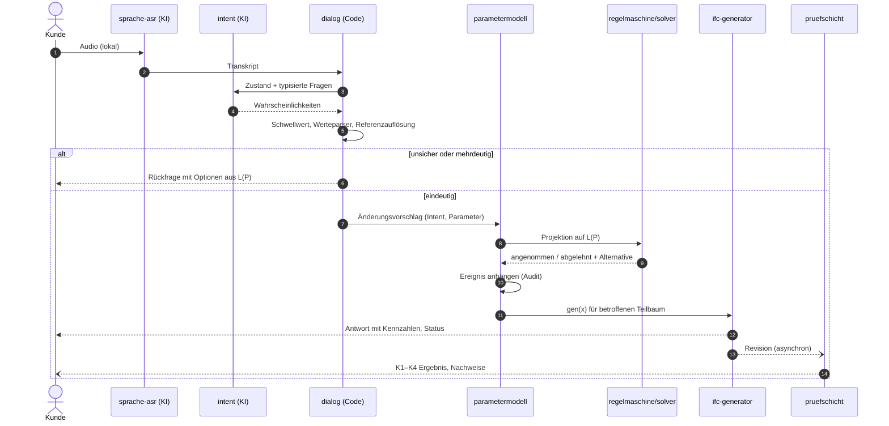
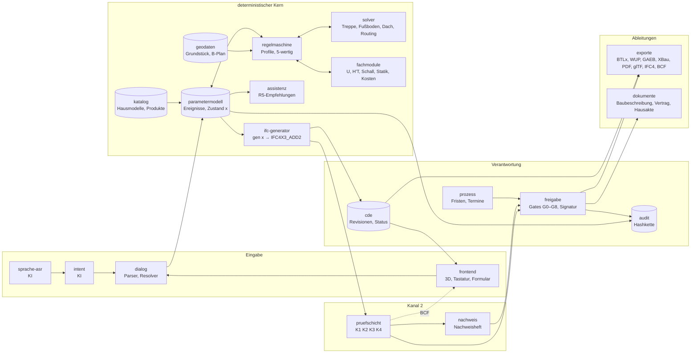
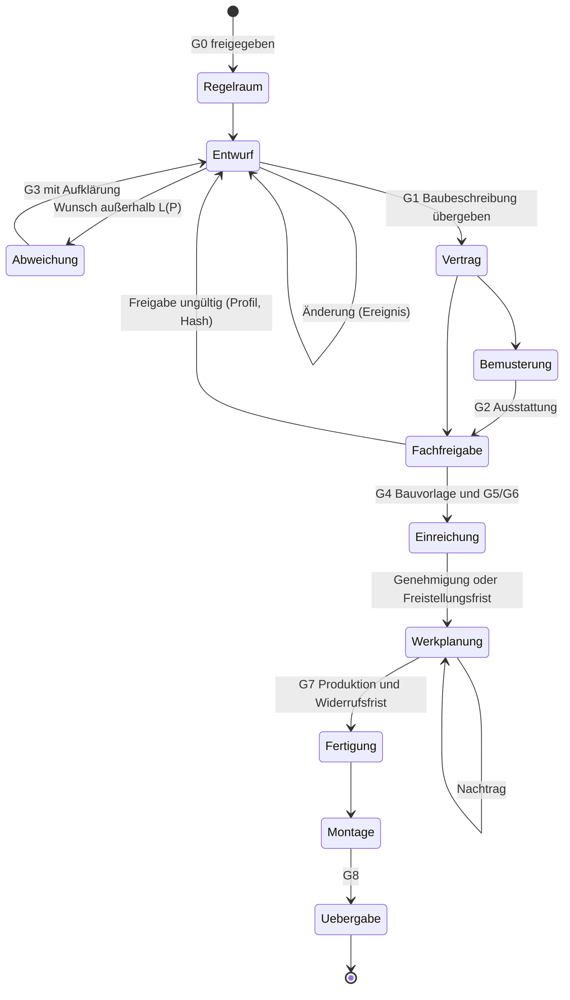

# 7 Systemarchitektur

Status: Entwurf v0.1 (27.09.2026). Befunde tragen [V] (an der Primärquelle geprüft) oder [U] (nicht an der Primärquelle geprüft oder eigene Bewertung). Lizenzangaben sind Befunde der Recherchen 01, 03, 05, 08, 09, 10, 18, 20 und 22, keine Rechtsauskunft. Die Modulzerlegung liegt maschinenlesbar in `spezifikation/module.yaml`.

## 7.0 Einordnung und Architekturtreiber

Kapitel 6 hat die Anforderungen an das System festgelegt. Dieses Kapitel beschreibt, wie das System gebaut wird, damit es sie erfüllt. Eine Architektur ist dabei nicht die Summe ihrer Module, sondern die Menge der Entscheidungen, die sich später nur schwer ändern lassen. Für diese Arbeit sind es sieben. Tabelle 7.1 ordnet jeder die Anforderungen zu, die sie erzwingen.

**Tabelle 7.1: Architekturtreiber**

| Treiber | Anforderungen | Architekturfolge | Abschnitt |
|---|---|---|---|
| Die KI versteht, der Code entscheidet | ANF-06-35, ANF-09b-09 | typisierte Intent-Schnittstelle, kein Wert aus dem Sprachmodell | 7.1 |
| Konform durch Konstruktion, belegt durch Nachprüfung | ANF-09-17, -18 | zwei getrennte Kanäle: Solver und Prüfschicht | 7.2 |
| Determinismus und Reproduzierbarkeit | ANF-08-23, -24; ANF-06-26, -27 | reiner Generator, Ereignisquelle, archivierte Umgebung | 7.2.4, 7.3 |
| Latenz der Sprachschleife | ANF-06-28, -29 | synchroner und asynchroner Pfad | 7.2.7 |
| Beweisvorsorge und Verantwortung | ANF-06-02 bis -06, -36, -37 | hashverketteter Audit-Trail, Gates mit Signatur | 7.3.4, 7.4 |
| Regeln und Mapping sind Daten | ANF-09-01, ANF-08-31, ANF-09b-02 | Regelmaschine und Generator lesen Kataloge | 7.2.3, 7.2.4 |
| Lizenzkonformität und Offline-Kern | ANF-06-38; Abschnitt 4.9 | Bausteinwahl mit Lizenzanalyse, lokaler Kern | 7.6, 7.7 |

Die Architektur folgt damit dem Zielbild in drei Grundsätzen: Ein Modell ist die Wahrheit (Prinzip 1), andere Formate sind Ableitungen (Prinzip 4), und die KI versteht, der Code entscheidet (Prinzip 7).

## 7.1 Neuro-symbolische Trennung

### 7.1.1 Befund der Literatur

Abschnitt 5.6 hat die Systeme gesichtet, die Sprachmodelle zur Erzeugung oder Änderung von Bauwerksmodellen einsetzen. In den meisten schreibt das Sprachmodell selbst den Code oder die geänderten Daten: Text2BIM erzeugt imperativen Code für die Vectorworks-API [@du2026text2bim], MCP4IFC lässt Sprachmodelle IFC-Elemente erzeugen oder Code per Retrieval generieren [@nithyanantham2025mcp4ifc]. Reproduzierbarkeit und Haftungszuordnung sind damit schwach, denn dieselbe Anweisung kann zu verschiedenen Modellen führen (Abschnitt 5.6.4).

Die Grenzen der Sprachmodelle sind gut belegt. Halluzinationen sind systematisch beschrieben [@ji2023hallucination]. Sprachmodelle bilden Text zuverlässig auf räumliche Relationen ab, scheitern aber am mehrstufigen räumlichen Schließen; erst die Kombination mit logischem Schließen löst den untersuchten Benchmark fehlerfrei [@li2024spatial]. In der Arbeit von Kodnongbua et al. machte die Selbstprüfung von GPT-4 Rechenfehler (Recherche 12) [@kodnongbua2024zeroshot]. Selbst hohe Trefferquoten reichen für haftungsrelevante Freigaben nicht: Iversen et al. berichten 97 % F1 für ein Sprachmodell, das Vorschriften direkt interpretiert und prüft [@iversen2026leveraging]. Für eine Abstandsfläche, die über die Genehmigungsfreistellung entscheidet, ist ein Fehler in drei von hundert Fällen nicht tragbar.

Dem steht ein gut belegtes Muster gegenüber: Das Sprachmodell zerlegt das Problem, ein Interpreter oder Werkzeug rechnet. Program-Aided Language Models lassen das Modell nur Programme schreiben und das Rechnen an Python abgeben [@gao2023pal]; Toolformer lernt, externe Werkzeuge aufzurufen [@schick2023toolformer]; ReAct verschränkt Schlussfolgerungen und Werkzeugaufrufe [@yao2023react]. Garcez und Lamb nennen die Verbindung neuro-symbolische KI: Lernverfahren übernehmen Wahrnehmung, symbolische Verfahren Schlussfolgern, Garantien und Erklärbarkeit [@garcez2023neurosymbolic]. In der AEC-Literatur tritt das Muster mehrfach auf, etwa mit IfcOpenShell als deterministischem Kern [@mirhosseini2026ambiguity] oder einem OWL-Reasoner [@saluz2025semio].

Abschnitt 5.8.1 hat die verbleibende Lücke als L6 benannt: In allen gesichteten Systemen darf das Sprachmodell noch Constraints, Code oder Daten erzeugen. Eine Architektur, in der es nur eine Absicht und typisierte Parameter aus einem geschlossenen Katalog wählt, ist nicht dokumentiert. Diese Architektur beschreibt der folgende Abschnitt.

### 7.1.2 Drei Schichten

Das System trennt drei Schichten mit verschiedener Fehlerart und verschiedener Absicherung (Tabelle 7.2).

**Tabelle 7.2: Schichten der Sprachverarbeitung**

| Schicht | Aufgabe | Verfahren | Ausgabe | typischer Fehler | Absicherung |
|---|---|---|---|---|---|
| Wahrnehmung | Sprache → Text | Spracherkennung (KI) | Transkript mit Zeitmarken | falsch erkanntes Fachwort | Fachbegriff-Boosting, Anzeige des Transkripts, Korrektur |
| Absicht | Text → Intent | Intent-Modell (KI) | Wahrscheinlichkeiten über typisierte Fragen | falscher Intent, falsche Gruppe | Schwellwert je Frage, Rückfrage, Hierarchie |
| Symbolik | Intent + Text → Modelländerung | Werteparser, Referenzauflösung, Regelmaschine, Solver, Generator (Code) | Ereignis, Revision, Nachweis | keiner zufällig; Fehler sind reproduzierbar und testbar | Tests, Kanal 2, Nachweis |

Die ersten beiden Schichten sind KI-Systeme im Sinne der KI-Verordnung, die dritte voraussichtlich nicht [@eu2025aidefinition] (Abschnitt 6.3.6). Die Grenze zwischen Absicht und Symbolik ist die wichtigste Schnittstelle des Systems. Sie ist so gestaltet, dass kein Wert, der später im Modell steht, aus einer KI-Schicht stammt.

**E7.1 – Das Sprachmodell wählt, der Code füllt.** *Entscheidung.* Das Intent-Modell beantwortet ausschließlich typisierte Fragen mit geschlossener Antwortmenge und liefert Wahrscheinlichkeiten. Zahlenwerte liest ein deterministischer Parser aus dem Transkript, Referenzen löst ein deterministischer Resolver gegen das Modell auf, und jede Modelländerung entsteht im Parametermodell durch Code. Kein Sprachmodell erzeugt Code, IFC, Constraints oder Meldungstexte. *Begründung.* Nur so ist jeder Wert im Modell auf eine deterministische Regel zurückführbar (Abschnitt 4.8.2), und nur so fällt die Regelmaschine nicht unter die Definition des KI-Systems. Die Haftungsliteratur unterscheidet automatisierte Systeme mit festen, nachvollziehbaren Regeln von autonomen Systemen, bei denen Zurechnungslücken entstehen [@wilhelmi2020haftung]; Zech verortet das Autonomierisiko in eingeschränkter Vorhersehbarkeit und Erklärbarkeit [@zech2020risiken]; Matthias beschreibt die Verantwortungslücke lernender Maschinen [@matthias2004responsibility]. *Beleg.* Recherche 03 [V] für die Fragetypen; B6 [V] für Parser und Resolver.

### 7.1.3 Der Schnittstellenvertrag der Absicht

Die Schnittstelle zwischen Absicht und Symbolik übernimmt das Protokoll der typisierten Entscheidungsmodelle (Recherche 03) [V]. Ein Aufruf besteht aus einem Zustand und einer Menge typisierter Fragen, die parallel beantwortet werden:

- **choice**: eine von 1 bis 255 Optionen, Ausgabe ist eine Verteilung über die Optionen;
- **score**: eine Rubrik mit 2 bis 10 Stufen;
- **noul**: eine Ja/Nein-Frage, Ausgabe ist P(true) zwischen 0 und 1, kein Boolean.

Den Schwellwert für eine Entscheidung legt der Code je Frage fest, passend zu den Kosten eines Fehlers. Das offene Modell Laya spricht dasselbe Protokoll über einen selbst gehosteten Server, das Cloud-Modell Jev über das Vercel AI Gateway. Beide sind seit Mitte September 2026 öffentlich und damit sehr jung [V].

Drei Eigenschaften der Modelle bestimmen den Entwurf der Schnittstelle. Laya liegt laut Model Card ohne Fine-Tuning mit einer Genauigkeit von 0,342 nahe am Zufallsniveau von 0,318, wird unkalibriert ausgeliefert, und mit mehr als etwa 20 Optionen sinkt die Leistung deutlich. Jev hat Englisch als Hauptsprache und läuft nur in der Cloud (Recherche 03) [V].

**E7.2 – Der Intent-Katalog ist hierarchisch, jede Frage hat höchstens 20 Optionen.** *Entscheidung.* Die Absicht wird in zwei Stufen bestimmt: erst die Gruppe, dann der Intent in der Gruppe. Jede choice-Frage hat höchstens 20 Optionen. Der Intent-Katalog von Kapitel 10 (`spezifikation/intents.yaml`) setzt das mit 16 Gruppen und höchstens 19 Optionen je Frage um; Schwellwerte stehen dort je Frage und je Risikoklasse, nicht im Code. Das Intent-Modell wird auf einem deutschen Testset feinabgestimmt und kalibriert; ohne Kalibrierungsbericht wird es nicht geladen. *Begründung.* Die Leistungsgrenze der Model Card und die fehlende Kalibrierung lassen sonst keine belastbaren Schwellwerte zu. Kou und Tan haben gezeigt, dass eine CAD-spezifische Grammatik deutlich besser erkennt als freies Diktat [@kou2008design]; die Folgearbeit filtert Kandidaten nach dem aktuellen Modellkontext und fragt bei Mehrdeutigkeit nach [@kou2010knowledge]. Beides entspricht einem geschlossenen, hierarchischen Katalog. *Beleg.* Recherche 03 [V]; die zweite Stufe kostet im Budget etwa 70 ms zusätzlich (Abschnitt 6.3.3).

Listing 7.1 zeigt eine Anfrage an das Intent-Modell und die Antwort in der Form, die das Modul `intent` an das Modul `dialog` weitergibt.

```json
{
  "zustand": {"geschoss_aktiv": "OG", "auswahl": null, "revision": "sha256:…"},
  "fragen": [
    {"id": "q.gruppe", "typ": "choice", "schwelle": 0.7,
     "optionen": ["grundriss", "geschosse_baukoerper", "huelle", "dach", "fassade",
                  "bemusterung_interior", "tga", "licht", "pv", "aussenanlagen", "moeblierung",
                  "gebaeudetyp_nutzung", "steuerung", "anzeigen_auswerten", "freigabe_prozess", "meta"]},
    {"id": "q.grundriss", "typ": "choice", "schwelle": 0.7,
     "optionen": ["raum_groesse_aendern", "raum_hinzufuegen", "raum_entfernen", "raum_verschieben",
                  "raeume_tauschen", "…"]},
    {"id": "n.relativ", "typ": "noul", "schwelle": 0.7}
  ],
  "antwort": {
    "q.gruppe": {"grundriss": 0.94, "dach": 0.02, "…": "…"},
    "q.grundriss": {"raum_groesse_aendern": 0.91, "raum_hinzufuegen": 0.03, "…": "…"},
    "n.relativ": 0.97
  },
  "modell": {"name": "STUB", "version": "B6", "kalibrierung": null}
}
```

**Listing 7.1:** Anfrage und Antwort an der Schnittstelle der Absicht (Schema in 7.9.2, Struktur A). Fragen-IDs und Optionen folgen `intents.yaml` (Kapitel 10); die Wahrscheinlichkeiten sind die Stub-Werte aus B6. Die Antwort enthält keine Zahl, die ins Modell übernommen wird, nur Wahrscheinlichkeiten über geschlossene Mengen.

### 7.1.4 Werte, Referenzen und unscharfe Angaben

Typisierte Entscheidungsmodelle liefern keine Werte wie „1,20 m“ oder „35 Grad“ (Recherche 03) [V]. Die Recherche nennt zwei Auswege: einen deutschen Parser für Zahlen und Einheiten oder ein Sprachmodell mit JSON-Schema. Die Arbeit wählt ausschließlich den ersten. Ein Sprachmodell mit Schema garantiert die Form der Ausgabe, nicht ihren Inhalt.

Der Parser in B6 zeigt, dass der deterministische Weg für gesprochenes Deutsch trägt. Er besteht 16 Testfälle, darunter „eins zwanzig“, „anderthalb Meter“, „drei komma fünf Meter“ und „fünfunddreißig Grad“, und erkennt Mehrdeutigkeit statt sie still aufzulösen, etwa bei „eins fünf“ (1,05 oder 1,50 m) [V]. Das Vorbild ist Kakadoo, das strukturierte Befehle deterministisch parst und ein Sprachmodell nur für unscharfe Angaben wie „höher“ aufruft [@atakan2025kakadoo]. Die Arbeit geht einen Schritt weiter und ruft auch dafür kein Sprachmodell auf.

**E7.3 – Unscharfe Angaben werden mit regelkonformen Optionen beantwortet, die der Code erzeugt.** *Entscheidung.* Sagt der Kunde „das Bad etwas größer“, bestimmt das Intent-Modell nur die Stärke der Änderung als score-Frage (in `intents.yaml` fünf Stufen von „sehr wenig“ bis „sehr stark“). Der Code übersetzt die Stufe in eine Schrittweite, prüft sie gegen den Lösungsraum *L*(*P*) und zeigt sie als Vorschau. Ist die Stufe unsicher oder die Schrittweite unzulässig, bietet er Optionen an, die er aus *L*(*P*) berechnet, etwa „+0,20 m“, „+0,50 m“ und „größtmöglich“. Die Auswahl ist wieder eine choice-Frage. *Begründung.* Chen et al. lassen fehlende Angaben vom Sprachmodell nach „gesundem Menschenverstand“ ergänzen [@chen2025agent]; Abschnitt 5.7.5 führt stilles Ergänzen als zu vermeidendes Muster. Werden die Optionen aus *L*(*P*) erzeugt, ist jede Option zulässig, und die Rückfrage ist zugleich die Alternative im Sinne von Abschnitt 9.5. *Beleg.* Eigene Entscheidung [U]; die Projektion auf *L*(*P*) ist in Abschnitt 9.5.1 begründet.

> **Beispiel 7.1 (drei Äußerungen durch die drei Schichten).** Beispiel B6 mit dem Intent-Stub; die Laufzeit des symbolischen Teils ist am 27.09.2026 gemessen (Median 0,125 ms, p95 0,229 ms über 450 Aufrufe):
>
> | Äußerung | Absicht (Stub) | Symbolik | Ergebnis |
> |---|---|---|---|
> | „Das Bad oben eins fünf breiter“ | raum_aendern, p = 0,91 | Parser: 1,05 m, Muster C, mehrdeutig (1,05 oder 1,50 m) | Rückfrage nach dem Wert |
> | „Das Bad soll zwanzig Zentimeter breiter werden“ | raum_aendern, p = 0,91 | Parser: 0,20 m; Resolver: zwei Bäder (EG, OG) | Rückfrage nach dem Raum |
> | „Kannst du das mal anders machen“ | sonstiges, p = 0,46 | kein Wert, keine Referenz | Rückfrage nach der Absicht |
>
> Keine der drei Äußerungen ändert das Modell. Die erste scheitert am Wert, die zweite an der Referenz, die dritte an der Absicht. Die Unterscheidung ist wichtig, weil nur der dritte Fall ein Fehler der KI-Schicht ist. Abschnitt 9.5.3 trennt deshalb Rückfragen zur Absicht von Ablehnungen nach Regeln (ANF-09-15).

### 7.1.5 Meldungen ohne Sprachmodell

Auch die Antwort an den Kunden formuliert kein Sprachmodell. Meldungen entstehen aus den Textvorlagen der Regel- und Empfehlungskataloge mit eingesetzten Werten (ANF-09b-09). Der Grund ist nicht nur Determinismus. In einem Experiment mit 1.506 Teilnehmenden verschob ein meinungsgeprägter Schreibassistent nicht nur die Texte, sondern auch die später erhobene Einstellung der Nutzer [@jakesch2023cowriting]. Ein frei formulierendes Modell könnte Wertungen einführen, die weder in der Regel noch in der Evidenz stehen (Abschnitt 9b.7.3).

Abbildung 7.1 zeigt die Sprachschleife als Sequenz. Die gestrichelten Pfeile sind asynchron.



**Abbildung 7.1:** Sequenz der Sprachschleife. Die KI-Schichten liefern nur Transkript und Wahrscheinlichkeiten; jede Änderung läuft über Parametermodell und Regelmaschine.

## 7.2 Die Pipeline

### 7.2.1 Überblick

Die Kette hat fünf Stufen: Parametermodell, Regelmaschine mit Solvern, IFC-Generator, Prüfschicht und Ableitungen. Abbildung 7.2 zeigt die Module und ihre Datenflüsse. Die Modulnamen sind die aus Tabelle 7.5 und `module.yaml`.



**Abbildung 7.2:** Architektur des Systems. Nur das Parametermodell hält den Entwurfszustand; alle Artefakte rechts davon sind aus ihm abgeleitet. Das Modul `betrieb` (Datenschutz, Telemetrie, Lizenzen) ist querschnittlich und nicht eingezeichnet.

### 7.2.2 Parametermodell

Das Parametermodell ist die einzige Stelle, an der der Entwurf **geschrieben** wird. Es hält den Parametervektor *x* ∈ *X* aus Abschnitt 9.2.1: Grundriss, Geschosshöhen, Dachform und -neigung, Bauteilaufbauten, Bemusterung. Daneben stehen der Kontext *c* (Grundstück, Bebauungsplan, Gemeinde, Lärmquellen, Stichtage) und die Verweise auf die freigegebenen Kataloge. Das Format ist kanonisches JSON mit sortierten Schlüsseln und definierter Zahlen-Normalform, wie Abschnitt 7a.5 sie für den Nachweis-Hash festgelegt hat. Sein SHA-256 steht als `ParameterHash` im `IfcProject` (ANF-08-28).

Jedes Objekt, das der Generator später erzeugt, hat im Parametermodell einen **Pfad**, etwa `/wand/oeffnungen/F1/sturz`. Der Pfad ist Teil der Schnittstelle, denn aus ihm folgt die GlobalId (E8.27). Eine Änderung der Pfadstruktur ist eine Schemamigration mit Zuordnungstabelle.

Das Parametermodell wird nicht überschrieben, sondern als Folge von **Ereignissen** fortgeschrieben (7.3.2). Der aktuelle Zustand ist das Ergebnis dieser Folge.

### 7.2.3 Regelmaschine und Solver (Kanal 1)

Die Regelmaschine lädt Regelkatalog, Regelprofile und Empfehlungskatalog, prüft sie beim Laden gegen das Schema und auf Monotonie (ANF-09-01, -10) und leitet das Profil aus dem Merkmalsvektor ab (ANF-09a-01). Jede Prüfung liefert einen der fünf Werte erfüllt, verletzt, unbestimmt, nicht anwendbar oder freigabepflichtig (Abschnitt 9.2.1).

Die Regelmaschine wirkt im **Kanal 1**: vor der Anwendung einer Änderung. Sie projiziert den Änderungsvorschlag auf *L*(*P*) und liefert Annahme, Ablehnung mit Konfliktmenge oder eine Alternative (Abschnitt 9.5). Wo eine Regel eine Suche verlangt, ruft sie einen Solver. Die Beispiele zeigen sechs Muster (Tabelle 9.5): vollständige Aufzählung bei der Treppe (B5, 68 Lösungen) und der Wärmepumpe (B20, 2 304 Rasterpunkte), exakte lineare Teilprobleme beim Fußbodenaufbau (B14), Suche nach freier Achse bei Durchdringungen (B15), Aufzählung mit Clipping bei Fliesen (B16) und Kostenminimierung beim Außenlärm (B19). Diese Verfahren sind vollständig oder exakt; sie können deshalb nicht nur „keine Lösung gefunden“ melden, sondern „es gibt keine Lösung“ (ANF-09-17).

Für Grundriss und Möblierung empfiehlt Recherche 03 einen regelbasierten Solver mit OR-Tools CP-SAT statt neuronaler Generatoren, deren Lizenzen die Nutzung ausschließen [V]. Das Muster „Regeln geben Constraints vor, ein Solver platziert“ folgt Holodeck und Infinigen Indoors. Für die Dachgeometrie ist das gewichtete Straight Skeleton der Kern (Recherche 09), für das TGA-Routing eine Graph-Suche mit Installationszonen als Kantenrestriktion (Recherche 08). Die Arbeitsteilung zwischen Constraint Solving und Constraint Checking haben Khalili-Araghi und Kolarevic für die dimensionale Kundenanpassung beschrieben [@khalili2016development]; eine Regelbasis für Prüfen und Erzeugen haben Sydora und Stroulia gezeigt [@sydora2020rulebased].

Die Regelmaschine führt einen **Abhängigkeitsgraphen** von Parametern zu Regeln. Eine Änderung der Dachneigung löst genau Abstandsfläche, Vollgeschoss, Dachneigungsklasse und Gebäudeklasse neu aus (ANF-09-19). Das entspricht dem Vorberechnungsgraphen von OpenBIMRL [@stepien2023openbimrl].

### 7.2.4 IFC-Generator

Der Generator ist eine reine Funktion *M* = gen(*x*). Er liest das Parametermodell, die freigegebenen Kataloge und das Klassenmapping aus `spezifikation/ifc-mapping.csv` (ANF-08-31) und schreibt IFC4X3_ADD2 mit IfcOpenShell. „Rein“ heißt: kein Zugriff auf Uhr, Zufall oder Netz. Der Zeitstempel kommt aus dem Parametermodell oder aus `SOURCE_DATE_EPOCH` (ANF-08-24). Beziehungen werden mit fester Listenreihenfolge angelegt, weil Funktionen von `ifcopenshell.api`, die über Python-Mengen iterieren, bei vier Hash-Seeds vier verschiedene Dateien erzeugten (Abschnitt 8.6.2) [V]. Die GlobalIds werden nach dem Aufbau in einem Durchlauf nach der Regel G1–G8 vergeben (Abschnitt 8.8.3).

Die Granularität folgt dem Reifegrad: Teile, Verbindungsmittel, Bearbeitungen und Belagstücke entstehen erst in Reifegrad A (ANF-08-25). Das hat eine Laufzeitfolge. Ein Wandelement in Reifegrad A mit 217 Teilen, davon 176 Schrauben, braucht in B1 im Median 0,131 s (eigene Messung, 27.09.2026). Im Entwurf, in Reifegrad P, entstehen diese Teile nicht. Im Zielsystem erzeugt der Generator außerdem nur den geänderten Teilbaum neu [U, im Prototyp nicht umgesetzt]; die GlobalIds außerhalb bleiben in jedem Fall gleich (ANF-08-23).

### 7.2.5 Prüfschicht (Kanal 2)

Die Prüfschicht prüft das **IFC-Modell**, nicht das Parametermodell. Sie ist bewusst getrennt vom Generator und von den Solvern: Sie importiert deren Code nicht und liest nur die IFC-Datei, den Kontext und die Kataloge (ANF-07-15). Weichen Kanal 1 und Kanal 2 voneinander ab, liegt ein Fehler im Generator, im Solver oder in der Regel vor, und jede Freigabe ist gesperrt (ANF-09-18). Pinto et al. haben gezeigt, dass selbst deterministische Prüfsoftware Regeln nicht immer richtig ausführt [@pinto2026exhaustive]; die Zweikanaligkeit ist die Antwort darauf.

Die Prüfschicht hat vier Stufen (Abschnitt 8.1.2):

- **K1 Schema und EXPRESS-Regeln** mit `ifcopenshell.validate`. Für B1 dauert das 3,66 s bei 0 Meldungen (eigene Messung) und läuft deshalb asynchron.
- **K2 buildingSMART Validation Service** mit Syntax, Schema, normativen Regeln und bSDD-Prüfung. Der Dienst ist als API und als Docker-Betrieb dokumentiert [@bsi2025validation]; die Arbeit betreibt ihn lokal (ANF-08-03).
- **K3 IDS** je Gate und Reifegrad [@bsi2024ids], geprüft mit ifctester. Weil ifctester 0.8.5 das Attribut `identifier` ignoriert, ordnet die Prüfschicht Befunde über den Spezifikationsnamen einer Regel-ID zu (ANF-09-04). Das IDS-Audit-Tool von buildingSMART (.NET, MIT) ist eine serverseitige Alternative (Recherche 05) [V].
- **K4 Regelmaschine und Nachweise** mit Gegenrechnung aus den offengelegten Eingaben (Abschnitt 7a.3).

Das Vier-Stufen-Modell der automatisierten Prüfung nach Eastman et al. mit Regelinterpretation, Modellvorbereitung, Ausführung und Bericht bildet sich auf diese Stufen ab [@eastman2009automatic]. Moult hat gezeigt, dass Regeln in einer Continuous-Integration-Kette bei jeder Modellrevision in Sekunden laufen können [@moult2020compliance]. Prüfergebnisse gehen als BCF-Themen mit den GlobalIds der betroffenen Komponenten zurück (E8.25).

### 7.2.6 Ableitungen

Alle anderen Formate sind Ableitungen einer **veröffentlichten** Revision. Jede Ableitung trägt je Objekt die GlobalId ihrer Quelle (E8.26) und ein Manifest mit Revisions-Hash, Version des Exporters und Zuordnungstabelle (ANF-07-20). Tabelle 7.3 zeigt den Stand.

**Tabelle 7.3: Ableitungen**

| Ableitung | Zweck | Baustein | GUID-Träger | Stand |
|---|---|---|---|---|
| BTLx 2.3 | Abbund | compas_timber (MIT) [@compastimber] | `UserAttribute IfcGlobalId`, `UrsacheGUID`, `Transformation GUID` | B7: 18 Parts; B15: `Drilling` mit Leitungs-GUID [V] |
| WUP | Wandanlage | Adapter, Spezifikation fehlt | `export_guid.csv` | bricht mit definierter Meldung ab (ANF-03-14) |
| GAEB DA XML | Leistungsverzeichnis | `gaeb` (MIT) | Position ↔ `IfcCostItem` | Recherche 05 [V], nicht umgesetzt |
| PDF-Bauvorlagen | Einreichung | SVG-Zeichnungen aus der Nachweisschicht | Revisions-Hash je Blatt | Lageplan 1 : 200 in B4; PDF nur über Browserdruck (Abschnitt 7a.7) |
| XBau, BayernPortal | Formulardaten | eigener Schreiber | Verweis auf Anlage-IFC | nicht umgesetzt |
| glTF mit PBR | Präsentation, AR | eigener Schreiber mit glTF-Transform (MIT) oder trimesh (MIT) | `extras` je Knoten | IfcOpenShell exportiert keine Texturen und UVs [V] |
| IFC4 | Fremdsoftware (hsbcad, cadwork) | Generator mit IFC4-Ziel | GlobalId gleich | Verlustprotokoll (ANF-08-29) |
| BCF | Prüfergebnisse, Rückfragen | eigener Schreiber | Komponenten-GUIDs | nicht umgesetzt (E8.25) |
| Baubeschreibung, Vertrag, Hausakte | Vertrag, Übergabe | Modul `dokumente` | Revisions-Hash, `IfcDocumentReference` | Vollständigkeitsregel vorhanden |

### 7.2.7 Synchroner und asynchroner Pfad

Das Latenzbudget von 1,5 s (E6.3) lässt sich nur einhalten, wenn nicht alles synchron läuft. Die Architektur hat deshalb zwei Pfade.

**Synchron** laufen Spracherkennung, Intent, Parser, Referenzauflösung, die lokalen R1-Regeln im Solver und die Neuerzeugung des geänderten Teilbaums. Die gemessenen Werte liegen weit unter ihren Teilbudgets: 0,229 ms (p95) für den symbolischen Teil von B6, 0,60 ms je Abstandsflächen-Szenario (B4), 0,56 ms für alle 68 Treppenlösungen (B5) und 0,131 s für ein Wandelement in Reifegrad A (B1).

**Asynchron** laufen K1 bis K3, die Nachweishefte, Energiebilanz, vollständiger Schallnachweis und Tragwerksvorbemessung. Ihr Ergebnis ist bis zum Abschluss **unbestimmt**, und die Oberfläche zeigt „wird berechnet“ (ANF-06-29). Das ist die Arbeitsregel aus Abschnitt 9.6.3, jetzt als Architektur.

**E7.4 – Freigaben warten auf den asynchronen Pfad, der Entwurf nicht.** *Entscheidung.* Der Kunde kann weiterentwerfen, während die Hintergrundprüfung läuft. Jede neue Änderung macht laufende Hintergrundprüfungen der alten Revision nicht ungültig, aber für die Freigabe unbrauchbar. Freigegeben werden kann nur eine Revision, für die alle vier Stufen abgeschlossen sind. *Begründung.* Die Schemaprüfung eines einzelnen Wandelements dauert schon 3,66 s. Ein synchroner Pfad durch K1 würde die Sprachschleife um Größenordnungen verlangsamen. *Beleg.* Eigene Messung [V]; die Laufzeit für ein ganzes Haus ist noch zu messen [U].

## 7.3 Identität, Versionierung, Undo und Audit-Trail

### 7.3.1 Identität

Die Identität der Objekte beruht auf der GUID-Regel aus Abschnitt 8.8.3. Sie wird hier nicht wiederholt, sondern in ihre Rolle in der Architektur eingeordnet:

- **G1 Namensräume** machen die GlobalId global eindeutig: `NS_PROJEKT = uuid5(NS_FIRMA, "projekt:" + projekt_id)`.
- **G2 bis G5 Pfade** machen sie reproduzierbar und eindeutig; ein doppelter Pfad bricht den Generator ab.
- **G6 Stabilität** macht sie über Änderungen hinweg gleich, solange das Objekt fachlich fortbesteht. Bei geänderter Brüstungshöhe von 900 auf 850 mm behalten Wand, Rasterständer, Schwelle, Rähm und Brüstungsriegel ihre GlobalId [V].
- **G7 Exporte** tragen dieselbe UUID.
- **G8 Regressionsvektoren** sichern die Regel gegen unbemerkte Änderungen.

Die GlobalId ist damit der Schlüssel, über den Nachweise, BCF-Themen, Audit-Einträge, Exporte und Freigaben auf dasselbe Objekt verweisen. Der Vergleich zweier Revisionen reduziert sich auf den Abgleich zweier Mengen von GlobalIds (E8.23).

### 7.3.2 Versionierung als Ereignisquelle

Das Parametermodell wird als Ereignisquelle geführt. Ein Ereignis *e*ₙ ist eine Änderung mit Rolle, Eingabeweg, Intent, Parametern, Ergebnis der Regelprüfung und den Versionen aller beteiligten Komponenten. Der Zustand nach *n* Ereignissen ist

$$x_n = \mathrm{apply}(x_{n-1}, e_n), \qquad x_0 = \text{Hausmodell aus dem Katalog}.$$

Eine **Revision** ist ein Zustand *x*ₙ zusammen mit den Versionen von Generator, Katalogen und Profilen. Aus ihr entsteht die IFC-Datei gen(*x*ₙ) mit SHA-256. Die Revision liegt unveränderlich in genau einer gemeinsamen Datenumgebung (CDE) nach ISO 19650 [@iso19650], deren Status die Reife angibt: in Arbeit, geteilt, veröffentlicht, archiviert (ANF-07-10). Ein Review nach PRISMA nennt die parallele Nutzung mehrerer CDEs als Hauptproblem für Zurechenbarkeit und Verlässlichkeit [@jaskula2024common]; die Arbeit hält deshalb an einer CDE fest (E8.23).

**Varianten** sind Zweige der Ereignisfolge, nicht Gruppen in der IFC-Datei (E8.13). Vergleicht der Kunde „Schlafräume nach Norden“ und „Schlafräume nach Süden“ wie in B19, entstehen zwei Zweige ab demselben Ereignis. Der Pareto-Vergleich von bis zu fünf Varianten in Kapitel 9b (ANF-09b-06) arbeitet auf diesen Zweigen.

Die Ereignisquelle hat einen Vorzug, der für die Beweisvorsorge entscheidend ist: Das Ergebnis der Intent-Erkennung wird im Ereignis gespeichert, nicht beim Wiederholen neu berechnet. Damit ist die Wiederholung der Folge deterministisch, obwohl eine KI-Schicht beteiligt war (ANF-06-26).

### 7.3.3 Undo und Redo

Weil gen(*x*) rein ist, ist Undo trivial und prüfbar: Undo ist der Zustand *x*ₙ₋₁, und gen(*x*ₙ₋₁) ergibt byte-identisch die IFC-Datei vor der Änderung (ANF-07-09). Das Undo selbst ist wieder ein Ereignis („zurück auf *n* − 1“), damit der Audit-Trail vollständig bleibt. Für lange Folgen hält das Parametermodell Momentaufnahmen, damit nicht jede Wiederholung beim Hausmodell beginnt.

Undo hat zwei Grenzen, die aus dem Recht folgen, nicht aus der Technik:

- **Nach einem Freeze** ist eine Rücknahme eine Änderung wie jede andere: Nach dem Vertrag entsteht ein Nachtrag (ANF-06-13), nach dem Freeze W der Bemusterung ein Nachtrag mit Liste der betroffenen Wandelemente (ANF-03-19).
- **Eine Freigabe** lässt sich nicht rückgängig machen, nur widerrufen. Der Widerruf ist ein eigenes Ereignis mit Rolle und Begründung, das die Freigabe ungültig macht, sie aber nicht aus dem Protokoll entfernt.

### 7.3.4 Audit-Trail

Der Audit-Trail ist ein nur anhängbares Protokoll, in dem jeder Eintrag den SHA-256 seines Vorgängers enthält (ANF-06-36). Die Expertengruppe der Kommission hat „logging by design“ als Herstellerpflicht vorgeschlagen [@expertgroup2019liability]. Die Kette macht jede nachträgliche Änderung erkennbar, belegt aber allein weder Zeitpunkt noch Urheberschaft. Dafür sorgen drei Ergänzungen:

1. **Zeitstempel über Hashbäume.** Täglich und bei jedem Gate wird aus den Einträgen seit dem letzten Stempel ein Hashbaum gebildet. Seine Wurzel erhält einen qualifizierten Zeitstempel, der die Vermutung von Datum und Integrität begründet (Art. 41 eIDAS) [@eu2014eidas]. Das Verfahren folgt den Evidence Records nach RFC 4998, die TR-ESOR für die Beweiswerterhaltung beschreibt [@bsi2022tresor] [V].
2. **Siegel auf Berichten.** Nachweishefte und Prüfprotokolle tragen das qualifizierte Siegel der Firma (Art. 35 eIDAS).
3. **Signatur am Gate.** Die Freigabe trägt die qualifizierte elektronische Signatur der Person (7.4).

Eine Blockchain ist nicht nötig. Nach dem Entscheidungsrahmen von Hunhevicz und Hall hängt die Wahl eines verteilten Ledgers von Merkmalen des Anwendungsfalls ab, etwa davon, ob es eine vertrauenswürdige Instanz gibt [@hunhevicz2020need]. Beim Hersteller mit eigener CDE ist das der Fall. Das qualifizierte elektronische Ledger nach Art. 45k eIDAS bliebe die unionsrechtliche Alternative, falls mehrere Firmen dieselbe Kette teilen (Recherche 27).

> **Beispiel 7.2 (drei verkettete Audit-Einträge).** Die ersten drei Äußerungen aus B6 mit Endergebnis „angenommen“, „abgelehnt“ und „Rückfrage“ ergeben drei Ereignisse. Jeder Eintrag enthält Nummer, Art, Rolle, Eingabeweg, Intent mit Quelle, Parameter, Ergebnis und `vorgaenger_hash`; der erste Vorgänger sind 64 Nullen. Kanonisiert wird mit sortierten Schlüsseln, ohne Leerzeichen, UTF-8:
>
> | Nr. | Art | Parameter (Auszug) | SHA-256 des Eintrags |
> |---|---|---|---|
> | 1 | aenderung | Bad `1cRQfmv29HlfHiIPofgLWT`, Breite 2,60 m | `84c13b03…fd6cef6a` |
> | 2 | ablehnung | Kinderzimmer 1 `0ITNhZ0prS0unT2eFYJ6EO`, −1,20 m; Regel `M.Projekt.Raum-Mindestmasse` | `a8e98838…36852716` |
> | 3 | rueckfrage | Kandidaten 1,05 m und 1,50 m | `7545a106…f15a9dd7` |
>
> Wird im ersten Eintrag nachträglich 2,60 m durch 2,50 m ersetzt, ändert sich dessen Hash, und der `vorgaenger_hash` von Eintrag 2 stimmt nicht mehr. Die Kettenprüfung meldet Eintrag 2 als ersten ungültigen. Das Transkript steht in keinem Eintrag (ANF-06-30).

### 7.3.5 Reproduzierbarkeit über die Zeit

Eine Revision muss auch Jahre später neu erzeugbar sein (ANF-06-27). Die Architektur speichert deshalb zu jeder Revision nicht nur die Versionen von Generator, Katalogen und Profilen, sondern auch den Hash der Paketliste (`requirements-lock.txt`) und die Kennung eines archivierten Container-Abbilds. Abschnitt 8.6.2 hat gezeigt, dass schon Bibliotheksinterna die Byte-Identität brechen können. Nur eine archivierte Umgebung garantiert, dass „dieses Modell, geprüft nach Profil *P* in Version *v*“ später dieselbe Prüfsumme ergibt.

## 7.4 Freigabe-Gates mit Signatur und Zeitstempel

### 7.4.1 Die Gates

Kapitel 6 hat neun Gates festgelegt. Tabelle 7.4 beschreibt sie als Teil der Architektur: wer freigibt, was vorliegen muss, welches Artefakt entsteht und wie es gesichert wird.

**Tabelle 7.4: Freigabe-Gates**

| Gate | freigebende Rolle | Vorbedingung | Artefakt | Sicherung | IFC | Grundlage |
|---|---|---|---|---|---|---|
| G0 Regelraum | BV (Entwurf durch FR) | Katalog schema-valide, monoton | Freigabe der Katalogversion | QES, Zeitstempel | `IfcApproval` an `IfcProjectLibrary` | Art. 61 Abs. 6 BayBO; Recherche 27 |
| G1 Vertrag | KU und VT | Baubeschreibung vollständig, in Textform übergeben | eingefrorener Vertragsstand | Hash, Zeitstempel; Unterschrift nach Vertragsform | `IfcProjectOrder`, `IfcDocumentReference` | §§ 650j, 650l BGB |
| G2 Ausstattung | KU | Bemusterung vollständig für Freeze W | Ausstattungsfestlegung | Hash, Zeitstempel | `IfcDocumentReference` | AGB § 5/§ 6 [@regnauerBLB2024] |
| G3 Abweichung | BV, KU | dokumentierte Aufklärung | Aufklärungsdokument | QES der Person, Zustimmung des Kunden | `IfcDocumentReference` | [@bgh2011viizr810] |
| G4 Bauvorlage | BV | K1–K4 abgeschlossen, Warnsignale beantwortet, Profil in Reichweite | Freigabe der Revision | QES, Zeitstempel | `IfcApproval`, `IfcActor` | Art. 61, 64 BayBO |
| G5 Statik | TW, ggf. PS | Qualifikation geprüft | Erklärung des Nachweiserstellers, unterschriebenes Original | QES; Abbild nach DBauV | `IfcApproval` | Art. 62a BayBO; § 11 Abs. 4 DBauV |
| G6 Brandschutz | BV, ab GK 5 PS | Profil GK 4/5 | Bestätigung bzw. Bescheinigung | QES | `IfcApproval` | Art. 62b BayBO |
| G7 Produktion | WP | G2 unterschrieben ∧ (Genehmigung ∨ Freistellungsfrist abgelaufen) ∧ Widerrufsfrist abgelaufen | Fertigungspaket | Siegel, Zeitstempel | `IfcApproval` | ANF-03-18 |
| G8 Übergabe | MO, KU | Abnahme | Hausakte | Siegel, Evidence Record | `IfcAsset`, `IfcDocumentReference` | QDF [@qdf2022] |

Abbildung 7.3 zeigt die Gates als Zustandsautomat. Er ist Konfiguration, nicht Code: Die Vorbedingungen stehen in `regelprofile.yaml` (Abschnitt `gates`) und `regelkatalog-06.yaml`.



**Abbildung 7.3:** Gates als Zustandsautomat. Eine Freigabe bindet einen Revisions-Hash und ein Profil. Ändert sich eines davon, fällt der Zustand zurück.

### 7.4.2 Drei Sicherungsmittel

Recherche 27 hat gezeigt, dass Signatur, Siegel und Zeitstempel verschiedene Wirkungen haben. Die Architektur setzt jedes an die Stelle, an der seine Wirkung gebraucht wird.

- **Qualifizierte elektronische Signatur der Person am Gate.** Nur ein privates Dokument mit QES einer natürlichen Person hat besondere Beweiskraft (§ 371a ZPO) [@zpo371a]; die QES ist der Handschrift gleichgestellt (Art. 25 eIDAS) [@eu2014eidas]. Sie gehört an die Freigabe, weil dort die Verantwortung entsteht, und nicht an jeden Bericht.
- **Qualifiziertes Siegel der Firma auf jedem Prüfbericht und Paket.** Es begründet die Vermutung von Integrität und Herkunft (Art. 35 Abs. 2 eIDAS), ohne dass eine Person jeden automatisch erzeugten Bericht zeichnen muss.
- **Qualifizierter Zeitstempel auf dem Hash.** Er begründet die Vermutung von Datum und Integrität (Art. 41 eIDAS) und verankert die Hashbäume des Audit-Trails.

Behördlich ist die QES in Bayern künftig nicht nötig: Der Gesetzentwurf vom 21.07.2026 lässt den Namen der Person im Beschriftungsfeld genügen, ausdrücklich ohne Schriftformersatz [@bayDigitalisierungEntwurf2026] [V, Entwurf]. Die QES bleibt eine Frage der zivilrechtlichen Beweisvorsorge. Für das Gate Statik gilt eine Besonderheit: Solange die DBauV gilt, wird der Standsicherheitsnachweis als Abbild des unterschriebenen Originals eingereicht [@dbauv2026]. Das Gate speichert deshalb das Original mit Hash, nicht nur eine Freigabe im System.

**E7.5 – Signiert wird die Datei, die Freigabe bindet den Hash.** *Entscheidung.* Signaturen und Siegel stehen auf Dateiebene über dem SHA-256 von IFC-Revision, Nachweisheft oder Paket. Das Modell verweist auf die signierten Dokumente über `IfcDocumentReference` mit Hash; die Freigabe ist ein `IfcApproval` (ANF-08-19). Jede Änderung der Revision macht die Freigabe ungültig (ANF-07-12). *Begründung.* Das CHEK-Projekt hat die Signatur einer IFC-Datei mit QES als Prototyp umgesetzt: Hash der Datei, Signatur über einen Vertrauensdiensteanbieter, Zeitstempel [@alfaro2025chek]. Signaturen auf Objektebene sind Forschungsstand mit offenen Fragen zu Struktur, Langzeitprüfbarkeit und Teiländerungen [@fakour2025exploring]. *Beleg.* Recherche 06 und 27 [V].

Für die Langzeitaufbewahrung der Hausakte werden Signaturen, Siegel und Zeitstempel nach § 15 VDG erneuert [@vdg2017]. Ohne Erneuerung entfällt nur die besondere Beweiskraft nach § 371a ZPO, nicht jeder Beweiswert [@bsi2022tresor] [V].

### 7.4.3 Das Gate als Übernahmeprüfung

Ein Gate ist in der Architektur mehr als ein Signaturknopf. Abschnitt 6.1.4 hat es als Übernahmeprüfung bestimmt: Es zeigt Warnsignale und ist erst abschließbar, wenn zu jedem eine Reaktion protokolliert ist (ANF-06-03). Die vier Bedingungen wirksamer Aufsicht nach Sterz et al. werden damit technisch gestützt [@sterz2024quest]. Kausaler Einfluss: Die Person kann ablehnen, und die Ablehnung sperrt die Ableitungen. Epistemischer Zugang: Sie sieht Nachweise ohne Code, mit Formeln und Grafiken (Kapitel 7a). Selbstkontrolle: Warnsignale erzwingen eine Auseinandersetzung. Passende Absichten lassen sich nicht technisch herstellen, wohl aber durch die Organisation stützen, etwa durch eine schriftliche Freigabeordnung (DAT-06-01). Laux beschreibt diese Gestaltung als institutionalisiertes Misstrauen [@laux2023institutionalised].

## 7.5 Modulzerlegung und Schnittstellen

### 7.5.1 Grundsätze

Die Zerlegung folgt vier Grundsätzen. Erstens hat jedes Modul **eine** Verantwortung und genau eine Stelle, an der es Zustand schreibt; nur `parametermodell`, `cde`, `audit` und `freigabe` halten Zustand. Zweitens kommunizieren Module über versionierte JSON-Schemas, nicht über gemeinsame Objekte. Drittens verlaufen Abhängigkeiten nur entlang der Kanten in `module.yaml`; ein Architekturtest prüft das bei jedem Build (ANF-07-14). Viertens liegt die Lizenzentscheidung beim Modul, nicht beim Gesamtsystem, weil Copyleft an Modul- und Prozessgrenzen wirkt (7.6).

### 7.5.2 Module

Tabelle 7.5 beschreibt die 21 Module. Die Spalte „Bausteine“ unterscheidet übernehmen (ü), adaptieren (a) und selbst bauen (s). Die Lizenzen sind die der Recherchen; [U] markiert ungeprüfte Angaben.

**Tabelle 7.5: Module, Schnittstellen und Bausteine**

| Modul | Verantwortung | Eingaben | Ausgaben | Bausteine (ü/a/s) | Lizenz |
|---|---|---|---|---|---|
| `sprache-asr` | Sprache → Transkript, lokal, Fachbegriff-Boosting | Audio-Stream | Transkript mit Zeitmarken | ü Voxtral Mini 4B Realtime; ü Parakeet-TDT-0.6b-v3 (Boosting); ü Whisper large-v3-turbo (Fallback) | Apache-2.0; CC-BY-4.0; MIT |
| `intent` | Transkript + Zustand → Wahrscheinlichkeiten über typisierte Fragen | Transkript, Intent-Katalog | Antwort nach Struktur A | a Laya (Fine-Tuning, Kalibrierung); ü Jev (Fallback); s Stichwort-Klassifikator (offline) | Apache-2.0; Dienst; eigen |
| `dialog` | Schwellwerte, Werteparser, Referenzauflösung, Rückfragen, Meldungen aus Katalog | Intent-Antwort, Transkript, Zustand | Änderungsvorschlag oder Rückfrage | s Parser und Resolver (B6) | eigen |
| `parametermodell` | Zustand *x*, Ereignisse, Pfade, Undo, Varianten | Änderungsvorschläge, Ergebnis der Regelmaschine | Ereignis, Zustand, ParameterHash | s | eigen |
| `regelmaschine` | Kataloge laden, Profil ableiten, 5-wertige Prüfung, Projektion, Alternativen, Abhängigkeitsgraph | Zustand, Kontext, Kataloge | Prüfergebnis, Konfliktmenge, Alternative | s Prüfkern; ü jsonschema, PyYAML [U] | eigen; MIT [U] |
| `solver` | Treppe, Fußboden, Fliesen, Durchdringung, Grundriss, Möblierung, Dach, TGA-Routing, Wärmepumpe, Entwässerung, Kran | Teilzustand, Regeln | Lösungen, Unlösbarkeitsdiagnose | ü OR-Tools CP-SAT; ü shapely 2.1; ü networkx 3.7; a CGAL Straight Skeleton; ü pyswmm, swmm-toolkit; s Router, Aufzählungen | Apache-2.0; BSD-3; BSD-3; GPL/kommerziell; BSD-2, CC0/MIT/Apache |
| `fachmodule` | U-Wert, H'T, Monatsbilanz, Statik-Vorbemessung, Schall, Kosten, Ökobilanz, Wohnfläche, PV-Ertrag | Revision, Kennwerte | Kennzahlen, Nachweis-Eingaben | s U-Wert (B3); ü PyNite; a eurocodepy (DE-NA); ü ifc5d/api.cost; ü ÖKOBAUDAT; ü pvlib; Lizenz: Fraunhofer IBP18599kernel für den Nachweis | MIT; LGPL-3.0; LGPL-3.0; frei mit Quellenangabe; BSD-3; kommerziell |
| `assistenz` | R5-Empfehlungen, Profil mit sieben Dimensionen, Kulturprofile | Revision, `empfehlungen.yaml` | Hinweise mit Evidenzgrad | s (Kapitel 9b) | eigen |
| `ifc-generator` | gen(*x*) → IFC4X3_ADD2, GUID G1–G8, Reifegrad | Zustand, `ifc-mapping.csv`, Kataloge | IFC-Datei, SHA-256 | ü IfcOpenShell 0.8.5; a compas_timber / timber_design (Rahmenlogik); s Mapping, GUID | LGPL-3.0+; MIT; eigen |
| `pruefschicht` | K1–K4, Kanalabgleich, BCF | IFC, Kontext, IDS, Kataloge | Prüfprotokoll, BCF | ü ifcopenshell.validate; ü Validation Service (lokal); ü ifctester; a IDS-Audit-Tool; s Kanalabgleich | LGPL-3.0; offen [U]; LGPL; MIT |
| `nachweis` | Nachweise und Nachweisheft nach A1–A8, SVG, Hash | Prüfergebnis, Eingaben | Nachweisheft JSON/MD/HTML | s `nachweis.py`; ü pint; ü matplotlib (optional) | eigen; BSD [U]; PSF-artig [U] |
| `exporte` | BTLx, WUP, GAEB, XBau, PDF-Bauvorlagen, glTF, IFC4, BCF | veröffentlichte Revision | Datei + Manifest | ü compas_timber (BTLx); ü `gaeb`; a glTF-Transform, trimesh; s WUP-Adapter, XBau, PDF | MIT; MIT; MIT; eigen |
| `dokumente` | Baubeschreibung, Angebot, Vertrag, Ausstattungsbeschreibung, Aufklärung, Hausakte | Revision, Katalogtexte | PDF/HTML mit Hash | s | eigen |
| `katalog` | Hausmodelle, Bauteilkatalog, Bemusterung, Produktdaten, Herstellerkennwerte mit Status | Herstellerdaten (DAT-01, -02, -07) | `IfcProjectLibrary`, Katalogversion | ü ETIM 10 (ODC-By); a dataholz (Lizenz anfragen); a BMEcat/ETIM xChange | ODC-By 1.0; geschützt; frei |
| `geodaten` | Grundstück, DGM, ALKIS, Bebauungsplan im XPlanGML-Schema, Lärmkarten, KOSTRA | amtliche Dienste, Dialog | Kontext *c* mit Herkunft | ü DGM1, Hausumringe, Luftbild; ü KOSTRA-DWD; s XPlanGML-Leser; meiden xPlanBox | CC BY 4.0; GeoNutzV; eigen; AGPL-3.0 |
| `cde` | Revisionen, Status nach ISO 19650, Varianten, Pfadmigration | Revisionen | Revisions-ID, Status | s (Objektspeicher mit Hash) | eigen |
| `audit` | Hashkette, Hashbäume, Evidence Records | Ereignisse, Freigaben | Protokoll, Beweisdaten | s; ü Zeitstempeldienst (Vertrauensdiensteanbieter) | eigen; Dienst |
| `freigabe` | Rollen, Rechte, Berechtigungsreichweite, Gates G0–G8, Warnsignale, Signatur-Adapter | Prüfprotokolle, Personen, Profile | `IfcApproval`, Signaturen | s; ü QES-, Siegel-, Zeitstempeldienst | eigen; Dienst |
| `prozess` | Phasen, Fristen, Termine, Nachträge, Montageplan | Gates, Termine | Fristen, Warnungen, `IfcWorkSchedule` | s | eigen |
| `frontend` | Web-Oberfläche, 3D-Viewer, nicht-visuelle Sicht, KI-Hinweis, AR | Revisionen, BCF, Antworten | Intents, Eingaben | ü web-ifc; ü @thatopen/components; ü three.js; ü three-gpu-pathtracer; ü model-viewer; a IfcOpenShell WASM (IDS im Web Worker); meiden xeokit | MPL-2.0; MIT; MIT; MIT; Apache-2.0; LGPL; AGPL |
| `betrieb` | Einwilligungen, Datenschutz, Telemetrie, SBOM und Lizenzprüfung, Offline-Synchronisation | alle Module | Berichte, Sperren | s | eigen |

### 7.5.3 Schnittstellen

Kapitel 10 verwendet in `intents.yaml` feinere Namen für die Module, die ein Intent auslöst, etwa `grundriss_solver`, `kosten` oder `viewer`. `module.yaml` ordnet diese Namen im Feld `teilmodule` genau einem der 21 Module zu, sodass beide Dateien konsistent bleiben.

Die wichtigsten Schnittstellen sind in 7.9.2 als Datenstrukturen festgelegt. Drei davon verdienen hier eine Begründung.

**Absicht → Dialog (Struktur A).** Die Schnittstelle trägt nur Wahrscheinlichkeiten über geschlossene Mengen. Sie ist das technische Gegenstück zu E7.1 und der Punkt, an dem ANF-06-35 geprüft wird.

**Dialog → Parametermodell (Struktur B).** Der Änderungsvorschlag enthält Intent, Referenz als GlobalId oder Pfad, Größe, Wert mit Einheit und den Beleg des Parsers (Quelltext, Muster). Ein Vorschlag ohne Parser-Beleg für einen Zahlenwert wird abgewiesen.

**Revision → Ableitung (Struktur D).** Jeder Exporter hat dieselbe Signatur: Er erhält eine veröffentlichte Revision und liefert eine Datei mit Manifest. Das hält die Ableitungen austauschbar, etwa wenn die WUP-Spezifikation eintrifft (DAT-04) oder ein IFC4-Export für eine andere Werkssoftware hinzukommt.

## 7.6 Bausteinwahl mit Lizenzanalyse

### 7.6.1 Kriterien

Das Zielbild verlangt: „Nichts erfinden, alles übernehmen“ (Prinzip 6). Abschnitt 4.9 hat gezeigt, dass Existenz und Nutzbarkeit zu trennen sind. Jeder Baustein wird deshalb nach fünf Kriterien beurteilt: fachliche Eignung, Unterstützung von IFC 4.3, Determinismus, Reife und Lizenz. Das Urteil hat vier Stufen:

- **übernehmen**: unverändert als Abhängigkeit;
- **adaptieren**: mit eigenen Ergänzungen oder als Vorlage für eigenen Code;
- **selbst bauen**: weil es keinen geeigneten Baustein gibt oder die Lizenz ihn ausschließt;
- **meiden**: nur als Referenz oder hinter einer Prozessgrenze.

### 7.6.2 Lizenztypen und ihre Wirkung

Für ein kommerzielles Produkt, das als Dienst betrieben wird und zugleich Code an Browser und Endgeräte ausliefert, haben die Lizenztypen unterschiedliche Folgen. Die folgende Einordnung ist eine technische Bewertung, keine Rechtsauskunft [U].

| Lizenztyp | Beispiele im Projekt | Folge für die Architektur |
|---|---|---|
| permissiv (MIT, BSD, Apache-2.0) | compas_timber, @thatopen/components, three.js, networkx, shapely, pvlib, OR-Tools, Laya, Voxtral | frei nutzbar; Lizenztext und Hinweise mitliefern |
| schwaches Copyleft auf Bibliotheksebene (LGPL-3.0) | IfcOpenShell, ifctester, IfcClash, eurocodepy, bim2sim | nutzbar als eigenständig austauschbare Bibliothek; Änderungen an der Bibliothek offenlegen; im Browser als getrennte WASM-Datei laden |
| Copyleft auf Dateiebene (MPL-2.0) | web-ifc | geänderte Dateien offenlegen; eigener Code bleibt frei |
| starkes Copyleft (GPL-3.0) | CGAL Straight Skeleton (oder kommerziell), Bonsai, bpypolyskel, NoiseModelling, IFC2SB, ifc_hygrothermal | nicht in ausgelieferten Code linken; nur als getrennter Prozess, als Referenz oder mit kommerzieller Lizenz |
| Netzwerk-Copyleft (AGPL-3.0) | xeokit, Honeybee, honeybee-radiance, ladybug-geometry, eLCA, FloorPlan6, xPlanBox, `eulumdat` | meiden: Die Pflicht zur Offenlegung greift schon bei Nutzung über das Netz |
| Datenlizenzen (CC BY 4.0, ODC-By, CC0, GeoNutzV) | DGM1 Bayern, ETIM, ambientCG, KOSTRA-DWD | Namensnennung in Nachweis und Oberfläche; Lizenz als Merkmal der Herkunft (Abschnitt 6.7.2 C) |
| nicht kommerziell oder ohne Lizenz | OpenSees, House-GAN++, HouseDiffusion, Graph2Plan, RPLAN [U] | ausgeschlossen |
| geschützt oder kostenpflichtig | Normtexte (DIN Media), dataholz, BKI, Fraunhofer IBP18599kernel, DWA-A 138-1 | Lizenz beschaffen; Kennwerte nur mit Fundstelle (Abschnitt 9.7) |

### 7.6.3 Bausteine je Aufgabe

Tabelle 7.6 fasst die Bausteinurteile der Recherchen zusammen, gegliedert nach Modulen. Sie ist die Grundlage der Spalte „Bausteine“ in `module.yaml`.

**Tabelle 7.6: Bausteine mit Lizenz und Urteil**

| Aufgabe | Baustein | Lizenz | Urteil | Quelle |
|---|---|---|---|---|
| IFC schreiben, validieren | IfcOpenShell 0.8.5 | LGPL-3.0+ [V] | übernehmen | Recherche 01 |
| Rahmenlogik Wand | timber_design 0.3.1 (`wall_populator.py`) | MIT, Beta [V] | adaptieren | Recherche 01 |
| Balken, Verbindungen, BTLx | compas_timber 2.2.0 | MIT, Beta [V] | adaptieren (IFC-Mapping selbst) | Recherche 01; [@compastimber] |
| BTLx-Schema | BTLx 2.3 | nicht ausgewiesen [U] | übernehmen, Lizenz klären | [@btlx23] |
| Schichtaufbauten | dataholz.eu | geschützt, keine API [V] | adaptieren über IDS/bSDD, Lizenz anfragen | [@dataholz] |
| IDS-Prüfung | ifctester; IDS-Audit-Tool (.NET) | LGPL [V]; MIT [V] | übernehmen | Recherche 05 |
| Viewer | web-ifc; @thatopen/components | MPL-2.0 [V]; MIT [V] | übernehmen | Recherche 05, 10 |
| Viewer | xeokit-sdk | AGPL [V] | meiden | Recherche 05 |
| Energie-Nachweis | Fraunhofer IBP18599kernel | kommerziell [V] | lizenzieren | Recherche 05 |
| Detailsimulation | bim2sim | LGPL-3.0 [V] | später | Recherche 05 |
| Energie-Komfort | Honeybee-energy | AGPL [V] | meiden | Recherche 05 |
| FE-Kern | PyNite | MIT [V] | übernehmen | Recherche 05 |
| EC 5 | eurocodepy | LGPL-3.0 [V] | adaptieren, DE-NA ergänzen | Recherche 05 |
| Kosten | IfcOpenShell `ifc5d`/`api.cost`; `gaeb` | LGPL-3.0 [V]; MIT [V] | übernehmen | Recherche 05 |
| Ökobilanz | ÖKOBAUDAT (API) | frei mit Quellenangabe [V] | übernehmen | [@oekobaudat] |
| Ökobilanz | eLCA | AGPL-3.0 [V] | nur Referenz | Recherche 05 |
| TGA-Systeme | IfcOpenShell `api.system`, ShapeBuilder | LGPL-3.0+ [V] | übernehmen | Recherche 08 |
| Kollision | IfcClash; python-fcl, trimesh | LGPL-3.0+ [V]; BSD, MIT [V] | übernehmen | Recherche 08 |
| Routing | networkx 3.7 | BSD-3 [V] | übernehmen; Router selbst bauen | Recherche 08 |
| Licht | Radiance, pyradiance | BSD-artig [V] | übernehmen | Recherche 08 |
| Licht-Wrapper | honeybee-radiance, ladybug-geometry | AGPL-3.0 [V] | meiden | Recherche 08 |
| Leuchtendaten | `eulumdat` (PyPI) | AGPL-3.0+ [V] | selbst bauen | Recherche 08 |
| Leuchtendaten | GLDF-XSD | MIT [V] | übernehmen | Recherche 08 |
| PV-Ertrag | pvlib 0.16.1 | BSD-3 [V] | übernehmen | Recherche 08, 09 |
| Dachgeometrie | CGAL Straight Skeleton 2 | GPL/kommerziell [V] | Kern; kommerzielle Lizenz oder getrennter Prozess | Recherche 09 |
| Dachgeometrie | scikit-geometry, polyskel | LGPL-3 [V] | nur Prototyp | Recherche 09 |
| Dachgeometrie | bpypolyskel | GPL-3 [V] | Referenz | Recherche 09 |
| Geometrie | Shapely 2.1 | BSD-3 [V] | übernehmen | Recherche 09 |
| glTF-Nachbearbeitung | trimesh; glTF-Transform | MIT [V] | übernehmen | Recherche 09, 10 |
| glTF | pygltflib | nicht geprüft [U] | offen | Recherche 09 |
| Renderer, Pathtracing, AR | three.js; three-gpu-pathtracer; model-viewer | MIT; MIT; Apache-2.0 [V] | übernehmen | Recherche 10 |
| Klassifikation | ETIM 10.0 | ODC-By 1.0 [V] | übernehmen | Recherche 10 |
| Klassifikation | ECLASS 16.0 | lizenzpflichtig [V] | nur auf Wunsch | Recherche 10 |
| Konfigurationslogik | OR-Tools CP-SAT; clingo | Apache-2.0; MIT [V] | übernehmen | Recherche 10, 16 |
| Entwässerung | EPA SWMM 5; pyswmm; swmm-toolkit; swmmio | Public Domain; BSD-2; CC0 und MIT/Apache; MIT [V] | übernehmen | Recherche 18 |
| Bemessung Versickerung | DWA Versickerungs-Expert | kommerziell [V] | nur zur Validierung | Recherche 18 |
| Gelände | DGM1 Bayern | CC BY 4.0 [V] | übernehmen | Recherche 18; [@opengeodataBY] |
| Außenlärm | NoiseModelling | GPL-3.0 [V] | nur als getrennter Dienst, Plausibilisierung | Recherche 20, 22 |
| Bauleitplan | xPlanBox, XPlanValidator | AGPL-3.0 [V] | meiden; eigener Leser für XPlanGML | Recherche 02 |
| Grundriss | FloorPlan6 | AGPL-3.0 [V] | nur Referenz | Recherche 03 |
| Grundriss | House-GAN++, HouseDiffusion, Graph2Plan | nicht kommerziell oder ohne Lizenz [V] | ausgeschlossen | Recherche 03 |
| Möblierung | Holodeck; Infinigen Indoors | Apache-2.0; BSD-3 [V] | Muster adaptieren | Recherche 03 |
| Spracherkennung | Voxtral Mini 4B Realtime 2602 | Apache-2.0 [V] | übernehmen (Favorit) | Recherche 03 |
| Spracherkennung | Parakeet-TDT-0.6b-v3 | CC-BY-4.0 [V] | übernehmen, wenn Fachbegriffe entscheiden | Recherche 03 |
| Spracherkennung | Whisper large-v3-turbo | MIT [V] | Fallback | Recherche 03; [@radford2023whisper] |
| Intent | Laya | Apache-2.0 [V] | adaptieren (Fine-Tuning, Kalibrierung) | Recherche 03 |
| Intent | Jev | Dienst [V] | Fallback | Recherche 03 |
| Vorbild Pipeline | Shapeshift | MIT [V] | Muster (Offline-Fallback) | Recherche 03 |
| Werkzeugschicht | IfcMCP / `ifcopenshell-mcp` | LGPL-3.0 [V] | nur für Abfrage-Intents, nie für Modelländerung | Recherche 03 |
| NL-BIM-Testdaten | IFC-Bench v1; v2 | CC0; eigene Lizenz [V] | v1 übernehmen, v2 vor Nutzung prüfen | Recherche 12 |

### 7.6.4 Lizenzfallen und ihre Auflösung

Vier Fallen verdienen eine eigene Behandlung, weil sie Kernfunktionen betreffen.

**Dachgeometrie (CGAL, GPL oder kommerziell).** CGAL ab 5.6 enthält gewichtete Straight Skeletons mit Winkel je Kante; damit sind Walm-, Zelt- und Satteldach abgedeckt. Die Python-Bindings enthalten das Modul nicht (Recherche 09) [V]. Die Auflösung ist eine kommerzielle Lizenz oder ein eigener Prozess mit Kommandozeilenschnittstelle, der ein Polygon mit Kantengewichten erhält und das Skelett als JSON zurückgibt. Die Prozessgrenze ist dann zugleich die Schnittstelle des Moduls `solver.dach`.

**Viewer (xeokit, AGPL).** Der naheliegende BIM-Viewer ist AGPL-lizenziert. Die Auflösung ist web-ifc (MPL-2.0) mit @thatopen/components (MIT) [V].

**Bauleitplan (xPlanBox, AGPL).** Der Validator mit bayerischem Profil ist AGPL-lizenziert (Recherche 02) [V]. Die Auflösung ist ein eigener Leser für das XPlanGML-Schema, das die App ohnehin als internes Schema übernimmt (Abschnitt 4.2).

**Außenlärm (NoiseModelling, GPL-3.0).** Als Bibliothek würde GPL-Code den Planercode „infizieren“, als getrennter Dienst über eine Prozessgrenze ist das nach Recherche 20 unkritisch [U, Lizenzauslegung]. NoiseModelling implementiert CNOSSOS-EU, nicht ISO 9613-2 (Recherche 22) [V]; es taugt deshalb nur zur Plausibilisierung, der Nachweis läuft mit der eigenen Implementierung aus B20.

**E7.6 – Kein AGPL-Code im Produkt, GPL-Code nur hinter einer Prozessgrenze oder mit kommerzieller Lizenz.** *Entscheidung.* Das Modul `betrieb` erzeugt je Build eine Stückliste der Software (SBOM) mit Lizenz je Paket. Der Build bricht, wenn ein AGPL-Paket in einem ausgelieferten oder als Dienst betriebenen Modul steht oder ein GPL-Paket im selben Prozess wie eigener Code läuft. Ausnahmen stehen mit Begründung in `module.yaml`. *Begründung.* AGPL greift schon bei Nutzung über das Netz; die Firma verlöre sonst die Kontrolle über den eigenen Quellcode. Eine Prüfung im Build ist die einzige Maßnahme, die auch bei indirekten Abhängigkeiten wirkt. *Beleg.* Lizenzbefunde der Recherchen [V]; Auslegung [U], vor dem Produktivbetrieb rechtlich zu prüfen (DAT-07-04).

## 7.7 Technologiestack

### 7.7.1 Vorschlag

Tabelle 7.7 fasst den Vorschlag zusammen. Er folgt aus der Bausteinwahl und aus drei Randbedingungen: Der Kern der Beispiele ist Python mit IfcOpenShell, der Viewer läuft im Browser, und die Sprachschleife muss lokal laufen können.

**Tabelle 7.7: Technologiestack**

| Schicht | Vorschlag | Alternative | Begründung |
|---|---|---|---|
| Kern | Python 3.11, IfcOpenShell 0.8.5, shapely 2.1, pint, networkx, OR-Tools CP-SAT; gepinnt über `requirements-lock.txt` | – | Stand der Beispiele B1–B20; Byte-Identität unter dieser Umgebung gezeigt |
| Regeln und Kataloge | YAML nach `regel.schema.json`, jsonschema, PyYAML | – | Kataloge validiert (Abschnitt 9.9.1) |
| Dienstschnittstelle | HTTP mit JSON-Schemas je Struktur (7.9.2) | – | Module bleiben austauschbar; Rahmenwerk offen [U] |
| Frontend | TypeScript, web-ifc, @thatopen/components, three.js; three-gpu-pathtracer für Standbilder; model-viewer für AR | Babylon.js (Apache-2.0) | Lizenzen permissiv bzw. MPL; xeokit ausgeschlossen |
| IDS im Browser | IfcOpenShell WASM mit `ifcopenshell-ids` im Web Worker | serverseitig | im Web Worker (Recherche 05); als getrennte Datei bleibt die LGPL-Bibliothek austauschbar [U] |
| Spracherkennung | Voxtral Mini 4B Realtime, lokal | Parakeet v3 (Boosting), Whisper large-v3-turbo | Streaming, Wortfehlerrate Deutsch 6,19 % bei 480 ms (Recherche 03) |
| Intent | Laya lokal, feinabgestimmt und kalibriert, über Jev-kompatiblen Server | Jev über Vercel AI Gateway mit Zero Data Retention; offline Stichwort-Klassifikator | 322 Mio. Parameter, etwa 7 ms je Frage auf einer T4; Apache-2.0 |
| Werte | eigener deutscher Zahlen- und Einheitenparser (B6) | – | E7.1: kein Sprachmodell für Werte |
| Zustand | Ereignisspeicher mit Momentaufnahmen; CDE als Objektspeicher mit SHA-256 | – | 7.3.2 |
| Beweisvorsorge | Hashkette, Hashbäume, qualifizierter Zeitstempel, Siegel und QES über einen Vertrauensdiensteanbieter | qualifiziertes Ledger (Art. 45k eIDAS) | 7.3.4, 7.4.2 |

### 7.7.2 Betriebstopologien

Die Architektur erlaubt zwei Topologien, die sich nur in der Verteilung der Module unterscheiden.

- **Lokal im Musterhaus.** Ein Gerät führt `sprache-asr`, `intent`, `dialog`, `parametermodell`, `regelmaschine`, `solver`, `ifc-generator`, K1 und K3 aus. Laya erreicht auf einer T4 etwa 7 ms je Frage (Recherche 03) [V]; der Speicherbedarf von Voxtral auf der Zielhardware ist nicht geprüft [U]. Freigaben, Signaturen und amtliche Abrufe sind nicht verfügbar (E6.4). Ereignisse werden bei Verbindung synchronisiert und im Server nachgeprüft (ANF-07-19).
- **Server der Firma oder EU-Rechenzentrum.** Alle Module, dazu K2 als lokal betriebener Validation Service, CDE, Audit und Signaturdienste. Die Oberfläche läuft im Browser des Kunden.

Konflikte bei der Synchronisation löst die Ereignisquelle: Stehen zwei Ereignisfolgen auf derselben Revision, werden die lokalen Ereignisse auf die neue Revision wiederholt und neu geprüft. Verletzt ein Ereignis dann eine Regel, wird es zur Rückfrage.

### 7.7.3 Grenzen des Vorschlags

Der Vorschlag hat drei offene Stellen. Erstens sind Laya und Jev erst seit Mitte September 2026 öffentlich; wissenschaftliche Evaluationen gibt es nicht (Abschnitt 5.6.1). Der Intent-Kern ist deshalb über Struktur A austauschbar gehalten, und jedes andere Modell, das Wahrscheinlichkeiten über geschlossene Mengen liefert, kann ihn ersetzen. Zweitens ist die Fachbegriff-Erkennung im Deutschen nicht evaluiert; deutsche Sprachdatensätze aus dem Bauwesen wurden nicht gefunden, Contextual Biasing ist nur für Englisch belegt [@pundak2018deep]. Ein eigenes Testset ist zu bauen (DAT-07-03). Drittens ist die Laufzeit für ein ganzes Haus nicht gemessen; die Werte in 7.2.7 gelten für ein Wandelement und einzelne Regeln.

## 7.8 Zwischenfazit

Das Kapitel beantwortet den architektonischen Teil von FF3 und FF4 in fünf Punkten:

1. **Die KI wählt, der Code füllt.** Das Intent-Modell beantwortet nur typisierte Fragen mit höchstens 20 Optionen; Werte, Referenzen, Regeln, Geometrie und Meldungen entstehen im Code. Unscharfe Angaben werden mit regelkonformen Optionen beantwortet, die der Code aus *L*(*P*) erzeugt. Diese strengere Teilung schließt die Lücke L6 aus Abschnitt 5.8.1 auf Architekturebene; ob sie für Laien trägt, prüft Kapitel 20.
2. **Zwei Kanäle sichern das Ergebnis.** Die Regelmaschine mit Solvern begrenzt den Entwurf vor der Änderung, eine davon getrennte Prüfschicht prüft das IFC danach. Weichen sie ab, ist die Freigabe gesperrt.
3. **Determinismus macht Versionierung, Undo und Audit einfach.** Weil gen(*x*) rein ist und das Parametermodell eine Ereignisquelle, ist Undo ein Zustand, eine Revision ein Hash und die Wiederholung eines Projekts byte-identisch. Der Audit-Trail ist eine Hashkette mit qualifizierten Zeitstempeln über Hashbäumen; eine Blockchain ist nicht nötig.
4. **Gates binden Verantwortung an Hashes.** Neun Gates von G0 Regelraum bis G8 Übergabe binden jede Freigabe an eine Revision und ein Profil. Die QES der Person steht am Gate, das Siegel der Firma auf den Berichten, der Zeitstempel auf dem Hash.
5. **Die Lizenzen bestimmen die Modulgrenzen mit.** Von rund 50 geprüften Bausteinen sind acht AGPL-lizenziert und werden gemieden; GPL-Werkzeuge wie CGAL und NoiseModelling laufen nur hinter einer Prozessgrenze oder mit kommerzieller Lizenz. Eine SBOM je Build hält das dauerhaft ein.

## 7.9 Umsetzungsvorgaben für die App

Es gelten die Regeln aus Abschnitt 3.7 und 8.8. Die Module mit Zweck, Schnittstellen, Abhängigkeiten, Bausteinen und zugeordneten Anforderungen stehen in `spezifikation/module.yaml`.

### 7.9.1 Anforderungen

**Neuro-symbolische Schnittstelle**

| ID | Muss/Soll | Beschreibung | Beleg im Kapitel | Abnahmekriterium (Testfall) |
|---|---|---|---|---|
| ANF-07-01 | Muss | Das Intent-Modell liefert ausschließlich Antworten nach Struktur A: Verteilungen über geschlossene Optionsmengen (choice, score) oder P(true) (noul). | 7.1.3, E7.1 | Schema-Test: Antwort mit freiem Text oder Zahl außerhalb [0; 1] wird abgewiesen; Antwort mit Option außerhalb der Frage wird abgewiesen. |
| ANF-07-02 | Muss | Jede Frage hat einen konfigurierten Schwellwert nach Fehlerkosten; unterhalb wird zurückgefragt. Die Schwellwerte werden aus `intents.yaml` gelesen, nicht im Code gepflegt. | 7.1.3 | B6 „Kannst du das mal anders machen“ (p = 0,46) liegt unter der Schwelle 0,7 von `q.gruppe` → Rückfrage nach der Absicht. Änderung der Schwelle in `intents.yaml` wirkt ohne Neubau. |
| ANF-07-03 | Muss | Zahlenwerte stammen nur aus dem deterministischen Werteparser; mehrdeutige Werte führen zur Rückfrage. | 7.1.4 | B6 „eins fünf breiter“ → Kandidaten 1,05 m und 1,50 m, Status Rückfrage; die 16 Parser-Fälle aus `test_b6_b7.py` bestehen. |
| ANF-07-04 | Muss | Der Intent-Katalog ist hierarchisch; jede choice-Frage hat höchstens 20 Optionen. | 7.1.3, E7.2 | Lint des Katalogs: 0 Fragen mit mehr als 20 Optionen; jeder Intent ist über genau einen Pfad Gruppe → Intent erreichbar. |
| ANF-07-05 | Muss | Ein Intent-Modell wird nur mit Kalibrierungsbericht auf dem deutschen Testset geladen; Modell- und Kalibrierungsversion stehen in jedem Ereignis. | 7.1.3, E7.2 | Laden ohne Bericht: Fehler „Kalibrierung fehlt“. Mit Bericht: Ereignis enthält `modell.version` und `modell.kalibrierung`. |
| ANF-07-06 | Muss | Unscharfe Angaben werden mit Optionen beantwortet, die der Code aus *L*(*P*) erzeugt; keine Option verletzt eine harte Regel. | 7.1.4, E7.3 | „Das Bad oben etwas breiter“ → Rückfrage mit mindestens zwei Optionen; für jede Option liefert die Regelmaschine `erfuellt`; die größte Option ist das Maximum in *L*(*P*) im 5-cm-Raster. |

**Pipeline und Zustand**

| ID | Muss/Soll | Beschreibung | Beleg im Kapitel | Abnahmekriterium (Testfall) |
|---|---|---|---|---|
| ANF-07-07 | Muss | Das Parametermodell ist die einzige Schreibschnittstelle; IFC-Dateien werden nie direkt bearbeitet. | 7.2.2 | Architekturtest: außer `ifc-generator` schreibt kein Modul IFC; ein Schreibversuch auf eine Revision in der CDE wird abgewiesen (vgl. ANF-08-18). |
| ANF-07-08 | Muss | gen(*x*) ist rein: kein Netz, keine Uhr, kein Zufall. | 7.2.4 | Lauf mit gesperrtem Netz und festem `SOURCE_DATE_EPOCH` ergibt denselben SHA-256 wie ein Lauf mit Netz; Aufruf von `time.time()` oder `random` im Generator schlägt im Test fehl. |
| ANF-07-09 | Muss | Das Parametermodell ist eine Ereignisquelle. Undo ergibt byte-identisch die IFC-Datei vor der Änderung. Nach Freeze oder Freigabe wird Undo zum Nachtrag bzw. Widerruf. | 7.3.2, 7.3.3 | B6 „Bad oben 2,60 m“, danach Undo: Zustands-Hash und IFC-Hash gleich dem Ausgangszustand. Undo nach G1: Nachtrag mit Bezug auf den eingefrorenen Hash. |
| ANF-07-10 | Muss | Revisionen liegen in genau einer CDE mit Status in Arbeit, geteilt, veröffentlicht, archiviert; nur veröffentlichte Revisionen gehen an Behörde und Werk. | 7.3.2 | Export einer Revision mit Status „geteilt“ an Rolle WK: abgewiesen. Status „veröffentlicht“: Export mit Manifest. |
| ANF-07-11 | Muss | Täglich und bei jedem Gate wird ein Hashbaum über die neuen Audit-Einträge gebildet und seine Wurzel mit qualifiziertem Zeitstempel versehen (Evidence Record nach RFC 4998). | 7.3.4 | Nach einem Testtag existiert genau ein Zeitstempel über die Wurzel; der Evidence Record belegt die Zugehörigkeit von Eintrag 2 aus Beispiel 7.2; ein veränderter Eintrag fällt aus dem Beleg. |
| ANF-07-12 | Muss | Gates sind ein konfigurierter Zustandsautomat. Eine Freigabe bindet Revisions-Hash und Profil; ändert sich eines, ist sie ungültig. | 7.4.1, E7.5 | Freigabe G4 für Revision r1, danach Änderung → r2: Freigabe ungültig, Export gesperrt. Profilwechsel ohne Geometrieänderung: ebenfalls ungültig (vgl. ANF-09a-07). |
| ANF-07-13 | Muss | Signatur, Siegel und Zeitstempel laufen über einen austauschbaren Adapter zu einem Vertrauensdiensteanbieter; ohne konfigurierten Dienst entsteht keine Pseudo-Signatur, das Gate bleibt „signaturpflichtig“. | 7.4.2 | Testmodus ohne Dienst: Gate G4 zeigt „signaturpflichtig“, kein `IfcApproval` mit Status „approved“. Mit Testdienst: Signatur prüfbar. |
| ANF-07-20 | Muss | Jeder Exporter hat die Signatur export(veröffentlichte Revision) → Datei + Manifest (Revisions-Hash, Exporter-Version, GUID-Zuordnung). Fertigungsbearbeitungen tragen `IfcGlobalId` des Teils und `UrsacheGUID` des verursachenden Objekts. | 7.2.6, 7.5.3 | B15-Bohrungen: jedes `Drilling` hat beide Attribute, `f.by_guid()` findet beide Objekte. Export aus nicht veröffentlichter Revision: nur Vorschau mit Wasserzeichen. |
| ANF-07-22 | Muss | Jedes Ereignis und jeder Nachweis nennt die Versionen von Generator, Katalogen, Profilen, Intent-Modell und Spracherkennung. | 7.3.5 | Ereignis aus B6 enthält alle fünf Versionen; fehlt eine, wird das Ereignis abgewiesen. |

**Module, Lizenzen und Betrieb**

| ID | Muss/Soll | Beschreibung | Beleg im Kapitel | Abnahmekriterium (Testfall) |
|---|---|---|---|---|
| ANF-07-14 | Muss | Abhängigkeiten zwischen Modulen verlaufen nur entlang der Kanten in `module.yaml`. | 7.5.1 | Architekturtest über die Importe: 0 Importe außerhalb der deklarierten Abhängigkeiten. |
| ANF-07-15 | Muss | Die Prüfschicht ist vom Generator unabhängig: Sie importiert keine Module von `ifc-generator`, `solver` oder `regelmaschine` und liest nur IFC, Kontext und Kataloge. | 7.2.5 | Importtest der Prüfschicht: 0 Treffer; manipuliertes IFC (U = 0,25) wird erkannt, obwohl das Parametermodell U = 0,187 enthält (vgl. ANF-09-18). |
| ANF-07-16 | Muss | Jeder Build erzeugt eine SBOM mit Lizenz je Paket; der Build bricht bei AGPL in einem ausgelieferten oder betriebenen Modul und bei GPL im selben Prozess wie eigener Code. | 7.6.4, E7.6 | Testabhängigkeit `eulumdat` (AGPL) im Modul `fachmodule`: Build bricht mit Nennung von Paket und Modul. |
| ANF-07-17 | Muss | GPL-Werkzeuge laufen nur als getrennter Prozess mit dokumentierter Schnittstelle oder mit kommerzieller Lizenz; die Entscheidung steht je Baustein in `module.yaml`. | 7.6.4 | Für CGAL Straight Skeleton und NoiseModelling ist in `module.yaml` `einbindung: prozess` oder `lizenz: kommerziell` gesetzt; der Prozess wird nur über seine Schnittstelle aufgerufen. |
| ANF-07-18 | Muss | Das Frontend liest Revisionen und BCF; jede Schreibaktion geht als Intent oder Ereignis an den Kern. | 7.5.2 | Netzwerkprotokoll eines UI-Tests: keine Anfrage schreibt eine IFC-Datei; jede Änderung erzeugt ein Ereignis mit `eingabeweg`. |
| ANF-07-19 | Muss | Die lokale Topologie synchronisiert Ereignisse; bei Konflikt werden lokale Ereignisse auf die neue Revision wiederholt und neu geprüft, verletzende Ereignisse werden zur Rückfrage. | 7.7.2 | Zwei Geräte ändern offline dasselbe Bad (2,60 m und 2,80 m): nach Synchronisation eine Revision mit dem zuerst synchronisierten Wert und eine Rückfrage für den zweiten. |
| ANF-07-21 | Soll | Der Cloud-Fallback liefert Antworten im selben Schema wie das lokale Modell; Anbieter, Modell-ID und Zero-Data-Retention-Flag stehen im Ereignis. | 7.1.3, 7.7.1 | Umschalten auf Fallback: Antwort besteht den Schema-Test aus ANF-07-01; Ereignis enthält `anbieter`, `modell_id`, `zdr: true`. |
| ANF-07-23 | Soll | Die Sprachschleife misst die Zeit je Stufe ohne Inhalte (Telemetrie nach Struktur E aus Abschnitt 6.7.2). | 7.2.7 | Lasttest aus ANF-06-28 liefert je Stufe Median und p95; kein Telemetriedatensatz enthält Transkript oder Audio. |

### 7.9.2 Datenstrukturen und Parameter

**A Intent-Anfrage und -Antwort** (Schnittstelle `intent` → `dialog`)

| Feld | Typ | Einheit | Wertebereich | Quelle |
|---|---|---|---|---|
| `zustand` | object | – | Geschoss, Auswahl, Revisions-Hash | Listing 7.1 |
| `fragen[].id`, `fragen[].typ` | string, enum | – | choice, score, noul | Recherche 03 |
| `fragen[].optionen` | list[string] | – | 1–20 (Arbeit), Protokoll erlaubt 1–255 | E7.2 |
| `fragen[].schwelle` | float | – | 0–1, je Frage nach Fehlerkosten | ANF-07-02 |
| `antwort` | map | – | Verteilung (Σ = 1 ± 10⁻⁶) bzw. P(true) ∈ [0; 1] | ANF-07-01 |
| `modell` | object | – | Name, Version, Kalibrierung, Anbieter, `zdr` | ANF-07-05, -21 |

**B Änderungsvorschlag** (Schnittstelle `dialog` → `parametermodell`)

| Feld | Typ | Einheit | Wertebereich | Quelle |
|---|---|---|---|---|
| `intent` | string | – | aus dem Intent-Katalog | E7.2 |
| `referenz` | GlobalId oder Pfad | – | vom Resolver aufgelöst | B6 |
| `groesse` | enum | – | breite, laenge, flaeche, hoehe, neigung, … | B6 |
| `wert`, `einheit` | float, string | SI | Plausibilitätsgrenzen je Größe | B6 |
| `relativ`, `richtung` | bool, int | – | −1, 0, +1 | B6 |
| `parser_beleg` | object | – | Quelltext, Muster (A, B, C), mehrdeutig | ANF-07-03 |

**C Ereignis** (im `parametermodell` und `audit`; ergänzt Struktur D aus Abschnitt 6.7.2)

| Feld | Typ | Einheit | Wertebereich | Quelle |
|---|---|---|---|---|
| `nr`, `zweig` | int, string | – | fortlaufend; Variante | 7.3.2 |
| `vorschlag` | Struktur B | – | – | 7.5.3 |
| `regel_ergebnis` | object | – | Status, Konfliktmenge, Alternative, Regel-IDs mit Version | Abschnitt 9.5 |
| `zustand_hash`, `revision_hash` | string | – | SHA-256 | ANF-07-09 |
| `versionen` | object | – | Generator, Kataloge, Profile, Intent-Modell, ASR | ANF-07-22 |

**D Export-Manifest**

| Feld | Typ | Einheit | Wertebereich | Quelle |
|---|---|---|---|---|
| `revision_hash`, `status` | string, enum | – | nur „veröffentlicht“ für Werk und Behörde | ANF-07-10 |
| `format`, `exporter_version` | string | – | BTLx 2.3, WUP, GAEB, XBau, PDF, glTF, IFC4, BCF | Tabelle 7.3 |
| `zuordnung` | list[object] | – | Exportobjekt ↔ IfcGlobalId, UrsacheGUID | ANF-07-20, ANF-08-22 |
| `datei_sha256`, `siegel` | string, object | – | – | ANF-06-21 |

**E Modul** (Schema der Einträge in `module.yaml`)

| Feld | Typ | Einheit | Wertebereich | Quelle |
|---|---|---|---|---|
| `name`, `zweck` | string | – | Name aus Tabelle 7.5 | 7.5.2 |
| `schnittstellen.eingaben`, `schnittstellen.ausgaben` | list[string] | – | Strukturen A–D oder Dateien | 7.5.3 |
| `abhaengigkeiten` | list[string] | – | Namen anderer Module | ANF-07-14 |
| `bausteine[]` | object | – | Name, Urteil (übernehmen, adaptieren, selbst_bauen, meiden, lizenzieren), Lizenz, Status V/U, Einbindung (bibliothek, prozess, dienst, referenz) | 7.6, ANF-07-17 |
| `ki_system` | bool | – | true nur für `sprache-asr`, `intent` | ANF-06-35 |
| `teilmodule` | list[string] | – | feinere Namen aus `intents.yaml`, jeder genau einem Modul zugeordnet | 7.5.3 |
| `anforderungen` | list[string] | – | ANF-IDs, jede ANF genau einmal | 6.5 |

### 7.9.3 Datenlieferungen von Regnauer

| ID | Inhalt | gewünschtes Format | Ersatz bis zur Lieferung | blockiert |
|---|---|---|---|---|
| DAT-07-01 | IT-Landschaft: CRM, ERP, CAD/CAM (vgl. DAT-04), Identitätsdienst, vorhandene Schnittstellen | Systemliste mit Schnittstellen | eigenständiger Betrieb ohne Anbindung | Anbindung an Werk und Vertrieb |
| DAT-07-02 | Hosting und Betrieb: eigener Server oder Cloud, Standort, verfügbare GPU, Geräte in Musterhaus und Bauherrenzentrum | Tabelle | Topologie „lokal“ mit Referenzhardware | ANF-06-28, ANF-07-19 |
| DAT-07-03 | Sprachdaten: Fachbegriffsliste, anonymisierte typische Kundenäußerungen, Einwilligung zu Aufnahmen für das Testset | Liste, Textkorpus, Einwilligungen | synthetisches Testset aus Aufnahmen und Sprachsynthese (Recherche 03) | ANF-07-05 |
| DAT-07-04 | Lizenzpolitik: Freigabe kommerzieller Lizenzen (CGAL, DIN Media, Fraunhofer IBP18599kernel, BKI), Richtlinie zu Open Source | Entscheidung, Budget | GPL-Bausteine nur als Prozess, Normwerte nur mit Fundstelle | ANF-07-16, -17 |
| DAT-07-05 | vorhandene Hausmodelle und Konfiguratordaten als Startbibliothek | CAD-Export, Tabellen | Hausmodell aus B1-Aufbauten | Phase 0 (ANF-06-02) |

Mit Priorität „Muss“ geführt sind DAT-07-02 bis -04, weil Latenzbudget, Kalibrierung des Intent-Modells und Lizenzsperre ohne sie nicht abgenommen werden können.

### 7.9.4 Maschinenlesbare Datei `module.yaml`

`spezifikation/module.yaml` enthält die 21 Module der Tabelle 7.5 nach Struktur E. Die Zuordnung der Anforderungen ist vorläufig; jede der 185 Anforderungen steht bei genau einem Modul. `spezifikation/anforderungen_extrahieren.py` liest die Zuordnung und schreibt sie in die Spalte `modul` von `anforderungen.csv`.

**Prüfung (Python, 27.09.2026).** Die Datei wurde mit PyYAML geladen und geprüft auf: Pflichtfelder je Modul, eindeutige Namen, Abhängigkeiten nur auf vorhandene Module, keine Zyklen im Abhängigkeitsgraphen, Urteil und Einbindung aus der erlaubten Menge, jede ANF-ID vorhanden und genau einmal zugeordnet, kein Baustein mit AGPL außer mit Urteil „meiden“. Ergebnis: **0 Fehler**.

---

## Verwendete Keys

alfaro2025chek, atakan2025kakadoo, bayDigitalisierungEntwurf2026, bgh2011viizr810, bsi2022tresor, bsi2024ids, bsi2025validation, btlx23, chen2025agent, compastimber, dataholz, dbauv2026, du2026text2bim, eastman2009automatic, eu2014eidas, eu2025aidefinition, expertgroup2019liability, fakour2025exploring, gao2023pal, garcez2023neurosymbolic, hunhevicz2020need, iso19650, iversen2026leveraging, jakesch2023cowriting, jaskula2024common, ji2023hallucination, khalili2016development, kodnongbua2024zeroshot, kou2008design, kou2010knowledge, laux2023institutionalised, li2024spatial, matthias2004responsibility, mirhosseini2026ambiguity, moult2020compliance, nithyanantham2025mcp4ifc, oekobaudat, opengeodataBY, pinto2026exhaustive, pundak2018deep, qdf2022, radford2023whisper, regnauerBLB2024, saluz2025semio, schick2023toolformer, stepien2023openbimrl, sterz2024quest, sydora2020rulebased, vdg2017, wilhelmi2020haftung, yao2023react, zech2020risiken, zpo371a

### Key-Check

Der folgende Test extrahiert alle Pandoc-Zitate `[@key]` aus diesem Kapitel und prüft sie gegen die Einträge in `literatur/lit-*.bib`. Aufruf aus `arbeit/`:

```python
#!/usr/bin/env python3
"""Prüft, dass jeder [@key] in Kapitel 7 in literatur/lit-*.bib definiert ist."""
import glob
import re
from pathlib import Path

text = Path("07-systemarchitektur.md").read_text(encoding="utf-8").split("## Verwendete Keys")[0]
zitate = set()
for block in re.findall(r"\[(@[^\]]+)\]", text):
    zitate.update(re.findall(r"@([A-Za-z0-9_:\-]+)", block))
bib = set()
for datei in glob.glob("literatur/lit-*.bib"):
    bib.update(re.findall(r"^@\w+\{([^,\s]+),", Path(datei).read_text(encoding="utf-8"), re.M))
fehlend = sorted(zitate - bib)
print(f"{len(zitate)} Schlüssel zitiert, {len(bib)} Schlüssel in lit-*.bib, {len(fehlend)} fehlend")
print("fehlend:", fehlend if fehlend else "keine")
```

Ausgabe am 27.09.2026:

```
53 Schlüssel zitiert, 1087 Schlüssel in lit-*.bib, 0 fehlend
fehlend: keine
```
