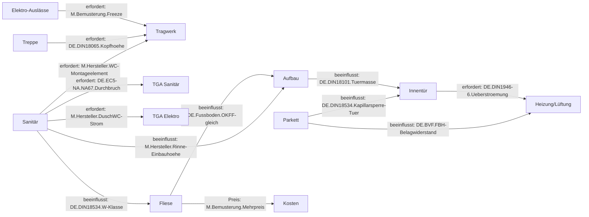

# 12 Bemusterung, Innenausbau und Interior-Katalog

Status: Entwurf v0.1 (27.09.2026). Zitate beziehen sich auf `literatur/lit-*.bib`. Befunde tragen [V] (an Primärquelle, Herstellerunterlage, Schema IFC4X3_ADD2 oder in einem Prototyp geprüft) oder [U] (unsicher, Sekundärquelle oder eigene Bewertung). Normtexte sind geschützt; Kennwerte stehen mit Normverweis, Tabellen werden nicht kopiert (Kapitel 4.9). Die Rechenwerte stammen aus B5, B14, B15 und B16 und sind Beispielwerte, keine Herstellerdaten.

## 12.0 Einordnung und Vorgehen

**Leitbild.** Das Zielbild beschreibt die App als ernsthafte, an die deutsche Bauwirtschaft angebundene Version des Baumodus von „Die Sims“. Sie ist ein Hausplaner, kein Lebenssimulator. Jede Fliese, jede Farbe und jedes Möbel ist ein realer, bestellbarer und normkonformer Artikel. Dieses Kapitel prüft, was dieses Leitbild fachlich verlangt, und übersetzt es in Katalog, Regeln und Datenformate.

**Warum die Bemusterung zentral ist.** Die Bemusterung ist ein Schwerpunkt der Kundenwünsche. Eine Längsschnittstudie bei einem deutschen Hausbauer über 16 Projekte und 35 Jahre fand eine stark steigende Zahl von Abweichungen von der Standardausstattung. Die Schwerpunkte lagen bei Sanitär, Innenausbau und Fassade [@schoenwitz2012nature]. Eine Fallstudie bei einem deutschen Fertighaushersteller mit 87 befragten Kunden zeigt eine Produktarchitektur in drei Ebenen: Produkt, Kategorie und Komponente. Auf Kategorie- und Komponentenebene reicht das Angebot von reiner Standardisierung bis zu freier Individualisierung, und es passt nicht immer zu dem, was die Kunden wollen [@schoenwitz2017product]. Die Taxonomie in Abschnitt 12.1 folgt diesen drei Ebenen.

**Warum die Bemusterung ein Fertigungs-Gate ist.** Beim Praxispartner führt der Projektleiter die „Beratung und Ausstattungsfestlegung“ im Bauherrenzentrum durch [@regnauerBLB2024] [V]. Dosenbohrungen und Zugdrähte, Sanitäranschlüsse, die Tragkonstruktion für das Hänge-WC, Unterputz-Spülkästen und Unterputz-Armaturen werden „bereits bei der Wandproduktion“ eingebaut. Der Baubeginn setzt die vollständige, unterschriebene Ausstattungsfestlegung voraus; die Montage folgt frühestens zwölf Wochen danach (AGB § 5 und § 6) [V]. Kapitel 11 hat daraus die Reifegrade und die Gate-Bedingung abgeleitet. Dieses Kapitel liefert die Inhalte.

**Vorgehen.** 12.1 entwickelt die Taxonomie mit Abhängigkeitsgraph, 12.2 den Innenausbau Gewerk für Gewerk, 12.3 die Möblierung. 12.4 bis 12.7 behandeln Festschreibung und Suche, Abhängigkeiten, Produktdaten mit IFC-Kopplung und Konfigurationslogik; 12.8 grenzt die App von Consumer-Planern und Fachsoftware ab.

**Maschinenlesbare Ergebnisse** stehen in `spezifikation/`:

- `bemusterung-katalog.schema.json` für Katalogartikel und festgeschriebene Auswahl,
- `bemusterung-abhaengigkeiten.yaml` mit 23 Kategorien, 34 Kanten und 24 Optionen,
- `regelkatalog-12.yaml` mit 32 Regeln,
- fünf validierte Beispieldateien in `beispiele/`.

**Entscheidungen** sind als E12.1 bis E12.11 nummeriert.

## 12.1 Taxonomie der Bemusterung

### 12.1.1 Kategorien, Auswahlpunkte, Freeze

Die Taxonomie verbindet die Bau- und Leistungsbeschreibung des Praxispartners (Recherche 10) mit der Fachlogik der Gewerke (Recherche 13). Jede Kategorie hat eine IFC-Abbildung, einen Leistungsbereich nach STLB-Bau, eine Reifegradgruppe (Kapitel 11) und einen **Freeze**, den spätesten technischen Festlegungszeitpunkt: „W“ vor Werkplanung und Wandfertigung, „A“ vor dem Ausbau.

**Tabelle 12.1: Bemusterungstaxonomie** (vollständig in `bemusterung-abhaengigkeiten.yaml#kategorien`)

| Bereich | Kategorie | Auswahlpunkte | IFC 4.3 | Freeze |
|---|---|---|---|---|
| außen | Fassade | Putz, Schalung; Holzart, Farbe, Profil | `IfcCovering` CLADDING | W |
| außen | Dachdeckung, Dacheinbauteile | Ziegel, Farbe, Spenglerarbeit; Dachfenster, Schneefang, PV | `IfcCovering` ROOFING, `IfcWindow` SKYLIGHT, `IfcSolarDevice` | W |
| außen | Fenster, Sonnenschutz, Haustür | Alu-Farbe (11 beim Praxispartner), Sprossen, Glas; Rollladen oder Raffstore; Modell, Zutritt | `IfcWindowType`, `IfcShadingDevice`, `IfcDoor` | W |
| außen | Balkon, Terrasse; Außenanlagen | Belag, Geländer, Schwelle; meist bauherrenseitig | `IfcSlab`, `IfcRailing`; `IfcGeographicElement` | W; − |
| innen | Treppe | Form, Holzart, Setzstufen, Geländer | `IfcStair`, `IfcStairFlight`, `IfcRailing` | W |
| innen | Innentür | Oberfläche, Glas, Zarge, Drücker, Anschlag | `IfcDoorType` | A (Maße W) |
| innen | Parkett; elastischer Boden | Holzart, Sortierung, Oberfläche, Muster, Sockel; Designboden, Teppich | `IfcCovering` FLOORING, SKIRTINGBOARD | A |
| innen | Fliese, Naturstein; Beton Ciré | Format, Farbe, Fuge, Muster, Höhen, Profile | `IfcCovering` FLOORING/CLADDING | A |
| innen | Wand und Decke | Spachtelqualität, Farbe, Putz, Tapete | `IfcCovering` CLADDING/CEILING | A |
| innen | Sanitär | Serie, WC, Waschtisch, Wanne, Dusche, Armaturen | `IfcSanitaryTerminalType` | W |
| innen | Elektro-Programm, Auslässe, Smart Home | Schalterprogramm; Lage und Anzahl; Umfang | `IfcSwitchingDevice`, `IfcOutlet`, `IfcJunctionBox` | W |
| innen | Heizung, Lüftung | Wärmepumpe, Heizkörper Bad, Lüftung | `IfcUnitaryEquipment`, `IfcAirTerminal` | W |
| innen | Küche; Möbel | Küchenstudio, Anschlüsse; freie Einrichtung | `IfcFurniture`, `IfcElectricAppliance` | A (Anschlüsse W); − |

**Befund 1: Die meisten Kategorien sind vor der Werkplanung festzulegen [V/U].** Von 23 Kategorien haben 13 den Freeze W, 8 den Freeze A und 2 (Außenanlagen, Möbel) keinen. Nur Böden, Fliesen, Naturstein, Beton Ciré, Wand und Decke, Innentüren (ohne ihre Maße) und die Küche (ohne ihre Anschlüsse) bleiben bis vor den Ausbau offen. Die Zuordnung ist aus Bau- und Leistungsbeschreibung und Herstellerquellen abgeleitet (Recherche 10); die tatsächlichen Termine liefert der Praxispartner (DAT-08, DAT-11-01).

**Befund 2: Die Standardausstattung ist teils ein Budget, kein Artikel [V].** Für Fliesen gelten 50 €/m² brutto Material bis 30 × 60 cm in Kreuzfuge, für Parkett 80 €/m² Preisempfehlung bei etwa 13,5 mm mit 3,5 mm Nutzschicht, schwimmend. Dazu kommen Mengenregeln, etwa Wandfliesen im Bad 120 cm hoch, an Wanne und Dusche 200 cm [@regnauerBLB2024]. Der Katalog kennt deshalb Standard*artikel* (Wand-WC, Treppe Buche keilgezinkt) und Standard*budgets* (Fliese, Parkett).

**E12.1 – Die Taxonomie ist Datensatz, nicht Oberfläche.** *Entscheidung.* Kategorien, Freeze, IFC-Abbildung, Leistungsbereich, Reifegradgruppe und Pflichtkategorien je Raumtyp stehen in `bemusterung-abhaengigkeiten.yaml`; das Katalogschema übernimmt die Kategorien als geschlossenes Vokabular. *Begründung.* Welche Komponenten frei, konfigurierbar oder fest sind, ist je Kategorie festzulegen [@schoenwitz2017product] und muss ohne Codeänderung pflegbar sein. *Beleg.* 23 Kategorien stimmen mit dem Schema-Enum überein [V].

### 12.1.2 Der Abhängigkeitsgraph

Eine Wahl ist selten lokal. Der Graph in `bemusterung-abhaengigkeiten.yaml#kanten` hat 34 gerichtete Kanten zwischen den Kategorien und zehn Fachdomänen: Tragwerk, Sanitär, Elektro, Heizung und Lüftung, Aufbau, Bauphysik, Kosten, Termine, Recht und Gestaltung sowie Darstellung. Jede Kante trägt eine Art (erfordert, beeinflusst, begrenzt, Preis, Termin) und eine Regel-ID.



Die Auswertung propagiert eine Änderung transitiv über die Kanten, per Breitensuche und jede Kante genau einmal. Die Menge der neu auszulösenden Regeln ist die Vereinigung der Regel-IDs aller erreichten Kanten. Zyklen sind im Gesamtgraphen möglich und fachlich echt. Ein Beispiel: Die Belagdicke bestimmt den Aufbau, der Aufbau die Türhöhe, und die Tür mit ihrer Überströmung wirkt auf die Lüftung. Im Teilgraphen der Kanten „erfordert“ ist ein Zyklus dagegen ein Modellierungsfehler, denn er würde zwei Optionen wechselseitig voraussetzen. Die Prüfung in `pruefe_kap11_12.py` bestätigt, dass dieser Teilgraph azyklisch ist [V].

**E12.2 – Abhängigkeiten sind gerichtete Kanten mit Regel-ID; die Regel entscheidet, die Kante löst nur aus.** *Entscheidung.* Eine Kante sagt, *welche* Regel nach einer Änderung neu auszuwerten ist, nicht *wie* sie ausgeht. *Begründung.* So bleibt die Logik an einer Stelle, dem Regelkatalog mit Quelle, Fassung und Status. Der Graph dient der gezielten Neuberechnung (ANF-09-19) und der Folgenliste eines Nachtrags (12.7.4). *Beleg.* Alle 42 in Graph, Optionen und Beispielen referenzierten Regel-IDs sind in `regelkatalog.yaml`, `regelkatalog-11.yaml` oder `regelkatalog-12.yaml` definiert [V].

## 12.2 Innenausbau im Detail

### 12.2.1 Fliesen: Format, Rutschhemmung, Muster, Fuge, Abdichtung

**Produktnorm und Toleranzen [V].** DIN EN 14411 gliedert keramische Fliesen nach Formgebung und Wasseraufnahme. Die Spanne reicht von Feinsteinzeug BIa (≤ 0,5 %) bis Steingut BIII (> 10 %, nur Wand). Für Maß, Rechtwinkligkeit und Kantengeradheit gelten ± 0,5 %, höchstens ± 2,0 mm. Rektifizierte Kanten sind nach dem Brand geschliffen und dadurch maßhaltiger; die Wölbung bleibt jedoch (Recherche 13).

**Großformat.** Der Zentralverband des Deutschen Baugewerbes (ZDB) zählt Fliesen ab 0,25 m² Fläche als Großformat. Sein Merkblatt gilt für Kantenlängen von 60 bis 120 cm, bei Riegelformaten bis 150 cm. Es nennt eine Mindestdicke von 7,5 mm am Boden und 3,5 mm an der Wand und eine Mindestfuge von 3 mm. Über 120 cm gilt die Platte als Sonderkonstruktion mit schriftlicher Vereinbarung [V/U]. Seit 02/2026 gibt es ein neues Merkblatt „Groß- und Megaformate“, dessen Inhalt nicht eingesehen wurde [U]. Die Regel `DE.ZDB.Grossformat` trägt deshalb den Status U.

**Versatz [V/U].** Hersteller empfehlen für Rechteckformate den Viertelverband und höchstens den Drittelverband. Vom Halbverband raten sie ab, weil sich Hoch- und Tiefpunkte der Wölbung treffen und Überzähne entstehen. Einen festen Grenzwert im ZDB-Merkblatt hat Recherche 13 nicht belegt. Die Regel `M.Hersteller.Fliese-Versatz` ist deshalb eine Herstellerregel der Schicht S5 und keine Norm.

**Rutschhemmung [V].** Die Prüfverfahren der früheren DIN 51130 (Schuh, R9–R13) und DIN 51097 (barfuß, A–C) stehen heute in DIN EN 16165:2023. Die Bewertungsklassen stammen aus dem Arbeitsschutz (ASR A1.5, DGUV-Information 207-006). Im Einfamilienhaus sind sie Empfehlung, nicht Pflicht. Verbindlich wird die Barfußklasse B erst mit dem Profilschalter „barrierefrei“ für Duschplätze nach DIN 18040-2. Standard-IFC hilft hier nicht: `Pset_CoveringFlooring.HasNonSkidSurface` ist nur boolesch (Kapitel 8.5.3). Die Klasse steht in `HRB_Belag.Rutschhemmung` und `HRB_Belag.Barfuss`.

**Fuge [V].** Nach ATV DIN 18352:2019-09 ist eine Fugenbreite von 2 bis 8 mm technisch notwendig, je nach Format und Toleranz auch mehr. Regelfall ist eine graue, hydraulisch abbindende Fugenmasse. Eine andere Farbe oder ein Reaktionsharz ist nur geschuldet, wenn das Leistungsverzeichnis es beschreibt (Recherche 13). Für die App heißt das: Die Fugenfarbe ist kein Anzeigeattribut, sondern eine vertragliche Leistung. Sie gehört in die Festschreibung (12.4).

**Abdichtung [V].** DIN 18534 gilt seit 10/2025 in neuer Ausgabe mit vier Wassereinwirkungsklassen:

| Klasse | Fläche |
|---|---|
| W0-I gering | Wand außerhalb der Dusche, Boden ohne Ablauf |
| W1-I mäßig | Wand an Wanne und Dusche, Boden mit Ablauf |
| W2-I hoch | Boden der bodengleichen Dusche; ohne wirksame Abtrennung der ganze Badboden |
| W3-I sehr hoch | gewerbliche Nutzung |

Ab W2-I sind nur feuchteunempfindliche Untergründe zulässig. In W2-I sind Spezialgipsplatten mit Herstellernachweis erlaubt, in W3-I nur zementgebundene. Neu sind außerdem ein Schnittschutz unter Silikonfugen und Kapillarsperren an Türen. Holz und Holzwerkstoffe sind als Untergrund für flüssige und bahnenförmige Verbundabdichtung ungeeignet (Recherche 16). Im Holzrahmenbau bestimmt die Wassereinwirkungsklasse damit die **Beplankung** der Wandtafel. Diese Folge entsteht im Werk, nicht beim Fliesenleger (DAT-12-04).

**Ebenheit [V].** Großformat, Beton Ciré und Klebevinyl verlangen erhöhte Ebenheit nach DIN 18202, Tabelle 3, Zeile 4 (Stichmaß 3 mm auf 1 m statt 4 mm). Sie ist gesondert zu vereinbaren und damit ein Mehrpreis (Regel `DE.DIN18202.Ebenheit-Belag`).

**Varianten-Taxonomie der Fliese.** Die Auswahl entfaltet sich in dieser Reihenfolge (Recherche 13):

1. Material
2. Format (Nennmaß, Dicke)
3. Kante
4. Oberfläche (mit R-Klasse und Barfußklasse)
5. Dekor und Farbe
6. Verlegung: Muster, Versatz, Richtung, Achsbezug, Fugenbreite, Fugenmörtel und -farbe, Silikonfarbe
7. Formteile
8. Aufbau (Kleber, Entkopplung, Abdichtung, W-Klasse)

Die ersten fünf Stufen bestimmen den *Artikel* (eine GTIN), die letzten drei die *Leistung*. Diese Trennung trägt die Festschreibung (12.4.1).

**IFC-Lücke [V].** IFC 4.3 hat weder Attribut noch Pset für Verlegemuster, Fugenfarbe, Versatz, Achsbezug und Stufenverziehung (Recherche 13). Die Arbeit schließt die Lücke mit `HRB_Verlegung` und `HRB_Belag` (Kapitel 11, `hrb_psets`).

### 12.2.2 Fliesen und Parkett als 3D-Einzelobjekte

Das Zielbild verlangt, jede Fliese als 3D-Objekt zu führen und den Verschnitt real zu berechnen, auch bei Chevron oder Fischgrät in polygonalen Räumen mit mehrfachem Gefälle. B16 zeigt, dass das geht.

**Keine Normzahl für Gefälle und Verschnitt [V/U].** DIN 18534 verlangt nur „ausreichendes Gefälle“; die üblichen 1–2 % stammen von Herstellern. Ratgeber, die „1,5–2 % nach DIN 18534“ nennen, irren (Recherche 17). ATV DIN 18352 rechnet nach hergestellter Fläche ab; der Verschnitt steckt im Einheitspreis, Zuschläge von 5 bis 20 % je Muster sind Ratgeberwerte.

**Algorithmus.** B16 behandelt jedes Muster als periodische Kachelung aus Motiv und zwei Gittervektoren. Es zerlegt den Raum in Gefällefacetten, schneidet die Stücke an Knicklinien, Ablauf und Wand, klassifiziert jede Schnittkante und verwertet Reststücke gierig. Zulässig sind nur Drehungen, die den Rohling auf sich abbilden; Fabrikkanten bleiben Fabrikkanten. Der Rasterursprung wird in 6 × 6 Lagen nach einem Zielwert aus Material, Schnittzeit und Kleinstücken gewählt. Keine der sieben in Recherche 17 ausgewerteten Arbeiten zur Layoutoptimierung behandelt mehrfaches Gefälle, eine Fabrikkantenregel oder IFC-Einzelstücke mit Herkunft [U, Stand der Suche].

> **Beispiel 12.1 (Fischgrät im achteckigen Duschraum).** Achteck mit Innenkreis 2,40 m, 4,77 m², Punktablauf mit 8 Kehlen, Gefälle 1,5 %, Fuge 3 mm; Stäbchen 60 × 10 cm zu 4,50 €, 24 je Paket (Beispielwerte). Beste Lage u = 0,833, v = 0 (`ausgabe/b16_ergebnis.json`):
>
> | Größe | Wert |
> |---|---|
> | Stücke / ganz / aus Reststück | 168 / 7 / 83 |
> | Rohlinge naiv → je Position → nach Verwertung | 168 → 96 → 85 |
> | Verschnitt je Position → nach Verwertung | 21,2 % → 11,0 % |
> | Schnitte gerade / schräg / Grat / Ablauf; Länge; Zeit | 24 / 32 / 147 / 15; 27,0 m; 515,5 min |
> | Kleinstücke unter ⅓ / unter 20 mm / verfugt | 67 / 2 / 3 |
>
> Im selben Raum ergeben gerade Verlegung im Drittelverband 5,5 %, Chevron aus Rechteckstäben 23,2 % und Chevron aus Formteilen 8,8 %. Mit zwei Rinnen statt Punktablauf sinkt die Schnittlänge beim Fischgrät auf 13,0 m (Recherche 17). Die Festschreibung `bemusterung-auswahl-fliese-fischgraet.json` bestellt 96 Stück (85 Rohlinge plus 5 % Reserve, 4 Pakete); der Mehrpreis beträgt 616,58 € (12.7.2).

**Befund 3: Die Drittelregel für Randstücke ist bei Stäbchen auf Gefälle nicht erfüllbar [V, Beispielwerte].** In allen zehn B16-Fällen bleiben auch in der besten Lage 8 bis 78 Stücke unter einem Drittel der Sollfläche. Eine Breitenregel (Inkreis ≥ 20 mm) ist mit 0 bis 7 Verstößen fast immer erreichbar. Die Regel `M.Firma.Mindestschnitt` ist deshalb eine Firmenregel mit Beispielwert (Status U).

**Befund 4: Parkett ist nicht Keramik [U].** Bei Nut und Feder vertauscht eine Drehung um 180° Nut und Feder; zulässig ist nur die Identität, L- und R-Stäbe sind zwei Artikel. Dasselbe gilt für richtungsgebundenes Dekor. Der Katalog führt deshalb das Merkmal `drehbar_180`.

**Abrechnung [V/U].** Nach ATV DIN 18352 werden Aussparungen bis 0,1 m² übermessen; der Rost des Punktablaufs (0,0225 m²) zählt zur Fläche. Schrägschnitte sind Längenpositionen (0.5.2), die Schnittlänge je Art aus B16 ist damit direkt eine LV-Menge.

**E12.3 – Material wird nach Stück aus dem Verlegeplan bestellt, Leistung nach VOB-Fläche plus Schnittlängen abgerechnet.** *Entscheidung.* Bestellmenge = Rohlinge nach Reststückverwertung plus Bruch und Reserve (Vorgabe 5 %), auf Pakete gerundet. Pauschale Verschnittzuschläge dienen nur noch als Plausibilitätsgrenze. *Begründung.* Ohne Verwertung lägen alle B16-Fälle bei 19 bis 39 %; Pauschalen von 10 bis 20 % sind dafür zu niedrig, der Greedy-Wert ist optimistisch (Recherche 17). *Beleg.* B16 [V]; ANF-03-22.

### 12.2.3 Parkett, Böden und Fußbodenaufbau mit Höhenausgleich

**Parkett [V].** Massivparkett folgt DIN EN 13226:2025-02, Mehrschichtparkett DIN EN 13489:2023-09 mit mindestens 2,5 mm Nutzschicht und den Erscheinungsklassen ○, △, □; Herstellersortierungen sind zulässig (Recherche 13). Die Varianten sind Konstruktion, Holzart, Sortierung, Oberfläche, Kante, Verlegemuster und Verlegeart.

**Fußbodenheizung [V].** Der Wärmedurchlasswiderstand des Belags samt Unterlage soll 0,15 m²K/W nicht überschreiten; ausgelegt wird mit 0,10 m²K/W. Schwimmendes Parkett auf Fußbodenheizung gilt nach Branchenmerkblättern als nur bedingt geeignet (Recherche 10, 13). Der Standard des Praxispartners („schwimmend“) steht damit im Konflikt zur Branchenempfehlung; `DE.BVF.FBH-Belagwiderstand` meldet das als weiche Regel (DAT-12-05).

**Gleiche Fertigfußbodenhöhe.** Das Zielbild verlangt eine gleiche Oberkante Fertigfußboden (OKFF) bei Parkett, Feinsteinzeug, Naturstein, Beton Ciré und Vinyl ohne Kanten an Übergängen. B14 löst das exakt (Kapitel 9.4.6, `DE.Fussboden.OKFF-gleich`). Die Bemusterung ist der Auslöser: Jede Belagwahl ändert Dicke und Verlegewerkstoff und damit die Estrich- oder Ausgleichsdicke.

> **Beispiel 12.2 (Belagwahl und Fußbodenaufbau, B14 Variante A).** EG auf Bodenplatte, Ziel-Aufbauhöhe 210 mm, Heizestrich Bauart A mit 17-mm-Rohr (`ausgabe/b14_bericht.txt`):
>
> | Raum | Belag | Estrich | OKFF | R_λ,B [m²K/W] | Masse [kg/m²] |
> |---|---|---|---|---|---|
> | Wohnen | Mehrschichtparkett 14 mm, verklebt | CAF-F4 67 mm | 210 ± 0,6 | 0,1127 | 152 |
> | Küche | Feinsteinzeug 10 mm, Dünnbett | CAF-F4 68 mm | 210 ± 1,0 | 0,0127 | 173 |
> | Bad | Naturstein 20 mm, Mittelbett, AIV | **CT-F4 90 mm** | 210 ± 0,5 | 0,0187 | 263 |
> | Flur | Mikrozement 3 mm | CAF-F4 57 mm + Schüttung 46 mm | 210 ± 0,8 | 0,0043 | 145 |
>
> Die bodengleiche Dusche verlangt im Bad feuchteunempfindlichen Estrich (CT statt CAF), 20 mm Gefälle und 8 mm Toleranz. Ohne Absenkung der Rohdecke um 30 mm meldet B14: „Mindestens erreichbar: 240 mm (fehlen 30 mm)“. Die Übergänge haben ΔOKFF = 0,0 mm, Kanten im ungünstigsten Fall 1,3 bis 1,6 mm. Ein Teppich auf Fußbodenheizung ergäbe R_λ,B = 0,233 m²K/W > 0,15.

Auf der Holzbalkendecke (B14 Variante B, 160 mm Trockenaufbau, ≤ 180 kg/m²) brauchen Feinsteinzeug und Mikrozement auf Gipsfaser-Trockenestrich eine Herstellerfreigabe, und die Rinne muss in die Balkenlage (B15). Naturstein auf der Holzbalkendecke ist deshalb freigabepflichtig (`M.Hersteller.Naturstein-Holzdecke`, Status U, DAT-03).

**Übergänge [V/U].** Übergangsprofile stehen als `IfcCovering` USERDEFINED „Uebergangsprofil“ im Modell (E8.15). An Badtüren verlangt DIN 18534-1:2025-10, Abschnitt 8.5.5, den kapillaren Feuchtetransport im Belagaufbau zu berücksichtigen [V]; `DE.DIN18534.Kapillarsperre-Tuer` löst das an jeder Tür zwischen einem Raum ab W1-I und einem feuchteempfindlichen Belag aus.

**E12.4 – Jede Belagwahl startet den Fußbodensolver; das Ergebnis ist Teil der Auswahl.** *Entscheidung.* Eine Belagauswahl ab R enthält den berechneten Aufbau (Estrich, OKFF mit Toleranz, R_λ,B, Belegreife, Flächenmasse, Schichten). Ist kein Aufbau zulässig, wird sie nicht gespeichert; die Meldung nennt die fehlende Höhe und die Alternativen. *Begründung.* Belag, Estrich und Türhöhe hängen zusammen; eine Belagwahl ohne Aufbau wäre die „unendlich dünne“ Oberfläche eines Consumer-Planers (12.8). *Beleg.* B14 [V]; `bemusterung-auswahl-parkett.json`.

### 12.2.4 Wände, Putze und Farben einschließlich Keller

**Spachtelqualität [V].** Das Merkblatt 2 der Industriegruppe Gipsplatten unterscheidet vier Qualitätsstufen:

| Stufe | Inhalt und Einsatz |
|---|---|
| Q1 | Grundverspachtelung; unter Fliesen nur Fugen füllen |
| Q2 | Standard: Raufaser mittel oder grob, matte Anstriche; gilt ohne Angabe im LV |
| Q3 | matte, fein strukturierte Beschichtungen, Oberputz ≤ 1 mm |
| Q4 | Vollflächenspachtelung > 1 mm für Glanz, Lack, Stuccolustro; Lichtverhältnisse ins LV |

Q3 und Q4 sind Besondere Leistungen nach DIN 18340 und verlangen erhöhte Ebenheit nach DIN 18202, Zeile 7 (Recherche 13). Die Kette lautet also: Glanzgrad → Spachtelqualität → Ebenheit → Preis. Streiflicht von Fenstern und Leuchten verschärft sie zusätzlich. Sie steht in der Regel `DE.GipsMB2.Q-Stufe`.

**Wandfarbe [V/U].** DIN EN 13300 ist 2023 neu erschienen. Der Glanz reicht von G1 glänzend bis G4 stumpfmatt. Nassabrieb und Deckvermögen sind in neue Klassen gefasst (R-Klassen, H10-Klassen). Die alten Grenzwerte dürfen nicht ungeprüft übernommen werden (Recherche 13). Die App speichert deshalb die Klasse, wie der Hersteller sie angibt, und rechnet nicht mit alten Grenzwerten.

**Farbsysteme und Farbmetrik [V/U].** RAL umfasst über 2.500 Töne, digital in RGB und CIELAB. Die Download-Bibliotheken sind laut RAL „nicht für farbmetrische Zwecke“ bestimmt und je Nutzer lizenziert. RAL-Codes in Online-Konfiguratoren sind lizenzpflichtig [V]. Für NCS und die Farbfächer der Hersteller gelten eigene Lizenzen [U]. Das Schema speichert die Farbe deshalb:

- als CIELAB-Wert mit Lichtart und Beobachter (D65/10° oder D50/2°),
- daraus abgeleitet als linear-sRGB für das PBR-Material,
- mit einem Merkmal `lizenz_farbsystem`, ohne das kein RAL- oder NCS-Code exportiert wird.

Verbindlich bleibt das physische Muster. Das steht als Hinweis in jeder Festschreibung (`M.Bemusterung.Farbverbindlichkeit`).

**Innenputz und Keller [U].** Innenputze werden nach DIN EN 13914-2 geplant (Gips, Kalk, Kalkzement, Lehm). Im feuchten massiven Keller gilt als Praxisregel ein mineralischer, diffusionsoffener Putz statt dichter Dispersion (Recherche 13). Wegen der unsicheren Quelle ist das nur ein Hinweis (ANF-12-16).

**Einbauleuchten [U].** Beim Praxispartner besteht die Decke aus 25 mm Gipsplatte auf 30 mm Abstandsschalung mit Schwingungselementen. Unter dem Dach liegt die Dampfbremse direkt dahinter [@regnauerBLB2024]. Einbauleuchten berühren damit Einbautiefe, Schallschutz und Brandschutzbekleidung. Die Regel `M.Firma.Einbauleuchte-Decke` ist freigabepflichtig, bis der Praxispartner die Zulässigkeit klärt (DAT-12-09).

### 12.2.5 Treppen: Formen, Verziehung, Holzarten, Geländer

**Hauptmaße [V].** Für Wohngebäude mit höchstens zwei Wohnungen gelten nach DIN 18065:2020-08:

- Laufbreite ≥ 80 cm,
- Steigung 14–20 cm,
- Auftritt 23–37 cm,
- Schrittmaß 2s + a = 59–65 cm [@din18065].

Die Norm ist in diesem Bereich bauaufsichtlich nicht eingeführt, aber werkvertraglich als anerkannte Regel der Technik geschuldet (Kapitel 4.4). Die lichte Treppendurchgangshöhe beträgt mindestens 200 cm (Abschnitt 6.5).

**Verziehung [V].** Gewendelte Läufe müssen an der inneren Begrenzung einen Mindestauftritt haben: allgemein 100 mm, bei höchstens zwei Wohnungen 50 mm, bei deren Spindeltreppen 0 mm. Die Norm lässt die anerkannten handwerklichen Verziehungsregeln zu, insbesondere die Verhältnis-, Winkel- oder Kreisbogenmethode. Die Methoden dürfen innerhalb eines Laufs nicht gemischt werden. Eine „Abwicklungsmethode“ ist kein Normbegriff (Recherche 13). Die Regel `DE.DIN18065.Verziehung` prüft die Einheit der Methode und den Mindestauftritt. Ein Solver für die Verziehung fehlt noch; B5 rechnet nur gerade Läufe.

**Geländer [V].** BayBO Art. 36 verlangt eine Umwehrung ab 0,50 m Absturzhöhe sowie an freien Seiten von Treppenläufen und Treppenaugen, „ausreichend hoch und fest“, aber **ohne Zahlenwert**. Die Regel gegen Über- und Durchklettern durch Kleinkinder gilt innerhalb von Wohngebäuden der Gebäudeklassen 1 und 2 und innerhalb von Wohnungen nicht [@baybo2026] [V, Recherche 13]. DIN 18065 stellt an Geländer bei höchstens zwei Wohnungen keine Anforderung an die 12-cm-Öffnung. Ein Stababstand von 12 cm im Einfamilienhaus ist also eine Firmen- oder Haftungsentscheidung.

Die Regel `M.Firma.Gelaender-Stababstand` führt diesen Wert deshalb in Schicht S5. Die Meldung nennt als Quelle „Firmenregel“, nicht „BayBO“. Das ist mehr als Formalie: Eine Meldung, die dem Kunden eine gesetzliche Pflicht vortäuscht, wäre eine falsche Begründung im Sinne von Kapitel 9.5.

**IFC [V].** `IfcStairTypeEnum` kennt 15 Formen. `IfcStair` aggregiert Läufe (`IfcStairFlight` STRAIGHT, WINDER, SPIRAL …), Podeste und Geländer. Die Zahlenattribute von `IfcStairFlight` sind seit IFC4 deprecated. Die Werte stehen in `Pset_StairFlightCommon` (ANF-08-06), die Verziehung in `HRB_Verziehung`.

Die Treppe aus B5 ist in Kapitel 11 als Beispiel 11.1 durchgerechnet. Ihre Auswahl liegt in `bemusterung-auswahl-treppe.json` im Reifegrad R. Die Kopfhöhe ist dort `unbestimmt`, weil die Deckenöffnung noch nicht festliegt. Die Treppe ist damit das Musterbeispiel für ein W-Gewerk: Ihre Form bestimmt den Wechsel in der Holzbalkendecke, und der Wechsel ist ein Abbundteil in der BTLx.

### 12.2.6 Innentüren und Beschläge

**Maße [V].** DIN 18101:2014-08 legt die Baurichtmaße fest: Breiten von 625 bis 1.125 mm (1.250 mm), Höhen von 2.000 bis 2.250 mm. Für 875 × 2.000 mm ergeben sich:

- Zargenfalz 841 × 1.983 mm,
- lichter Durchgang 811 × 1.968 mm,
- Türblatt gefälzt 860 × 1.985 mm, stumpf 834 × 1.972 mm.

Außen-, Brandschutz-, Rauchschutz- und einbruchhemmende Türen fallen nicht unter die Norm (Recherche 13). Die Türhöhe hängt an der OKFF (12.2.3). Der Zargenspiegel hängt an der Wanddicke des Holzrahmenbaus, die Lage des Lichtschalters am Anschlag.

**Anschlag: eine Falle im Standard [V].** DIN 107 bestimmt den Anschlag mit Blick auf die Öffnungsfläche. Die Mapping-Tabelle der IfcDoor-Dokumentation ordnet `SINGLE_SWING_LEFT` der Tür **DIN-rechts** zu und `SINGLE_SWING_RIGHT` der Tür DIN-links. Ein Namensabgleich ohne Übersetzung führt zu falsch bestellten Zargen und Bändern (Recherche 13).

**E12.5 – Anschläge werden in DIN-Bezeichnung erfasst, bestellt und angezeigt und nur für IFC übersetzt.** *Entscheidung.* Die Auswahl speichert DIN-L oder DIN-R. Der Generator setzt `OperationType` über die Tabelle der Regel `DE.DIN107.IFC-Anschlag`. Eine Umkehr des Anschlags erfolgt nur über das ObjectPlacement. *Begründung.* Bestellungen und Werkzeichnungen im deutschen Markt sprechen DIN, das IFC-Schema spricht die Gegenrichtung. *Beleg.* Recherche 13 [V].

**Überströmung [V/U].** In einer Wohnung mit Lüftung und Wärmerückgewinnung muss Luft unter oder durch die Tür strömen. Möglich sind ein Türunterschnitt, eine Überströmdichtung oder ein Gitter; für das Bad nennt ein Herstellerblatt 75–100 cm². Die Bodenluft ist wieder eine Folge der OKFF (Regel `DE.DIN1946-6.Ueberstroemung`) [@din1946-6].

Die Taxonomie der Tür umfasst Blatt, Kante, Höhe, Glas, Zarge, Bänder, Schloss, Drücker, Anschlag, Öffnungsart und Bodenluft (Recherche 13). Die Schiebetür in der Wand ist im Holzrahmenbau ein W-Gewerk, weil der Kasten in die Wandtafel kommt [U].

### 12.2.7 Sanitärobjekte mit Bewegungsflächen

**Bewegungsflächen [V].** VDI 6000 Blatt 1 und Blatt 2 (2024-07) ersetzen Blatt 1 von 2008. Die Maße sind Fertigmaße, die Objekte werden mit ihren Außenmaßen geführt. Vor dem WC sind 80 × 75 cm frei zu halten, vor der Dusche 90 × 75 cm. Bei Einzelnutzung dürfen sich Bewegungs- und Verkehrsflächen überlagern, aber nicht verkleinern (Regel `DE.VDI6000.Bewegungsflaeche`). Mit dem Schalter „barrierefrei“ gelten nach DIN 18040-2 1,20 × 1,20 m vor WC, Waschtisch und in der Dusche. Die Dusche ist dann niveaugleich mit einer Absenkung von höchstens 2 cm, der Belag hat mindestens die Barfußklasse B (Recherche 13).

**Montageelement in der Holzständerwand [V].** Ein Vorwandsystem-Hersteller gibt für Wand-WCs in der Holzständerwand an:

- Ständer ≥ 60 × 80 mm,
- Beplankung beidseitig ≥ 18 mm,
- lichter Ständerabstand 50 cm, sonst Querriegel,
- vier Befestigungspunkte.

Die Prüflast für Wand-WCs von 400 kg nach DIN EN 997 ist nicht eingesehen [U] (Recherche 10).

**Weitere Folgen.**

- **Dusch-WC:** Es braucht Strom und Leerrohr am Montageelement, also eine Dosenbohrung in der Wandtafel (Freeze W) [V].
- **Badewanne:** Eine gefüllte Wanne 170/75 bringt nach einer Beispielrechnung etwa 2,3 kN/m² auf. Das liegt örtlich über der Wohn-Nutzlast von 1,5 kN/m² und ist ein Fall für die Tragwerksplanung (Regel `DE.EC1-NA.Nutzlast-Badewanne`, freigabepflichtig) [U].

> **Beispiel 12.3 (Wand-WC in der Installationswand, B15).** Die Schmutzwasser-Fallleitung SW-01 (DN 100, da 110 mm, Öffnung Ø 150 mm) liegt bei x = 3.150 mm. Die Installationswand IW-OG-02 hat Ständer 60 × 160 mm im Raster 625 mm und beidseitig 15 mm Gipsfaser (`beispiele/daten/b15_durchdringungen.json`). B15 meldet:
>
> - **Decke:** Balken 5 (x = 3.125) trifft die Leitung. Er wird zwischen y = 1.905 und 2.295 mm unterbrochen, zwei Wechsel 100/240 werden eingesetzt.
> - **Wand:** Ständer 5 trifft die Öffnung. Die Bohrung von 150 mm überschreitet 25 % der Ständertiefe (Firmenregel, Platzhalter). Der Ständer wird ausgewechselt oder die Leitung in die Vorwand gelegt.
> - **Verschub:** Die nächste in Decke und Wand freie Achse läge bei x = 3.270 mm, also 120 mm entfernt, mehr als die zulässigen 100 mm.
>
> Die Auswahl „Wand-WC“ in dieser Wand löst zusätzlich die Regel `M.Hersteller.WC-Montageelement` aus. Deren Prüfung deckt zwei weitere Konflikte auf, die in B15 nicht sichtbar waren:
>
> - Die Beplankung von 15 mm unterschreitet die geforderten 18 mm.
> - Der lichte Ständerabstand beträgt 625 − 60 = 565 mm statt 500 mm.
>
> Die Festschreibung `bemusterung-auswahl-wand-wc.json` enthält deshalb als Kompensation eine 18-mm-Platte im Elementbereich und einen Querriegel. Erst mit diesen Maßnahmen ist die Regel `erfuellt`. Der Freeze ist W; die Auswahl ist am 20.07.2026 festgeschrieben (Inhaltshash `sha256:b7a332aa…`).

Das Beispiel ist der Kern des Zielbilds: Eine Wahl des Kunden erzeugt vier Maßnahmen in zwei vorgefertigten Elementen, die vor der Wandfertigung feststehen müssen. Heute sammelt sie ein Mensch aus mehreren Unterlagen; die App leitet sie aus dem Graphen ab (12.5).

**IFC [V].** `IfcSanitaryTerminalTypeEnum` kennt die üblichen Objekte (BATH, SHOWER, TOILETPAN, WASHHANDBASIN, CISTERN …). Es gibt typspezifische Psets, etwa `Pset_SanitaryTerminalTypeToiletPan.PanMounting`. Bodenablauf und Rinne sind `IfcWasteTerminal` FLOORTRAP. Anschlüsse sind `IfcDistributionPort` über `IfcRelNests`. Bewegungsflächen haben kein Standardobjekt; sie stehen als Merkmal in `HRB_Sanitaer` und als Rechteck in der Regelmaschine.

### 12.2.8 Küche

**Maße und Abstände [V].** DIN EN 1116:2018-03 regelt die Koordinationsmaße. Mit Kochfeld oder Spüle beträgt die Plattentiefe mindestens 600 mm. Die Arbeitsgemeinschaft Die Moderne Küche (AMK) nennt Abstände:

- Kochfeld zum seitlichen Hochschrank ≥ 300 mm,
- Spüle zu Kochfeld ≥ 300 mm (Empfehlung), ergonomisch ≥ 900 mm.

Vor der Zeile sind mindestens 120 cm Bewegungsfläche frei zu halten. Einzeilige Küchen brauchen eine Raumtiefe ab 180 cm, zweizeilige ab 240 cm (Recherche 13).

**Schnittstelle [V].** Die Küche ist beim Praxispartner nicht Teil der Leistung. Enthalten sind die Anschlüsse für Spüle, Geschirrspüler und Herd sowie zwei bis drei Lichtauslässe [@regnauerBLB2024]. Die Anschlüsse sind ein W-Gewerk, die Möbel ein A-Gewerk. Für die Anschlussplanung genügt ein Plan des Küchenstudios, für die Darstellung und die Kollisionsprüfung braucht es 3D-Daten (12.3). In der Kochinsel liegen Wasser, Abwasser und Strom im Fußbodenaufbau. B14 zeigt den Konflikt: Im 160-mm-Trockenaufbau auf der Holzbalkendecke ist für eine Abwasserleitung kein Aufbau zulässig.

Eine Fallstudie bei einem schwedischen Fertighaushersteller fand, dass der wertorientierte Einkauf individueller Küchen bei einem lokalen Zulieferer vorteilhafter ist als der Einkauf nach dem niedrigsten Preis [@bildsten2011kitchen]. Das stützt die Entscheidung, die Küche als externe Lieferung mit Datenschnittstelle zu führen statt als eigenen Katalog.

## 12.3 Möblierung in 3D

**Datenstandards [V].** Das IDM des Daten Competence Center (DCC) vereint kaufmännische, funktionale und grafische Information; IDM Küche/Bad 3.1.0 gilt seit 01.08.2025, daneben IDM Living 4.1.0. Schema und Dokumentation sind frei, die Katalogdaten laufen über Cat@web und brauchen einen Vertrag. OFML 2.0 (Büromöbel) liegt in den Rechten bei EasternGraphics, die Daten laufen über pCon. Beide haben einen Regelteil (IDM: DECISIONS, OPTION_COMBINATION, ACTIONS; OFML: OCD). Kein geprüfter Consumer-Planer exportiert IFC (Recherche 10, 13).

**IFC [V].** `IfcFurnitureTypeEnum` kennt BED, CHAIR, DESK, FILECABINET, SHELF, SOFA, TABLE und TECHNICALCABINET; Schrank, Kommode und Küchenschrank laufen über USERDEFINED. `Pset_FurnitureTypeCommon` trägt Nennmaße, Farbe und `IsBuiltIn`, die Geometrie gehört als `IfcRepresentationMap` an den Typ.

**Stellflächen [V].** DIN 18011 (1967) ist zurückgezogen; ihre Werte, etwa 70 cm Bewegungsfläche vor Stellflächen, taugen nur als Heuristik und dürfen nicht als Norm zitiert werden (Recherche 13).

**Stand der Forschung.** Einrichtungsrichtlinien lassen sich als Terme einer Dichtefunktion formulieren; Laien möblierten damit in einer Nutzerstudie besser [@merrell2011interactive]. Andere Arbeiten optimieren Kostenterme für Sichtbarkeit und Zugänglichkeit [@yu2011make]. Eine Regelsprache für Innenräume prüft und erzeugt zugleich gültige Küchenlayouts nach den Regeln eines Industriepartners [@sydora2020rulebased]. Ein Möbelkritiker passt die Rückmeldung dem Wissensstand an [@oh2010furniture]. Ein neuro-symbolischer Ansatz erreicht beim Vervollständigen von BIM-Innenräumen 86,7 % Präzision gegenüber 20 Experten in 10 Szenen [@feng2026bridging]. Übernommen werden die Kostenterme als R5-Regeln (Kapitel 9b) und das Prinzip „eine Regelbasis, zwei Verwendungen“, nicht die stochastischen Verfahren, weil das Ergebnis deterministisch sein muss (Kapitel 7).

**E12.6 – Möbel und Küche kommen über IDM mit Vertrag oder als generische Stellflächen; Möblierungsregeln sind R5, Bewegungsflächen R1.** *Entscheidung.* Ohne Datenvertrag bietet die App parametrische Möbel mit Stell- und Bewegungsfläche an; mit Vertrag importiert sie IDM-Kataloge und übernimmt deren Regeln als Kompatibilitätsregeln. *Begründung.* Die Schemata sind frei, die Daten nicht; DIN 18011 ist keine Norm mehr (Recherche 13). *Beleg.* [@sydora2020rulebased; @merrell2011interactive].

## 12.4 Festschreibung und Suchbarkeit

### 12.4.1 Was eine Auswahl festlegt

Eine GTIN identifiziert einen Artikel, meist mit Farbe, Oberfläche und Format. Sie identifiziert aber nicht die Leistung. Muster, Versatz, Fugenbreite, Fugenmörtel und -farbe, Silikon, Achsbezug, Abdichtungsklasse und Ebenheitszeile sind Einbaudaten. Zwei Bäder mit derselben Fliese und verschiedenem Muster sind verschiedene Leistungen (Recherche 13). Das Schema `bemusterung-katalog.schema.json` trennt deshalb drei Teile einer Auswahl:

| Teil | Inhalt | Beispiel Fliese | Beispiel Wand-WC |
|---|---|---|---|
| **Artikel** (was bestellt wird) | Artikel-ID, Variante, Hersteller, Artikelnummer, GTIN, Farbe, Oberfläche, Format, Dicke, weitere Artikel | K-FLI-0001/V01, 600 × 100 × 9 mm, sand, matt, R10/B | K-SAN-0001, Montageelement, Betätigungsplatte |
| **Leistung** (wie eingebaut wird) | Verlegung (Muster, Versatz, Winkel, Rasterursprung, Achsbezug, Fuge, Silikon, Gefälle, Schnittregeln, Übergänge), Aufbau, Treppe, Einbau, Oberfläche, STLB-LB | Fischgrät 45°, u/v = 0,833/0, Fuge 3 mm zementgrau, W2-I | Montagehöhe 420 mm, Achse, Bewegungsfläche, Anschlüsse, Tragkonstruktion |
| **Kontext** (wo) | Projekt, Geschoss, Raum, Fläche, IFC-GUIDs, Nettofläche, Gebäudetyp, Profil | EG-Dusche, Boden, 4,77 m² | OG-Bad, Wand IW-OG-02 |

Dazu kommen **Mengen**, **Kosten** (Mehrpreis mit Formel und Gültigkeit), **Termine** (Freeze, Lieferzeit, spätester Bestelltermin) und **Folgen** (Verweise auf Optionen des Abhängigkeitsgraphen). Außerdem gehören **Prüfungen** (Regel-ID und Ergebnis in der fünfwertigen Logik), die **IFC-Abbildung**, die **Freigabe** und die **Lieferdaten** zur Auswahl.

### 12.4.2 Stufung nach Reifegrad

Das Schema erzwingt die Reifegrade aus Kapitel 11 über bedingte Pflichtfelder:

| Reifegrad | zusätzlich Pflicht (Schema, `allOf`/`if`–`then`) |
|---|---|
| P | Kategorie, Kontext mit Raum, Artikel-ID |
| R | Leistung, Prüfungen, Kosten, Termine, Hersteller; bei Böden Verlegung und Aufbau; bei Fliesen zusätzlich Muster, Fugenbreite, Fuge mit Farbe, Achsbezug, Abdichtung, Farbe, Oberfläche, Format; bei Treppen die Geometrie; bei Sanitär der Einbau |
| A | Mengen, IFC-Abbildung, Freigabe; GTIN und Artikelnummer oder Einzelanfertigung mit Auftragsnummer; bei Fliesen Rasterursprung, Silikon, Rohlinge, Pakete, Verschnitt |
| Status „festgeschrieben“ | Inhaltshash und Zeitpunkt; nur in Reifegrad A zulässig |
| Status „nachtrag“ | Vorgänger (die ersetzte Auswahl) |

Sieben Negativtests bestätigen die Stufung [V, `pruefe_kap11_12.py pruefen`]. Abgewiesen werden:

1. eine festgeschriebene Auswahl ohne Hash,
2. eine Fliese ohne Fugenmörtel und -farbe,
3. eine A-Auswahl ohne GTIN und ohne Kennzeichen der Einzelanfertigung,
4. „festgeschrieben“ im Reifegrad R,
5. ein Muster außerhalb des Vokabulars („Drittelverband“ statt „gerade“ mit Versatz 1/3),
6. ein Katalogartikel ohne Freeze,
7. eine Herstellertextur ohne Lizenznachweis.

### 12.4.3 Festschreiben heißt hashen

**E12.7 – Eine Auswahl wird durch einen Inhaltshash über ihren kanonischen JSON-Text festgeschrieben.** *Entscheidung.* Der Hash lautet `sha256:` + SHA-256 über den UTF-8-Text der Auswahl. Die Felder `inhaltshash` und `lieferdaten` sind ausgenommen. Die Schlüssel sind sortiert, der Text enthält keinen Leerraum, nach JCS (RFC 8785) für die verwendeten Werte [U]. Der Hash steht in der Auswahl, in `HRB_Auswahl.Inhaltshash` am IFC-Exemplar und im Ausstattungsplan. Jede Änderung danach erzeugt eine neue Auswahl mit neuer UUID und dem Verweis `vorgaenger` (Status „nachtrag“). *Begründung.* Der Vertragsstand wird ebenso durch einen Hash eingefroren (Kapitel 4.7, E8.24). Die Festschreibung überträgt dieses Prinzip auf die einzelne Wahl. Die Ausnahme für Lieferdaten folgt E11.3. *Beleg.* `M.Bemusterung.Festschreibung`. Die Hashes der Beispiele `fliese-fischgraet` (`sha256:84e441d7…`) und `wand-wc` (`sha256:b7a332aa…`) wurden bei der Prüfung reproduziert [V].

### 12.4.4 Suchbarkeit

Suchbar wird eine Auswahl über normalisierte Facetten, nicht über Freitext. Jede Auswahl trägt `suchschluessel` in der Form `kategorie:fliese`, `muster:fischgraet`, `merkmal:FormatLaenge=600[mm]`, `merkmal:Rutschhemmung=R10`, `fuge:3[mm]:zementgrau` oder `w:W2-I`. Die Merkmale stammen aus den Merkmalslisten des Katalogs. Diese verweisen, wo vorhanden, auf eine bSDD-URI (ETIM) und tragen immer eine Einheit. Die Suche „Fliese matt R10 60 × 10“ ist damit eine Konjunktion von Facetten. Sie findet dieselbe Auswahl auch dann, wenn der Hersteller den Farbnamen ändert.

Für den Zuschnitt des Katalogs gibt es ein empirisches Vorbild aus der Automobilindustrie. Stäblein und Kollegen haben 226.106 Pkw-Bestellungen ausgewertet und die theoretisch mögliche mit der tatsächlich nachgefragten Varianz verglichen. Dazu führen sie eine mittlere Wiederholungsrate und eine Spezifikations-Pareto-Kurve ein [@stablein2011variety]. Übertragen heißt das: Sind die Festschreibungen erst suchbar, lässt sich der Katalog nach realer Nachfrage kürzen oder erweitern (DAT-12-14).

**E12.8 – Suchschlüssel sind abgeleitete Facetten mit Einheit; ETIM-Nummern nur geprüft.** *Entscheidung.* Die App erzeugt die Suchschlüssel aus Artikel, Leistung und Kontext; sie werden nicht von Hand vergeben. Eine ETIM-Klasse wird nur eingetragen, wenn ihre Nummer geprüft ist (`klassifikation.geprueft`, ANF-08-16). *Begründung.* Die ETIM-Klassennummern für Fliese, Parkett und Wandfarbe waren in der Recherche nicht verifizierbar (Recherche 13) [U]. Eine erfundene Nummer wäre schlimmer als keine.

## 12.5 Abhängigkeiten zwischen Optionen

Auf der Ebene der **Optionen** (`bemusterung-abhaengigkeiten.yaml#optionen`) wird der Graph konkret. Jede der 24 Optionen hat eine Bedingung als IFC-Ausdruck und Folgen je Domäne mit Regel-ID, Beispiel und Status.

**Tabelle 12.2: Ausgewählte Optionen und ihre Folgen**

| Option | Tragwerk | TGA | Aufbau | Kosten, Termine |
|---|---|---|---|---|
| Wand-WC | Montageelement, Ständer 60 × 80, Beplankung ≥ 18 mm, Querriegel; Wechsel, Ständerauswechslung (B15) | Fallleitung DN 100, Lüftung über Dach | Fliesenachse, Bewegungsfläche 0,80 × 0,75 m | Standard 0 €; Freeze W |
| Dusch-WC (erbt Wand-WC) | – | Steckdose, Leerrohr im Vorwandelement | – | Mehrpreis; Freeze W |
| bodengleiche Dusche | Ablauf in die Balkenlage; DN 50 quer unzulässig (Ø 60 > 36 mm) | Rinne DN 50 | CT statt CAF, Rohdecke −30 mm; Einlauf 188 mm in 90–220 mm; W2-I | Schnittlänge beim Punktablauf 2,0- bis 2,6-fach |
| Fliese > 30 × 60 | Flächenmasse auf Holzbalkendecke | – | Ebenheit Zeile 4, Fuge ≥ 3 mm, Versatz ≤ ⅓ | über Budget 50 €/m² |
| Parkett auf FBH | – | R_λ,B 0,1127 ≤ 0,15 | verkleben statt schwimmend | über Budget 80 €/m² |
| gewendelte Treppe | Deckenöffnung, Wechsel, Kopfhöhe | – | eine Verziehungsmethode, innen ≥ 50 mm | Freeze W |
| Kochinsel | – | Wasser, Abwasser, Strom im Boden | im Trockenaufbau der Holzdecke unzulässig (B14) | Anschlüsse Freeze W |
| Hängeschrank | keine Folge (25 mm Gips „an jeder Stelle“) | – | – | – |

Die letzte Zeile ist Absicht. Die Taxonomie führt auch die bestätigte *Unabhängigkeit* [@regnauerBLB2024], sonst fragt die App nach Folgen, die es nicht gibt.

**Propagation.** Ändert der Kunde nach dem Freeze W das Wand-WC in ein stehendes WC, sammelt die App über `OPT-SAN-WANDWC` die Folgen ein: Montageelement und Querriegel entfallen, die Ständerauswechslung wird neu bewertet, die Anschlusshöhe der Fallleitung und die Fliesenachse ändern sich, der Termin der Wandfertigung ist betroffen. `M.Bemusterung.Freeze` legt einen Nachtrag (`IfcProjectOrder` CHANGEORDER, ANF-03-19) mit genau diesen Folgen und den betroffenen Elementen an.

## 12.6 Produktdatenstandards und ihre Kopplung an IFC

### 12.6.1 Die Standards

**Tabelle 12.3: Produktdatenstandards für die Bemusterung** (Recherche 10, Stand 27.09.2026 [V])

| Standard | Inhalt | Lizenz | IFC-Bezug | Rolle |
|---|---|---|---|---|
| ETIM 10.0 | Klassen und Merkmale Elektro, SHK, Bau | frei (ODC-By 1.0) | bSDD; 97 Gruppen, 491 Klassen mit IFC 4.3 verknüpft (z. B. EC003535 „interior door“) | Primärklassifikation |
| ETIM MC, ETIM xChange 2.0 | Geometrie-Blueprints (LOD ≈ 200); JSON-Stammdaten | frei | bSDD bzw. keiner | Ersatzgeometrie; Import |
| BMEcat 2005 | Katalog, Preise, `PRODUCT_CONFIG_DETAILS` | XSD frei | keiner | Vorbild Konfigurationsschritte |
| ECLASS 16.0 | Klassen nach ISO 13584 | lizenzpflichtig | offen [U] | nur auf Kundenwunsch |
| VDI 3805 (Bl. 45 Sanitär) | Technikdaten, Störräume, Anschlüsse | kostenpflichtig | ISO 16757 | Sanitär, Heizung |
| DCC IDM 3.1.0 | Küche/Bad mit Varianten und Regeln | Daten per Vertrag | keiner | Küchenschnittstelle |
| ISO 23386, ISO 23387:2025 | Merkmals-Governance, Data Templates | kostenpflichtig | Links zu IFC-Klassen | Firmen-Templates |
| GS1 GTIN | Artikel-ID | Mitgliedschaft | `Pset_ManufacturerTypeInformation` | Pflicht in A |
| Digitaler Produktpass | Bauprodukte nach (EU) 2024/3110, Art. 75 ff., in Kraft seit 08.01.2026 | Pflicht 18 Monate nach delegiertem Rechtsakt (fehlt) | „ohne Beeinträchtigung der Interoperabilität mit BIM“ | Dokumentverweis vorbereiten |

Einen „VDS-Datenstandard“ gibt es nicht; für Sanitär gelten VDI 3805 Blatt 45, ETIM und die Datenqualitätsrichtlinie DQR (Recherche 10).

ISO 23387 regelt Data Templates und ihre Verknüpfung mit IFC-Klassen und Klassifikationen im Data Dictionary [@iso23387]. Eine offene Plattform für Product Data Templates mit API und bSDD-Anbindung zeigt die Umsetzbarkeit, bisher für Portugal [@elsibaii2025open]. Wald & Holz 4.0 beschreibt Produktdaten nach ETIM und BMEcat für die Holzbranche [@standtke2024etim]. Herstellerdaten als OWL-Ontologie [@kebede2022manufacturers] und die Building Product Ontology [@wagner2022building] liegen neben dem Prinzip „nur IFC-Standard“ und bleiben Kontext. Ein Pilot in einem schwedischen Holz-Einfamilienhausunternehmen zeigt den Bedarf an Produktdatenmanagement mit Kopplung an BIM und ERP [@vestin2023mitigating]; Produktdatenbibliotheken galten schon früh nur standardisiert als Hebel [@palos2014productdata].

### 12.6.2 Herstellerdaten in der Praxis

Die Prüfung realer Herstellerdaten in Recherche 10 ergab ein uneinheitliches Bild [V]:

| Hersteller oder Plattform | Befund |
|---|---|
| Sanitärhersteller über eine Objektplattform | IFC2X3, `IfcFlowTerminal` mit `IfcSanitaryTerminalType` NOTDEFINED, GTIN leer, proprietäre Psets |
| Schalterhersteller A | alle Produkte als IFC-Gesamtdatei (etwa 14–15 MB), für den deutschen Markt kostenlos |
| Schalterhersteller B | Revit- und Archicad-Konfigurator mit Logikprüfung gegen falsche Kombinationen, etwa 10.000 Artikel, ETIM 8; die Regeln liegen nicht als offene Daten vor |
| Parketthersteller | CAD-Texturen 5 × 5 m, nicht kachelnd |
| Texturplattform | über 50.000 Herstellertexturen; die Lizenz verbietet Datenbanken, Web-Anwendungen, Speicherung auf eigenen Servern und KI-Training |
| Fenster des Praxispartners | Eigenfertigung ohne öffentliche BIM-Daten; parametrisch selbst zu modellieren |

Daraus folgt E8.22, die hier bestätigt wird: Hersteller-IFC liefert nur die Geometrie; Klasse, Typ, Psets und Klassifikation erzeugt der Generator.

Für Konfigurationsregeln fand Recherche 10 **keinen herstellerübergreifenden Standard** [U]. Regeln stecken in IDM (DECISIONS, ACTIONS), in OFML/OCD, in BMEcat (`CONFIG_RULES`), in VDI 3805 (Varianten per Funktion) und in Plug-ins, wo sie nicht als Daten vorliegen.

### 12.6.3 Kopplung an IFC

Die Kopplung folgt dem Muster aus Recherche 10 und E8.14 [V am Schema, Muster U]:

1. **Katalog:** eine `IfcProjectLibrary` „Bemusterung 2026“, die alle Options-Typen über `IfcRelDeclares` führt. Die Wahl ist ein `IfcRelDefinesByType`.
2. **Klassifikation:** `IfcClassification` (ETIM, Edition 10.0, `Specification` = bSDD-URI) und `IfcClassificationReference` (Klassen-URI). Dazu kommen DIN 276 und STLB-Bau als eigene Klassifikationen (E8.19).
3. **Merkmale:** ETIM-Features in einem eigenen Pset, jedes Property über `IfcExternalReferenceRelationship` mit seiner bSDD-URI verknüpft.
4. **Hersteller:** `Pset_ManufacturerTypeInformation` am Typ, `Pset_ManufacturerOccurrence` erst bei Lieferung am Exemplar.
5. **Dokumente:** Datenblatt, Montageanleitung, Leistungserklärung und später der digitale Produktpass als `IfcDocumentReference`.
6. **Preis:** `IfcCostItem` je Position mit `IfcCostValue` (Category „Mehrpreis“, ApplicableDate, FixedUntilDate).
7. **Freigabe:** `IfcApproval` „Ausstattungsfestlegung unterzeichnet“.
8. **Anschlüsse:** `IfcDistributionPort` über `IfcRelNests`.
9. **Auswahl:** `HRB_Auswahl` am Exemplar mit AuswahlID und Inhaltshash, als Brücke zur Festschreibung (E11.7).

**3D-Darstellung.** Die Varianten einer Option gehören als `KHR_materials_variants` in eine einzige GLB, AR läuft über einen Web-Viewer mit automatisch erzeugtem USDZ (Recherche 10). Weil der IfcOpenShell-Export Texturen verliert, braucht die App einen eigenen Exporter (ANF-08-30). Die Herkunft der Textur steht in `darstellung.modus`; CC0-Material zeigt das Original nicht und wird als „ähnlich“ gekennzeichnet (`M.Bemusterung.Texturlizenz`).

**E12.9 – Produktdaten werden über ETIM xChange oder BMEcat importiert, gegen Katalogschema und Data Template geprüft und erst dann ins IFC geschrieben.** *Entscheidung.* Der Import schreibt Katalogartikel nach `bemusterung-katalog.schema.json`. Die Prüfung umfasst GTIN-Prüfziffer, Pflichtmerkmale je Kategorie und Lizenz der Darstellung. Hersteller-IFC liefert nur Geometrie. Der Katalog führt das Feld `dpp_uri` schon heute, leer zulässig. *Begründung.* ETIM ist frei und im bSDD mit IFC 4.3 verknüpft. Herstellerdaten sind uneinheitlich. Der Produktpass kommt, ist aber noch nicht Pflicht (Recherche 10) [V]. *Beleg.* Tabelle 12.3; Beispiel `bemusterung-artikel-fliese-s60x10.json` (valide).

## 12.7 Konfigurationslogik

### 12.7.1 Wissensbasierte Konfiguration

Die Bemusterung ist eine wissensbasierte Konfiguration: Wissensrepräsentation, Constraint-Reasoning, Test von Wissensbasen und Konfliktmanagement [@felfernig2014knowledge]. Ältere Übersichten unterscheiden regel-, modell- und fallbasierte Ansätze [@sabin1998product]; eine Konfigurationsontologie führt Komponenten, Attribute, Ressourcen, Ports, Kontexte, Funktionen und Constraints zusammen [@soininen1998general]. Für die Bemusterung passt das modellbasierte Vorgehen, in dem auch Formeln Constraints sind [@xie2005modelling]: Fußbodenaufbau und Verschnitt sind Rechnungen, keine Tabellen. Konflikte werden als Constraint-Problem aufgelöst [@yang2012constraint], unvereinbare Wünsche mit personalisierten Diagnosen beantwortet [@felfernig2011personalized]. Mehrere Inferenzformen auf derselben Wissensbasis liefern Prüfen, Propagieren und Erklären [@vanhertum2016kb]; für die Austauschbarkeit ist standardisiertes Konfigurationswissen das Vorbild [@felfernig2007standardized].

Im Bauwesen geht die Entwicklung von festen Varianten zur Parametrisierung [@jensen2012configuration]; Configure-to-Order verlangt eine modulare Architektur [@jensen2015product]. Der Regelraum lässt sich in Begriffen des Kunden ausdrücken [@wikberg2014design]. Konfiguratoren verknüpfen Grundrisse mit zertifizierten Materialkatalogen nach Bauordnung [@wang2024cloud] oder reichen bis zu Zuschnittdaten [@shafiee2025enhancing]. Die eigentliche Hürde der Kundenbeteiligung ist die Prüfung gegen Vorschriften [@khalili2016development].

**E12.10 – Konfigurationsregeln sind Daten mit Regel-ID; ein Constraint-Löser prüft, propagiert und diagnostiziert.** *Entscheidung.* Kompatibilität, Implikation und Ausschluss stehen im Katalogartikel (`kompatibilitaet`) und in den Optionen des Graphen; Mengen- und Preisformeln sind versionierte Funktionen. Bei Widerspruch liefert der Löser (Vorschlag CP-SAT oder clingo [U]) die kleinste Korrekturmenge als Alternative A3 (Kapitel 9.5). *Begründung.* Ein herstellerübergreifender Regelstandard fehlt (12.6.2); Diagnose statt bloßer Ablehnung ist Stand der Forschung [@felfernig2011personalized]. *Beleg.* `M.Bemusterung.Kompatibilitaet`.

### 12.7.2 Mehrpreise

Der Praxispartner saldiert Mehr- und Minderpreise der Ausstattungsfestlegung (AGB § 8) [@regnauerBLB2024]. Die Preislogik für Beläge ist nicht veröffentlicht. Die App verwendet deshalb bis zur Lieferung (DAT-13, DAT-12-06) die Platzhalterformel aus ANF-03-21:

$$\text{Mehrpreis} = \max(0;\ \text{UVP} - \text{Budget}) \cdot A \cdot (1 + v) + Z_{\text{Verlegung}}$$

> **Beispiel 12.4 (Mehrpreise).** **Parkett:** UVP 95 €/m², Budget 80 €/m², Fläche 20 m², Verschnitt 5 %, kein Verlegezuschlag. Der Mehrpreis beträgt (95 − 80) · 20 · 1,05 = **315,00 €** (Testfall ANF-03-21; `bemusterung-auswahl-parkett.json`).
>
> **Fischgrät-Fliese aus Beispiel 12.1:** 4,50 € je Stäbchen von 0,06 m² ergeben 75 €/m². Der Materialanteil beträgt (75 − 50) · 4,7717 · 1,1102 = 132,44 €. Als Verlegezuschlag setzt der Prototyp die Schnittzeit an: 515,5 min zum Mittellohn von 56,35 €/h aus einem Kalkulationshandbuch ergeben 484,14 €. Zusammen sind das **616,58 €**.
>
> Beide Rechnungen sind Beispiele, keine Preise des Praxispartners. Die zweite zeigt aber, worauf es ankommt: Bei Mustern auf Gefälle übersteigt die Arbeit den Materialmehrpreis um mehr als das Dreifache. Eine Budgetlogik, die nur den Materialpreis kennt, unterschätzt die Aufbemusterung systematisch.

Wie der Preis dargestellt wird, wirkt auf den Kunden. In einem Experiment mit 180 Studierenden erhöhten Einzelpreise je Modul die wahrgenommene Kontrolle [@yi2022configurator]. Bei einem estnischen Fertighaus-Konfigurator mit Echtzeitkosten bemerkten viele der 133 beobachteten Nutzer Preisänderungen nicht [@puusepp2017enabling]. Die App zeigt deshalb den Mehrpreis je Position und nennt ihn in der Sprachantwort aktiv (Kapitel 10).

### 12.7.3 Lieferzeiten

Jeder Katalogartikel trägt eine Lieferzeit, jede Variante kann eine eigene haben. Die Regel `M.Bemusterung.Lieferzeit` rechnet den spätesten Bestelltermin als Einbautermin minus Lieferzeit. Bei W-Gewerken ist der Einbautermin der Beginn der Wandfertigung, nicht die Montage auf der Baustelle.

Im Beispiel Wand-WC beginnt die Wandfertigung (Beispielwert) am 14.09.2026. Bei 28 Tagen Lieferzeit muss bis 17.08.2026 bestellt sein. Bei der Fliese (Einbau 16.11.2026, 42 Tage) ist es der 05.10.2026. Eine Variante mit längerer Lieferzeit, etwa „anthrazit“ mit 56 Tagen im Katalogbeispiel, kann einen Termin reißen, den die Standardfarbe hält. Die App bietet dann die lieferbare Farbe derselben Serie als Alternative an.

### 12.7.4 Freeze-Termine als Fertigungs-Gate

**E12.11 – Der Freeze ist eine Eigenschaft jedes Katalogartikels und wird am Gate hart durchgesetzt.** *Entscheidung.* Jeder Artikel trägt `freeze` W, A oder −. Nach Erreichen des zugehörigen Gates (W: G5 Produktion, A: G6 Ausbau) nimmt die App Änderungen nur als Nachtrag an. Der Nachtrag listet die Folgen aus dem Abhängigkeitsgraphen und die betroffenen Elemente. Das Herstellerprofil kann den Freeze aller Bemusterungsgruppen auf G4 vorziehen. *Begründung.* Die Bemusterung ist beim Praxispartner ein Fertigungs-Gate (12.0). Die Studie über 16 Projekte zeigt, dass Kundenänderungen zunehmen [@schoenwitz2012nature]. Eine Längsschnittstudie über 18 Projekte eines schwedischen Bauunternehmens fand, dass die Fehler in Stücklisten und Zeichnungen mit einem Konfigurationssystem von 51 % auf 1 % sanken [@campogay2026quality]. *Beleg.* `M.Bemusterung.Freeze`; ANF-03-19; Kapitel 11.5.2.

### 12.7.5 Wie viel Wahl?

Die Zahl der Optionen ist eine Gestaltungsfrage mit empirischer Grundlage. Eine Meta-Analyse über 63 Bedingungen fand im Mittel keinen Effekt der Überwahl, aber eine große Streuung [@scheibehenne2010choice]. Eine zweite Meta-Analyse über 99 Beobachtungen benennt die Bedingungen, unter denen Überwahl verlässlich auftritt: hohe Komplexität der Auswahl, schwierige Aufgabe, unsichere Präferenzen und das Ziel, Aufwand zu sparen [@chernev2015choice]. Auf die Bemusterung eines Hauses treffen alle vier zu [U, eigene Bewertung].

Attributweise Abfrage senkt die wahrgenommene Komplexität großer Sortimente [@huffman1998variety]. Mehr Module erhöhen Nutzen und Komplexität, Laien empfinden diese stärker [@dellaert2005marketing]. Nutzer von Web-Konfiguratoren gewichten die Gültigkeit des Ergebnisses höher als Bedienbarkeit und Visualisierung [@leclercq2022expectations]. Die App fragt deshalb Attribut für Attribut (Material, Format, Oberfläche, Farbe, Muster) und zeigt nur gültige Kombinationen.

Konfiguratoren wirken in der Industrie stark: In 14 technikorientierten Unternehmen sank die Durchlaufzeit von Angeboten nach der Einführung im Mittel um 85,5 % [@haug2011impact]. Individualisierung ohne begrenzenden Regelraum kostet dagegen. Eine Großumfrage unter US-Herstellern von Modul- und Fertighäusern fand mit steigender Individualisierung sinkende Effizienz und Kundenzufriedenheit [@nahmens2011customization].

## 12.8 Abgrenzung: die „ernsthaften Sims“

### 12.8.1 Werkzeuge im Vergleich

**Tabelle 12.4: Planungswerkzeuge für Innenräume** (Recherche 13)

| Werkzeug | Zielgruppe | IFC | Status |
|---|---|---|---|
| Planner 5D | Laien | nein; die PRO-Version exportiert DWG/DXF nur in 2D | [V] |
| RoomSketcher | Laien, Makler | nein; nur JPG, PNG, PDF | [V] |
| Coohom | Interior, Küche, Bad | nein; kein Export des ganzen Modells | [V] |
| Floorplanner, Homestyler, IKEA Kreativ | Laien | nicht geprüft | [U] |
| Roomle | Handel, Konfigurator; importiert IDM Polster und Wohnen | nicht geprüft | [U] |
| Palette CAD | Bad, Fliese, Küche, Interior | ja, Import und Export, dazu GLB, FBX, STEP; Fliesenplaner mit Verschnittoptimierung und Etiketten | [V] |
| Winner Flex | Küche | IFC-Import von Räumen, IFC-Export ab Version 12.2a6 | [V] |
| PYTHA | Tischler | IFC nicht belegt | [U] |

Consumer-Planer stellen Räume schön dar, kennen aber weder Bestellbarkeit noch Regeln, Aufbau oder IFC. Die Fachsoftware des Ausbaus plant Fliesen, Verschnitt und Küchen fachgerecht, ist aber ein Werkzeug für Fachleute ohne Bezug zu Holzrahmenbau und Fertigungs-Gate. Die App verbindet Laienbedienung mit fachlicher Tiefe und der Anbindung an Werk und Regelraum.

### 12.8.2 Was übernommen wird und was nicht

**Tabelle 12.5: Prinzipien aus dem Baumodus von „Die Sims“** (Recherche 13, eigene Bewertung [U])

| übernommen als | nicht übernommen, weil |
|---|---|
| getrennte Modi „Bauen“ und „Kaufen“ → Gewerke-Modi (Grundriss, Oberflächen, Ausstattung), gekoppelt an den Reifegrad | Wände beliebig abreißen: tragende Holzrahmenwände, Aussteifung, Werkplanung |
| Raster-Snap → Fliesenraster, Achsraster 625 mm, Baurichtmaße nach DIN 18101, Küchenraster | unendlich dünne Wände und Böden ohne Aufbau: Fertigfußboden, Estrich und Türhöhe hängen zusammen |
| Rot/Grün beim Platzieren → Regelmaschine live mit Regel-ID und Quelle | Textur ohne Maßstab und Fuge: Fliese und Parkett haben reale Formate, Muster und Achse |
| Preis-Ticker → Mehrpreis mit Gültigkeit, Material und Leistung getrennt | Waschbecken „irgendwo“: Vorwand, Fallleitung, Abdichtung |
| Pipette, Farbvarianten → Varianten derselben Serie ohne neue Suche | „Bewegen“-Cheat mit überlappenden Objekten: Stell- und Bewegungsflächen |
| ganzen Raum mit einem Klick streichen → ein Covering je Raum (E11.6) | Farbe wie auf dem Bildschirm: Farbmetrik und physisches Muster sind vertragsrelevant |
| Rückgängig, Galerie → Versionen in der CDE; freigegebene Stände unveränderlich | – |

Die Motivation hinter dem Leitbild ist empirisch gestützt. Selbst entworfene Produkte erzielen in fünf Experimenten eine höhere Zahlungsbereitschaft, unabhängig von Passung und Aufwand, vermittelt über das Gefühl der eigenen Leistung [@franke2010designed]. Die Literaturübersicht zu Mass Customization im Hausbau sieht großes Potenzial. Sie findet aber wenig Forschung zum Lösungsraum und zu Werkzeugen, mit denen Kunden durch die Auswahl navigieren [@larsen2019mass]. Genau diese Lücke besetzt das Kapitel: Der Lösungsraum ist der Katalog mit Regeln, das Navigationswerkzeug ist die attributweise Auswahl mit Echtzeitprüfung.

## 12.9 Grenzen

1. **Die Katalogdaten sind Beispiele.** Hersteller, GTINs (Präfix 20, für den internen Gebrauch reserviert [U]) und Preise sind als Beispiel gekennzeichnet (DAT-12-01).
2. **Mehrere Kennwerte sind unsicher.** Dazu gehören das neue ZDB-Merkblatt, die Prüflast nach DIN EN 997, die Flächenlast der Wanne, die Überströmquerschnitte und die Regeln für Einbauleuchten. Die zugehörigen Regeln tragen den Status U und sind vor dem Produktivbetrieb zu bestätigen.
3. **Parkettverschnitt und Verziehung werden noch nicht berechnet.** B16 rechnet Keramik mit 180°-Symmetrie, B5 nur gerade Treppen.
4. **Der Wand-WC-Fall ist aus zwei Quellen zusammengesetzt.** Die Geometrie stammt aus B15, die Herstellerregel aus Recherche 10. Ein Prototyp, der beides im IFC verbindet (B9 in der Gliederung), fehlt.
5. **Rechte an Texturen und Katalogdaten sind offen.** Ohne schriftliche Zustimmung zeigt die App nur CC0- oder eigene Materialien, gekennzeichnet als „ähnlich“ (DAT-15, DAT-12-10).
6. **Die Wahl-Psychologie stammt aus dem Konsumgüterbereich**; die Übertragung prüft die Nutzerstudie (Kapitel 20).

## 12.10 Zwischenfazit

Das Kapitel beantwortet den Bemusterungsteil von FF6 mit fünf Aussagen.

1. **Die Bemusterung ist ein Fertigungs-Gate mit 23 Kategorien.** Dreizehn davon müssen vor der Werkplanung ausführungsfertig sein, bei Küche und Innentür zusätzlich Anschlüsse und Maße. Das macht aus einer Ausstattungsfrage eine Frage der Informationslogistik.
2. **Eine Wahl hat berechenbare Folgen.** Das Wand-WC in der B15-Wand erzeugt Maßnahmen in Decke und Wand; die Herstellerregel deckt zwei weitere Konflikte auf. Der Abhängigkeitsgraph macht sie maschinell auffindbar.
3. **Fliesen und Parkett sind Leistungen, nicht Texturen.** Muster, Fuge und Rasterursprung bestimmen Menge, Arbeit und Preis. Im Beispiel übersteigt der Verlegeaufwand den Materialmehrpreis um mehr als das Dreifache. Der Verschnitt liegt je nach Muster zwischen 5,5 und 23,2 %.
4. **Festschreiben heißt trennen und hashen.** Artikel, Leistung und Kontext werden getrennt, nach Reifegrad gestuft und mit einem Inhaltshash eingefroren, der zugleich im IFC steht.
5. **Die „ernsthaften Sims“ sind eine Datenfrage.** ETIM ist frei und mit IFC 4.3 verknüpft; es fehlen offene Konfigurationsregeln der Hersteller und die Rechte an Texturen – beides organisatorisch lösbar.

These 1 der Arbeit („keine neue Grundlagentechnik nötig“) gilt damit auch für die Bemusterung, mit einer Einschränkung: Die Integration braucht eigene Psets (`HRB_Auswahl`, `HRB_Verlegung`, `HRB_Belag`) und ein eigenes Festschreibungsschema, weil IFC 4.3 weder Option noch Verlegemuster kennt.

## 12.11 Umsetzungsvorgaben für die App

Es gelten die Regeln aus Kapitel 8.8 („Muss“ freigabeblockierend, „Soll“ umzusetzen). Die Abnahmekriterien sind Testfälle mit Referenzwerten aus B5, B14, B15, B16 und den validierten Beispieldateien.

### 12.11.1 Anforderungen

**Katalog und Taxonomie**

| ID | Muss/Soll | Beschreibung | Beleg im Kapitel | Abnahmekriterium |
|---|---|---|---|---|
| ANF-12-01 | Muss | Katalogartikel nur nach Schema und mit gültiger GTIN-Prüfziffer importieren. | 12.4, E12.9 | Beispielartikel angenommen; ohne `freeze` abgewiesen; GTIN 2000000000016 abgewiesen, 2000000000015 angenommen. |
| ANF-12-02 | Muss | Kategorien, Freeze und Pflichtkategorien je Raumtyp kommen aus `bemusterung-abhaengigkeiten.yaml`. | E12.1 | 23 Kategorien = Schema-Enum; Bad ohne Fliese an G4 ⇒ `M.Bemusterung.Vollstaendigkeit` verletzt („fliese“). |
| ANF-12-03 | Muss | Änderungen propagieren über den Graphen; der Teilgraph „erfordert“ ist azyklisch. | E12.2 | Testkante `tragwerk → sanitaer (erfordert)` ⇒ Ladefehler „Zyklus“; Änderung „Wand-WC“ löst genau die Regeln von `OPT-SAN-WANDWC` aus. |
| ANF-12-04 | Muss | Wand-WC: Montageelement, Ständer, Beplankung, Ständerabstand und Befestigungspunkte werden gegen das Wandelement geprüft. | 12.2.7, Bsp. 12.3 | B15-Wand IW-OG-02 (60 × 160, 2 × 15 mm, Raster 625): `verletzt` mit „Beplankung 15 < 18 mm“ und „lichter Abstand 565 ≠ 500 mm“; mit 18-mm-Platte und Querriegel: `erfuellt`. |
| ANF-12-05 | Muss | Implikationen automatisch ergänzen: Dusch-WC ⇒ Steckdose und Leerrohr (Freeze W); Dose in Außenwand ohne Installationsebene ⇒ luftdicht. | Tab. 12.2 | Dusch-WC: `IfcOutlet` POWEROUTLET im Vorwandelement; Außenwanddose: Typ „luftdicht“. |

**Fliese und Verlegung**

| ID | Muss/Soll | Beschreibung | Beleg im Kapitel | Abnahmekriterium |
|---|---|---|---|---|
| ANF-12-06 | Muss | Fliesenauswahl ab R mit Artikel, Farbe, Oberfläche, Format, Muster, Fuge (Breite, Mörtel, Farbe), Achsbezug, Abdichtung; ab A mit Rasterursprung und Silikon. | 12.4.2 | Fischgrät-Beispiel valide; ohne `fuge` oder mit Muster „Drittelverband“ abgewiesen. |
| ANF-12-07 | Muss | Die Wassereinwirkungsklasse wird je Fläche abgeleitet; der Untergrund wird dagegen geprüft. | 12.2.1 | Bodengleiche Dusche ohne Abtrennung ⇒ ganzer Badboden W2-I; Gipsfaser-Trockenestrich in W2-I ohne Herstellernachweis ⇒ `freigabepflichtig`. |
| ANF-12-08 | Muss | Fliesenmengen kommen aus dem Verlegeplan (B16): Rohlinge nach Reststückverwertung plus Bruch und Reserve, auf Pakete gerundet. | E12.3 | Fischgrät 60 × 10, Punktablauf: 85 Rohlinge, 11,0 % ± 0,1 Prozentpunkte, Reserve 5 % ⇒ 96 Stück, 4 Pakete. |
| ANF-12-09 | Soll | LV-Mengen nach ATV DIN 18352 (Aussparungen ≤ 0,1 m² übermessen, Schrägschnitte in m). | 12.2.2 | Fischgrät Punkt: 4,7717 m², Schnittlänge 27,0 m, Schnitte 24/32/147/15. |
| ANF-12-10 | Muss | Großformat: Fuge ≥ 3 mm, Versatz ≤ ⅓ bei Rechteckformaten, Ebenheit Zeile 4 als Mehrpreis, > 120 cm freigabepflichtig. | 12.2.1 | 60 × 120 im Halbverband ⇒ weiche Meldung „Versatz 0,5 > 1/3“; Fuge 2 mm ⇒ Meldung; 60 × 160 ⇒ `freigabepflichtig`. |
| ANF-12-11 | Soll | Mindestschnitt als Firmenregel (Inkreis ≥ 20 mm; unter 6 mm verfugt); die Drittelregel nur bei geradem Muster ohne Knicklinien. | Befund 3 | Fischgrät Punkt: Meldung „2 Stücke schmaler als 20 mm“, keine Meldung zur Drittelregel. |
| ANF-12-12 | Muss | Parkett und richtungsgebundenes Dekor ohne 180°-Drehung verwerten; L/R-Stäbe als zwei Artikel. | Befund 4 | `drehbar_180 = false` ⇒ nur Identität; Chevron-Parkett ⇒ zwei Bestellpositionen. |

**Boden, Wand, Treppe, Tür**

| ID | Muss/Soll | Beschreibung | Beleg im Kapitel | Abnahmekriterium |
|---|---|---|---|---|
| ANF-12-13 | Muss | Jede Belagwahl startet den Fußbodensolver (E12.4); ohne zulässigen Aufbau wird die Auswahl nicht gespeichert. R_λ,B > 0,15 und Parkett schwimmend auf FBH sind weiche Meldungen. | 12.2.3, Bsp. 12.2 | Bad Naturstein ohne Absenkung: Auswahl abgewiesen, „fehlen 30 mm“; mit −30 mm: CT-F4 90 mm, OKFF 210,0 ± 0,5 mm; Teppich auf FBH: R_λ,B 0,233 ⇒ Meldung. |
| ANF-12-14 | Muss | Übergänge zwischen Belägen: Profil oder Fuge, Kante ≤ 2 mm; an Türen zu Räumen ab W1-I Kapillarsperre. | 12.2.3 | B14 Flur–Bad: ΔOKFF 0,0 mm, Kante 1,3 mm, Hinweis `DE.DIN18534.Kapillarsperre-Tuer`. |
| ANF-12-15 | Soll | Q-Stufe aus Glanzgrad; Farbe als CIELAB; RAL/NCS nur mit Lizenzkennzeichen; Einbauleuchten freigabepflichtig bis DAT-12-09. | 12.2.4 | G1-Lack bei Q2 ⇒ Empfehlung Q4; RAL-Code ohne `lizenz_farbsystem` ⇒ Export verweigert. |
| ANF-12-16 | Soll | Feuchte Kellerwand: Hinweis auf mineralischen Putz. | 12.2.4 | Merkmal „feucht“ + Dispersion ⇒ Hinweis (U). |
| ANF-12-17 | Muss | Treppenauswahl übernimmt die Lösung aus B5; Verziehung mit einer Methode je Lauf; Kopfhöhe erst mit Deckenöffnung prüfbar. | 12.2.5 | `bemusterung-auswahl-treppe.json`: 17 × 170,59/290 mm ⇒ `DE.DIN18065.WG2WE` erfüllt; ohne Deckenöffnung ⇒ `DE.DIN18065.Kopfhoehe` unbestimmt, Gate G4 gesperrt. |
| ANF-12-18 | Muss | Geländer: Meldungen zum Stababstand nennen die Firmenregel als Quelle, nie die BayBO. | 12.2.5 | Stababstand 140 mm im EFH ⇒ Meldung mit Quelle „Firmenregel“ und Hinweis „BayBO Art. 36 nennt keinen Zahlenwert“. |
| ANF-12-19 | Muss | Türanschlag wird in DIN-Bezeichnung geführt und für IFC übersetzt. | E12.5 | DIN-R ⇒ `SINGLE_SWING_LEFT`, DIN-L ⇒ `SINGLE_SWING_RIGHT`; Rundreise IFC → Auswahl ergibt die Ausgangsbezeichnung. |
| ANF-12-20 | Muss | Türmaße nach DIN 18101; Bodenluft und Überströmung aus OKFF und Lüftungskonzept. | 12.2.6 | 875 × 2.000 ⇒ Zargenfalz 841 × 1.983, lichter Durchgang 811 × 1.968; 900 × 2.000 ⇒ „kein Baurichtmaß“. |

**Sanitär, Küche, Möbel**

| ID | Muss/Soll | Beschreibung | Beleg im Kapitel | Abnahmekriterium |
|---|---|---|---|---|
| ANF-12-21 | Muss | Bewegungsflächen nach VDI 6000 (ANF-09-29), mit Schalter „barrierefrei“ nach DIN 18040-2. | 12.2.7 | WC 0,80 × 0,75 m schneidet Waschtisch ⇒ `verletzt`; mit Schalter: 1,20 × 1,20 m verlangt. |
| ANF-12-22 | Muss | Badewanne auf Holzbalkendecke mit örtlicher Last > 1,5 kN/m² ist freigabepflichtig für die Tragwerksplanung. | 12.2.7 | Wanne 180 l + 30 kg + Person 80 kg auf 1,28 m² ⇒ 2,3 kN/m² ⇒ `freigabepflichtig`, Rolle „Tragwerksplanung“. |
| ANF-12-23 | Muss | Duschrinne: Estrichhöhe am Einlauf im Bereich des Rohbausets. | 12.2.3 | B14 Bad: Rinne DN 50, 188 mm in 90–220 mm ⇒ `erfuellt`; 80 mm ⇒ `verletzt` mit Alternative „anderes Rohbauset“. |
| ANF-12-24 | Muss | Küche: Plattentiefe ≥ 600 mm mit Kochfeld oder Spüle, Abstand Kochfeld–Hochschrank ≥ 300 mm, Bewegungsfläche ≥ 1.200 mm; Anschlüsse mit Freeze W. | 12.2.8 | Kochfeld 290 mm neben Hochschrank ⇒ weiche Meldung; Kochinsel im Trockenaufbau der Holzdecke ⇒ „kein Aufbau zulässig“ (B14). |
| ANF-12-25 | Soll | Möbel über IDM oder generisch; DIN 18011 nur als Heuristik nennen. | E12.6 | Meldung vor Schrank: Quelle „Heuristik (DIN 18011 zurückgezogen)“; IDM-Import ⇒ `IfcFurniture` mit `Pset_FurnitureTypeCommon`. |

**Produktdaten und Festschreibung**

| ID | Muss/Soll | Beschreibung | Beleg im Kapitel | Abnahmekriterium |
|---|---|---|---|---|
| ANF-12-26 | Muss | ETIM über bSDD als Primärklassifikation, nur geprüfte Nummern; ECLASS nur auf Kundenwunsch. | E12.8, 12.6 | ETIM-Referenz ohne `geprueft = true` wird nicht ins IFC geschrieben; `klassifikation` ETIM ohne Edition ⇒ Schemafehler. |
| ANF-12-27 | Muss | Hersteller-IFC liefert nur Geometrie (E8.22). | 12.6.2 | IFC2X3-Objekt mit NOTDEFINED, leerer GTIN ⇒ `IfcSanitaryTerminalType` TOILETPAN mit Katalog-GTIN, Geometrie als `RepresentationMap`. |
| ANF-12-28 | Soll | Import aus ETIM xChange 2.0 und BMEcat 2005 mit Übersetzung von `CONFIG_RULES`. | 12.6.1 | BMEcat mit einer Regel ⇒ ein Eintrag in `kompatibilitaet`, Quelle BMEcat. |
| ANF-12-29 | Soll | Der digitale Produktpass wird als `dpp_uri` bzw. `IfcDocumentReference` vorbereitet. | 12.6.1 | Feld vorhanden, leer zulässig; gesetzt ⇒ `IfcDocumentReference` am Typ. |
| ANF-12-30 | Muss | Festschreibung durch Inhaltshash (E12.7), identisch in Auswahl und `HRB_Auswahl.Inhaltshash`; Lieferdaten ausgenommen. | 12.4.3 | Hashes der Beispiele reproduziert (`sha256:84e441d7…`, `sha256:b7a332aa…`); Änderung eines Werts ⇒ Prüfung `M.Bemusterung.Festschreibung` verletzt; Nachtrag der Charge ⇒ Hash unverändert. |
| ANF-12-31 | Muss | Suche über normalisierte Facetten mit Einheit. | 12.4.4 | Suche {kategorie:fliese, merkmal:Rutschhemmung=R10, merkmal:FormatBreite=100[mm]} findet die Fischgrät-Auswahl; Suche mit „FormatBreite=10[cm]“ findet sie nach Einheitennormalisierung ebenfalls. |
| ANF-12-32 | Muss | Die Pflichtfelder sind nach Reifegrad gestuft (12.4.2); „festgeschrieben“ nur in A. | 12.4.2 | Die sieben Negativtests aus 12.4.2 werden abgewiesen; die fünf Beispieldateien werden angenommen. |

**Konfiguration, Kosten, Termine, Darstellung**

| ID | Muss/Soll | Beschreibung | Beleg im Kapitel | Abnahmekriterium |
|---|---|---|---|---|
| ANF-12-33 | Muss | Kompatibilität, Implikation und Ausschluss als Daten; bei Widerspruch Diagnose mit kleinster Korrekturmenge (E12.10). | 12.7.1 | Naturstein 60 × 120 auf Holzbalkendecke ⇒ `freigabepflichtig` mit Alternativen „Feinsteinzeug ≤ 30 × 60“ und „Freigabe Tragwerksplanung“. |
| ANF-12-34 | Muss | Mehrpreise nach versionierter Formel mit Gültigkeit (ANF-03-21); Verlegezuschlag getrennt ausgewiesen. | 12.7.2, Bsp. 12.4 | Parkett 95/80/20 m²/5 % ⇒ 315,00 €; Fischgrät Beispiel 12.1 ⇒ 132,44 € + 484,14 € = 616,58 €. |
| ANF-12-35 | Muss | Spätester Bestelltermin aus Einbautermin und Lieferzeit; bei W-Gewerken ist der Einbautermin der Beginn der Wandfertigung. | 12.7.3 | Wand-WC: Wandfertigung 14.09.2026, Lieferzeit 28 d ⇒ 17.08.2026; Fliese: 16.11.2026, 42 d ⇒ 05.10.2026. |
| ANF-12-36 | Muss | Nach dem Freeze nur Nachtrag mit Folgenliste aus dem Graphen (E12.11). | 12.5, 12.7.4 | Wand-WC → stehendes WC nach G5: Nachtrag mit den Domänen Tragwerk, TGA, Aufbau, Termine und den betroffenen Elementen IW-OG-02 und D-OG. |
| ANF-12-37 | Muss | Herstellertexturen nur mit Lizenznachweis; CC0-Material als „ähnlich“ gekennzeichnet. | 12.6.3 | Artikel mit `modus = herstellertextur` ohne Lizenz ⇒ Schemafehler; CC0-Material ⇒ Label „ähnlich“ im Viewer. |
| ANF-12-38 | Soll | Modi Grundriss, Oberflächen, Ausstattung mit Raster-Snap und Live-Prüfung. | 12.8.2 | Tür springt auf 875 mm; Möbel über Bewegungsfläche wird rot mit Regel-ID. |
| ANF-12-39 | Muss | Kein Objekt ohne Anschluss und Bewegungsfläche: Sanitärobjekte nur an einer Vorwand oder Installationswand mit erreichbarer Fallleitung. | 12.8.2 | Waschtisch mitten im Raum ⇒ Ablehnung mit Alternative „an Wand X verschieben“; Waschtisch an IW-OG-02 ⇒ angenommen. |

### 12.11.2 Datenstrukturen und Parameter

Die vollständige Struktur steht in `bemusterung-katalog.schema.json`; die wichtigsten Felder:

| Feld | Typ | Einheit | Wertebereich | Quelle |
|---|---|---|---|---|
| `katalogartikel.artikel_id` | string | – | `^K-[A-Z]{3}-[0-9]{4}$` | E11.7 |
| `katalogartikel.kategorie`, `freeze` | enum | – | 23 Kategorien; W, A, − | E12.1, E12.11 |
| `katalogartikel.varianten[].gtin` | string | – | 8, 12, 13, 14 Ziffern, Prüfziffer Modulo 10 | ANF-08-17 |
| `katalogartikel.preis` | object | €, €/m² | Modell, UVP, Budget (Fliese 50, Parkett 80), Gültigkeit | [@regnauerBLB2024] |
| `katalogartikel.lieferzeit_tage` | int | d | 0–365 | 12.7.3 |
| `katalogartikel.kompatibilitaet` | object | – | erfordert, schliesst_aus, passt_zu, regeln, optionen | E12.10 |
| `darstellung.modus`, `pbr.textur_groesse_mm` | enum, [number, number] | –, mm | herstellertextur, aehnlich, generisch; > 0 | 12.6.3 |
| `farbe.lab` | number × 3 | – | CIELAB mit Lichtart D65/D50, Beobachter 2°/10° | 12.2.4 |
| `auswahl.auswahl_id`, `inhaltshash` | string | – | UUID; `sha256:` + 64 Hex | E12.7 |
| `auswahl.reifegrad`, `status` | enum | – | P, R, A; entwurf, geprueft, festgeschrieben, nachtrag | 12.4.2 |
| `verlegung.muster`, `versatz`, `rasterursprung_uv` | enum, number, [number, number] | – | 9 Muster; 0–0,5; 0–1 | 12.2.1, B16 |
| `verlegung.fugenbreite_mm` | number | mm | 0–20 (Fliese 2–8) | ATV DIN 18352 |
| `aufbau.abdichtung.wassereinwirkungsklasse` | enum | – | W0-I … W3-I | DIN 18534 |
| `aufbau.okff_mm`, `r_lambda_b` | number | mm, m²K/W | Ergebnis B14 | E12.4 |
| `treppe.steigung_mm`, `auftritt_mm` | number | mm | Ergebnis B5 | 12.2.5 |
| `einbau.bewegungsflaeche_mm` | [number, number] | mm | WC ≥ 800 × 750 | VDI 6000 |
| `mengen.rohlinge`, `pakete`, `verschnitt_anteil`, `abrechnung_m2` | map, map, number, number | Stück, –, m² | ≥ 0; 0–1 | E12.3 |
| `kosten.mehrpreis`, `termine.spaetester_bestelltermin` | object, date | EUR, – | Formel mit Gültigkeit; Einbau − Lieferzeit | 12.7 |
| `pruefungen[].ergebnis` | enum | – | fünf Werte nach Kapitel 9.2.1 | Kap. 9 |
| `suchschluessel[]` | string | – | `kategorie:…`, `merkmal:Name=Wert[Einheit]` | E12.8 |

### 12.11.3 Datenlieferungen von Regnauer

| ID | Inhalt | Format | Ersatz bis zur Lieferung | blockiert |
|---|---|---|---|---|
| DAT-12-01 | Bemusterungskatalog mit Nummern, GTIN, Varianten, Preis bzw. Budget, Lieferzeit, Gültigkeit (zu DAT-07) | ETIM xChange, BMEcat oder ERP-Export | Beispielartikel, Budgetlogik | ANF-12-01, -34, -35 |
| DAT-12-02 | Hersteller der Serien „Derby, Tesi, Lua“; Vorwandsystem mit Ständerraster und Beplankung | Systemdatenblatt | Herstellerregel Recherche 10 | ANF-12-04 |
| DAT-12-03 | Freeze-Termine je Kategorie, Kosten späterer Änderungen (zu DAT-08) | Tabelle | W/A nach Recherche 10 | ANF-12-35, -36 |
| DAT-12-04 | Nassraum-Beplankung je W-Klasse mit Nachweis; Werkfliesung; Achsbezug zu Elementstößen | Tabelle, Nachweis | zementgebunden ab W2-I | ANF-12-07 |
| DAT-12-05 | Estrich und FBH im Standard; R_λ,B der Kollektion; Verlegeart | Tabelle | B14-Werte | ANF-12-13 |
| DAT-12-06 | Preislogik für Großformat, Muster, Verlegezuschläge (zu DAT-13) | Formel, Preisliste | Formel ANF-03-21 | ANF-12-34 |
| DAT-12-07 | Treppenbau: Zulieferer, Verziehung, Stababstand, Handlauf, Holzarten | Datenblatt | B5, Firmenregel 120 mm | ANF-12-17, -18 |
| DAT-12-08 | Türen: Standardhöhe, Zarge, Anschlagskonvention der Werkssoftware | Tabelle | DIN 18101, DIN 107 | ANF-12-19, -20 |
| DAT-12-09 | Zulässigkeit von Einbauleuchten | schriftliche Regel | freigabepflichtig | ANF-12-15 |
| DAT-12-10 | Rechte an Bildern, Texturen, BIM-Daten der Partner (zu DAT-15) | Zustimmung je Partner | CC0 „ähnlich“ | ANF-12-37 |
| DAT-12-11 | Küchenschnittstelle: Partner, IDM oder Anschlussplan, Termin | Muster | generische Küche | ANF-12-24, -25 |
| DAT-12-12 | Farbsystem und Lizenzen; Standard-Spachtelqualität | Nachweis, Tabelle | CIELAB, Q2 | ANF-12-15 |
| DAT-12-13 | Eigenleistungspakete SF1, SF2, TA1–TA3, TBH | Tabelle | keine Eigenleistung | Vollständigkeit |
| DAT-12-14 | anonymisierte Ausstattungsfestlegungen zur Katalogkalibrierung | CSV | keine | Evaluation |

### 12.11.4 Maschinenlesbare Dateien

| Datei | Inhalt | Prüfung am 27.09.2026 |
|---|---|---|
| `spezifikation/bemusterung-katalog.schema.json` | JSON-Schema (Draft 2020-12) für Katalogartikel und Auswahl, gestuft nach Reifegrad | gültig (`check_schema`); 7 Negativtests abgewiesen |
| `spezifikation/bemusterung-abhaengigkeiten.yaml` | 23 Kategorien, Pflichtkategorien je Raumtyp, 34 Kanten, 24 Optionen | parsebar; 42 Regel-IDs definiert; „erfordert“ azyklisch |
| `spezifikation/regelkatalog-12.yaml` | 32 neue Regeln (R1, R2, R4) | gültig nach `regel.schema.json`; keine ID-Kollision |
| `spezifikation/beispiele/bemusterung-{artikel-fliese-s60x10, auswahl-fliese-fischgraet, auswahl-parkett, auswahl-treppe, auswahl-wand-wc}.json` | Katalogartikel; Fliese A (B16), Parkett R (B14), Treppe R (B5), Wand-WC A (B15) | alle valide; beide Hashes reproduziert; 5 GTINs mit gültiger Prüfziffer |

Geprüft wird mit `python spezifikation/pruefe_kap11_12.py pruefen`. Die Profile `DE-aRdT-Ausbau` (S3), `M-Hersteller-Bemusterung` und `M-Bemusterung-Prozess` (S5) sind in `regelprofile.yaml` (Kapitel 9a) zu registrieren; die Datei wurde nicht geändert.

## Verwendete Schlüssel

Das Kapitel enthält 57 Zitatstellen zu 46 Schlüsseln aus `literatur/lit-*.bib`; zugeordnet ist jeweils die erste Datei, in der ein Schlüssel steht. Normen ohne Eintrag im Literaturverzeichnis (DIN 18534, DIN EN 16165, VDI 6000, DIN EN 13300, ATV DIN 18352, DIN 18101, DIN EN 1116 u. a.) sind über die Recherchen 10, 13, 16 und 17 belegt und nicht als Schlüssel zitiert.

**lit-B-vorfertigung-ki.bib** (13): `chernev2015choice`, `felfernig2014knowledge`, `franke2010designed`, `jensen2012configuration`, `jensen2015product`, `merrell2011interactive`, `nahmens2011customization`, `sabin1998product`, `scheibehenne2010choice`, `schoenwitz2012nature`, `schoenwitz2017product`, `wikberg2014design`, `yu2011make`

**lit-C-recht-normen.bib** (4): `baybo2026`, `din18065`, `din1946-6`, `regnauerBLB2024`

**lit-D-vergleich-vorfertigung.bib** (3): `khalili2016development`, `puusepp2017enabling`, `shafiee2025enhancing`

**lit-E-vergleich-automation.bib** (4): `elsibaii2025open`, `sydora2020rulebased`, `wagner2022building`, `wang2024cloud`

**lit-G-luecken.bib** (1): `standtke2024etim`

**lit-H-ff4-ff5.bib** (1): `haug2011impact`

**lit-I-schneeball-b.bib** (11): `bildsten2011kitchen`, `campogay2026quality`, `dellaert2005marketing`, `huffman1998variety`, `iso23387`, `kebede2022manufacturers`, `leclercq2022expectations`, `oh2010furniture`, `palos2014productdata`, `stablein2011variety`, `yi2022configurator`

**lit-J-schneeball-runde2.bib** (7): `felfernig2007standardized`, `feng2026bridging`, `larsen2019mass`, `soininen1998general`, `vestin2023mitigating`, `xie2005modelling`, `yang2012constraint`

**lit-L-schneeball-runde3.bib** (2): `felfernig2011personalized`, `vanhertum2016kb`

### Python-Key-Check

```python
import re, glob, pathlib
text = pathlib.Path("12-bemusterung-interior.md").read_text(encoding="utf-8")
body = text.split("## Verwendete Schlüssel")[0]
cited = {k.strip().lstrip("@") for grp in re.findall(r"\[(@[^\]]+)\]", body) for k in grp.split(";")}
bib = set()
for f in glob.glob("literatur/lit-*.bib"):
    bib |= set(re.findall(r"^@\w+\{([^,\s]+),", open(f, encoding="utf-8").read(), re.M))
print(len(cited), "zitiert;", len(cited - bib), "fehlend", sorted(cited - bib))
```

Ergebnis (27.09.2026, aus `arbeit/` ausgeführt): `46 zitiert; 0 fehlend []`. Die Schlüssel in den Feldern `bib` von `regelkatalog-12.yaml` und `bemusterung-abhaengigkeiten.yaml` sind mit demselben Abgleich geprüft; es fehlt keiner.
