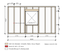
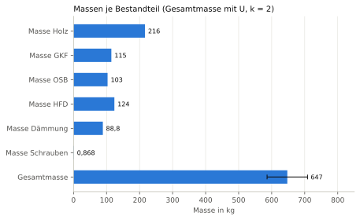

# Nachweisheft B1 – Mengen und Massen Wandelement AW-01

## Deckblatt

| Merkmal | Wert |
|---|---|
| Projekt | Beispielhaus Holzrahmenbau |
| Gebäude | Einfamilienhaus (fiktiv) |
| Geschoss | EG |
| Parametermodell | daten/wandelement.json (SHA-256 dcdbed63cc3d9ae5…) |
| Grundstück | daten/grundstueck.json (SHA-256 a60954d2a172493d…) |
| Rechtsstand der Beispiele | 27.09.2026 |
| Hinweis | Beispielrechnung für eine wissenschaftliche Arbeit; keine Rechts- oder Normauskunft, kein geprüfter bautechnischer Nachweis. |
| Verfasser | Entwurfsgenerator (Beispiel), ohne Prüfvermerk |
| Gesamtergebnis | **[ERFÜLLT]** (1 erfüllt, 0 nicht erfüllt, 0 Hinweis) |
| Heft-Hash (SHA-256) | `45741b8366d151e8090119cbbacd3c23ac5625e826747989f4d4c953199a26f4` |
| Zeitstempel | nicht gesetzt (deterministischer Lauf) |

Regelwerk-Profile:

- `HRB-Mengen` Version `0.1.0`

Regelquellen:

- Projektregel Mengenermittlung (eigene Festlegung), Fassung 2026-09 [V]

## Inhaltsverzeichnis

| Nr. | ID | Titel | Status | η | Hash (Anfang) |
|---:|---|---|---|---:|---|
| 1 | [N-B1-01](#n-n-b1-01) | Mengen- und Massenermittlung Wandelement AW-01 (Außenwand Nord, Element 1) | erfüllt | 0,001 | `3984bfb486b3` |

## N-B1-01 – Mengen- und Massenermittlung Wandelement AW-01 (Außenwand Nord, Element 1)

**Ergebnis: [ERFÜLLT]** · maßgebende Ausnutzung η = 0,001

### Gegenstand

| Merkmal | Wert |
|---|---|
| Bezeichnung | Wandelement AW-01 mit 18 Hölzern |
| IFC-GlobalId | `0gsiGQj_bG3wx8M0qwRA0U` |
| IFC-Klasse | IfcWall |
| IFC-Datei (SHA-256) | wandelement.ifc (aus B1) (`5a796ea7b0f1d8c0…`) |
| weitere GUIDs | `3N9BxbmVjJqfMasIm6VCTu`, `1TymEnbXzHcunnMbwZo5Cm`, `0ruebnGhrPUPaN5fsim6Vf`, `26xC9QsMnO6BHuxmSviBaF`, `254V3I5NrHxx6g9J9WAbEp`, `3ZVVDbGwDO7x2vg7I4UXpp`, `3BO1mSw7HO89jMsBG9Jb7H`, `1Shh7ZI39PQgxArHuFCIxO`, `2rWYAdwuXR2upUkdv7j_IN`, `0AkqIXRtnLZxJbnMw9nqYO`, `18vNpgLaTOYgpLpdvN0aeA`, `02QVWAdt9VqxV8$c1qnuss` … |

### Regel

> Mengen und Massen des vorgefertigten Wandelements aus dem Parametermodell ermitteln; die Mengen müssen mit den Mengenangaben (Qto) des IFC-Modells übereinstimmen.

Quelle: Projektregel Mengenermittlung (eigene Festlegung) · Fassung: 2026-09 · Fundstelle: vgl. Qto_MemberBaseQuantities, Qto_PlateBaseQuantities (IFC 4.3) · Prüfung am Primärtext: [V]  
Regelwerk-Profil: `HRB-Mengen` Version `0.1.0`

### Eingangsgrößen

| Größe | Symbol | Wert | u (k=1) | Art | Quelle |
|---|---|---:|---:|---|---|
| Wandlänge | $L$ | 4800 mm | – | eingabe | daten/wandelement.json /wand/laenge |
| Wandhöhe | $H$ | 2750 mm | – | eingabe | daten/wandelement.json /wand/hoehe |
| Fensterbreite (Rohbau) | $b_{\mathrm{F}}$ | 1260 mm | – | eingabe | daten/wandelement.json /wand/oeffnungen/0/breite |
| Fensterhöhe (Rohbau) | $h_{\mathrm{F}}$ | 1385 mm | – | eingabe | daten/wandelement.json /wand/oeffnungen/0/hoehe |
| Holzquerschnittstiefe | $t_{\mathrm{H}}$ | 200 mm | – | eingabe | daten/wandelement.json /wand/staender/tiefe |
| Kervenbreite (= Ständerbreite) | $b_{\mathrm{K}}$ | 60 mm | – | eingabe | daten/wandelement.json /wand/staender/breite |
| Kerventiefe | $t_{\mathrm{K}}$ | 25 mm | – | eingabe | daten/wandelement.json /wand/kerven/0/tiefe |
| Kervenhöhe | $h_{\mathrm{K}}$ | 40 mm | – | eingabe | daten/wandelement.json /wand/kerven/0/hoehe |
| Dicke GKF | $d_{\mathrm{GKF}}$ | 12,5 mm | – | eingabe | daten/wandelement.json Schicht gkf |
| Dicke OSB/3 | $d_{\mathrm{OSB}}$ | 15 mm | – | eingabe | daten/wandelement.json Schicht osb |
| Dicke Gefach | $d_{\mathrm{G}}$ | 200 mm | – | eingabe | daten/wandelement.json Schicht gefach |
| Dicke Holzfaserdämmplatte | $d_{\mathrm{HFD}}$ | 60 mm | – | eingabe | daten/wandelement.json Schicht hfd |
| Schraubendurchmesser | $d_{\mathrm{S}}$ | 4 mm | – | eingabe | daten/wandelement.json /wand/verbindungsmittel/0/durchmesser |
| Schraubenlänge | $l_{\mathrm{S}}$ | 50 mm | – | eingabe | daten/wandelement.json /wand/verbindungsmittel/0/laenge |
| Rohdichte KVH C24 (Nadelholz) | $\rho_{\mathrm{kvh},\mathrm{c24}}$ | 420 kg/m³ | 42 kg/m³ | annahme | daten/wandelement.json /materialien/kvh_c24/rho: Beispielwert (Mittelwert), keine Wichte nach DIN EN 1991-1-1; u = 10 % angenommen |
| Rohdichte Gipsplatte Typ DF (GKF) | $\rho_{\mathrm{gkf}}$ | 800 kg/m³ | 40 kg/m³ | annahme | daten/wandelement.json /materialien/gkf/rho: Beispielwert (Mittelwert), keine Wichte nach DIN EN 1991-1-1; u = 5 % angenommen |
| Rohdichte OSB/3 | $\rho_{\mathrm{osb3}}$ | 600 kg/m³ | 60 kg/m³ | annahme | daten/wandelement.json /materialien/osb3/rho: Beispielwert (Mittelwert), keine Wichte nach DIN EN 1991-1-1; u = 10 % angenommen |
| Rohdichte Holzfaser-Dämmmatte (flexibel) | $\rho_{\mathrm{holzfaser},\mathrm{flex}}$ | 50 kg/m³ | 7,5 kg/m³ | annahme | daten/wandelement.json /materialien/holzfaser_flex/rho: Beispielwert (Mittelwert), keine Wichte nach DIN EN 1991-1-1; u = 15 % angenommen |
| Rohdichte Holzfaserdämmplatte (Putzträger) | $\rho_{\mathrm{holzfaserplatte}}$ | 180 kg/m³ | 18 kg/m³ | annahme | daten/wandelement.json /materialien/holzfaserplatte/rho: Beispielwert (Mittelwert), keine Wichte nach DIN EN 1991-1-1; u = 10 % angenommen |
| Rohdichte Stahl | $\rho_{\mathrm{St}}$ | 7850 kg/m³ | – | annahme | daten/wandelement.json /materialien/stahl_verzinkt/rho |
| zulässige Mengenabweichung Modell/IFC | $\mathrm{dV}_{\mathrm{zul}}$ | 1 · 10⁻⁸ m³ | – | grenzwert | Projektregel: Qto-Werte sind auf 1e-9 m³ gerundet; Summe über ≤ 18 Teile ergibt höchstens 9e-9 m³ |

### Annahmen

- **Annahme:** Die Dampfbremse (0,2 mm) hat im Parametermodell keine Rohdichte und bleibt in der Masse unberücksichtigt.
- **Annahme:** Schrauben als Zylinder d × l (Kopf und Gewinde nicht modelliert), wie die IFC-Geometrie.
- **Annahme:** Die Unsicherheiten der Rohdichten sind Annahmen zur Demonstration der Unsicherheitsfortpflanzung.
- **Annahme:** Rohdichte KVH C24 (Nadelholz) (rho_kvh_c24) = 420 kg/m³: daten/wandelement.json /materialien/kvh_c24/rho: Beispielwert (Mittelwert), keine Wichte nach DIN EN 1991-1-1; u = 10 % angenommen
- **Annahme:** Rohdichte Gipsplatte Typ DF (GKF) (rho_gkf) = 800 kg/m³: daten/wandelement.json /materialien/gkf/rho: Beispielwert (Mittelwert), keine Wichte nach DIN EN 1991-1-1; u = 5 % angenommen
- **Annahme:** Rohdichte OSB/3 (rho_osb3) = 600 kg/m³: daten/wandelement.json /materialien/osb3/rho: Beispielwert (Mittelwert), keine Wichte nach DIN EN 1991-1-1; u = 10 % angenommen
- **Annahme:** Rohdichte Holzfaser-Dämmmatte (flexibel) (rho_holzfaser_flex) = 50 kg/m³: daten/wandelement.json /materialien/holzfaser_flex/rho: Beispielwert (Mittelwert), keine Wichte nach DIN EN 1991-1-1; u = 15 % angenommen
- **Annahme:** Rohdichte Holzfaserdämmplatte (Putzträger) (rho_holzfaserplatte) = 180 kg/m³: daten/wandelement.json /materialien/holzfaserplatte/rho: Beispielwert (Mittelwert), keine Wichte nach DIN EN 1991-1-1; u = 10 % angenommen
- **Annahme:** Rohdichte Stahl (rho_St) = 7850 kg/m³: daten/wandelement.json /materialien/stahl_verzinkt/rho

### Rechengang

Gerechnet wird ungerundet. Angezeigte Zwischenwerte: 5 signifikante Stellen, Regel B (bei 5 betragsmäßig aufrunden) nach ISO 80000-1:2022 Anh. B.3; entspricht DIN 1333:1992-02; Begründung: Anzeige von Zwischenwerten; gerechnet wird ungerundet (vgl. DIN EN ISO 6946:2018-03, 6.7.1.1: mindestens drei Dezimalstellen).

**Schritt 1: Bruttowandfläche**

$$
A_{\mathrm{b}} = L \cdot H
$$

$$
A_{\mathrm{b}} = 4800\ \mathrm{mm} \cdot 2750\ \mathrm{mm} = 13{,}200\ \mathrm{m^{2}}
$$

Ausdruck (maschinenlesbar): `L*H`

**Schritt 2: Öffnungsfläche Fenster F1**

$$
A_{\mathrm{F}} = b_{\mathrm{F}} \cdot h_{\mathrm{F}}
$$

$$
A_{\mathrm{F}} = 1260\ \mathrm{mm} \cdot 1385\ \mathrm{mm} = 1{,}7451\ \mathrm{m^{2}}
$$

Ausdruck (maschinenlesbar): `b_F*h_F`

**Schritt 3: Nettowandfläche**

$$
A_{\mathrm{n}} = A_{\mathrm{b}} - A_{\mathrm{F}}
$$

$$
A_{\mathrm{n}} = 13{,}200\ \mathrm{m^{2}} - 1{,}7451\ \mathrm{m^{2}} = 11{,}455\ \mathrm{m^{2}}
$$

Ausdruck (maschinenlesbar): `A_b - A_F`

**Schritt 4: Ansichtsfläche aller Hölzer**

Verfahren: Summe der 18 achsparallelen Holzrechtecke aus b1_wandelement.rahmenlayout; Überlappungsfreiheit per shapely-Vereinigung geprüft (Differenz < 1e-6 mm²)

Ergebnis: $A_{\mathrm{H}}$ = 2,5752 m²

**Schritt 5: Gefachfläche (Dämmung)**

$$
A_{\mathrm{G}} = A_{\mathrm{n}} - A_{\mathrm{H}}
$$

$$
A_{\mathrm{G}} = 11{,}455\ \mathrm{m^{2}} - 2{,}5752\ \mathrm{m^{2}} = 8{,}8797\ \mathrm{m^{2}}
$$

Ausdruck (maschinenlesbar): `A_n - A_H`

**Schritt 6: Volumen der Kerve K1**

$$
V_{\mathrm{K}} = b_{\mathrm{K}} \cdot t_{\mathrm{K}} \cdot h_{\mathrm{K}}
$$

$$
V_{\mathrm{K}} = 60\ \mathrm{mm} \cdot 25\ \mathrm{mm} \cdot 40\ \mathrm{mm} = 0{,}000060000\ \mathrm{m^{3}}
$$

Ausdruck (maschinenlesbar): `b_K*t_K*h_K`

**Schritt 7: Holzvolumen netto**

$$
V_{\mathrm{H}} = A_{\mathrm{H}} \cdot t_{\mathrm{H}} - V_{\mathrm{K}}
$$

$$
V_{\mathrm{H}} = 2{,}5752\ \mathrm{m^{2}} \cdot 200\ \mathrm{mm} - 0{,}000060000\ \mathrm{m^{3}} = 0{,}51498\ \mathrm{m^{3}}
$$

Ausdruck (maschinenlesbar): `A_H*t_H - V_K`

**Schritt 8: Volumen GKF** (Platten decken A_n vollständig)

$$
V_{\mathrm{GKF}} = A_{\mathrm{n}} \cdot d_{\mathrm{GKF}}
$$

$$
V_{\mathrm{GKF}} = 11{,}455\ \mathrm{m^{2}} \cdot 12{,}5\ \mathrm{mm} = 0{,}14319\ \mathrm{m^{3}}
$$

Ausdruck (maschinenlesbar): `A_n*d_GKF`

**Schritt 9: Volumen OSB/3**

$$
V_{\mathrm{OSB}} = A_{\mathrm{n}} \cdot d_{\mathrm{OSB}}
$$

$$
V_{\mathrm{OSB}} = 11{,}455\ \mathrm{m^{2}} \cdot 15\ \mathrm{mm} = 0{,}17182\ \mathrm{m^{3}}
$$

Ausdruck (maschinenlesbar): `A_n*d_OSB`

**Schritt 10: Volumen Holzfaserdämmplatte**

$$
V_{\mathrm{HFD}} = A_{\mathrm{n}} \cdot d_{\mathrm{HFD}}
$$

$$
V_{\mathrm{HFD}} = 11{,}455\ \mathrm{m^{2}} \cdot 60\ \mathrm{mm} = 0{,}68729\ \mathrm{m^{3}}
$$

Ausdruck (maschinenlesbar): `A_n*d_HFD`

**Schritt 11: Volumen Gefachdämmung**

$$
V_{\mathrm{D}} = A_{\mathrm{G}} \cdot d_{\mathrm{G}}
$$

$$
V_{\mathrm{D}} = 8{,}8797\ \mathrm{m^{2}} \cdot 200\ \mathrm{mm} = 1{,}7759\ \mathrm{m^{3}}
$$

Ausdruck (maschinenlesbar): `A_G*d_G`

**Schritt 12: Anzahl Schrauben (aus dem IFC-Modell)**

Verfahren: Zählung der IfcMechanicalFastener im Modell (Raster 150 mm, Randabstand 75 mm, Plattenrand ≥ 10 mm)

Ergebnis: $n_{\mathrm{S}}$ = 176 Stk

**Schritt 13: Masse Holz**

$$
m_{\mathrm{H}} = \rho_{\mathrm{kvh},\mathrm{c24}} \cdot V_{\mathrm{H}}
$$

$$
m_{\mathrm{H}} = 420\ \mathrm{kg/m^{3}} \cdot 0{,}51498\ \mathrm{m^{3}} = 216{,}29\ \mathrm{kg}
$$

Ausdruck (maschinenlesbar): `rho_kvh_c24*V_H`

**Schritt 14: Masse GKF**

$$
m_{\mathrm{GKF}} = \rho_{\mathrm{gkf}} \cdot V_{\mathrm{GKF}}
$$

$$
m_{\mathrm{GKF}} = 800\ \mathrm{kg/m^{3}} \cdot 0{,}14319\ \mathrm{m^{3}} = 114{,}55\ \mathrm{kg}
$$

Ausdruck (maschinenlesbar): `rho_gkf*V_GKF`

**Schritt 15: Masse OSB/3**

$$
m_{\mathrm{OSB}} = \rho_{\mathrm{osb3}} \cdot V_{\mathrm{OSB}}
$$

$$
m_{\mathrm{OSB}} = 600\ \mathrm{kg/m^{3}} \cdot 0{,}17182\ \mathrm{m^{3}} = 103{,}09\ \mathrm{kg}
$$

Ausdruck (maschinenlesbar): `rho_osb3*V_OSB`

**Schritt 16: Masse Holzfaserdämmplatte**

$$
m_{\mathrm{HFD}} = \rho_{\mathrm{holzfaserplatte}} \cdot V_{\mathrm{HFD}}
$$

$$
m_{\mathrm{HFD}} = 180\ \mathrm{kg/m^{3}} \cdot 0{,}68729\ \mathrm{m^{3}} = 123{,}71\ \mathrm{kg}
$$

Ausdruck (maschinenlesbar): `rho_holzfaserplatte*V_HFD`

**Schritt 17: Masse Gefachdämmung**

$$
m_{\mathrm{D}} = \rho_{\mathrm{holzfaser},\mathrm{flex}} \cdot V_{\mathrm{D}}
$$

$$
m_{\mathrm{D}} = 50\ \mathrm{kg/m^{3}} \cdot 1{,}7759\ \mathrm{m^{3}} = 88{,}797\ \mathrm{kg}
$$

Ausdruck (maschinenlesbar): `rho_holzfaser_flex*V_D`

**Schritt 18: Masse Schrauben (Schaft als Zylinder, wie Modellgeometrie)**

$$
m_{\mathrm{S}} = n_{\mathrm{S}} \cdot \rho_{\mathrm{St}} \cdot \pi \cdot {\frac{d_{\mathrm{S}}}{2}}^{2} \cdot l_{\mathrm{S}}
$$

$$
m_{\mathrm{S}} = 176\ \mathrm{Stk} \cdot 7850\ \mathrm{kg/m^{3}} \cdot \pi \cdot {\frac{4\ \mathrm{mm}}{2}}^{2} \cdot 50\ \mathrm{mm} = 0{,}86808\ \mathrm{kg}
$$

Ausdruck (maschinenlesbar): `n_S*rho_St*pi*(d_S/2)**2*l_S`

**Schritt 19: Gesamtmasse des Wandelements**

$$
m_{\mathrm{ges}} = m_{\mathrm{H}} + m_{\mathrm{GKF}} + m_{\mathrm{OSB}} + m_{\mathrm{HFD}} + m_{\mathrm{D}} + m_{\mathrm{S}}
$$

$$
m_{\mathrm{ges}} = 216{,}29\ \mathrm{kg} + 114{,}55\ \mathrm{kg} + 103{,}09\ \mathrm{kg} + 123{,}71\ \mathrm{kg} + 88{,}797\ \mathrm{kg} + 0{,}86808\ \mathrm{kg} = 647{,}31\ \mathrm{kg}
$$

Ausdruck (maschinenlesbar): `m_H + m_GKF + m_OSB + m_HFD + m_D + m_S`

**Schritt 20: flächenbezogene Masse**

$$
m_{\mathrm{A}} = \frac{m_{\mathrm{ges}}}{A_{\mathrm{n}}}
$$

$$
m_{\mathrm{A}} = \frac{647{,}31\ \mathrm{kg}}{11{,}455\ \mathrm{m^{2}}} = 56{,}510\ \mathrm{kg/m^{2}}
$$

Ausdruck (maschinenlesbar): `m_ges/A_n`

**Schritt 21: Holzvolumen laut IFC (Summe Qto_MemberBaseQuantities.NetVolume)**

Verfahren: Summe NetVolume über 18 IfcMember (GUIDs im Gegenstand)

Ergebnis: $V_{\mathrm{H},\mathrm{IFC}}$ = 0,51498 m³

**Schritt 22: Beplankungsvolumen laut IFC (Summe Qto_PlateBaseQuantities.NetVolume)**

Verfahren: Summe NetVolume über 10 IfcPlate

Ergebnis: $V_{\mathrm{P},\mathrm{IFC}}$ = 1,00230375 m³

**Schritt 23: Dämmvolumen laut IFC (Summe Qto_BodyGeometryValidation.NetVolume)**

Verfahren: Summe NetVolume über 12 IfcBuildingElementPart INSULATION

Ergebnis: $V_{\mathrm{D},\mathrm{IFC}}$ = 1,77594 m³

**Schritt 24: Abweichung Holzvolumen Nachweis/IFC**

$$
\mathrm{dV}_{\mathrm{H}} = \left|V_{\mathrm{H}} - V_{\mathrm{H},\mathrm{IFC}}\right|
$$

$$
\mathrm{dV}_{\mathrm{H}} = \left|0{,}51498\ \mathrm{m^{3}} - 0{,}51498\ \mathrm{m^{3}}\right| = 0{,}00000000000000011102\ \mathrm{m^{3}}
$$

Ausdruck (maschinenlesbar): `abs(V_H - V_H_IFC)`

**Schritt 25: Abweichung Beplankung Nachweis/IFC**

$$
\mathrm{dV}_{\mathrm{P}} = \left|V_{\mathrm{GKF}} + V_{\mathrm{OSB}} + V_{\mathrm{HFD}} - V_{\mathrm{P},\mathrm{IFC}}\right|
$$

$$
\mathrm{dV}_{\mathrm{P}} = \left|0{,}14319\ \mathrm{m^{3}} + 0{,}17182\ \mathrm{m^{3}} + 0{,}68729\ \mathrm{m^{3}} - 1{,}0023\ \mathrm{m^{3}}\right| = 0{,}00000000000000022204\ \mathrm{m^{3}}
$$

Ausdruck (maschinenlesbar): `abs(V_GKF + V_OSB + V_HFD - V_P_IFC)`

**Schritt 26: Abweichung Dämmung Nachweis/IFC**

$$
\mathrm{dV}_{\mathrm{D}} = \left|V_{\mathrm{D}} - V_{\mathrm{D},\mathrm{IFC}}\right|
$$

$$
\mathrm{dV}_{\mathrm{D}} = \left|1{,}7759\ \mathrm{m^{3}} - 1{,}7759\ \mathrm{m^{3}}\right| = 0{,}00000000000000044409\ \mathrm{m^{3}}
$$

Ausdruck (maschinenlesbar): `abs(V_D - V_D_IFC)`

### Nachweis

| Kriterium | Ist | Vergleich | Grenzwert | η | Ergebnis | Normverweis |
|---|---:|:---:|---:|---:|---|---|
| Holzvolumen: Nachweis = IFC | 1,1102 · 10⁻¹⁶ m³ | ≤ | 1 · 10⁻⁸ m³ | 0,001 | erfüllt | Konsistenz Modell/IFC |
| Beplankung: Nachweis = IFC | 2,2204 · 10⁻¹⁶ m³ | ≤ | 1 · 10⁻⁸ m³ | 0,001 | erfüllt | Konsistenz Modell/IFC |
| Dämmung: Nachweis = IFC | 4,4409 · 10⁻¹⁶ m³ | ≤ | 1 · 10⁻⁸ m³ | 0,001 | erfüllt | Konsistenz Modell/IFC |

Der Vergleich erfolgt mit ungerundeten Werten.

Rundung des Ergebnisses: 3 signifikante Stellen, Regel B (bei 5 betragsmäßig aufrunden) nach ISO 80000-1:2022 Anh. B.3; entspricht DIN 1333:1992-02; Begründung: Massen für Transport- und Montageplanung; drei Stellen genügen.

### Messunsicherheit

Methode: lineare Fortpflanzung erster Ordnung, unkorrelierte Eingangsgrößen (JCGM 100:2008, 5.1.2, Gl. 10); Sensitivitäten numerisch durch zentrale Differenzen über die gesamte Rechenkette.

Ergebnis: **650 ± 70 kg (k = 2)**, kombinierte Standardunsicherheit u_c = 31 kg.

| Eingang | u(x) | Sensitivität c | Einheit von c | Beitrag \|c\|·u | Anteil an u_c² |
|---|---:|---:|---|---:|---:|
| rho_kvh_c24 | 42 kg/m³ | 0,515 | (kg)/(kg/m³) | 22 | 49,9 % |
| rho_gkf | 40 kg/m³ | 0,143 | (kg)/(kg/m³) | 5,7 | 3,5 % |
| rho_osb3 | 60 kg/m³ | 0,172 | (kg)/(kg/m³) | 10 | 11,3 % |
| rho_holzfaser_flex | 7,5 kg/m³ | 1,78 | (kg)/(kg/m³) | 13 | 18,9 % |
| rho_holzfaserplatte | 18 kg/m³ | 0,687 | (kg)/(kg/m³) | 12 | 16,3 % |

Monte-Carlo (Monte-Carlo-Fortpflanzung der Verteilungen (JCGM 101:2008), numpy.random.default_rng (PCG64); 50 000 Versuche, Seed 20260927): Mittelwert 647,4, s = 31, 95-%-Intervall [587,3; 707,1] kg.

### Hinweise

- Beispielrechnung für eine wissenschaftliche Arbeit; keine Rechts- oder Normauskunft, kein geprüfter bautechnischer Nachweis.
- Unsicherheitsbeiträge der Verfahrensschritte A_H, n_S, V_H_IFC, V_P_IFC, V_D_IFC sind nicht fortgepflanzt.

### Grafischer Nachweis

**Abbildung N-B1-01/ansicht: Wandansicht AW-01 von innen (Holzgerüst, Öffnung, Kerve)** (Maßstab 1:50)

Bemaßung in mm. Hölzer schraffiert, Öffnung mit Kreuz, Kerve rot.

**Abbildung N-B1-01/massen: Massen je Bestandteil**

### Rückverfolgbarkeit

- Hash (SHA-256): `3984bfb486b36ef8f82b34a4a028415fee791610c21254d31ce814a329987bfb`
- Umfang: kanonisches JSON des Nachweises ohne die Felder hash, zeitstempel und umgebung
- Umgebung: Python 3.11.15, Modul nachweis 1.0.0, Einheiten: pint, Grafik: matplotlib, numpy 2.4.6, pint 0.25.3, matplotlib 3.11.2, shapely 2.1.2, ifcopenshell 0.8.5, ifctester 0.8.5
- Zeitstempel: nicht gesetzt (deterministischer Lauf)

