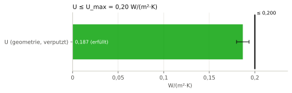
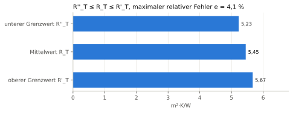
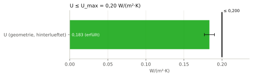
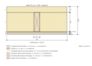
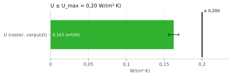
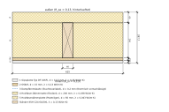
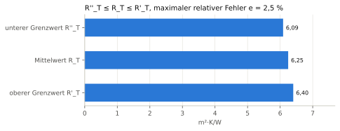
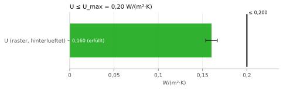

# Nachweisheft B3 – Wärmedurchgangskoeffizient Außenwand AW-01 (DIN EN ISO 6946)

## Deckblatt

| Merkmal | Wert |
|---|---|
| Projekt | Beispielhaus Holzrahmenbau |
| Gebäude | Einfamilienhaus (fiktiv) |
| Geschoss | EG |
| Parametermodell | daten/wandelement.json (SHA-256 dcdbed63cc3d9ae5…) |
| Grundstück | daten/grundstueck.json (SHA-256 a60954d2a172493d…) |
| Rechtsstand der Beispiele | 27.09.2026 |
| Hinweis | Beispielrechnung für eine wissenschaftliche Arbeit; keine Rechts- oder Normauskunft, kein geprüfter bautechnischer Nachweis. |
| Verfasser | Entwurfsgenerator (Beispiel), ohne Prüfvermerk |
| Gesamtergebnis | **[ERFÜLLT]** (4 erfüllt, 0 nicht erfüllt, 0 Hinweis) |
| Heft-Hash (SHA-256) | `73c1e10be721152cd5a7f72d475f4bf1773402b66da4efd310cab9315c1a7afc` |
| Zeitstempel | nicht gesetzt (deterministischer Lauf) |

Regelwerk-Profile:

- `DE-Waermeschutz-Beispiel` Version `0.1.0`

Regelquellen:

- DIN EN ISO 6946:2018-03 (ISO 6946:2017); Grenzwert: holzrahmenbau.ids HRB-01 (Projektanforderung), Fassung 2018-03 [V]

## Inhaltsverzeichnis

| Nr. | ID | Titel | Status | η | Hash (Anfang) |
|---:|---|---|---|---:|---|
| 1 | [N-B3-geometrie-verputzt](#n-n-b3-geometrie-verputzt) | U-Wert Außenwand AW-01 (Holzanteil aus der Elementgeometrie, verputzt) | erfüllt | 0,934 | `c9be9bf83a9c` |
| 2 | [N-B3-geometrie-hinterlueftet](#n-n-b3-geometrie-hinterlueftet) | U-Wert Außenwand AW-01 (Holzanteil aus der Elementgeometrie, hinterlueftet) | erfüllt | 0,918 | `c5ce6828b373` |
| 3 | [N-B3-raster-verputzt](#n-n-b3-raster-verputzt) | U-Wert Außenwand AW-01 (Holzanteil aus dem Raster, verputzt) | erfüllt | 0,813 | `477cffed6648` |
| 4 | [N-B3-raster-hinterlueftet](#n-n-b3-raster-hinterlueftet) | U-Wert Außenwand AW-01 (Holzanteil aus dem Raster, hinterlueftet) | erfüllt | 0,801 | `6affe8a4a000` |

## N-B3-geometrie-verputzt – U-Wert Außenwand AW-01 (Holzanteil aus der Elementgeometrie, verputzt)

**Ergebnis: [ERFÜLLT]** · maßgebende Ausnutzung η = 0,934

### Gegenstand

| Merkmal | Wert |
|---|---|
| Bezeichnung | Außenwand AW-01, Typ AW-HRB-01, Variante geometrie/verputzt |
| IFC-GlobalId | `0gsiGQj_bG3wx8M0qwRA0U` |
| IFC-Klasse | IfcWall |
| IFC-Datei (SHA-256) | wandelement.ifc (aus B1) (`5a796ea7b0f1d8c0…`) |

### Regel

> Der Wärmedurchgangskoeffizient der Außenwand darf 0,20 W/(m²·K) nicht überschreiten. Berechnung nach dem vereinfachten Verfahren für Bauteile aus homogenen und inhomogenen Schichten (oberer und unterer Grenzwert).

Quelle: DIN EN ISO 6946:2018-03 (ISO 6946:2017); Grenzwert: holzrahmenbau.ids HRB-01 (Projektanforderung) · Fassung: 2018-03 · Fundstelle: 6.5.2, 6.6, 6.7.1.1, 6.7.2, 6.8 · Prüfung am Primärtext: [V]  
Regelwerk-Profil: `DE-Waermeschutz-Beispiel` Version `0.1.0`

### Eingangsgrößen

| Größe | Symbol | Wert | u (k=1) | Art | Quelle |
|---|---|---:|---:|---|---|
| Wärmeübergangswiderstand innen | $R_{\mathrm{si}}$ | 0,13 m²·K/W | – | konstante | DIN EN ISO 6946:2018-03 (ISO 6946:2017), 6.8, horizontaler Wärmestrom |
| Wärmeübergangswiderstand außen | $R_{\mathrm{se}}$ | 0,04 m²·K/W | – | konstante | DIN EN ISO 6946:2018-03 (ISO 6946:2017), 6.8 (Fassade verputzt) |
| Dicke GKF | $d_{\mathrm{GKF}}$ | 12,5 mm | 0,3 mm | eingabe | daten/wandelement.json Schicht gkf |
| Dicke OSB/3 | $d_{\mathrm{OSB}}$ | 15 mm | 0,3 mm | eingabe | daten/wandelement.json Schicht osb |
| Dicke Gefach | $d_{\mathrm{G}}$ | 200 mm | 2 mm | eingabe | daten/wandelement.json Schicht gefach |
| Dicke Holzfaserdämmplatte | $d_{\mathrm{HFD}}$ | 60 mm | 1 mm | eingabe | daten/wandelement.json Schicht hfd |
| Bemessungswert λ GKF | $\lambda_{\mathrm{GKF}}$ | 0,25 W/(m·K) | 0,0075 W/(m·K) | eingabe | daten/wandelement.json: typische Herstellerangabe (Beispielwert) |
| Bemessungswert λ OSB/3 | $\lambda_{\mathrm{OSB}}$ | 0,13 W/(m·K) | 0,0039 W/(m·K) | eingabe | daten/wandelement.json: typische Herstellerangabe / DIN EN 13986 (Beispielwert) |
| Bemessungswert λ Holz (KVH C24) | $\lambda_{\mathrm{H}}$ | 0,13 W/(m·K) | 0,0039 W/(m·K) | eingabe | daten/wandelement.json: typischer Wert Nadelholz, vgl. DIN EN ISO 10456 (Beispielwert) |
| Bemessungswert λ Gefachdämmung | $\lambda_{\mathrm{D}}$ | 0,038 W/(m·K) | 0,00114 W/(m·K) | eingabe | daten/wandelement.json: Beispielwert Herstellerangabe (Bemessungswert) |
| Bemessungswert λ Holzfaserdämmplatte | $\lambda_{\mathrm{HFD}}$ | 0,043 W/(m·K) | 0,00129 W/(m·K) | eingabe | daten/wandelement.json: Beispielwert Herstellerangabe (Bemessungswert) |
| Holzanteil der Gefachschicht | $f_{\mathrm{a}}$ | 0,22481208914962156 | – | eingabe | Geometrie: Holzansichtsfläche/Nettowandfläche aus b1_wandelement.rahmenlayout = 2 575 200 mm² / 11 454 900 mm² |
| Höchstwert des U-Werts | $U_{\mathrm{max}}$ | 0,2 W/(m²·K) | – | grenzwert | holzrahmenbau.ids, HRB-01 (Projektanforderung, Beispielwert) |

### Annahmen

- **Annahme:** Korrekturen ΔU nach Anhang F nicht angesetzt: Luftspalte Stufe 0 (Dämmung passgenau), Befestigungen durchdringen die Dämmschicht nicht (6.4 d: Korrektur nur bei > 3 % von U).
- **Annahme:** Die Dampfbremse (0,2 mm) ist thermisch vernachlässigt.
- **Annahme:** λ-Werte sind Beispielwerte aus dem Parametermodell, keine Tabellenwerte der DIN 4108-4.
- **Annahme:** Unsicherheiten der Dicken (Rechteckverteilung) und der λ-Werte (3 %, normal): Annahme zur Demonstration der Unsicherheitsfortpflanzung.

### Rechengang

Gerechnet wird ungerundet. Angezeigte Zwischenwerte: 5 signifikante Stellen, Regel B (bei 5 betragsmäßig aufrunden) nach ISO 80000-1:2022 Anh. B.3; entspricht DIN 1333:1992-02; Begründung: Anzeige von Zwischenwerten; gerechnet wird ungerundet (vgl. DIN EN ISO 6946:2018-03, 6.7.1.1: mindestens drei Dezimalstellen).

**Schritt 1: Wärmedurchlasswiderstand GKF** (DIN EN ISO 6946:2018-03 (ISO 6946:2017), 6.7.1.1, Formel (3))

$$
R_{\mathrm{GKF}} = \frac{d_{\mathrm{GKF}}}{\lambda_{\mathrm{GKF}}}
$$

$$
R_{\mathrm{GKF}} = \frac{12{,}5\ \mathrm{mm}}{0{,}25\ \mathrm{W/(m\cdot K)}} = 0{,}050000\ \mathrm{m^{2}\cdot K/W}
$$

Ausdruck (maschinenlesbar): `d_GKF/lambda_GKF`

**Schritt 2: Wärmedurchlasswiderstand OSB/3** (6.7.1.1, Formel (3))

$$
R_{\mathrm{OSB}} = \frac{d_{\mathrm{OSB}}}{\lambda_{\mathrm{OSB}}}
$$

$$
R_{\mathrm{OSB}} = \frac{15\ \mathrm{mm}}{0{,}13\ \mathrm{W/(m\cdot K)}} = 0{,}11538\ \mathrm{m^{2}\cdot K/W}
$$

Ausdruck (maschinenlesbar): `d_OSB/lambda_OSB`

**Schritt 3: Wärmedurchlasswiderstand Holzfaserdämmplatte** (6.7.1.1, Formel (3))

$$
R_{\mathrm{HFD}} = \frac{d_{\mathrm{HFD}}}{\lambda_{\mathrm{HFD}}}
$$

$$
R_{\mathrm{HFD}} = \frac{60\ \mathrm{mm}}{0{,}043\ \mathrm{W/(m\cdot K)}} = 1{,}3953\ \mathrm{m^{2}\cdot K/W}
$$

Ausdruck (maschinenlesbar): `d_HFD/lambda_HFD`

**Schritt 4: Gefachschicht, Abschnitt a (Holz)** (6.7.1.1)

$$
R_{\mathrm{Ga}} = \frac{d_{\mathrm{G}}}{\lambda_{\mathrm{H}}}
$$

$$
R_{\mathrm{Ga}} = \frac{200\ \mathrm{mm}}{0{,}13\ \mathrm{W/(m\cdot K)}} = 1{,}5385\ \mathrm{m^{2}\cdot K/W}
$$

Ausdruck (maschinenlesbar): `d_G/lambda_H`

**Schritt 5: Gefachschicht, Abschnitt b (Dämmung)** (6.7.1.1)

$$
R_{\mathrm{Gb}} = \frac{d_{\mathrm{G}}}{\lambda_{\mathrm{D}}}
$$

$$
R_{\mathrm{Gb}} = \frac{200\ \mathrm{mm}}{0{,}038\ \mathrm{W/(m\cdot K)}} = 5{,}2632\ \mathrm{m^{2}\cdot K/W}
$$

Ausdruck (maschinenlesbar): `d_G/lambda_D`

**Schritt 6: Gesamtwiderstand Abschnitt a (innen bis außen)** (6.7.2 (oberer Grenzwert, Abschnittswiderstände))

$$
R_{\mathrm{T},a} = R_{\mathrm{si}} + R_{\mathrm{GKF}} + R_{\mathrm{OSB}} + R_{\mathrm{Ga}} + R_{\mathrm{HFD}} + R_{\mathrm{se}}
$$

$$
R_{\mathrm{T},a} = 0{,}13\ \mathrm{m^{2}\cdot K/W} + 0{,}050000\ \mathrm{m^{2}\cdot K/W} + 0{,}11538\ \mathrm{m^{2}\cdot K/W} + 1{,}5385\ \mathrm{m^{2}\cdot K/W} + 1{,}3953\ \mathrm{m^{2}\cdot K/W} + 0{,}04\ \mathrm{m^{2}\cdot K/W} = 3{,}2692\ \mathrm{m^{2}\cdot K/W}
$$

Ausdruck (maschinenlesbar): `R_si + R_GKF + R_OSB + R_Ga + R_HFD + R_se`

**Schritt 7: Gesamtwiderstand Abschnitt b** (6.7.2)

$$
R_{\mathrm{T},b} = R_{\mathrm{si}} + R_{\mathrm{GKF}} + R_{\mathrm{OSB}} + R_{\mathrm{Gb}} + R_{\mathrm{HFD}} + R_{\mathrm{se}}
$$

$$
R_{\mathrm{T},b} = 0{,}13\ \mathrm{m^{2}\cdot K/W} + 0{,}050000\ \mathrm{m^{2}\cdot K/W} + 0{,}11538\ \mathrm{m^{2}\cdot K/W} + 5{,}2632\ \mathrm{m^{2}\cdot K/W} + 1{,}3953\ \mathrm{m^{2}\cdot K/W} + 0{,}04\ \mathrm{m^{2}\cdot K/W} = 6{,}9939\ \mathrm{m^{2}\cdot K/W}
$$

Ausdruck (maschinenlesbar): `R_si + R_GKF + R_OSB + R_Gb + R_HFD + R_se`

**Schritt 8: Flächenanteil Abschnitt b**

$$
f_{\mathrm{b}} = 1 - f_{\mathrm{a}}
$$

$$
f_{\mathrm{b}} = 1 - 0{,}22481208914962156 = 0{,}77519
$$

Ausdruck (maschinenlesbar): `1 - f_a`

**Schritt 9: oberer Grenzwert R'_T (parallele Wärmeströme)** (6.7.2, oberer Grenzwert [Absatznummer U])

$$
R'_{\mathrm{T}} = \frac{1}{\frac{f_{\mathrm{a}}}{R_{\mathrm{T},a}} + \frac{f_{\mathrm{b}}}{R_{\mathrm{T},b}}}
$$

$$
R'_{\mathrm{T}} = \frac{1}{\frac{0{,}22481208914962156}{3{,}2692\ \mathrm{m^{2}\cdot K/W}} + \frac{0{,}77519}{6{,}9939\ \mathrm{m^{2}\cdot K/W}}} = 5{,}5678\ \mathrm{m^{2}\cdot K/W}
$$

Ausdruck (maschinenlesbar): `1/(f_a/R_Ta + f_b/R_Tb)`

**Schritt 10: äquivalente Wärmeleitfähigkeit der Gefachschicht** (6.7.2, unterer Grenzwert)

$$
\lambda'' = f_{\mathrm{a}} \cdot \lambda_{\mathrm{H}} + f_{\mathrm{b}} \cdot \lambda_{\mathrm{D}}
$$

$$
\lambda'' = 0{,}22481208914962156 \cdot 0{,}13\ \mathrm{W/(m\cdot K)} + 0{,}77519 \cdot 0{,}038\ \mathrm{W/(m\cdot K)} = 0{,}058683\ \mathrm{W/(m\cdot K)}
$$

Ausdruck (maschinenlesbar): `f_a*lambda_H + f_b*lambda_D`

**Schritt 11: Wärmedurchlasswiderstand Gefach mit λ''** (6.7.2, unterer Grenzwert)

$$
R''_{\mathrm{G}} = \frac{d_{\mathrm{G}}}{\lambda''}
$$

$$
R''_{\mathrm{G}} = \frac{200\ \mathrm{mm}}{0{,}058683\ \mathrm{W/(m\cdot K)}} = 3{,}4082\ \mathrm{m^{2}\cdot K/W}
$$

Ausdruck (maschinenlesbar): `d_G/lambda_eq`

**Schritt 12: unterer Grenzwert R''_T (isotherme Ebenen)** (6.7.2, unterer Grenzwert [Absatznummer U])

$$
R''_{\mathrm{T}} = R_{\mathrm{si}} + R_{\mathrm{GKF}} + R_{\mathrm{OSB}} + R''_{\mathrm{G}} + R_{\mathrm{HFD}} + R_{\mathrm{se}}
$$

$$
R''_{\mathrm{T}} = 0{,}13\ \mathrm{m^{2}\cdot K/W} + 0{,}050000\ \mathrm{m^{2}\cdot K/W} + 0{,}11538\ \mathrm{m^{2}\cdot K/W} + 3{,}4082\ \mathrm{m^{2}\cdot K/W} + 1{,}3953\ \mathrm{m^{2}\cdot K/W} + 0{,}04\ \mathrm{m^{2}\cdot K/W} = 5{,}1389\ \mathrm{m^{2}\cdot K/W}
$$

Ausdruck (maschinenlesbar): `R_si + R_GKF + R_OSB + R_Geq + R_HFD + R_se`

**Schritt 13: Wärmedurchgangswiderstand als arithmetisches Mittel** (6.7.2.2 [V])

$$
R_{\mathrm{T}} = \frac{R'_{\mathrm{T}} + R''_{\mathrm{T}}}{2}
$$

$$
R_{\mathrm{T}} = \frac{5{,}5678\ \mathrm{m^{2}\cdot K/W} + 5{,}1389\ \mathrm{m^{2}\cdot K/W}}{2} = 5{,}3533\ \mathrm{m^{2}\cdot K/W}
$$

Ausdruck (maschinenlesbar): `(R_o + R_u)/2`

**Schritt 14: maximaler relativer Fehler** (6.7.2, Abschätzung des Fehlers)

$$
e_{\mathrm{rel}} = \frac{R'_{\mathrm{T}} - R''_{\mathrm{T}}}{2 \cdot R_{\mathrm{T}}}
$$

$$
e_{\mathrm{rel}} = \frac{5{,}5678\ \mathrm{m^{2}\cdot K/W} - 5{,}1389\ \mathrm{m^{2}\cdot K/W}}{2 \cdot 5{,}3533\ \mathrm{m^{2}\cdot K/W}} = 4{,}0058\ \mathrm{\%}
$$

Ausdruck (maschinenlesbar): `(R_o - R_u)/(2*R_T)`

**Schritt 15: Wärmedurchgangskoeffizient** (DIN EN ISO 6946:2018-03 (ISO 6946:2017), 6.5.2, Formel (1))

$$
U = \frac{1}{R_{\mathrm{T}}}
$$

$$
U = \frac{1}{5{,}3533\ \mathrm{m^{2}\cdot K/W}} = 0{,}18680\ \mathrm{W/(m^{2}\cdot K)}
$$

Ausdruck (maschinenlesbar): `1/R_T`

### Nachweis

| Kriterium | Ist | Vergleich | Grenzwert | η | Ergebnis | Normverweis |
|---|---:|:---:|---:|---:|---|---|
| U ≤ U_max | 0,19 W/(m²·K) | ≤ | 0,2 W/(m²·K) | 0,934 | erfüllt | holzrahmenbau.ids HRB-01 |

Der Vergleich erfolgt mit ungerundeten Werten.

Rundung des Ergebnisses: 2 signifikante Stellen, Regel B (bei 5 betragsmäßig aufrunden) nach ISO 80000-1:2022 Anh. B.3; entspricht DIN 1333:1992-02; Begründung: DIN EN ISO 6946:2018-03 (ISO 6946:2017), 6.5.2: Endergebnis auf zwei signifikante Stellen [V].

### Messunsicherheit

Methode: lineare Fortpflanzung erster Ordnung, unkorrelierte Eingangsgrößen (JCGM 100:2008, 5.1.2, Gl. 10); Sensitivitäten numerisch durch zentrale Differenzen über die gesamte Rechenkette.

Ergebnis: **0,187 ± 0,007 W/(m²·K) (k = 2)**, kombinierte Standardunsicherheit u_c = 0,0034 W/(m²·K).

| Eingang | u(x) | Sensitivität c | Einheit von c | Beitrag \|c\|·u | Anteil an u_c² |
|---|---:|---:|---|---:|---:|
| d_GKF | 0,3 mm | −0,000150 | (W/(m²·K))/(mm) | 0,000045 | 0,0 % |
| d_OSB | 0,3 mm | −0,000288 | (W/(m²·K))/(mm) | 0,000086 | 0,1 % |
| d_G | 2 mm | −0,000610 | (W/(m²·K))/(mm) | 0,0012 | 12,6 % |
| d_HFD | 1 mm | −0,000870 | (W/(m²·K))/(mm) | 0,00087 | 6,4 % |
| lambda_GKF | 0,0075 W/(m·K) | 0,00748 | (W/(m²·K))/(W/(m·K)) | 0,000056 | 0,0 % |
| lambda_OSB | 0,0039 W/(m·K) | 0,0332 | (W/(m²·K))/(W/(m·K)) | 0,00013 | 0,1 % |
| lambda_H | 0,0039 W/(m·K) | 0,362 | (W/(m²·K))/(W/(m·K)) | 0,0014 | 17,0 % |
| lambda_D | 0,00114 W/(m·K) | 1,97 | (W/(m²·K))/(W/(m·K)) | 0,0022 | 42,9 % |
| lambda_HFD | 0,00129 W/(m·K) | 1,21 | (W/(m²·K))/(W/(m·K)) | 0,0016 | 20,8 % |

Monte-Carlo (Monte-Carlo-Fortpflanzung der Verteilungen (JCGM 101:2008), numpy.random.default_rng (PCG64); 100 000 Versuche, Seed 20260927): Mittelwert 0,1867, s = 0,0034, 95-%-Intervall [0,1801; 0,1935] W/(m²·K).

### Gegenrechnung mit dem Rechenkern

| Größe | Rechenkern | Nachweis | Abweichung | Übereinstimmung |
|---|---|---:|---:|---|
| U | `b3_uwert_iso6946.berechne_uwert → u_wert (6 Dezimalstellen)` = 0,186799 | 0,18679932937799024 | 3.29e-07 | ja (Toleranz 5e-07) |
| R_o | `b3_uwert_iso6946.berechne_uwert → r_oben` = 5,567784 | 5,567784334633171 | 3.35e-07 | ja (Toleranz 5e-07) |
| R_u | `b3_uwert_iso6946.berechne_uwert → r_unten` = 5,138892 | 5,138892218541071 | 2.19e-07 | ja (Toleranz 5e-07) |
| U | `IFC Pset_WallCommon.ThermalTransmittance (3 Dezimalstellen)` = 0,187 | 0,18679932937799024 | 2.01e-04 | ja (Toleranz 5e-04) |

### Hinweise

- Beispielrechnung für eine wissenschaftliche Arbeit; keine Rechts- oder Normauskunft, kein geprüfter bautechnischer Nachweis.
- Im IFC-Modell (Pset_WallCommon.ThermalTransmittance) steht der U-Wert mit drei Dezimalstellen. Das ist ein Zwischenwert für Folgerechnungen (vgl. JCGM 100:2008, 7.2.6); als Endergebnis gilt die Angabe mit zwei signifikanten Stellen.

### Grafischer Nachweis

**Abbildung N-B3-geometrie-verputzt/schnitt: Horizontalschnitt Außenwand AW-01 (ein Ständerfeld, e = 625 mm)** (Maßstab 1:5)

Abschnitt a = Holz (Ständer), Abschnitt b = Dämmung. Maße in mm.

**Abbildung N-B3-geometrie-verputzt/grenzwerte: Grenzwerte des Wärmedurchgangswiderstands**

**Abbildung N-B3-geometrie-verputzt/uwert: U-Wert gegen Höchstwert (mit erweiterter Unsicherheit U, k = 2)**

### Rückverfolgbarkeit

- Hash (SHA-256): `c9be9bf83a9c39c6f9cd3561d228745df002b4bfc57289f0468e1ce0b7622701`
- Umfang: kanonisches JSON des Nachweises ohne die Felder hash, zeitstempel und umgebung
- Umgebung: Python 3.11.15, Modul nachweis 1.0.0, Einheiten: pint, Grafik: matplotlib, numpy 2.4.6, pint 0.25.3, matplotlib 3.11.2, shapely 2.1.2, ifcopenshell 0.8.5, ifctester 0.8.5
- Zeitstempel: nicht gesetzt (deterministischer Lauf)

## N-B3-geometrie-hinterlueftet – U-Wert Außenwand AW-01 (Holzanteil aus der Elementgeometrie, hinterlueftet)

**Ergebnis: [ERFÜLLT]** · maßgebende Ausnutzung η = 0,918

### Gegenstand

| Merkmal | Wert |
|---|---|
| Bezeichnung | Außenwand AW-01, Typ AW-HRB-01, Variante geometrie/hinterlueftet |
| IFC-GlobalId | `0gsiGQj_bG3wx8M0qwRA0U` |
| IFC-Klasse | IfcWall |
| IFC-Datei (SHA-256) | wandelement.ifc (aus B1) (`5a796ea7b0f1d8c0…`) |

### Regel

> Der Wärmedurchgangskoeffizient der Außenwand darf 0,20 W/(m²·K) nicht überschreiten. Berechnung nach dem vereinfachten Verfahren für Bauteile aus homogenen und inhomogenen Schichten (oberer und unterer Grenzwert).

Quelle: DIN EN ISO 6946:2018-03 (ISO 6946:2017); Grenzwert: holzrahmenbau.ids HRB-01 (Projektanforderung) · Fassung: 2018-03 · Fundstelle: 6.5.2, 6.6, 6.7.1.1, 6.7.2, 6.8 · Prüfung am Primärtext: [V]  
Regelwerk-Profil: `DE-Waermeschutz-Beispiel` Version `0.1.0`

### Eingangsgrößen

| Größe | Symbol | Wert | u (k=1) | Art | Quelle |
|---|---|---:|---:|---|---|
| Wärmeübergangswiderstand innen | $R_{\mathrm{si}}$ | 0,13 m²·K/W | – | konstante | DIN EN ISO 6946:2018-03 (ISO 6946:2017), 6.8, horizontaler Wärmestrom |
| Wärmeübergangswiderstand außen | $R_{\mathrm{se}}$ | 0,13 m²·K/W | – | konstante | DIN EN ISO 6946:2018-03 (ISO 6946:2017), 6.8; stark belüftete Luftschicht: R_se = R_si (6.9.4) |
| Dicke GKF | $d_{\mathrm{GKF}}$ | 12,5 mm | 0,3 mm | eingabe | daten/wandelement.json Schicht gkf |
| Dicke OSB/3 | $d_{\mathrm{OSB}}$ | 15 mm | 0,3 mm | eingabe | daten/wandelement.json Schicht osb |
| Dicke Gefach | $d_{\mathrm{G}}$ | 200 mm | 2 mm | eingabe | daten/wandelement.json Schicht gefach |
| Dicke Holzfaserdämmplatte | $d_{\mathrm{HFD}}$ | 60 mm | 1 mm | eingabe | daten/wandelement.json Schicht hfd |
| Bemessungswert λ GKF | $\lambda_{\mathrm{GKF}}$ | 0,25 W/(m·K) | 0,0075 W/(m·K) | eingabe | daten/wandelement.json: typische Herstellerangabe (Beispielwert) |
| Bemessungswert λ OSB/3 | $\lambda_{\mathrm{OSB}}$ | 0,13 W/(m·K) | 0,0039 W/(m·K) | eingabe | daten/wandelement.json: typische Herstellerangabe / DIN EN 13986 (Beispielwert) |
| Bemessungswert λ Holz (KVH C24) | $\lambda_{\mathrm{H}}$ | 0,13 W/(m·K) | 0,0039 W/(m·K) | eingabe | daten/wandelement.json: typischer Wert Nadelholz, vgl. DIN EN ISO 10456 (Beispielwert) |
| Bemessungswert λ Gefachdämmung | $\lambda_{\mathrm{D}}$ | 0,038 W/(m·K) | 0,00114 W/(m·K) | eingabe | daten/wandelement.json: Beispielwert Herstellerangabe (Bemessungswert) |
| Bemessungswert λ Holzfaserdämmplatte | $\lambda_{\mathrm{HFD}}$ | 0,043 W/(m·K) | 0,00129 W/(m·K) | eingabe | daten/wandelement.json: Beispielwert Herstellerangabe (Bemessungswert) |
| Holzanteil der Gefachschicht | $f_{\mathrm{a}}$ | 0,22481208914962156 | – | eingabe | Geometrie: Holzansichtsfläche/Nettowandfläche aus b1_wandelement.rahmenlayout = 2 575 200 mm² / 11 454 900 mm² |
| Höchstwert des U-Werts | $U_{\mathrm{max}}$ | 0,2 W/(m²·K) | – | grenzwert | holzrahmenbau.ids, HRB-01 (Projektanforderung, Beispielwert) |

### Annahmen

- **Annahme:** Korrekturen ΔU nach Anhang F nicht angesetzt: Luftspalte Stufe 0 (Dämmung passgenau), Befestigungen durchdringen die Dämmschicht nicht (6.4 d: Korrektur nur bei > 3 % von U).
- **Annahme:** Die Dampfbremse (0,2 mm) ist thermisch vernachlässigt.
- **Annahme:** λ-Werte sind Beispielwerte aus dem Parametermodell, keine Tabellenwerte der DIN 4108-4.
- **Annahme:** Unsicherheiten der Dicken (Rechteckverteilung) und der λ-Werte (3 %, normal): Annahme zur Demonstration der Unsicherheitsfortpflanzung.

### Rechengang

Gerechnet wird ungerundet. Angezeigte Zwischenwerte: 5 signifikante Stellen, Regel B (bei 5 betragsmäßig aufrunden) nach ISO 80000-1:2022 Anh. B.3; entspricht DIN 1333:1992-02; Begründung: Anzeige von Zwischenwerten; gerechnet wird ungerundet (vgl. DIN EN ISO 6946:2018-03, 6.7.1.1: mindestens drei Dezimalstellen).

**Schritt 1: Wärmedurchlasswiderstand GKF** (DIN EN ISO 6946:2018-03 (ISO 6946:2017), 6.7.1.1, Formel (3))

$$
R_{\mathrm{GKF}} = \frac{d_{\mathrm{GKF}}}{\lambda_{\mathrm{GKF}}}
$$

$$
R_{\mathrm{GKF}} = \frac{12{,}5\ \mathrm{mm}}{0{,}25\ \mathrm{W/(m\cdot K)}} = 0{,}050000\ \mathrm{m^{2}\cdot K/W}
$$

Ausdruck (maschinenlesbar): `d_GKF/lambda_GKF`

**Schritt 2: Wärmedurchlasswiderstand OSB/3** (6.7.1.1, Formel (3))

$$
R_{\mathrm{OSB}} = \frac{d_{\mathrm{OSB}}}{\lambda_{\mathrm{OSB}}}
$$

$$
R_{\mathrm{OSB}} = \frac{15\ \mathrm{mm}}{0{,}13\ \mathrm{W/(m\cdot K)}} = 0{,}11538\ \mathrm{m^{2}\cdot K/W}
$$

Ausdruck (maschinenlesbar): `d_OSB/lambda_OSB`

**Schritt 3: Wärmedurchlasswiderstand Holzfaserdämmplatte** (6.7.1.1, Formel (3))

$$
R_{\mathrm{HFD}} = \frac{d_{\mathrm{HFD}}}{\lambda_{\mathrm{HFD}}}
$$

$$
R_{\mathrm{HFD}} = \frac{60\ \mathrm{mm}}{0{,}043\ \mathrm{W/(m\cdot K)}} = 1{,}3953\ \mathrm{m^{2}\cdot K/W}
$$

Ausdruck (maschinenlesbar): `d_HFD/lambda_HFD`

**Schritt 4: Gefachschicht, Abschnitt a (Holz)** (6.7.1.1)

$$
R_{\mathrm{Ga}} = \frac{d_{\mathrm{G}}}{\lambda_{\mathrm{H}}}
$$

$$
R_{\mathrm{Ga}} = \frac{200\ \mathrm{mm}}{0{,}13\ \mathrm{W/(m\cdot K)}} = 1{,}5385\ \mathrm{m^{2}\cdot K/W}
$$

Ausdruck (maschinenlesbar): `d_G/lambda_H`

**Schritt 5: Gefachschicht, Abschnitt b (Dämmung)** (6.7.1.1)

$$
R_{\mathrm{Gb}} = \frac{d_{\mathrm{G}}}{\lambda_{\mathrm{D}}}
$$

$$
R_{\mathrm{Gb}} = \frac{200\ \mathrm{mm}}{0{,}038\ \mathrm{W/(m\cdot K)}} = 5{,}2632\ \mathrm{m^{2}\cdot K/W}
$$

Ausdruck (maschinenlesbar): `d_G/lambda_D`

**Schritt 6: Gesamtwiderstand Abschnitt a (innen bis außen)** (6.7.2 (oberer Grenzwert, Abschnittswiderstände))

$$
R_{\mathrm{T},a} = R_{\mathrm{si}} + R_{\mathrm{GKF}} + R_{\mathrm{OSB}} + R_{\mathrm{Ga}} + R_{\mathrm{HFD}} + R_{\mathrm{se}}
$$

$$
R_{\mathrm{T},a} = 0{,}13\ \mathrm{m^{2}\cdot K/W} + 0{,}050000\ \mathrm{m^{2}\cdot K/W} + 0{,}11538\ \mathrm{m^{2}\cdot K/W} + 1{,}5385\ \mathrm{m^{2}\cdot K/W} + 1{,}3953\ \mathrm{m^{2}\cdot K/W} + 0{,}13\ \mathrm{m^{2}\cdot K/W} = 3{,}3592\ \mathrm{m^{2}\cdot K/W}
$$

Ausdruck (maschinenlesbar): `R_si + R_GKF + R_OSB + R_Ga + R_HFD + R_se`

**Schritt 7: Gesamtwiderstand Abschnitt b** (6.7.2)

$$
R_{\mathrm{T},b} = R_{\mathrm{si}} + R_{\mathrm{GKF}} + R_{\mathrm{OSB}} + R_{\mathrm{Gb}} + R_{\mathrm{HFD}} + R_{\mathrm{se}}
$$

$$
R_{\mathrm{T},b} = 0{,}13\ \mathrm{m^{2}\cdot K/W} + 0{,}050000\ \mathrm{m^{2}\cdot K/W} + 0{,}11538\ \mathrm{m^{2}\cdot K/W} + 5{,}2632\ \mathrm{m^{2}\cdot K/W} + 1{,}3953\ \mathrm{m^{2}\cdot K/W} + 0{,}13\ \mathrm{m^{2}\cdot K/W} = 7{,}0839\ \mathrm{m^{2}\cdot K/W}
$$

Ausdruck (maschinenlesbar): `R_si + R_GKF + R_OSB + R_Gb + R_HFD + R_se`

**Schritt 8: Flächenanteil Abschnitt b**

$$
f_{\mathrm{b}} = 1 - f_{\mathrm{a}}
$$

$$
f_{\mathrm{b}} = 1 - 0{,}22481208914962156 = 0{,}77519
$$

Ausdruck (maschinenlesbar): `1 - f_a`

**Schritt 9: oberer Grenzwert R'_T (parallele Wärmeströme)** (6.7.2, oberer Grenzwert [Absatznummer U])

$$
R'_{\mathrm{T}} = \frac{1}{\frac{f_{\mathrm{a}}}{R_{\mathrm{T},a}} + \frac{f_{\mathrm{b}}}{R_{\mathrm{T},b}}}
$$

$$
R'_{\mathrm{T}} = \frac{1}{\frac{0{,}22481208914962156}{3{,}3592\ \mathrm{m^{2}\cdot K/W}} + \frac{0{,}77519}{7{,}0839\ \mathrm{m^{2}\cdot K/W}}} = 5{,}6704\ \mathrm{m^{2}\cdot K/W}
$$

Ausdruck (maschinenlesbar): `1/(f_a/R_Ta + f_b/R_Tb)`

**Schritt 10: äquivalente Wärmeleitfähigkeit der Gefachschicht** (6.7.2, unterer Grenzwert)

$$
\lambda'' = f_{\mathrm{a}} \cdot \lambda_{\mathrm{H}} + f_{\mathrm{b}} \cdot \lambda_{\mathrm{D}}
$$

$$
\lambda'' = 0{,}22481208914962156 \cdot 0{,}13\ \mathrm{W/(m\cdot K)} + 0{,}77519 \cdot 0{,}038\ \mathrm{W/(m\cdot K)} = 0{,}058683\ \mathrm{W/(m\cdot K)}
$$

Ausdruck (maschinenlesbar): `f_a*lambda_H + f_b*lambda_D`

**Schritt 11: Wärmedurchlasswiderstand Gefach mit λ''** (6.7.2, unterer Grenzwert)

$$
R''_{\mathrm{G}} = \frac{d_{\mathrm{G}}}{\lambda''}
$$

$$
R''_{\mathrm{G}} = \frac{200\ \mathrm{mm}}{0{,}058683\ \mathrm{W/(m\cdot K)}} = 3{,}4082\ \mathrm{m^{2}\cdot K/W}
$$

Ausdruck (maschinenlesbar): `d_G/lambda_eq`

**Schritt 12: unterer Grenzwert R''_T (isotherme Ebenen)** (6.7.2, unterer Grenzwert [Absatznummer U])

$$
R''_{\mathrm{T}} = R_{\mathrm{si}} + R_{\mathrm{GKF}} + R_{\mathrm{OSB}} + R''_{\mathrm{G}} + R_{\mathrm{HFD}} + R_{\mathrm{se}}
$$

$$
R''_{\mathrm{T}} = 0{,}13\ \mathrm{m^{2}\cdot K/W} + 0{,}050000\ \mathrm{m^{2}\cdot K/W} + 0{,}11538\ \mathrm{m^{2}\cdot K/W} + 3{,}4082\ \mathrm{m^{2}\cdot K/W} + 1{,}3953\ \mathrm{m^{2}\cdot K/W} + 0{,}13\ \mathrm{m^{2}\cdot K/W} = 5{,}2289\ \mathrm{m^{2}\cdot K/W}
$$

Ausdruck (maschinenlesbar): `R_si + R_GKF + R_OSB + R_Geq + R_HFD + R_se`

**Schritt 13: Wärmedurchgangswiderstand als arithmetisches Mittel** (6.7.2.2 [V])

$$
R_{\mathrm{T}} = \frac{R'_{\mathrm{T}} + R''_{\mathrm{T}}}{2}
$$

$$
R_{\mathrm{T}} = \frac{5{,}6704\ \mathrm{m^{2}\cdot K/W} + 5{,}2289\ \mathrm{m^{2}\cdot K/W}}{2} = 5{,}4497\ \mathrm{m^{2}\cdot K/W}
$$

Ausdruck (maschinenlesbar): `(R_o + R_u)/2`

**Schritt 14: maximaler relativer Fehler** (6.7.2, Abschätzung des Fehlers)

$$
e_{\mathrm{rel}} = \frac{R'_{\mathrm{T}} - R''_{\mathrm{T}}}{2 \cdot R_{\mathrm{T}}}
$$

$$
e_{\mathrm{rel}} = \frac{5{,}6704\ \mathrm{m^{2}\cdot K/W} - 5{,}2289\ \mathrm{m^{2}\cdot K/W}}{2 \cdot 5{,}4497\ \mathrm{m^{2}\cdot K/W}} = 4{,}0509\ \mathrm{\%}
$$

Ausdruck (maschinenlesbar): `(R_o - R_u)/(2*R_T)`

**Schritt 15: Wärmedurchgangskoeffizient** (DIN EN ISO 6946:2018-03 (ISO 6946:2017), 6.5.2, Formel (1))

$$
U = \frac{1}{R_{\mathrm{T}}}
$$

$$
U = \frac{1}{5{,}4497\ \mathrm{m^{2}\cdot K/W}} = 0{,}18350\ \mathrm{W/(m^{2}\cdot K)}
$$

Ausdruck (maschinenlesbar): `1/R_T`

### Nachweis

| Kriterium | Ist | Vergleich | Grenzwert | η | Ergebnis | Normverweis |
|---|---:|:---:|---:|---:|---|---|
| U ≤ U_max | 0,18 W/(m²·K) | ≤ | 0,2 W/(m²·K) | 0,918 | erfüllt | holzrahmenbau.ids HRB-01 |

Der Vergleich erfolgt mit ungerundeten Werten.

Rundung des Ergebnisses: 2 signifikante Stellen, Regel B (bei 5 betragsmäßig aufrunden) nach ISO 80000-1:2022 Anh. B.3; entspricht DIN 1333:1992-02; Begründung: DIN EN ISO 6946:2018-03 (ISO 6946:2017), 6.5.2: Endergebnis auf zwei signifikante Stellen [V].

### Messunsicherheit

Methode: lineare Fortpflanzung erster Ordnung, unkorrelierte Eingangsgrößen (JCGM 100:2008, 5.1.2, Gl. 10); Sensitivitäten numerisch durch zentrale Differenzen über die gesamte Rechenkette.

Ergebnis: **0,183 ± 0,007 W/(m²·K) (k = 2)**, kombinierte Standardunsicherheit u_c = 0,0033 W/(m²·K).

| Eingang | u(x) | Sensitivität c | Einheit von c | Beitrag \|c\|·u | Anteil an u_c² |
|---|---:|---:|---|---:|---:|
| d_GKF | 0,3 mm | −0,000144 | (W/(m²·K))/(mm) | 0,000043 | 0,0 % |
| d_OSB | 0,3 mm | −0,000277 | (W/(m²·K))/(mm) | 0,000083 | 0,1 % |
| d_G | 2 mm | −0,000590 | (W/(m²·K))/(mm) | 0,0012 | 12,7 % |
| d_HFD | 1 mm | −0,000837 | (W/(m²·K))/(mm) | 0,00084 | 6,4 % |
| lambda_GKF | 0,0075 W/(m·K) | 0,00720 | (W/(m²·K))/(W/(m·K)) | 0,000054 | 0,0 % |
| lambda_OSB | 0,0039 W/(m·K) | 0,0319 | (W/(m²·K))/(W/(m·K)) | 0,00012 | 0,1 % |
| lambda_H | 0,0039 W/(m·K) | 0,347 | (W/(m²·K))/(W/(m·K)) | 0,0014 | 16,7 % |
| lambda_D | 0,00114 W/(m·K) | 1,92 | (W/(m²·K))/(W/(m·K)) | 0,0022 | 43,4 % |
| lambda_HFD | 0,00129 W/(m·K) | 1,17 | (W/(m²·K))/(W/(m·K)) | 0,0015 | 20,6 % |

Monte-Carlo (Monte-Carlo-Fortpflanzung der Verteilungen (JCGM 101:2008), numpy.random.default_rng (PCG64); 100 000 Versuche, Seed 20260927): Mittelwert 0,1834, s = 0,0033, 95-%-Intervall [0,1770; 0,1900] W/(m²·K).

### Gegenrechnung mit dem Rechenkern

| Größe | Rechenkern | Nachweis | Abweichung | Übereinstimmung |
|---|---|---:|---:|---|
| U | `b3_uwert_iso6946.berechne_uwert → u_wert (6 Dezimalstellen)` = 0,183498 | 0,18349797236470997 | 2.76e-08 | ja (Toleranz 5e-07) |
| R_o | `b3_uwert_iso6946.berechne_uwert → r_oben` = 5,670411 | 5,670410777706296 | 2.22e-07 | ja (Toleranz 5e-07) |
| R_u | `b3_uwert_iso6946.berechne_uwert → r_unten` = 5,228892 | 5,228892218541071 | 2.19e-07 | ja (Toleranz 5e-07) |

### Hinweise

- Beispielrechnung für eine wissenschaftliche Arbeit; keine Rechts- oder Normauskunft, kein geprüfter bautechnischer Nachweis.
- Im IFC-Modell (Pset_WallCommon.ThermalTransmittance) steht der U-Wert mit drei Dezimalstellen. Das ist ein Zwischenwert für Folgerechnungen (vgl. JCGM 100:2008, 7.2.6); als Endergebnis gilt die Angabe mit zwei signifikanten Stellen.

### Grafischer Nachweis

**Abbildung N-B3-geometrie-hinterlueftet/schnitt: Horizontalschnitt Außenwand AW-01 (ein Ständerfeld, e = 625 mm)** (Maßstab 1:5)

Abschnitt a = Holz (Ständer), Abschnitt b = Dämmung. Maße in mm.

**Abbildung N-B3-geometrie-hinterlueftet/grenzwerte: Grenzwerte des Wärmedurchgangswiderstands**

**Abbildung N-B3-geometrie-hinterlueftet/uwert: U-Wert gegen Höchstwert (mit erweiterter Unsicherheit U, k = 2)**

### Rückverfolgbarkeit

- Hash (SHA-256): `c5ce6828b373d349cbf68c3ec5bbd0fcaa5688cbdae4f966c910a60ea5498339`
- Umfang: kanonisches JSON des Nachweises ohne die Felder hash, zeitstempel und umgebung
- Umgebung: Python 3.11.15, Modul nachweis 1.0.0, Einheiten: pint, Grafik: matplotlib, numpy 2.4.6, pint 0.25.3, matplotlib 3.11.2, shapely 2.1.2, ifcopenshell 0.8.5, ifctester 0.8.5
- Zeitstempel: nicht gesetzt (deterministischer Lauf)

## N-B3-raster-verputzt – U-Wert Außenwand AW-01 (Holzanteil aus dem Raster, verputzt)

**Ergebnis: [ERFÜLLT]** · maßgebende Ausnutzung η = 0,813

### Gegenstand

| Merkmal | Wert |
|---|---|
| Bezeichnung | Außenwand AW-01, Typ AW-HRB-01, Variante raster/verputzt |
| IFC-GlobalId | `0gsiGQj_bG3wx8M0qwRA0U` |
| IFC-Klasse | IfcWall |
| IFC-Datei (SHA-256) | wandelement.ifc (aus B1) (`5a796ea7b0f1d8c0…`) |

### Regel

> Der Wärmedurchgangskoeffizient der Außenwand darf 0,20 W/(m²·K) nicht überschreiten. Berechnung nach dem vereinfachten Verfahren für Bauteile aus homogenen und inhomogenen Schichten (oberer und unterer Grenzwert).

Quelle: DIN EN ISO 6946:2018-03 (ISO 6946:2017); Grenzwert: holzrahmenbau.ids HRB-01 (Projektanforderung) · Fassung: 2018-03 · Fundstelle: 6.5.2, 6.6, 6.7.1.1, 6.7.2, 6.8 · Prüfung am Primärtext: [V]  
Regelwerk-Profil: `DE-Waermeschutz-Beispiel` Version `0.1.0`

### Eingangsgrößen

| Größe | Symbol | Wert | u (k=1) | Art | Quelle |
|---|---|---:|---:|---|---|
| Wärmeübergangswiderstand innen | $R_{\mathrm{si}}$ | 0,13 m²·K/W | – | konstante | DIN EN ISO 6946:2018-03 (ISO 6946:2017), 6.8, horizontaler Wärmestrom |
| Wärmeübergangswiderstand außen | $R_{\mathrm{se}}$ | 0,04 m²·K/W | – | konstante | DIN EN ISO 6946:2018-03 (ISO 6946:2017), 6.8 (Fassade verputzt) |
| Dicke GKF | $d_{\mathrm{GKF}}$ | 12,5 mm | 0,3 mm | eingabe | daten/wandelement.json Schicht gkf |
| Dicke OSB/3 | $d_{\mathrm{OSB}}$ | 15 mm | 0,3 mm | eingabe | daten/wandelement.json Schicht osb |
| Dicke Gefach | $d_{\mathrm{G}}$ | 200 mm | 2 mm | eingabe | daten/wandelement.json Schicht gefach |
| Dicke Holzfaserdämmplatte | $d_{\mathrm{HFD}}$ | 60 mm | 1 mm | eingabe | daten/wandelement.json Schicht hfd |
| Bemessungswert λ GKF | $\lambda_{\mathrm{GKF}}$ | 0,25 W/(m·K) | 0,0075 W/(m·K) | eingabe | daten/wandelement.json: typische Herstellerangabe (Beispielwert) |
| Bemessungswert λ OSB/3 | $\lambda_{\mathrm{OSB}}$ | 0,13 W/(m·K) | 0,0039 W/(m·K) | eingabe | daten/wandelement.json: typische Herstellerangabe / DIN EN 13986 (Beispielwert) |
| Bemessungswert λ Holz (KVH C24) | $\lambda_{\mathrm{H}}$ | 0,13 W/(m·K) | 0,0039 W/(m·K) | eingabe | daten/wandelement.json: typischer Wert Nadelholz, vgl. DIN EN ISO 10456 (Beispielwert) |
| Bemessungswert λ Gefachdämmung | $\lambda_{\mathrm{D}}$ | 0,038 W/(m·K) | 0,00114 W/(m·K) | eingabe | daten/wandelement.json: Beispielwert Herstellerangabe (Bemessungswert) |
| Bemessungswert λ Holzfaserdämmplatte | $\lambda_{\mathrm{HFD}}$ | 0,043 W/(m·K) | 0,00129 W/(m·K) | eingabe | daten/wandelement.json: Beispielwert Herstellerangabe (Bemessungswert) |
| Holzanteil der Gefachschicht | $f_{\mathrm{a}}$ | 0,096 | – | eingabe | Raster: Ständerbreite/Achsmaß = 60/625 |
| Höchstwert des U-Werts | $U_{\mathrm{max}}$ | 0,2 W/(m²·K) | – | grenzwert | holzrahmenbau.ids, HRB-01 (Projektanforderung, Beispielwert) |

### Annahmen

- **Annahme:** Korrekturen ΔU nach Anhang F nicht angesetzt: Luftspalte Stufe 0 (Dämmung passgenau), Befestigungen durchdringen die Dämmschicht nicht (6.4 d: Korrektur nur bei > 3 % von U).
- **Annahme:** Die Dampfbremse (0,2 mm) ist thermisch vernachlässigt.
- **Annahme:** λ-Werte sind Beispielwerte aus dem Parametermodell, keine Tabellenwerte der DIN 4108-4.
- **Annahme:** Unsicherheiten der Dicken (Rechteckverteilung) und der λ-Werte (3 %, normal): Annahme zur Demonstration der Unsicherheitsfortpflanzung.

### Rechengang

Gerechnet wird ungerundet. Angezeigte Zwischenwerte: 5 signifikante Stellen, Regel B (bei 5 betragsmäßig aufrunden) nach ISO 80000-1:2022 Anh. B.3; entspricht DIN 1333:1992-02; Begründung: Anzeige von Zwischenwerten; gerechnet wird ungerundet (vgl. DIN EN ISO 6946:2018-03, 6.7.1.1: mindestens drei Dezimalstellen).

**Schritt 1: Wärmedurchlasswiderstand GKF** (DIN EN ISO 6946:2018-03 (ISO 6946:2017), 6.7.1.1, Formel (3))

$$
R_{\mathrm{GKF}} = \frac{d_{\mathrm{GKF}}}{\lambda_{\mathrm{GKF}}}
$$

$$
R_{\mathrm{GKF}} = \frac{12{,}5\ \mathrm{mm}}{0{,}25\ \mathrm{W/(m\cdot K)}} = 0{,}050000\ \mathrm{m^{2}\cdot K/W}
$$

Ausdruck (maschinenlesbar): `d_GKF/lambda_GKF`

**Schritt 2: Wärmedurchlasswiderstand OSB/3** (6.7.1.1, Formel (3))

$$
R_{\mathrm{OSB}} = \frac{d_{\mathrm{OSB}}}{\lambda_{\mathrm{OSB}}}
$$

$$
R_{\mathrm{OSB}} = \frac{15\ \mathrm{mm}}{0{,}13\ \mathrm{W/(m\cdot K)}} = 0{,}11538\ \mathrm{m^{2}\cdot K/W}
$$

Ausdruck (maschinenlesbar): `d_OSB/lambda_OSB`

**Schritt 3: Wärmedurchlasswiderstand Holzfaserdämmplatte** (6.7.1.1, Formel (3))

$$
R_{\mathrm{HFD}} = \frac{d_{\mathrm{HFD}}}{\lambda_{\mathrm{HFD}}}
$$

$$
R_{\mathrm{HFD}} = \frac{60\ \mathrm{mm}}{0{,}043\ \mathrm{W/(m\cdot K)}} = 1{,}3953\ \mathrm{m^{2}\cdot K/W}
$$

Ausdruck (maschinenlesbar): `d_HFD/lambda_HFD`

**Schritt 4: Gefachschicht, Abschnitt a (Holz)** (6.7.1.1)

$$
R_{\mathrm{Ga}} = \frac{d_{\mathrm{G}}}{\lambda_{\mathrm{H}}}
$$

$$
R_{\mathrm{Ga}} = \frac{200\ \mathrm{mm}}{0{,}13\ \mathrm{W/(m\cdot K)}} = 1{,}5385\ \mathrm{m^{2}\cdot K/W}
$$

Ausdruck (maschinenlesbar): `d_G/lambda_H`

**Schritt 5: Gefachschicht, Abschnitt b (Dämmung)** (6.7.1.1)

$$
R_{\mathrm{Gb}} = \frac{d_{\mathrm{G}}}{\lambda_{\mathrm{D}}}
$$

$$
R_{\mathrm{Gb}} = \frac{200\ \mathrm{mm}}{0{,}038\ \mathrm{W/(m\cdot K)}} = 5{,}2632\ \mathrm{m^{2}\cdot K/W}
$$

Ausdruck (maschinenlesbar): `d_G/lambda_D`

**Schritt 6: Gesamtwiderstand Abschnitt a (innen bis außen)** (6.7.2 (oberer Grenzwert, Abschnittswiderstände))

$$
R_{\mathrm{T},a} = R_{\mathrm{si}} + R_{\mathrm{GKF}} + R_{\mathrm{OSB}} + R_{\mathrm{Ga}} + R_{\mathrm{HFD}} + R_{\mathrm{se}}
$$

$$
R_{\mathrm{T},a} = 0{,}13\ \mathrm{m^{2}\cdot K/W} + 0{,}050000\ \mathrm{m^{2}\cdot K/W} + 0{,}11538\ \mathrm{m^{2}\cdot K/W} + 1{,}5385\ \mathrm{m^{2}\cdot K/W} + 1{,}3953\ \mathrm{m^{2}\cdot K/W} + 0{,}04\ \mathrm{m^{2}\cdot K/W} = 3{,}2692\ \mathrm{m^{2}\cdot K/W}
$$

Ausdruck (maschinenlesbar): `R_si + R_GKF + R_OSB + R_Ga + R_HFD + R_se`

**Schritt 7: Gesamtwiderstand Abschnitt b** (6.7.2)

$$
R_{\mathrm{T},b} = R_{\mathrm{si}} + R_{\mathrm{GKF}} + R_{\mathrm{OSB}} + R_{\mathrm{Gb}} + R_{\mathrm{HFD}} + R_{\mathrm{se}}
$$

$$
R_{\mathrm{T},b} = 0{,}13\ \mathrm{m^{2}\cdot K/W} + 0{,}050000\ \mathrm{m^{2}\cdot K/W} + 0{,}11538\ \mathrm{m^{2}\cdot K/W} + 5{,}2632\ \mathrm{m^{2}\cdot K/W} + 1{,}3953\ \mathrm{m^{2}\cdot K/W} + 0{,}04\ \mathrm{m^{2}\cdot K/W} = 6{,}9939\ \mathrm{m^{2}\cdot K/W}
$$

Ausdruck (maschinenlesbar): `R_si + R_GKF + R_OSB + R_Gb + R_HFD + R_se`

**Schritt 8: Flächenanteil Abschnitt b**

$$
f_{\mathrm{b}} = 1 - f_{\mathrm{a}}
$$

$$
f_{\mathrm{b}} = 1 - 0{,}096 = 0{,}90400
$$

Ausdruck (maschinenlesbar): `1 - f_a`

**Schritt 9: oberer Grenzwert R'_T (parallele Wärmeströme)** (6.7.2, oberer Grenzwert [Absatznummer U])

$$
R'_{\mathrm{T}} = \frac{1}{\frac{f_{\mathrm{a}}}{R_{\mathrm{T},a}} + \frac{f_{\mathrm{b}}}{R_{\mathrm{T},b}}}
$$

$$
R'_{\mathrm{T}} = \frac{1}{\frac{0{,}096}{3{,}2692\ \mathrm{m^{2}\cdot K/W}} + \frac{0{,}90400}{6{,}9939\ \mathrm{m^{2}\cdot K/W}}} = 6{,}3043\ \mathrm{m^{2}\cdot K/W}
$$

Ausdruck (maschinenlesbar): `1/(f_a/R_Ta + f_b/R_Tb)`

**Schritt 10: äquivalente Wärmeleitfähigkeit der Gefachschicht** (6.7.2, unterer Grenzwert)

$$
\lambda'' = f_{\mathrm{a}} \cdot \lambda_{\mathrm{H}} + f_{\mathrm{b}} \cdot \lambda_{\mathrm{D}}
$$

$$
\lambda'' = 0{,}096 \cdot 0{,}13\ \mathrm{W/(m\cdot K)} + 0{,}90400 \cdot 0{,}038\ \mathrm{W/(m\cdot K)} = 0{,}046832\ \mathrm{W/(m\cdot K)}
$$

Ausdruck (maschinenlesbar): `f_a*lambda_H + f_b*lambda_D`

**Schritt 11: Wärmedurchlasswiderstand Gefach mit λ''** (6.7.2, unterer Grenzwert)

$$
R''_{\mathrm{G}} = \frac{d_{\mathrm{G}}}{\lambda''}
$$

$$
R''_{\mathrm{G}} = \frac{200\ \mathrm{mm}}{0{,}046832\ \mathrm{W/(m\cdot K)}} = 4{,}2706\ \mathrm{m^{2}\cdot K/W}
$$

Ausdruck (maschinenlesbar): `d_G/lambda_eq`

**Schritt 12: unterer Grenzwert R''_T (isotherme Ebenen)** (6.7.2, unterer Grenzwert [Absatznummer U])

$$
R''_{\mathrm{T}} = R_{\mathrm{si}} + R_{\mathrm{GKF}} + R_{\mathrm{OSB}} + R''_{\mathrm{G}} + R_{\mathrm{HFD}} + R_{\mathrm{se}}
$$

$$
R''_{\mathrm{T}} = 0{,}13\ \mathrm{m^{2}\cdot K/W} + 0{,}050000\ \mathrm{m^{2}\cdot K/W} + 0{,}11538\ \mathrm{m^{2}\cdot K/W} + 4{,}2706\ \mathrm{m^{2}\cdot K/W} + 1{,}3953\ \mathrm{m^{2}\cdot K/W} + 0{,}04\ \mathrm{m^{2}\cdot K/W} = 6{,}0013\ \mathrm{m^{2}\cdot K/W}
$$

Ausdruck (maschinenlesbar): `R_si + R_GKF + R_OSB + R_Geq + R_HFD + R_se`

**Schritt 13: Wärmedurchgangswiderstand als arithmetisches Mittel** (6.7.2.2 [V])

$$
R_{\mathrm{T}} = \frac{R'_{\mathrm{T}} + R''_{\mathrm{T}}}{2}
$$

$$
R_{\mathrm{T}} = \frac{6{,}3043\ \mathrm{m^{2}\cdot K/W} + 6{,}0013\ \mathrm{m^{2}\cdot K/W}}{2} = 6{,}1528\ \mathrm{m^{2}\cdot K/W}
$$

Ausdruck (maschinenlesbar): `(R_o + R_u)/2`

**Schritt 14: maximaler relativer Fehler** (6.7.2, Abschätzung des Fehlers)

$$
e_{\mathrm{rel}} = \frac{R'_{\mathrm{T}} - R''_{\mathrm{T}}}{2 \cdot R_{\mathrm{T}}}
$$

$$
e_{\mathrm{rel}} = \frac{6{,}3043\ \mathrm{m^{2}\cdot K/W} - 6{,}0013\ \mathrm{m^{2}\cdot K/W}}{2 \cdot 6{,}1528\ \mathrm{m^{2}\cdot K/W}} = 2{,}4625\ \mathrm{\%}
$$

Ausdruck (maschinenlesbar): `(R_o - R_u)/(2*R_T)`

**Schritt 15: Wärmedurchgangskoeffizient** (DIN EN ISO 6946:2018-03 (ISO 6946:2017), 6.5.2, Formel (1))

$$
U = \frac{1}{R_{\mathrm{T}}}
$$

$$
U = \frac{1}{6{,}1528\ \mathrm{m^{2}\cdot K/W}} = 0{,}16253\ \mathrm{W/(m^{2}\cdot K)}
$$

Ausdruck (maschinenlesbar): `1/R_T`

### Nachweis

| Kriterium | Ist | Vergleich | Grenzwert | η | Ergebnis | Normverweis |
|---|---:|:---:|---:|---:|---|---|
| U ≤ U_max | 0,16 W/(m²·K) | ≤ | 0,2 W/(m²·K) | 0,813 | erfüllt | holzrahmenbau.ids HRB-01 |

Der Vergleich erfolgt mit ungerundeten Werten.

Rundung des Ergebnisses: 2 signifikante Stellen, Regel B (bei 5 betragsmäßig aufrunden) nach ISO 80000-1:2022 Anh. B.3; entspricht DIN 1333:1992-02; Begründung: DIN EN ISO 6946:2018-03 (ISO 6946:2017), 6.5.2: Endergebnis auf zwei signifikante Stellen [V].

### Messunsicherheit

Methode: lineare Fortpflanzung erster Ordnung, unkorrelierte Eingangsgrößen (JCGM 100:2008, 5.1.2, Gl. 10); Sensitivitäten numerisch durch zentrale Differenzen über die gesamte Rechenkette.

Ergebnis: **0,163 ± 0,007 W/(m²·K) (k = 2)**, kombinierte Standardunsicherheit u_c = 0,0033 W/(m²·K).

| Eingang | u(x) | Sensitivität c | Einheit von c | Beitrag \|c\|·u | Anteil an u_c² |
|---|---:|---:|---|---:|---:|
| d_GKF | 0,3 mm | −0,000110 | (W/(m²·K))/(mm) | 0,000033 | 0,0 % |
| d_OSB | 0,3 mm | −0,000212 | (W/(m²·K))/(mm) | 0,000064 | 0,0 % |
| d_G | 2 mm | −0,000574 | (W/(m²·K))/(mm) | 0,0011 | 11,7 % |
| d_HFD | 1 mm | −0,000642 | (W/(m²·K))/(mm) | 0,00064 | 3,7 % |
| lambda_GKF | 0,0075 W/(m·K) | 0,00552 | (W/(m²·K))/(W/(m·K)) | 0,000041 | 0,0 % |
| lambda_OSB | 0,0039 W/(m·K) | 0,0245 | (W/(m²·K))/(W/(m·K)) | 0,000096 | 0,1 % |
| lambda_H | 0,0039 W/(m·K) | 0,171 | (W/(m²·K))/(W/(m·K)) | 0,00067 | 4,0 % |
| lambda_D | 0,00114 W/(m·K) | 2,43 | (W/(m²·K))/(W/(m·K)) | 0,0028 | 68,5 % |
| lambda_HFD | 0,00129 W/(m·K) | 0,896 | (W/(m²·K))/(W/(m·K)) | 0,0012 | 11,9 % |

Monte-Carlo (Monte-Carlo-Fortpflanzung der Verteilungen (JCGM 101:2008), numpy.random.default_rng (PCG64); 100 000 Versuche, Seed 20260927): Mittelwert 0,1625, s = 0,0034, 95-%-Intervall [0,1559; 0,1691] W/(m²·K).

### Gegenrechnung mit dem Rechenkern

| Größe | Rechenkern | Nachweis | Abweichung | Übereinstimmung |
|---|---|---:|---:|---|
| U | `b3_uwert_iso6946.berechne_uwert → u_wert (6 Dezimalstellen)` = 0,162527 | 0,1625267602545588 | 2.40e-07 | ja (Toleranz 5e-07) |
| R_o | `b3_uwert_iso6946.berechne_uwert → r_oben` = 6,304348 | 6,304348160715462 | 1.61e-07 | ja (Toleranz 5e-07) |
| R_u | `b3_uwert_iso6946.berechne_uwert → r_unten` = 6,001318 | 6,001317668514656 | 3.31e-07 | ja (Toleranz 5e-07) |

### Hinweise

- Beispielrechnung für eine wissenschaftliche Arbeit; keine Rechts- oder Normauskunft, kein geprüfter bautechnischer Nachweis.
- Im IFC-Modell (Pset_WallCommon.ThermalTransmittance) steht der U-Wert mit drei Dezimalstellen. Das ist ein Zwischenwert für Folgerechnungen (vgl. JCGM 100:2008, 7.2.6); als Endergebnis gilt die Angabe mit zwei signifikanten Stellen.

### Grafischer Nachweis

**Abbildung N-B3-raster-verputzt/schnitt: Horizontalschnitt Außenwand AW-01 (ein Ständerfeld, e = 625 mm)** (Maßstab 1:5)

Abschnitt a = Holz (Ständer), Abschnitt b = Dämmung. Maße in mm.

**Abbildung N-B3-raster-verputzt/grenzwerte: Grenzwerte des Wärmedurchgangswiderstands**

**Abbildung N-B3-raster-verputzt/uwert: U-Wert gegen Höchstwert (mit erweiterter Unsicherheit U, k = 2)**

### Rückverfolgbarkeit

- Hash (SHA-256): `477cffed6648199c58178b7e3fe9de5674662059d12e258e46d764a16f0078cd`
- Umfang: kanonisches JSON des Nachweises ohne die Felder hash, zeitstempel und umgebung
- Umgebung: Python 3.11.15, Modul nachweis 1.0.0, Einheiten: pint, Grafik: matplotlib, numpy 2.4.6, pint 0.25.3, matplotlib 3.11.2, shapely 2.1.2, ifcopenshell 0.8.5, ifctester 0.8.5
- Zeitstempel: nicht gesetzt (deterministischer Lauf)

## N-B3-raster-hinterlueftet – U-Wert Außenwand AW-01 (Holzanteil aus dem Raster, hinterlueftet)

**Ergebnis: [ERFÜLLT]** · maßgebende Ausnutzung η = 0,801

### Gegenstand

| Merkmal | Wert |
|---|---|
| Bezeichnung | Außenwand AW-01, Typ AW-HRB-01, Variante raster/hinterlueftet |
| IFC-GlobalId | `0gsiGQj_bG3wx8M0qwRA0U` |
| IFC-Klasse | IfcWall |
| IFC-Datei (SHA-256) | wandelement.ifc (aus B1) (`5a796ea7b0f1d8c0…`) |

### Regel

> Der Wärmedurchgangskoeffizient der Außenwand darf 0,20 W/(m²·K) nicht überschreiten. Berechnung nach dem vereinfachten Verfahren für Bauteile aus homogenen und inhomogenen Schichten (oberer und unterer Grenzwert).

Quelle: DIN EN ISO 6946:2018-03 (ISO 6946:2017); Grenzwert: holzrahmenbau.ids HRB-01 (Projektanforderung) · Fassung: 2018-03 · Fundstelle: 6.5.2, 6.6, 6.7.1.1, 6.7.2, 6.8 · Prüfung am Primärtext: [V]  
Regelwerk-Profil: `DE-Waermeschutz-Beispiel` Version `0.1.0`

### Eingangsgrößen

| Größe | Symbol | Wert | u (k=1) | Art | Quelle |
|---|---|---:|---:|---|---|
| Wärmeübergangswiderstand innen | $R_{\mathrm{si}}$ | 0,13 m²·K/W | – | konstante | DIN EN ISO 6946:2018-03 (ISO 6946:2017), 6.8, horizontaler Wärmestrom |
| Wärmeübergangswiderstand außen | $R_{\mathrm{se}}$ | 0,13 m²·K/W | – | konstante | DIN EN ISO 6946:2018-03 (ISO 6946:2017), 6.8; stark belüftete Luftschicht: R_se = R_si (6.9.4) |
| Dicke GKF | $d_{\mathrm{GKF}}$ | 12,5 mm | 0,3 mm | eingabe | daten/wandelement.json Schicht gkf |
| Dicke OSB/3 | $d_{\mathrm{OSB}}$ | 15 mm | 0,3 mm | eingabe | daten/wandelement.json Schicht osb |
| Dicke Gefach | $d_{\mathrm{G}}$ | 200 mm | 2 mm | eingabe | daten/wandelement.json Schicht gefach |
| Dicke Holzfaserdämmplatte | $d_{\mathrm{HFD}}$ | 60 mm | 1 mm | eingabe | daten/wandelement.json Schicht hfd |
| Bemessungswert λ GKF | $\lambda_{\mathrm{GKF}}$ | 0,25 W/(m·K) | 0,0075 W/(m·K) | eingabe | daten/wandelement.json: typische Herstellerangabe (Beispielwert) |
| Bemessungswert λ OSB/3 | $\lambda_{\mathrm{OSB}}$ | 0,13 W/(m·K) | 0,0039 W/(m·K) | eingabe | daten/wandelement.json: typische Herstellerangabe / DIN EN 13986 (Beispielwert) |
| Bemessungswert λ Holz (KVH C24) | $\lambda_{\mathrm{H}}$ | 0,13 W/(m·K) | 0,0039 W/(m·K) | eingabe | daten/wandelement.json: typischer Wert Nadelholz, vgl. DIN EN ISO 10456 (Beispielwert) |
| Bemessungswert λ Gefachdämmung | $\lambda_{\mathrm{D}}$ | 0,038 W/(m·K) | 0,00114 W/(m·K) | eingabe | daten/wandelement.json: Beispielwert Herstellerangabe (Bemessungswert) |
| Bemessungswert λ Holzfaserdämmplatte | $\lambda_{\mathrm{HFD}}$ | 0,043 W/(m·K) | 0,00129 W/(m·K) | eingabe | daten/wandelement.json: Beispielwert Herstellerangabe (Bemessungswert) |
| Holzanteil der Gefachschicht | $f_{\mathrm{a}}$ | 0,096 | – | eingabe | Raster: Ständerbreite/Achsmaß = 60/625 |
| Höchstwert des U-Werts | $U_{\mathrm{max}}$ | 0,2 W/(m²·K) | – | grenzwert | holzrahmenbau.ids, HRB-01 (Projektanforderung, Beispielwert) |

### Annahmen

- **Annahme:** Korrekturen ΔU nach Anhang F nicht angesetzt: Luftspalte Stufe 0 (Dämmung passgenau), Befestigungen durchdringen die Dämmschicht nicht (6.4 d: Korrektur nur bei > 3 % von U).
- **Annahme:** Die Dampfbremse (0,2 mm) ist thermisch vernachlässigt.
- **Annahme:** λ-Werte sind Beispielwerte aus dem Parametermodell, keine Tabellenwerte der DIN 4108-4.
- **Annahme:** Unsicherheiten der Dicken (Rechteckverteilung) und der λ-Werte (3 %, normal): Annahme zur Demonstration der Unsicherheitsfortpflanzung.

### Rechengang

Gerechnet wird ungerundet. Angezeigte Zwischenwerte: 5 signifikante Stellen, Regel B (bei 5 betragsmäßig aufrunden) nach ISO 80000-1:2022 Anh. B.3; entspricht DIN 1333:1992-02; Begründung: Anzeige von Zwischenwerten; gerechnet wird ungerundet (vgl. DIN EN ISO 6946:2018-03, 6.7.1.1: mindestens drei Dezimalstellen).

**Schritt 1: Wärmedurchlasswiderstand GKF** (DIN EN ISO 6946:2018-03 (ISO 6946:2017), 6.7.1.1, Formel (3))

$$
R_{\mathrm{GKF}} = \frac{d_{\mathrm{GKF}}}{\lambda_{\mathrm{GKF}}}
$$

$$
R_{\mathrm{GKF}} = \frac{12{,}5\ \mathrm{mm}}{0{,}25\ \mathrm{W/(m\cdot K)}} = 0{,}050000\ \mathrm{m^{2}\cdot K/W}
$$

Ausdruck (maschinenlesbar): `d_GKF/lambda_GKF`

**Schritt 2: Wärmedurchlasswiderstand OSB/3** (6.7.1.1, Formel (3))

$$
R_{\mathrm{OSB}} = \frac{d_{\mathrm{OSB}}}{\lambda_{\mathrm{OSB}}}
$$

$$
R_{\mathrm{OSB}} = \frac{15\ \mathrm{mm}}{0{,}13\ \mathrm{W/(m\cdot K)}} = 0{,}11538\ \mathrm{m^{2}\cdot K/W}
$$

Ausdruck (maschinenlesbar): `d_OSB/lambda_OSB`

**Schritt 3: Wärmedurchlasswiderstand Holzfaserdämmplatte** (6.7.1.1, Formel (3))

$$
R_{\mathrm{HFD}} = \frac{d_{\mathrm{HFD}}}{\lambda_{\mathrm{HFD}}}
$$

$$
R_{\mathrm{HFD}} = \frac{60\ \mathrm{mm}}{0{,}043\ \mathrm{W/(m\cdot K)}} = 1{,}3953\ \mathrm{m^{2}\cdot K/W}
$$

Ausdruck (maschinenlesbar): `d_HFD/lambda_HFD`

**Schritt 4: Gefachschicht, Abschnitt a (Holz)** (6.7.1.1)

$$
R_{\mathrm{Ga}} = \frac{d_{\mathrm{G}}}{\lambda_{\mathrm{H}}}
$$

$$
R_{\mathrm{Ga}} = \frac{200\ \mathrm{mm}}{0{,}13\ \mathrm{W/(m\cdot K)}} = 1{,}5385\ \mathrm{m^{2}\cdot K/W}
$$

Ausdruck (maschinenlesbar): `d_G/lambda_H`

**Schritt 5: Gefachschicht, Abschnitt b (Dämmung)** (6.7.1.1)

$$
R_{\mathrm{Gb}} = \frac{d_{\mathrm{G}}}{\lambda_{\mathrm{D}}}
$$

$$
R_{\mathrm{Gb}} = \frac{200\ \mathrm{mm}}{0{,}038\ \mathrm{W/(m\cdot K)}} = 5{,}2632\ \mathrm{m^{2}\cdot K/W}
$$

Ausdruck (maschinenlesbar): `d_G/lambda_D`

**Schritt 6: Gesamtwiderstand Abschnitt a (innen bis außen)** (6.7.2 (oberer Grenzwert, Abschnittswiderstände))

$$
R_{\mathrm{T},a} = R_{\mathrm{si}} + R_{\mathrm{GKF}} + R_{\mathrm{OSB}} + R_{\mathrm{Ga}} + R_{\mathrm{HFD}} + R_{\mathrm{se}}
$$

$$
R_{\mathrm{T},a} = 0{,}13\ \mathrm{m^{2}\cdot K/W} + 0{,}050000\ \mathrm{m^{2}\cdot K/W} + 0{,}11538\ \mathrm{m^{2}\cdot K/W} + 1{,}5385\ \mathrm{m^{2}\cdot K/W} + 1{,}3953\ \mathrm{m^{2}\cdot K/W} + 0{,}13\ \mathrm{m^{2}\cdot K/W} = 3{,}3592\ \mathrm{m^{2}\cdot K/W}
$$

Ausdruck (maschinenlesbar): `R_si + R_GKF + R_OSB + R_Ga + R_HFD + R_se`

**Schritt 7: Gesamtwiderstand Abschnitt b** (6.7.2)

$$
R_{\mathrm{T},b} = R_{\mathrm{si}} + R_{\mathrm{GKF}} + R_{\mathrm{OSB}} + R_{\mathrm{Gb}} + R_{\mathrm{HFD}} + R_{\mathrm{se}}
$$

$$
R_{\mathrm{T},b} = 0{,}13\ \mathrm{m^{2}\cdot K/W} + 0{,}050000\ \mathrm{m^{2}\cdot K/W} + 0{,}11538\ \mathrm{m^{2}\cdot K/W} + 5{,}2632\ \mathrm{m^{2}\cdot K/W} + 1{,}3953\ \mathrm{m^{2}\cdot K/W} + 0{,}13\ \mathrm{m^{2}\cdot K/W} = 7{,}0839\ \mathrm{m^{2}\cdot K/W}
$$

Ausdruck (maschinenlesbar): `R_si + R_GKF + R_OSB + R_Gb + R_HFD + R_se`

**Schritt 8: Flächenanteil Abschnitt b**

$$
f_{\mathrm{b}} = 1 - f_{\mathrm{a}}
$$

$$
f_{\mathrm{b}} = 1 - 0{,}096 = 0{,}90400
$$

Ausdruck (maschinenlesbar): `1 - f_a`

**Schritt 9: oberer Grenzwert R'_T (parallele Wärmeströme)** (6.7.2, oberer Grenzwert [Absatznummer U])

$$
R'_{\mathrm{T}} = \frac{1}{\frac{f_{\mathrm{a}}}{R_{\mathrm{T},a}} + \frac{f_{\mathrm{b}}}{R_{\mathrm{T},b}}}
$$

$$
R'_{\mathrm{T}} = \frac{1}{\frac{0{,}096}{3{,}3592\ \mathrm{m^{2}\cdot K/W}} + \frac{0{,}90400}{7{,}0839\ \mathrm{m^{2}\cdot K/W}}} = 6{,}4024\ \mathrm{m^{2}\cdot K/W}
$$

Ausdruck (maschinenlesbar): `1/(f_a/R_Ta + f_b/R_Tb)`

**Schritt 10: äquivalente Wärmeleitfähigkeit der Gefachschicht** (6.7.2, unterer Grenzwert)

$$
\lambda'' = f_{\mathrm{a}} \cdot \lambda_{\mathrm{H}} + f_{\mathrm{b}} \cdot \lambda_{\mathrm{D}}
$$

$$
\lambda'' = 0{,}096 \cdot 0{,}13\ \mathrm{W/(m\cdot K)} + 0{,}90400 \cdot 0{,}038\ \mathrm{W/(m\cdot K)} = 0{,}046832\ \mathrm{W/(m\cdot K)}
$$

Ausdruck (maschinenlesbar): `f_a*lambda_H + f_b*lambda_D`

**Schritt 11: Wärmedurchlasswiderstand Gefach mit λ''** (6.7.2, unterer Grenzwert)

$$
R''_{\mathrm{G}} = \frac{d_{\mathrm{G}}}{\lambda''}
$$

$$
R''_{\mathrm{G}} = \frac{200\ \mathrm{mm}}{0{,}046832\ \mathrm{W/(m\cdot K)}} = 4{,}2706\ \mathrm{m^{2}\cdot K/W}
$$

Ausdruck (maschinenlesbar): `d_G/lambda_eq`

**Schritt 12: unterer Grenzwert R''_T (isotherme Ebenen)** (6.7.2, unterer Grenzwert [Absatznummer U])

$$
R''_{\mathrm{T}} = R_{\mathrm{si}} + R_{\mathrm{GKF}} + R_{\mathrm{OSB}} + R''_{\mathrm{G}} + R_{\mathrm{HFD}} + R_{\mathrm{se}}
$$

$$
R''_{\mathrm{T}} = 0{,}13\ \mathrm{m^{2}\cdot K/W} + 0{,}050000\ \mathrm{m^{2}\cdot K/W} + 0{,}11538\ \mathrm{m^{2}\cdot K/W} + 4{,}2706\ \mathrm{m^{2}\cdot K/W} + 1{,}3953\ \mathrm{m^{2}\cdot K/W} + 0{,}13\ \mathrm{m^{2}\cdot K/W} = 6{,}0913\ \mathrm{m^{2}\cdot K/W}
$$

Ausdruck (maschinenlesbar): `R_si + R_GKF + R_OSB + R_Geq + R_HFD + R_se`

**Schritt 13: Wärmedurchgangswiderstand als arithmetisches Mittel** (6.7.2.2 [V])

$$
R_{\mathrm{T}} = \frac{R'_{\mathrm{T}} + R''_{\mathrm{T}}}{2}
$$

$$
R_{\mathrm{T}} = \frac{6{,}4024\ \mathrm{m^{2}\cdot K/W} + 6{,}0913\ \mathrm{m^{2}\cdot K/W}}{2} = 6{,}2469\ \mathrm{m^{2}\cdot K/W}
$$

Ausdruck (maschinenlesbar): `(R_o + R_u)/2`

**Schritt 14: maximaler relativer Fehler** (6.7.2, Abschätzung des Fehlers)

$$
e_{\mathrm{rel}} = \frac{R'_{\mathrm{T}} - R''_{\mathrm{T}}}{2 \cdot R_{\mathrm{T}}}
$$

$$
e_{\mathrm{rel}} = \frac{6{,}4024\ \mathrm{m^{2}\cdot K/W} - 6{,}0913\ \mathrm{m^{2}\cdot K/W}}{2 \cdot 6{,}2469\ \mathrm{m^{2}\cdot K/W}} = 2{,}4898\ \mathrm{\%}
$$

Ausdruck (maschinenlesbar): `(R_o - R_u)/(2*R_T)`

**Schritt 15: Wärmedurchgangskoeffizient** (DIN EN ISO 6946:2018-03 (ISO 6946:2017), 6.5.2, Formel (1))

$$
U = \frac{1}{R_{\mathrm{T}}}
$$

$$
U = \frac{1}{6{,}2469\ \mathrm{m^{2}\cdot K/W}} = 0{,}16008\ \mathrm{W/(m^{2}\cdot K)}
$$

Ausdruck (maschinenlesbar): `1/R_T`

### Nachweis

| Kriterium | Ist | Vergleich | Grenzwert | η | Ergebnis | Normverweis |
|---|---:|:---:|---:|---:|---|---|
| U ≤ U_max | 0,16 W/(m²·K) | ≤ | 0,2 W/(m²·K) | 0,801 | erfüllt | holzrahmenbau.ids HRB-01 |

Der Vergleich erfolgt mit ungerundeten Werten.

Rundung des Ergebnisses: 2 signifikante Stellen, Regel B (bei 5 betragsmäßig aufrunden) nach ISO 80000-1:2022 Anh. B.3; entspricht DIN 1333:1992-02; Begründung: DIN EN ISO 6946:2018-03 (ISO 6946:2017), 6.5.2: Endergebnis auf zwei signifikante Stellen [V].

### Messunsicherheit

Methode: lineare Fortpflanzung erster Ordnung, unkorrelierte Eingangsgrößen (JCGM 100:2008, 5.1.2, Gl. 10); Sensitivitäten numerisch durch zentrale Differenzen über die gesamte Rechenkette.

Ergebnis: **0,160 ± 0,007 W/(m²·K) (k = 2)**, kombinierte Standardunsicherheit u_c = 0,0033 W/(m²·K).

| Eingang | u(x) | Sensitivität c | Einheit von c | Beitrag \|c\|·u | Anteil an u_c² |
|---|---:|---:|---|---:|---:|
| d_GKF | 0,3 mm | −0,000107 | (W/(m²·K))/(mm) | 0,000032 | 0,0 % |
| d_OSB | 0,3 mm | −0,000206 | (W/(m²·K))/(mm) | 0,000062 | 0,0 % |
| d_G | 2 mm | −0,000557 | (W/(m²·K))/(mm) | 0,0011 | 11,7 % |
| d_HFD | 1 mm | −0,000622 | (W/(m²·K))/(mm) | 0,00062 | 3,7 % |
| lambda_GKF | 0,0075 W/(m·K) | 0,00535 | (W/(m²·K))/(W/(m·K)) | 0,000040 | 0,0 % |
| lambda_OSB | 0,0039 W/(m·K) | 0,0237 | (W/(m²·K))/(W/(m·K)) | 0,000093 | 0,1 % |
| lambda_H | 0,0039 W/(m·K) | 0,165 | (W/(m²·K))/(W/(m·K)) | 0,00064 | 3,9 % |
| lambda_D | 0,00114 W/(m·K) | 2,37 | (W/(m²·K))/(W/(m·K)) | 0,0027 | 68,7 % |
| lambda_HFD | 0,00129 W/(m·K) | 0,868 | (W/(m²·K))/(W/(m·K)) | 0,0011 | 11,8 % |

Monte-Carlo (Monte-Carlo-Fortpflanzung der Verteilungen (JCGM 101:2008), numpy.random.default_rng (PCG64); 100 000 Versuche, Seed 20260927): Mittelwert 0,1600, s = 0,0033, 95-%-Intervall [0,1537; 0,1664] W/(m²·K).

### Gegenrechnung mit dem Rechenkern

| Größe | Rechenkern | Nachweis | Abweichung | Übereinstimmung |
|---|---|---:|---:|---|
| U | `b3_uwert_iso6946.berechne_uwert → u_wert (6 Dezimalstellen)` = 0,160081 | 0,16008062419998384 | 3.76e-07 | ja (Toleranz 5e-07) |
| R_o | `b3_uwert_iso6946.berechne_uwert → r_oben` = 6,402387 | 6,402386738218921 | 2.62e-07 | ja (Toleranz 5e-07) |
| R_u | `b3_uwert_iso6946.berechne_uwert → r_unten` = 6,091318 | 6,091317668514656 | 3.31e-07 | ja (Toleranz 5e-07) |

### Hinweise

- Beispielrechnung für eine wissenschaftliche Arbeit; keine Rechts- oder Normauskunft, kein geprüfter bautechnischer Nachweis.
- Im IFC-Modell (Pset_WallCommon.ThermalTransmittance) steht der U-Wert mit drei Dezimalstellen. Das ist ein Zwischenwert für Folgerechnungen (vgl. JCGM 100:2008, 7.2.6); als Endergebnis gilt die Angabe mit zwei signifikanten Stellen.

### Grafischer Nachweis

**Abbildung N-B3-raster-hinterlueftet/schnitt: Horizontalschnitt Außenwand AW-01 (ein Ständerfeld, e = 625 mm)** (Maßstab 1:5)

Abschnitt a = Holz (Ständer), Abschnitt b = Dämmung. Maße in mm.

**Abbildung N-B3-raster-hinterlueftet/grenzwerte: Grenzwerte des Wärmedurchgangswiderstands**

**Abbildung N-B3-raster-hinterlueftet/uwert: U-Wert gegen Höchstwert (mit erweiterter Unsicherheit U, k = 2)**

### Rückverfolgbarkeit

- Hash (SHA-256): `6affe8a4a0007d318304928c233c878616c40d323518daf48b336b34bcb5105b`
- Umfang: kanonisches JSON des Nachweises ohne die Felder hash, zeitstempel und umgebung
- Umgebung: Python 3.11.15, Modul nachweis 1.0.0, Einheiten: pint, Grafik: matplotlib, numpy 2.4.6, pint 0.25.3, matplotlib 3.11.2, shapely 2.1.2, ifcopenshell 0.8.5, ifctester 0.8.5
- Zeitstempel: nicht gesetzt (deterministischer Lauf)

