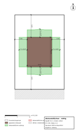
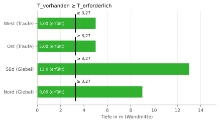
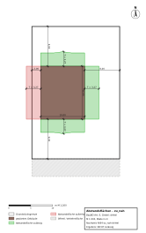
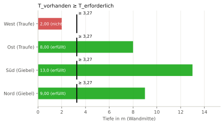
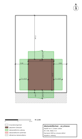
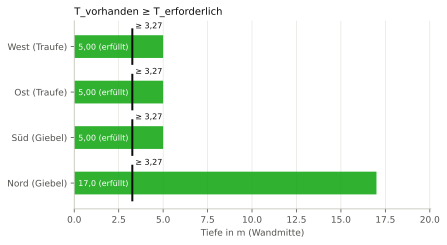
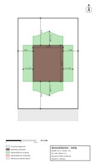
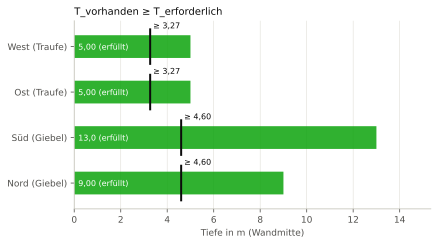

# Nachweisheft B4 – Abstandsflächen (BayBO Art. 6)

## Deckblatt

| Merkmal | Wert |
|---|---|
| Projekt | Beispielhaus Holzrahmenbau |
| Gebäude | Einfamilienhaus (fiktiv) |
| Geschoss | EG |
| Parametermodell | daten/wandelement.json (SHA-256 dcdbed63cc3d9ae5…) |
| Grundstück | daten/grundstueck.json (SHA-256 a60954d2a172493d…) |
| Rechtsstand der Beispiele | 27.09.2026 |
| Hinweis | Beispielrechnung für eine wissenschaftliche Arbeit; keine Rechts- oder Normauskunft, kein geprüfter bautechnischer Nachweis. |
| Verfasser | Entwurfsgenerator (Beispiel), ohne Prüfvermerk |
| Gesamtergebnis | **[NICHT ERFÜLLT]** (3 erfüllt, 1 nicht erfüllt, 0 Hinweis) |
| Heft-Hash (SHA-256) | `bc43ba96d685511ed37f9d3f82eabbba6e4b63c0df1c94e4dee38ddd577353b8` |
| Zeitstempel | nicht gesetzt (deterministischer Lauf) |

Szenario „zu_nah“ ist absichtlich unzulässig und demonstriert den negativen Nachweis.

Regelwerk-Profile:

- `BY-BayBO-2026-05` Version `0.1.0`

Regelquellen:

- BayBO Art. 6 (Fassung ab 01.05.2026) nach Recherche 02; Primärtext nicht geprüft, Fassung ab 01.05.2026 [U]

## Inhaltsverzeichnis

| Nr. | ID | Titel | Status | η | Hash (Anfang) |
|---:|---|---|---|---:|---|
| 1 | [N-B4-mittig-drittel](#n-n-b4-mittig-drittel) | Abstandsflächen Szenario „mittig“ (Haus mittig, 5 m zu den seitlichen Grenzen, Giebel: drittel) | erfüllt | 0,654 | `2891ccaff437` |
| 2 | [N-B4-zu_nah-drittel](#n-n-b4-zu-nah-drittel) | Abstandsflächen Szenario „zu_nah“ (Haus 2 m an die westliche Grenze gerückt, Giebel: drittel) | nicht erfüllt | 1,634 | `97bf3dbd829a` |
| 3 | [N-B4-an_strasse-drittel](#n-n-b4-an-strasse-drittel) | Abstandsflächen Szenario „an_strasse“ (Haus 1 m hinter der Straßengrenze (Süd), Giebel: drittel) | erfüllt | 0,654 | `09720c9ae0a2` |
| 4 | [N-B4-mittig-voll](#n-n-b4-mittig-voll) | Abstandsflächen Szenario „mittig“ (Haus mittig, 5 m zu den seitlichen Grenzen, Giebel: voll) | erfüllt | 0,654 | `3cf9eafbbb0a` |

## N-B4-mittig-drittel – Abstandsflächen Szenario „mittig“ (Haus mittig, 5 m zu den seitlichen Grenzen, Giebel: drittel)

**Ergebnis: [ERFÜLLT]** · maßgebende Ausnutzung η = 0,654

### Gegenstand

| Merkmal | Wert |
|---|---|
| Bezeichnung | Gebäudevorlage Satteldach 10 × 12 m, Szenario mittig (kein IFC-Gebäudemodell in B4; GUID folgt mit dem Gebäudegenerator) |
| IFC-GlobalId | `–` |
| IFC-Klasse | – |
| IFC-Datei (SHA-256) | – (–) |

### Regel

> Vor den Außenwänden sind Abstandsflächen der Tiefe T = 0,4 H, mindestens 3 m, einzuhalten; sie müssen auf dem Grundstück selbst liegen und dürfen bis zur Mitte öffentlicher Verkehrsflächen reichen. H = Wandhöhe + 1/3 der Dachhöhe bei Dachneigung ≤ 70°.

Quelle: BayBO Art. 6 (Fassung ab 01.05.2026) nach Recherche 02; Primärtext nicht geprüft · Fassung: ab 01.05.2026 · Fundstelle: Art. 6 Abs. 2, 4, 5 · Prüfung am Primärtext: [U]  
Regelwerk-Profil: `BY-BayBO-2026-05` Version `0.1.0`

### Eingangsgrößen

| Größe | Symbol | Wert | u (k=1) | Art | Quelle |
|---|---|---:|---:|---|---|
| Giebelbreite (quer zum First) | $b$ | 10 m | – | eingabe | daten/grundstueck.json /gebaeude_vorlage/breite |
| Trauflänge | $l$ | 12 m | – | eingabe | daten/grundstueck.json /gebaeude_vorlage/laenge |
| Wandhöhe bis Schnitt Wand/Dachhaut | $h_{\mathrm{w}}$ | 6,5 m | – | eingabe | daten/grundstueck.json /gebaeude_vorlage/wandhoehe |
| Dachneigung | $\alpha$ | 45 ° | – | eingabe | daten/grundstueck.json /gebaeude_vorlage/dachneigung_grad |
| Lage Südwestecke x | $x_{\mathrm{0}}$ | 5 m | – | eingabe | daten/grundstueck.json Szenario mittig |
| Lage Südwestecke y | $y_{\mathrm{0}}$ | 9 m | – | eingabe | daten/grundstueck.json Szenario mittig |
| Anrechnung Dachhöhe (Neigung ≤ 70°) | $f_{\mathrm{D}}$ | 0,3333333333333333 | – | konstante | BayBO Art. 6 (Fassung ab 01.05.2026) nach Recherche 02; Primärtext nicht geprüft, Abs. 4 |
| Anrechnung Giebeldreieck | $f_{\mathrm{Gi}}$ | 0,3333333333333333 | – | annahme | Lesart „drittel“ (umschaltbar; welche Lesart dem Wortlaut entspricht, ist offen [U]) |
| Faktor Tiefe | $c_{\mathrm{T}}$ | 0,4 | – | konstante | BayBO Art. 6 (Fassung ab 01.05.2026) nach Recherche 02; Primärtext nicht geprüft, Abs. 5 Satz 1 |
| Mindesttiefe | $T_{\mathrm{min}}$ | 3 m | – | konstante | BayBO Art. 6 (Fassung ab 01.05.2026) nach Recherche 02; Primärtext nicht geprüft, Abs. 5 Satz 1 |
| zulässige Fläche außerhalb | $A_{\mathrm{zul}}$ | 0 m² | – | grenzwert | BayBO Art. 6 (Fassung ab 01.05.2026) nach Recherche 02; Primärtext nicht geprüft, Abs. 2 Satz 1: Abstandsflächen auf dem Grundstück selbst |

### Annahmen

- **Annahme:** Gelände eben; Abs. 5a, 6 und 7 sowie Satzungen nach Art. 81 BayBO nicht berücksichtigt.
- **Annahme:** Giebelwand: Tiefe punktweise entlang der Wand (gestauchte Giebelform), unten auf die Mindesttiefe begrenzt.
- **Annahme:** Anrechnung Giebeldreieck (f_Gi) = 0,3333333333333333: Lesart „drittel“ (umschaltbar; welche Lesart dem Wortlaut entspricht, ist offen [U])

### Rechengang

Gerechnet wird ungerundet. Angezeigte Zwischenwerte: 5 signifikante Stellen, Regel B (bei 5 betragsmäßig aufrunden) nach ISO 80000-1:2022 Anh. B.3; entspricht DIN 1333:1992-02; Begründung: Anzeige von Zwischenwerten; gerechnet wird ungerundet (vgl. DIN EN ISO 6946:2018-03, 6.7.1.1: mindestens drei Dezimalstellen).

**Schritt 1: Dachhöhe über Traufe**

$$
h_{\mathrm{D}} = \frac{b}{2} \cdot \tan\left(\alpha\right)
$$

$$
h_{\mathrm{D}} = \frac{10\ \mathrm{m}}{2} \cdot \tan\left(45\ \mathrm{^{\circ}}\right) = 5{,}0000\ \mathrm{m}
$$

Ausdruck (maschinenlesbar): `b/2*tan(alpha)`

**Schritt 2: Maß H der Traufwände** (BayBO Art. 6 (Fassung ab 01.05.2026) nach Recherche 02; Primärtext nicht geprüft, Abs. 4)

$$
H_{\mathrm{T}} = h_{\mathrm{w}} + f_{\mathrm{D}} \cdot h_{\mathrm{D}}
$$

$$
H_{\mathrm{T}} = 6{,}5\ \mathrm{m} + 0{,}3333333333333333 \cdot 5{,}0000\ \mathrm{m} = 8{,}1667\ \mathrm{m}
$$

Ausdruck (maschinenlesbar): `h_w + f_D*h_D`

**Schritt 3: Tiefe der Abstandsfläche Traufe** (Abs. 5)

$$
T_{\mathrm{T}} = \max\left(c_{\mathrm{T}} \cdot H_{\mathrm{T}},\ T_{\mathrm{min}}\right)
$$

$$
T_{\mathrm{T}} = \max\left(0{,}4 \cdot 8{,}1667\ \mathrm{m},\ 3\ \mathrm{m}\right) = 3{,}2667\ \mathrm{m}
$$

Ausdruck (maschinenlesbar): `max(c_T*H_T, T_min)`

**Schritt 4: Maß H der Giebelwände am First** (Abs. 4)

$$
H_{\mathrm{G}} = h_{\mathrm{w}} + f_{\mathrm{Gi}} \cdot h_{\mathrm{D}}
$$

$$
H_{\mathrm{G}} = 6{,}5\ \mathrm{m} + 0{,}3333333333333333 \cdot 5{,}0000\ \mathrm{m} = 8{,}1667\ \mathrm{m}
$$

Ausdruck (maschinenlesbar): `h_w + f_Gi*h_D`

**Schritt 5: Tiefe der Abstandsfläche Giebel (First)** (Abs. 5)

$$
T_{\mathrm{G}} = \max\left(c_{\mathrm{T}} \cdot H_{\mathrm{G}},\ T_{\mathrm{min}}\right)
$$

$$
T_{\mathrm{G}} = \max\left(0{,}4 \cdot 8{,}1667\ \mathrm{m},\ 3\ \mathrm{m}\right) = 3{,}2667\ \mathrm{m}
$$

Ausdruck (maschinenlesbar): `max(c_T*H_G, T_min)`

**Schritt 6: vorhandene Tiefe vor Wand West (Traufe) (Wandmitte bis Grenze der zulässigen Fläche)**

Verfahren: Strahl von der Wandmitte in Richtung der Außennormalen, Schnitt mit dem Rand von Grundstück ∪ halber Straßenbreite (b4_abstandsflaechen.vorhandene_tiefe)

Ergebnis: $T_{\mathrm{v},\mathrm{W}}$ = 5 m

**Schritt 7: Fläche der Abstandsfläche West (Traufe) außerhalb der zulässigen Fläche**

Verfahren: Polygon der Abstandsfläche minus (Grundstück ∪ halbe öffentliche Verkehrsfläche), Flächeninhalt (b4_abstandsflaechen.abstandsflaechen, Polygon.difference)

Ergebnis: $A_{\mathrm{a},\mathrm{W}}$ = 0 m²

**Schritt 8: vorhandene Tiefe vor Wand Ost (Traufe) (Wandmitte bis Grenze der zulässigen Fläche)**

Verfahren: Strahl von der Wandmitte in Richtung der Außennormalen, Schnitt mit dem Rand von Grundstück ∪ halber Straßenbreite (b4_abstandsflaechen.vorhandene_tiefe)

Ergebnis: $T_{\mathrm{v},\mathrm{O}}$ = 5 m

**Schritt 9: Fläche der Abstandsfläche Ost (Traufe) außerhalb der zulässigen Fläche**

Verfahren: Polygon der Abstandsfläche minus (Grundstück ∪ halbe öffentliche Verkehrsfläche), Flächeninhalt (b4_abstandsflaechen.abstandsflaechen, Polygon.difference)

Ergebnis: $A_{\mathrm{a},\mathrm{O}}$ = 0 m²

**Schritt 10: vorhandene Tiefe vor Wand Süd (Giebel) (Wandmitte bis Grenze der zulässigen Fläche)**

Verfahren: Strahl von der Wandmitte in Richtung der Außennormalen, Schnitt mit dem Rand von Grundstück ∪ halber Straßenbreite (b4_abstandsflaechen.vorhandene_tiefe)

Ergebnis: $T_{\mathrm{v},\mathrm{S}}$ = 13 m

**Schritt 11: Fläche der Abstandsfläche Süd (Giebel) außerhalb der zulässigen Fläche**

Verfahren: Polygon der Abstandsfläche minus (Grundstück ∪ halbe öffentliche Verkehrsfläche), Flächeninhalt (b4_abstandsflaechen.abstandsflaechen, Polygon.difference)

Ergebnis: $A_{\mathrm{a},\mathrm{S}}$ = 0 m²

**Schritt 12: vorhandene Tiefe vor Wand Nord (Giebel) (Wandmitte bis Grenze der zulässigen Fläche)**

Verfahren: Strahl von der Wandmitte in Richtung der Außennormalen, Schnitt mit dem Rand von Grundstück ∪ halber Straßenbreite (b4_abstandsflaechen.vorhandene_tiefe)

Ergebnis: $T_{\mathrm{v},\mathrm{N}}$ = 9 m

**Schritt 13: Fläche der Abstandsfläche Nord (Giebel) außerhalb der zulässigen Fläche**

Verfahren: Polygon der Abstandsfläche minus (Grundstück ∪ halbe öffentliche Verkehrsfläche), Flächeninhalt (b4_abstandsflaechen.abstandsflaechen, Polygon.difference)

Ergebnis: $A_{\mathrm{a},\mathrm{N}}$ = 0 m²

### Nachweis

| Kriterium | Ist | Vergleich | Grenzwert | η | Ergebnis | Normverweis |
|---|---:|:---:|---:|---:|---|---|
| West (Traufe): Abstandsfläche auf dem Grundstück | 0,0000 m² | ≤ | 0 m² | – | erfüllt | BayBO Art. 6 (Fassung ab 01.05.2026) nach Recherche 02; Primärtext nicht geprüft, Abs. 2 |
| West (Traufe): vorhandene ≥ erforderliche Tiefe (Wandmitte) | 5,0000 m | ≥ | 3,2667 m | 0,654 | erfüllt | BayBO Art. 6 (Fassung ab 01.05.2026) nach Recherche 02; Primärtext nicht geprüft, Abs. 5 |
| Ost (Traufe): Abstandsfläche auf dem Grundstück | 0,0000 m² | ≤ | 0 m² | – | erfüllt | BayBO Art. 6 (Fassung ab 01.05.2026) nach Recherche 02; Primärtext nicht geprüft, Abs. 2 |
| Ost (Traufe): vorhandene ≥ erforderliche Tiefe (Wandmitte) | 5,0000 m | ≥ | 3,2667 m | 0,654 | erfüllt | BayBO Art. 6 (Fassung ab 01.05.2026) nach Recherche 02; Primärtext nicht geprüft, Abs. 5 |
| Süd (Giebel): Abstandsfläche auf dem Grundstück | 0,0000 m² | ≤ | 0 m² | – | erfüllt | BayBO Art. 6 (Fassung ab 01.05.2026) nach Recherche 02; Primärtext nicht geprüft, Abs. 2 |
| Süd (Giebel): vorhandene ≥ erforderliche Tiefe (Wandmitte) | 13,000 m | ≥ | 3,2667 m | 0,252 | erfüllt | BayBO Art. 6 (Fassung ab 01.05.2026) nach Recherche 02; Primärtext nicht geprüft, Abs. 5 |
| Nord (Giebel): Abstandsfläche auf dem Grundstück | 0,0000 m² | ≤ | 0 m² | – | erfüllt | BayBO Art. 6 (Fassung ab 01.05.2026) nach Recherche 02; Primärtext nicht geprüft, Abs. 2 |
| Nord (Giebel): vorhandene ≥ erforderliche Tiefe (Wandmitte) | 9,0000 m | ≥ | 3,2667 m | 0,363 | erfüllt | BayBO Art. 6 (Fassung ab 01.05.2026) nach Recherche 02; Primärtext nicht geprüft, Abs. 5 |

Der Vergleich erfolgt mit ungerundeten Werten, Toleranzen siehe JSON.

### Gegenrechnung mit dem Rechenkern

| Größe | Rechenkern | Nachweis | Abweichung | Übereinstimmung |
|---|---|---:|---:|---|
| T_T | `b4_abstandsflaechen.pruefe_szenario → T_erforderlich (3 Dez.)` = 3,267 | 3,2666666666666666 | 3,3 · 10⁻⁴ | ja (Toleranz 5 · 10⁻⁴) |
| T_G | `b4_abstandsflaechen.pruefe_szenario → T_erforderlich (3 Dez.)` = 3,267 | 3,2666666666666666 | 3,3 · 10⁻⁴ | ja (Toleranz 5 · 10⁻⁴) |
| h_D | `b4_abstandsflaechen.pruefe_szenario → dachhoehe (3 Dez.)` = 5 | 4,999999999999999 | 8,9 · 10⁻¹⁶ | ja (Toleranz 5 · 10⁻⁴) |

### Hinweise

- Beispielrechnung für eine wissenschaftliche Arbeit; keine Rechts- oder Normauskunft, kein geprüfter bautechnischer Nachweis.

### Grafischer Nachweis

**Abbildung N-B4-mittig-drittel/lageplan: Lageplan mit Abstandsflächen, Szenario mittig (drittel)** (Maßstab 1:200)

Nordrichtung = +y. Grün: Abstandsfläche innerhalb von Grundstück und halber Straße; rot: außerhalb. Die Straße (schraffiert) ist bis zur Mitte anrechenbar.

**Abbildung N-B4-mittig-drittel/tiefen: Vorhandene gegen erforderliche Tiefe je Wand**

### Rückverfolgbarkeit

- Hash (SHA-256): `2891ccaff4379881631e8f5f64d36fd1eb087d9211f40856f6ebe10507e12c56`
- Umfang: kanonisches JSON des Nachweises ohne die Felder hash, zeitstempel und umgebung
- Umgebung: Python 3.11.15, Modul nachweis 1.0.0, Einheiten: pint, Grafik: matplotlib, numpy 2.4.6, pint 0.25.3, matplotlib 3.11.2, shapely 2.1.2, ifcopenshell 0.8.5, ifctester 0.8.5
- Zeitstempel: nicht gesetzt (deterministischer Lauf)

## N-B4-zu_nah-drittel – Abstandsflächen Szenario „zu_nah“ (Haus 2 m an die westliche Grenze gerückt, Giebel: drittel)

**Ergebnis: [NICHT ERFÜLLT]** · maßgebende Ausnutzung η = 1,634

### Gegenstand

| Merkmal | Wert |
|---|---|
| Bezeichnung | Gebäudevorlage Satteldach 10 × 12 m, Szenario zu_nah (kein IFC-Gebäudemodell in B4; GUID folgt mit dem Gebäudegenerator) |
| IFC-GlobalId | `–` |
| IFC-Klasse | – |
| IFC-Datei (SHA-256) | – (–) |

### Regel

> Vor den Außenwänden sind Abstandsflächen der Tiefe T = 0,4 H, mindestens 3 m, einzuhalten; sie müssen auf dem Grundstück selbst liegen und dürfen bis zur Mitte öffentlicher Verkehrsflächen reichen. H = Wandhöhe + 1/3 der Dachhöhe bei Dachneigung ≤ 70°.

Quelle: BayBO Art. 6 (Fassung ab 01.05.2026) nach Recherche 02; Primärtext nicht geprüft · Fassung: ab 01.05.2026 · Fundstelle: Art. 6 Abs. 2, 4, 5 · Prüfung am Primärtext: [U]  
Regelwerk-Profil: `BY-BayBO-2026-05` Version `0.1.0`

### Eingangsgrößen

| Größe | Symbol | Wert | u (k=1) | Art | Quelle |
|---|---|---:|---:|---|---|
| Giebelbreite (quer zum First) | $b$ | 10 m | – | eingabe | daten/grundstueck.json /gebaeude_vorlage/breite |
| Trauflänge | $l$ | 12 m | – | eingabe | daten/grundstueck.json /gebaeude_vorlage/laenge |
| Wandhöhe bis Schnitt Wand/Dachhaut | $h_{\mathrm{w}}$ | 6,5 m | – | eingabe | daten/grundstueck.json /gebaeude_vorlage/wandhoehe |
| Dachneigung | $\alpha$ | 45 ° | – | eingabe | daten/grundstueck.json /gebaeude_vorlage/dachneigung_grad |
| Lage Südwestecke x | $x_{\mathrm{0}}$ | 2 m | – | eingabe | daten/grundstueck.json Szenario zu_nah |
| Lage Südwestecke y | $y_{\mathrm{0}}$ | 9 m | – | eingabe | daten/grundstueck.json Szenario zu_nah |
| Anrechnung Dachhöhe (Neigung ≤ 70°) | $f_{\mathrm{D}}$ | 0,3333333333333333 | – | konstante | BayBO Art. 6 (Fassung ab 01.05.2026) nach Recherche 02; Primärtext nicht geprüft, Abs. 4 |
| Anrechnung Giebeldreieck | $f_{\mathrm{Gi}}$ | 0,3333333333333333 | – | annahme | Lesart „drittel“ (umschaltbar; welche Lesart dem Wortlaut entspricht, ist offen [U]) |
| Faktor Tiefe | $c_{\mathrm{T}}$ | 0,4 | – | konstante | BayBO Art. 6 (Fassung ab 01.05.2026) nach Recherche 02; Primärtext nicht geprüft, Abs. 5 Satz 1 |
| Mindesttiefe | $T_{\mathrm{min}}$ | 3 m | – | konstante | BayBO Art. 6 (Fassung ab 01.05.2026) nach Recherche 02; Primärtext nicht geprüft, Abs. 5 Satz 1 |
| zulässige Fläche außerhalb | $A_{\mathrm{zul}}$ | 0 m² | – | grenzwert | BayBO Art. 6 (Fassung ab 01.05.2026) nach Recherche 02; Primärtext nicht geprüft, Abs. 2 Satz 1: Abstandsflächen auf dem Grundstück selbst |

### Annahmen

- **Annahme:** Gelände eben; Abs. 5a, 6 und 7 sowie Satzungen nach Art. 81 BayBO nicht berücksichtigt.
- **Annahme:** Giebelwand: Tiefe punktweise entlang der Wand (gestauchte Giebelform), unten auf die Mindesttiefe begrenzt.
- **Annahme:** Anrechnung Giebeldreieck (f_Gi) = 0,3333333333333333: Lesart „drittel“ (umschaltbar; welche Lesart dem Wortlaut entspricht, ist offen [U])

### Rechengang

Gerechnet wird ungerundet. Angezeigte Zwischenwerte: 5 signifikante Stellen, Regel B (bei 5 betragsmäßig aufrunden) nach ISO 80000-1:2022 Anh. B.3; entspricht DIN 1333:1992-02; Begründung: Anzeige von Zwischenwerten; gerechnet wird ungerundet (vgl. DIN EN ISO 6946:2018-03, 6.7.1.1: mindestens drei Dezimalstellen).

**Schritt 1: Dachhöhe über Traufe**

$$
h_{\mathrm{D}} = \frac{b}{2} \cdot \tan\left(\alpha\right)
$$

$$
h_{\mathrm{D}} = \frac{10\ \mathrm{m}}{2} \cdot \tan\left(45\ \mathrm{^{\circ}}\right) = 5{,}0000\ \mathrm{m}
$$

Ausdruck (maschinenlesbar): `b/2*tan(alpha)`

**Schritt 2: Maß H der Traufwände** (BayBO Art. 6 (Fassung ab 01.05.2026) nach Recherche 02; Primärtext nicht geprüft, Abs. 4)

$$
H_{\mathrm{T}} = h_{\mathrm{w}} + f_{\mathrm{D}} \cdot h_{\mathrm{D}}
$$

$$
H_{\mathrm{T}} = 6{,}5\ \mathrm{m} + 0{,}3333333333333333 \cdot 5{,}0000\ \mathrm{m} = 8{,}1667\ \mathrm{m}
$$

Ausdruck (maschinenlesbar): `h_w + f_D*h_D`

**Schritt 3: Tiefe der Abstandsfläche Traufe** (Abs. 5)

$$
T_{\mathrm{T}} = \max\left(c_{\mathrm{T}} \cdot H_{\mathrm{T}},\ T_{\mathrm{min}}\right)
$$

$$
T_{\mathrm{T}} = \max\left(0{,}4 \cdot 8{,}1667\ \mathrm{m},\ 3\ \mathrm{m}\right) = 3{,}2667\ \mathrm{m}
$$

Ausdruck (maschinenlesbar): `max(c_T*H_T, T_min)`

**Schritt 4: Maß H der Giebelwände am First** (Abs. 4)

$$
H_{\mathrm{G}} = h_{\mathrm{w}} + f_{\mathrm{Gi}} \cdot h_{\mathrm{D}}
$$

$$
H_{\mathrm{G}} = 6{,}5\ \mathrm{m} + 0{,}3333333333333333 \cdot 5{,}0000\ \mathrm{m} = 8{,}1667\ \mathrm{m}
$$

Ausdruck (maschinenlesbar): `h_w + f_Gi*h_D`

**Schritt 5: Tiefe der Abstandsfläche Giebel (First)** (Abs. 5)

$$
T_{\mathrm{G}} = \max\left(c_{\mathrm{T}} \cdot H_{\mathrm{G}},\ T_{\mathrm{min}}\right)
$$

$$
T_{\mathrm{G}} = \max\left(0{,}4 \cdot 8{,}1667\ \mathrm{m},\ 3\ \mathrm{m}\right) = 3{,}2667\ \mathrm{m}
$$

Ausdruck (maschinenlesbar): `max(c_T*H_G, T_min)`

**Schritt 6: vorhandene Tiefe vor Wand West (Traufe) (Wandmitte bis Grenze der zulässigen Fläche)**

Verfahren: Strahl von der Wandmitte in Richtung der Außennormalen, Schnitt mit dem Rand von Grundstück ∪ halber Straßenbreite (b4_abstandsflaechen.vorhandene_tiefe)

Ergebnis: $T_{\mathrm{v},\mathrm{W}}$ = 2 m

**Schritt 7: Fläche der Abstandsfläche West (Traufe) außerhalb der zulässigen Fläche**

Verfahren: Polygon der Abstandsfläche minus (Grundstück ∪ halbe öffentliche Verkehrsfläche), Flächeninhalt (b4_abstandsflaechen.abstandsflaechen, Polygon.difference)

Ergebnis: $A_{\mathrm{a},\mathrm{W}}$ = 15,2 m²

**Schritt 8: vorhandene Tiefe vor Wand Ost (Traufe) (Wandmitte bis Grenze der zulässigen Fläche)**

Verfahren: Strahl von der Wandmitte in Richtung der Außennormalen, Schnitt mit dem Rand von Grundstück ∪ halber Straßenbreite (b4_abstandsflaechen.vorhandene_tiefe)

Ergebnis: $T_{\mathrm{v},\mathrm{O}}$ = 8 m

**Schritt 9: Fläche der Abstandsfläche Ost (Traufe) außerhalb der zulässigen Fläche**

Verfahren: Polygon der Abstandsfläche minus (Grundstück ∪ halbe öffentliche Verkehrsfläche), Flächeninhalt (b4_abstandsflaechen.abstandsflaechen, Polygon.difference)

Ergebnis: $A_{\mathrm{a},\mathrm{O}}$ = 0 m²

**Schritt 10: vorhandene Tiefe vor Wand Süd (Giebel) (Wandmitte bis Grenze der zulässigen Fläche)**

Verfahren: Strahl von der Wandmitte in Richtung der Außennormalen, Schnitt mit dem Rand von Grundstück ∪ halber Straßenbreite (b4_abstandsflaechen.vorhandene_tiefe)

Ergebnis: $T_{\mathrm{v},\mathrm{S}}$ = 13 m

**Schritt 11: Fläche der Abstandsfläche Süd (Giebel) außerhalb der zulässigen Fläche**

Verfahren: Polygon der Abstandsfläche minus (Grundstück ∪ halbe öffentliche Verkehrsfläche), Flächeninhalt (b4_abstandsflaechen.abstandsflaechen, Polygon.difference)

Ergebnis: $A_{\mathrm{a},\mathrm{S}}$ = 0 m²

**Schritt 12: vorhandene Tiefe vor Wand Nord (Giebel) (Wandmitte bis Grenze der zulässigen Fläche)**

Verfahren: Strahl von der Wandmitte in Richtung der Außennormalen, Schnitt mit dem Rand von Grundstück ∪ halber Straßenbreite (b4_abstandsflaechen.vorhandene_tiefe)

Ergebnis: $T_{\mathrm{v},\mathrm{N}}$ = 9 m

**Schritt 13: Fläche der Abstandsfläche Nord (Giebel) außerhalb der zulässigen Fläche**

Verfahren: Polygon der Abstandsfläche minus (Grundstück ∪ halbe öffentliche Verkehrsfläche), Flächeninhalt (b4_abstandsflaechen.abstandsflaechen, Polygon.difference)

Ergebnis: $A_{\mathrm{a},\mathrm{N}}$ = 0 m²

### Nachweis

| Kriterium | Ist | Vergleich | Grenzwert | η | Ergebnis | Normverweis |
|---|---:|:---:|---:|---:|---|---|
| West (Traufe): Abstandsfläche auf dem Grundstück | 15,200 m² | ≤ | 0 m² | – | **nicht erfüllt** | BayBO Art. 6 (Fassung ab 01.05.2026) nach Recherche 02; Primärtext nicht geprüft, Abs. 2 |
| West (Traufe): vorhandene ≥ erforderliche Tiefe (Wandmitte) | 2,0000 m | ≥ | 3,2667 m | 1,634 | **nicht erfüllt** | BayBO Art. 6 (Fassung ab 01.05.2026) nach Recherche 02; Primärtext nicht geprüft, Abs. 5 |
| Ost (Traufe): Abstandsfläche auf dem Grundstück | 0,0000 m² | ≤ | 0 m² | – | erfüllt | BayBO Art. 6 (Fassung ab 01.05.2026) nach Recherche 02; Primärtext nicht geprüft, Abs. 2 |
| Ost (Traufe): vorhandene ≥ erforderliche Tiefe (Wandmitte) | 8,0000 m | ≥ | 3,2667 m | 0,409 | erfüllt | BayBO Art. 6 (Fassung ab 01.05.2026) nach Recherche 02; Primärtext nicht geprüft, Abs. 5 |
| Süd (Giebel): Abstandsfläche auf dem Grundstück | 0,0000 m² | ≤ | 0 m² | – | erfüllt | BayBO Art. 6 (Fassung ab 01.05.2026) nach Recherche 02; Primärtext nicht geprüft, Abs. 2 |
| Süd (Giebel): vorhandene ≥ erforderliche Tiefe (Wandmitte) | 13,000 m | ≥ | 3,2667 m | 0,252 | erfüllt | BayBO Art. 6 (Fassung ab 01.05.2026) nach Recherche 02; Primärtext nicht geprüft, Abs. 5 |
| Nord (Giebel): Abstandsfläche auf dem Grundstück | 0,0000 m² | ≤ | 0 m² | – | erfüllt | BayBO Art. 6 (Fassung ab 01.05.2026) nach Recherche 02; Primärtext nicht geprüft, Abs. 2 |
| Nord (Giebel): vorhandene ≥ erforderliche Tiefe (Wandmitte) | 9,0000 m | ≥ | 3,2667 m | 0,363 | erfüllt | BayBO Art. 6 (Fassung ab 01.05.2026) nach Recherche 02; Primärtext nicht geprüft, Abs. 5 |

Der Vergleich erfolgt mit ungerundeten Werten, Toleranzen siehe JSON.

### Gegenrechnung mit dem Rechenkern

| Größe | Rechenkern | Nachweis | Abweichung | Übereinstimmung |
|---|---|---:|---:|---|
| T_T | `b4_abstandsflaechen.pruefe_szenario → T_erforderlich (3 Dez.)` = 3,267 | 3,2666666666666666 | 3,3 · 10⁻⁴ | ja (Toleranz 5 · 10⁻⁴) |
| T_G | `b4_abstandsflaechen.pruefe_szenario → T_erforderlich (3 Dez.)` = 3,267 | 3,2666666666666666 | 3,3 · 10⁻⁴ | ja (Toleranz 5 · 10⁻⁴) |
| h_D | `b4_abstandsflaechen.pruefe_szenario → dachhoehe (3 Dez.)` = 5 | 4,999999999999999 | 8,9 · 10⁻¹⁶ | ja (Toleranz 5 · 10⁻⁴) |

### Hinweise

- Beispielrechnung für eine wissenschaftliche Arbeit; keine Rechts- oder Normauskunft, kein geprüfter bautechnischer Nachweis.

### Grafischer Nachweis

**Abbildung N-B4-zu_nah-drittel/lageplan: Lageplan mit Abstandsflächen, Szenario zu_nah (drittel)** (Maßstab 1:200)

Nordrichtung = +y. Grün: Abstandsfläche innerhalb von Grundstück und halber Straße; rot: außerhalb. Die Straße (schraffiert) ist bis zur Mitte anrechenbar.

**Abbildung N-B4-zu_nah-drittel/tiefen: Vorhandene gegen erforderliche Tiefe je Wand**

### Rückverfolgbarkeit

- Hash (SHA-256): `97bf3dbd829a64b081d9c1cbb3208043cb14af0e2dd8f42904574c654a31d0e9`
- Umfang: kanonisches JSON des Nachweises ohne die Felder hash, zeitstempel und umgebung
- Umgebung: Python 3.11.15, Modul nachweis 1.0.0, Einheiten: pint, Grafik: matplotlib, numpy 2.4.6, pint 0.25.3, matplotlib 3.11.2, shapely 2.1.2, ifcopenshell 0.8.5, ifctester 0.8.5
- Zeitstempel: nicht gesetzt (deterministischer Lauf)

## N-B4-an_strasse-drittel – Abstandsflächen Szenario „an_strasse“ (Haus 1 m hinter der Straßengrenze (Süd), Giebel: drittel)

**Ergebnis: [ERFÜLLT]** · maßgebende Ausnutzung η = 0,654

### Gegenstand

| Merkmal | Wert |
|---|---|
| Bezeichnung | Gebäudevorlage Satteldach 10 × 12 m, Szenario an_strasse (kein IFC-Gebäudemodell in B4; GUID folgt mit dem Gebäudegenerator) |
| IFC-GlobalId | `–` |
| IFC-Klasse | – |
| IFC-Datei (SHA-256) | – (–) |

### Regel

> Vor den Außenwänden sind Abstandsflächen der Tiefe T = 0,4 H, mindestens 3 m, einzuhalten; sie müssen auf dem Grundstück selbst liegen und dürfen bis zur Mitte öffentlicher Verkehrsflächen reichen. H = Wandhöhe + 1/3 der Dachhöhe bei Dachneigung ≤ 70°.

Quelle: BayBO Art. 6 (Fassung ab 01.05.2026) nach Recherche 02; Primärtext nicht geprüft · Fassung: ab 01.05.2026 · Fundstelle: Art. 6 Abs. 2, 4, 5 · Prüfung am Primärtext: [U]  
Regelwerk-Profil: `BY-BayBO-2026-05` Version `0.1.0`

### Eingangsgrößen

| Größe | Symbol | Wert | u (k=1) | Art | Quelle |
|---|---|---:|---:|---|---|
| Giebelbreite (quer zum First) | $b$ | 10 m | – | eingabe | daten/grundstueck.json /gebaeude_vorlage/breite |
| Trauflänge | $l$ | 12 m | – | eingabe | daten/grundstueck.json /gebaeude_vorlage/laenge |
| Wandhöhe bis Schnitt Wand/Dachhaut | $h_{\mathrm{w}}$ | 6,5 m | – | eingabe | daten/grundstueck.json /gebaeude_vorlage/wandhoehe |
| Dachneigung | $\alpha$ | 45 ° | – | eingabe | daten/grundstueck.json /gebaeude_vorlage/dachneigung_grad |
| Lage Südwestecke x | $x_{\mathrm{0}}$ | 5 m | – | eingabe | daten/grundstueck.json Szenario an_strasse |
| Lage Südwestecke y | $y_{\mathrm{0}}$ | 1 m | – | eingabe | daten/grundstueck.json Szenario an_strasse |
| Anrechnung Dachhöhe (Neigung ≤ 70°) | $f_{\mathrm{D}}$ | 0,3333333333333333 | – | konstante | BayBO Art. 6 (Fassung ab 01.05.2026) nach Recherche 02; Primärtext nicht geprüft, Abs. 4 |
| Anrechnung Giebeldreieck | $f_{\mathrm{Gi}}$ | 0,3333333333333333 | – | annahme | Lesart „drittel“ (umschaltbar; welche Lesart dem Wortlaut entspricht, ist offen [U]) |
| Faktor Tiefe | $c_{\mathrm{T}}$ | 0,4 | – | konstante | BayBO Art. 6 (Fassung ab 01.05.2026) nach Recherche 02; Primärtext nicht geprüft, Abs. 5 Satz 1 |
| Mindesttiefe | $T_{\mathrm{min}}$ | 3 m | – | konstante | BayBO Art. 6 (Fassung ab 01.05.2026) nach Recherche 02; Primärtext nicht geprüft, Abs. 5 Satz 1 |
| zulässige Fläche außerhalb | $A_{\mathrm{zul}}$ | 0 m² | – | grenzwert | BayBO Art. 6 (Fassung ab 01.05.2026) nach Recherche 02; Primärtext nicht geprüft, Abs. 2 Satz 1: Abstandsflächen auf dem Grundstück selbst |

### Annahmen

- **Annahme:** Gelände eben; Abs. 5a, 6 und 7 sowie Satzungen nach Art. 81 BayBO nicht berücksichtigt.
- **Annahme:** Giebelwand: Tiefe punktweise entlang der Wand (gestauchte Giebelform), unten auf die Mindesttiefe begrenzt.
- **Annahme:** Anrechnung Giebeldreieck (f_Gi) = 0,3333333333333333: Lesart „drittel“ (umschaltbar; welche Lesart dem Wortlaut entspricht, ist offen [U])

### Rechengang

Gerechnet wird ungerundet. Angezeigte Zwischenwerte: 5 signifikante Stellen, Regel B (bei 5 betragsmäßig aufrunden) nach ISO 80000-1:2022 Anh. B.3; entspricht DIN 1333:1992-02; Begründung: Anzeige von Zwischenwerten; gerechnet wird ungerundet (vgl. DIN EN ISO 6946:2018-03, 6.7.1.1: mindestens drei Dezimalstellen).

**Schritt 1: Dachhöhe über Traufe**

$$
h_{\mathrm{D}} = \frac{b}{2} \cdot \tan\left(\alpha\right)
$$

$$
h_{\mathrm{D}} = \frac{10\ \mathrm{m}}{2} \cdot \tan\left(45\ \mathrm{^{\circ}}\right) = 5{,}0000\ \mathrm{m}
$$

Ausdruck (maschinenlesbar): `b/2*tan(alpha)`

**Schritt 2: Maß H der Traufwände** (BayBO Art. 6 (Fassung ab 01.05.2026) nach Recherche 02; Primärtext nicht geprüft, Abs. 4)

$$
H_{\mathrm{T}} = h_{\mathrm{w}} + f_{\mathrm{D}} \cdot h_{\mathrm{D}}
$$

$$
H_{\mathrm{T}} = 6{,}5\ \mathrm{m} + 0{,}3333333333333333 \cdot 5{,}0000\ \mathrm{m} = 8{,}1667\ \mathrm{m}
$$

Ausdruck (maschinenlesbar): `h_w + f_D*h_D`

**Schritt 3: Tiefe der Abstandsfläche Traufe** (Abs. 5)

$$
T_{\mathrm{T}} = \max\left(c_{\mathrm{T}} \cdot H_{\mathrm{T}},\ T_{\mathrm{min}}\right)
$$

$$
T_{\mathrm{T}} = \max\left(0{,}4 \cdot 8{,}1667\ \mathrm{m},\ 3\ \mathrm{m}\right) = 3{,}2667\ \mathrm{m}
$$

Ausdruck (maschinenlesbar): `max(c_T*H_T, T_min)`

**Schritt 4: Maß H der Giebelwände am First** (Abs. 4)

$$
H_{\mathrm{G}} = h_{\mathrm{w}} + f_{\mathrm{Gi}} \cdot h_{\mathrm{D}}
$$

$$
H_{\mathrm{G}} = 6{,}5\ \mathrm{m} + 0{,}3333333333333333 \cdot 5{,}0000\ \mathrm{m} = 8{,}1667\ \mathrm{m}
$$

Ausdruck (maschinenlesbar): `h_w + f_Gi*h_D`

**Schritt 5: Tiefe der Abstandsfläche Giebel (First)** (Abs. 5)

$$
T_{\mathrm{G}} = \max\left(c_{\mathrm{T}} \cdot H_{\mathrm{G}},\ T_{\mathrm{min}}\right)
$$

$$
T_{\mathrm{G}} = \max\left(0{,}4 \cdot 8{,}1667\ \mathrm{m},\ 3\ \mathrm{m}\right) = 3{,}2667\ \mathrm{m}
$$

Ausdruck (maschinenlesbar): `max(c_T*H_G, T_min)`

**Schritt 6: vorhandene Tiefe vor Wand West (Traufe) (Wandmitte bis Grenze der zulässigen Fläche)**

Verfahren: Strahl von der Wandmitte in Richtung der Außennormalen, Schnitt mit dem Rand von Grundstück ∪ halber Straßenbreite (b4_abstandsflaechen.vorhandene_tiefe)

Ergebnis: $T_{\mathrm{v},\mathrm{W}}$ = 5 m

**Schritt 7: Fläche der Abstandsfläche West (Traufe) außerhalb der zulässigen Fläche**

Verfahren: Polygon der Abstandsfläche minus (Grundstück ∪ halbe öffentliche Verkehrsfläche), Flächeninhalt (b4_abstandsflaechen.abstandsflaechen, Polygon.difference)

Ergebnis: $A_{\mathrm{a},\mathrm{W}}$ = 0 m²

**Schritt 8: vorhandene Tiefe vor Wand Ost (Traufe) (Wandmitte bis Grenze der zulässigen Fläche)**

Verfahren: Strahl von der Wandmitte in Richtung der Außennormalen, Schnitt mit dem Rand von Grundstück ∪ halber Straßenbreite (b4_abstandsflaechen.vorhandene_tiefe)

Ergebnis: $T_{\mathrm{v},\mathrm{O}}$ = 5 m

**Schritt 9: Fläche der Abstandsfläche Ost (Traufe) außerhalb der zulässigen Fläche**

Verfahren: Polygon der Abstandsfläche minus (Grundstück ∪ halbe öffentliche Verkehrsfläche), Flächeninhalt (b4_abstandsflaechen.abstandsflaechen, Polygon.difference)

Ergebnis: $A_{\mathrm{a},\mathrm{O}}$ = 0 m²

**Schritt 10: vorhandene Tiefe vor Wand Süd (Giebel) (Wandmitte bis Grenze der zulässigen Fläche)**

Verfahren: Strahl von der Wandmitte in Richtung der Außennormalen, Schnitt mit dem Rand von Grundstück ∪ halber Straßenbreite (b4_abstandsflaechen.vorhandene_tiefe)

Ergebnis: $T_{\mathrm{v},\mathrm{S}}$ = 5 m

**Schritt 11: Fläche der Abstandsfläche Süd (Giebel) außerhalb der zulässigen Fläche**

Verfahren: Polygon der Abstandsfläche minus (Grundstück ∪ halbe öffentliche Verkehrsfläche), Flächeninhalt (b4_abstandsflaechen.abstandsflaechen, Polygon.difference)

Ergebnis: $A_{\mathrm{a},\mathrm{S}}$ = 0 m²

**Schritt 12: vorhandene Tiefe vor Wand Nord (Giebel) (Wandmitte bis Grenze der zulässigen Fläche)**

Verfahren: Strahl von der Wandmitte in Richtung der Außennormalen, Schnitt mit dem Rand von Grundstück ∪ halber Straßenbreite (b4_abstandsflaechen.vorhandene_tiefe)

Ergebnis: $T_{\mathrm{v},\mathrm{N}}$ = 17 m

**Schritt 13: Fläche der Abstandsfläche Nord (Giebel) außerhalb der zulässigen Fläche**

Verfahren: Polygon der Abstandsfläche minus (Grundstück ∪ halbe öffentliche Verkehrsfläche), Flächeninhalt (b4_abstandsflaechen.abstandsflaechen, Polygon.difference)

Ergebnis: $A_{\mathrm{a},\mathrm{N}}$ = 0 m²

### Nachweis

| Kriterium | Ist | Vergleich | Grenzwert | η | Ergebnis | Normverweis |
|---|---:|:---:|---:|---:|---|---|
| West (Traufe): Abstandsfläche auf dem Grundstück | 0,0000 m² | ≤ | 0 m² | – | erfüllt | BayBO Art. 6 (Fassung ab 01.05.2026) nach Recherche 02; Primärtext nicht geprüft, Abs. 2 |
| West (Traufe): vorhandene ≥ erforderliche Tiefe (Wandmitte) | 5,0000 m | ≥ | 3,2667 m | 0,654 | erfüllt | BayBO Art. 6 (Fassung ab 01.05.2026) nach Recherche 02; Primärtext nicht geprüft, Abs. 5 |
| Ost (Traufe): Abstandsfläche auf dem Grundstück | 0,0000 m² | ≤ | 0 m² | – | erfüllt | BayBO Art. 6 (Fassung ab 01.05.2026) nach Recherche 02; Primärtext nicht geprüft, Abs. 2 |
| Ost (Traufe): vorhandene ≥ erforderliche Tiefe (Wandmitte) | 5,0000 m | ≥ | 3,2667 m | 0,654 | erfüllt | BayBO Art. 6 (Fassung ab 01.05.2026) nach Recherche 02; Primärtext nicht geprüft, Abs. 5 |
| Süd (Giebel): Abstandsfläche auf dem Grundstück | 0,0000 m² | ≤ | 0 m² | – | erfüllt | BayBO Art. 6 (Fassung ab 01.05.2026) nach Recherche 02; Primärtext nicht geprüft, Abs. 2 |
| Süd (Giebel): vorhandene ≥ erforderliche Tiefe (Wandmitte) | 5,0000 m | ≥ | 3,2667 m | 0,654 | erfüllt | BayBO Art. 6 (Fassung ab 01.05.2026) nach Recherche 02; Primärtext nicht geprüft, Abs. 5 |
| Nord (Giebel): Abstandsfläche auf dem Grundstück | 0,0000 m² | ≤ | 0 m² | – | erfüllt | BayBO Art. 6 (Fassung ab 01.05.2026) nach Recherche 02; Primärtext nicht geprüft, Abs. 2 |
| Nord (Giebel): vorhandene ≥ erforderliche Tiefe (Wandmitte) | 17,000 m | ≥ | 3,2667 m | 0,193 | erfüllt | BayBO Art. 6 (Fassung ab 01.05.2026) nach Recherche 02; Primärtext nicht geprüft, Abs. 5 |

Der Vergleich erfolgt mit ungerundeten Werten, Toleranzen siehe JSON.

### Gegenrechnung mit dem Rechenkern

| Größe | Rechenkern | Nachweis | Abweichung | Übereinstimmung |
|---|---|---:|---:|---|
| T_T | `b4_abstandsflaechen.pruefe_szenario → T_erforderlich (3 Dez.)` = 3,267 | 3,2666666666666666 | 3,3 · 10⁻⁴ | ja (Toleranz 5 · 10⁻⁴) |
| T_G | `b4_abstandsflaechen.pruefe_szenario → T_erforderlich (3 Dez.)` = 3,267 | 3,2666666666666666 | 3,3 · 10⁻⁴ | ja (Toleranz 5 · 10⁻⁴) |
| h_D | `b4_abstandsflaechen.pruefe_szenario → dachhoehe (3 Dez.)` = 5 | 4,999999999999999 | 8,9 · 10⁻¹⁶ | ja (Toleranz 5 · 10⁻⁴) |

### Hinweise

- Beispielrechnung für eine wissenschaftliche Arbeit; keine Rechts- oder Normauskunft, kein geprüfter bautechnischer Nachweis.

### Grafischer Nachweis

**Abbildung N-B4-an_strasse-drittel/lageplan: Lageplan mit Abstandsflächen, Szenario an_strasse (drittel)** (Maßstab 1:200)

Nordrichtung = +y. Grün: Abstandsfläche innerhalb von Grundstück und halber Straße; rot: außerhalb. Die Straße (schraffiert) ist bis zur Mitte anrechenbar.

**Abbildung N-B4-an_strasse-drittel/tiefen: Vorhandene gegen erforderliche Tiefe je Wand**

### Rückverfolgbarkeit

- Hash (SHA-256): `09720c9ae0a2bc79cd9fede144570b1ef6ec909bf14d26c4ab2592689ea46bed`
- Umfang: kanonisches JSON des Nachweises ohne die Felder hash, zeitstempel und umgebung
- Umgebung: Python 3.11.15, Modul nachweis 1.0.0, Einheiten: pint, Grafik: matplotlib, numpy 2.4.6, pint 0.25.3, matplotlib 3.11.2, shapely 2.1.2, ifcopenshell 0.8.5, ifctester 0.8.5
- Zeitstempel: nicht gesetzt (deterministischer Lauf)

## N-B4-mittig-voll – Abstandsflächen Szenario „mittig“ (Haus mittig, 5 m zu den seitlichen Grenzen, Giebel: voll)

**Ergebnis: [ERFÜLLT]** · maßgebende Ausnutzung η = 0,654

### Gegenstand

| Merkmal | Wert |
|---|---|
| Bezeichnung | Gebäudevorlage Satteldach 10 × 12 m, Szenario mittig (kein IFC-Gebäudemodell in B4; GUID folgt mit dem Gebäudegenerator) |
| IFC-GlobalId | `–` |
| IFC-Klasse | – |
| IFC-Datei (SHA-256) | – (–) |

### Regel

> Vor den Außenwänden sind Abstandsflächen der Tiefe T = 0,4 H, mindestens 3 m, einzuhalten; sie müssen auf dem Grundstück selbst liegen und dürfen bis zur Mitte öffentlicher Verkehrsflächen reichen. H = Wandhöhe + 1/3 der Dachhöhe bei Dachneigung ≤ 70°.

Quelle: BayBO Art. 6 (Fassung ab 01.05.2026) nach Recherche 02; Primärtext nicht geprüft · Fassung: ab 01.05.2026 · Fundstelle: Art. 6 Abs. 2, 4, 5 · Prüfung am Primärtext: [U]  
Regelwerk-Profil: `BY-BayBO-2026-05` Version `0.1.0`

### Eingangsgrößen

| Größe | Symbol | Wert | u (k=1) | Art | Quelle |
|---|---|---:|---:|---|---|
| Giebelbreite (quer zum First) | $b$ | 10 m | – | eingabe | daten/grundstueck.json /gebaeude_vorlage/breite |
| Trauflänge | $l$ | 12 m | – | eingabe | daten/grundstueck.json /gebaeude_vorlage/laenge |
| Wandhöhe bis Schnitt Wand/Dachhaut | $h_{\mathrm{w}}$ | 6,5 m | – | eingabe | daten/grundstueck.json /gebaeude_vorlage/wandhoehe |
| Dachneigung | $\alpha$ | 45 ° | – | eingabe | daten/grundstueck.json /gebaeude_vorlage/dachneigung_grad |
| Lage Südwestecke x | $x_{\mathrm{0}}$ | 5 m | – | eingabe | daten/grundstueck.json Szenario mittig |
| Lage Südwestecke y | $y_{\mathrm{0}}$ | 9 m | – | eingabe | daten/grundstueck.json Szenario mittig |
| Anrechnung Dachhöhe (Neigung ≤ 70°) | $f_{\mathrm{D}}$ | 0,3333333333333333 | – | konstante | BayBO Art. 6 (Fassung ab 01.05.2026) nach Recherche 02; Primärtext nicht geprüft, Abs. 4 |
| Anrechnung Giebeldreieck | $f_{\mathrm{Gi}}$ | 1 | – | annahme | Lesart „voll“ (umschaltbar; welche Lesart dem Wortlaut entspricht, ist offen [U]) |
| Faktor Tiefe | $c_{\mathrm{T}}$ | 0,4 | – | konstante | BayBO Art. 6 (Fassung ab 01.05.2026) nach Recherche 02; Primärtext nicht geprüft, Abs. 5 Satz 1 |
| Mindesttiefe | $T_{\mathrm{min}}$ | 3 m | – | konstante | BayBO Art. 6 (Fassung ab 01.05.2026) nach Recherche 02; Primärtext nicht geprüft, Abs. 5 Satz 1 |
| zulässige Fläche außerhalb | $A_{\mathrm{zul}}$ | 0 m² | – | grenzwert | BayBO Art. 6 (Fassung ab 01.05.2026) nach Recherche 02; Primärtext nicht geprüft, Abs. 2 Satz 1: Abstandsflächen auf dem Grundstück selbst |

### Annahmen

- **Annahme:** Gelände eben; Abs. 5a, 6 und 7 sowie Satzungen nach Art. 81 BayBO nicht berücksichtigt.
- **Annahme:** Giebelwand: Tiefe punktweise entlang der Wand (gestauchte Giebelform), unten auf die Mindesttiefe begrenzt.
- **Annahme:** Anrechnung Giebeldreieck (f_Gi) = 1: Lesart „voll“ (umschaltbar; welche Lesart dem Wortlaut entspricht, ist offen [U])

### Rechengang

Gerechnet wird ungerundet. Angezeigte Zwischenwerte: 5 signifikante Stellen, Regel B (bei 5 betragsmäßig aufrunden) nach ISO 80000-1:2022 Anh. B.3; entspricht DIN 1333:1992-02; Begründung: Anzeige von Zwischenwerten; gerechnet wird ungerundet (vgl. DIN EN ISO 6946:2018-03, 6.7.1.1: mindestens drei Dezimalstellen).

**Schritt 1: Dachhöhe über Traufe**

$$
h_{\mathrm{D}} = \frac{b}{2} \cdot \tan\left(\alpha\right)
$$

$$
h_{\mathrm{D}} = \frac{10\ \mathrm{m}}{2} \cdot \tan\left(45\ \mathrm{^{\circ}}\right) = 5{,}0000\ \mathrm{m}
$$

Ausdruck (maschinenlesbar): `b/2*tan(alpha)`

**Schritt 2: Maß H der Traufwände** (BayBO Art. 6 (Fassung ab 01.05.2026) nach Recherche 02; Primärtext nicht geprüft, Abs. 4)

$$
H_{\mathrm{T}} = h_{\mathrm{w}} + f_{\mathrm{D}} \cdot h_{\mathrm{D}}
$$

$$
H_{\mathrm{T}} = 6{,}5\ \mathrm{m} + 0{,}3333333333333333 \cdot 5{,}0000\ \mathrm{m} = 8{,}1667\ \mathrm{m}
$$

Ausdruck (maschinenlesbar): `h_w + f_D*h_D`

**Schritt 3: Tiefe der Abstandsfläche Traufe** (Abs. 5)

$$
T_{\mathrm{T}} = \max\left(c_{\mathrm{T}} \cdot H_{\mathrm{T}},\ T_{\mathrm{min}}\right)
$$

$$
T_{\mathrm{T}} = \max\left(0{,}4 \cdot 8{,}1667\ \mathrm{m},\ 3\ \mathrm{m}\right) = 3{,}2667\ \mathrm{m}
$$

Ausdruck (maschinenlesbar): `max(c_T*H_T, T_min)`

**Schritt 4: Maß H der Giebelwände am First** (Abs. 4)

$$
H_{\mathrm{G}} = h_{\mathrm{w}} + f_{\mathrm{Gi}} \cdot h_{\mathrm{D}}
$$

$$
H_{\mathrm{G}} = 6{,}5\ \mathrm{m} + 1 \cdot 5{,}0000\ \mathrm{m} = 11{,}500\ \mathrm{m}
$$

Ausdruck (maschinenlesbar): `h_w + f_Gi*h_D`

**Schritt 5: Tiefe der Abstandsfläche Giebel (First)** (Abs. 5)

$$
T_{\mathrm{G}} = \max\left(c_{\mathrm{T}} \cdot H_{\mathrm{G}},\ T_{\mathrm{min}}\right)
$$

$$
T_{\mathrm{G}} = \max\left(0{,}4 \cdot 11{,}500\ \mathrm{m},\ 3\ \mathrm{m}\right) = 4{,}6000\ \mathrm{m}
$$

Ausdruck (maschinenlesbar): `max(c_T*H_G, T_min)`

**Schritt 6: vorhandene Tiefe vor Wand West (Traufe) (Wandmitte bis Grenze der zulässigen Fläche)**

Verfahren: Strahl von der Wandmitte in Richtung der Außennormalen, Schnitt mit dem Rand von Grundstück ∪ halber Straßenbreite (b4_abstandsflaechen.vorhandene_tiefe)

Ergebnis: $T_{\mathrm{v},\mathrm{W}}$ = 5 m

**Schritt 7: Fläche der Abstandsfläche West (Traufe) außerhalb der zulässigen Fläche**

Verfahren: Polygon der Abstandsfläche minus (Grundstück ∪ halbe öffentliche Verkehrsfläche), Flächeninhalt (b4_abstandsflaechen.abstandsflaechen, Polygon.difference)

Ergebnis: $A_{\mathrm{a},\mathrm{W}}$ = 0 m²

**Schritt 8: vorhandene Tiefe vor Wand Ost (Traufe) (Wandmitte bis Grenze der zulässigen Fläche)**

Verfahren: Strahl von der Wandmitte in Richtung der Außennormalen, Schnitt mit dem Rand von Grundstück ∪ halber Straßenbreite (b4_abstandsflaechen.vorhandene_tiefe)

Ergebnis: $T_{\mathrm{v},\mathrm{O}}$ = 5 m

**Schritt 9: Fläche der Abstandsfläche Ost (Traufe) außerhalb der zulässigen Fläche**

Verfahren: Polygon der Abstandsfläche minus (Grundstück ∪ halbe öffentliche Verkehrsfläche), Flächeninhalt (b4_abstandsflaechen.abstandsflaechen, Polygon.difference)

Ergebnis: $A_{\mathrm{a},\mathrm{O}}$ = 0 m²

**Schritt 10: vorhandene Tiefe vor Wand Süd (Giebel) (Wandmitte bis Grenze der zulässigen Fläche)**

Verfahren: Strahl von der Wandmitte in Richtung der Außennormalen, Schnitt mit dem Rand von Grundstück ∪ halber Straßenbreite (b4_abstandsflaechen.vorhandene_tiefe)

Ergebnis: $T_{\mathrm{v},\mathrm{S}}$ = 13 m

**Schritt 11: Fläche der Abstandsfläche Süd (Giebel) außerhalb der zulässigen Fläche**

Verfahren: Polygon der Abstandsfläche minus (Grundstück ∪ halbe öffentliche Verkehrsfläche), Flächeninhalt (b4_abstandsflaechen.abstandsflaechen, Polygon.difference)

Ergebnis: $A_{\mathrm{a},\mathrm{S}}$ = 0 m²

**Schritt 12: vorhandene Tiefe vor Wand Nord (Giebel) (Wandmitte bis Grenze der zulässigen Fläche)**

Verfahren: Strahl von der Wandmitte in Richtung der Außennormalen, Schnitt mit dem Rand von Grundstück ∪ halber Straßenbreite (b4_abstandsflaechen.vorhandene_tiefe)

Ergebnis: $T_{\mathrm{v},\mathrm{N}}$ = 9 m

**Schritt 13: Fläche der Abstandsfläche Nord (Giebel) außerhalb der zulässigen Fläche**

Verfahren: Polygon der Abstandsfläche minus (Grundstück ∪ halbe öffentliche Verkehrsfläche), Flächeninhalt (b4_abstandsflaechen.abstandsflaechen, Polygon.difference)

Ergebnis: $A_{\mathrm{a},\mathrm{N}}$ = 0 m²

### Nachweis

| Kriterium | Ist | Vergleich | Grenzwert | η | Ergebnis | Normverweis |
|---|---:|:---:|---:|---:|---|---|
| West (Traufe): Abstandsfläche auf dem Grundstück | 0,0000 m² | ≤ | 0 m² | – | erfüllt | BayBO Art. 6 (Fassung ab 01.05.2026) nach Recherche 02; Primärtext nicht geprüft, Abs. 2 |
| West (Traufe): vorhandene ≥ erforderliche Tiefe (Wandmitte) | 5,0000 m | ≥ | 3,2667 m | 0,654 | erfüllt | BayBO Art. 6 (Fassung ab 01.05.2026) nach Recherche 02; Primärtext nicht geprüft, Abs. 5 |
| Ost (Traufe): Abstandsfläche auf dem Grundstück | 0,0000 m² | ≤ | 0 m² | – | erfüllt | BayBO Art. 6 (Fassung ab 01.05.2026) nach Recherche 02; Primärtext nicht geprüft, Abs. 2 |
| Ost (Traufe): vorhandene ≥ erforderliche Tiefe (Wandmitte) | 5,0000 m | ≥ | 3,2667 m | 0,654 | erfüllt | BayBO Art. 6 (Fassung ab 01.05.2026) nach Recherche 02; Primärtext nicht geprüft, Abs. 5 |
| Süd (Giebel): Abstandsfläche auf dem Grundstück | 0,0000 m² | ≤ | 0 m² | – | erfüllt | BayBO Art. 6 (Fassung ab 01.05.2026) nach Recherche 02; Primärtext nicht geprüft, Abs. 2 |
| Süd (Giebel): vorhandene ≥ erforderliche Tiefe (Wandmitte) | 13,000 m | ≥ | 4,6000 m | 0,354 | erfüllt | BayBO Art. 6 (Fassung ab 01.05.2026) nach Recherche 02; Primärtext nicht geprüft, Abs. 5 |
| Nord (Giebel): Abstandsfläche auf dem Grundstück | 0,0000 m² | ≤ | 0 m² | – | erfüllt | BayBO Art. 6 (Fassung ab 01.05.2026) nach Recherche 02; Primärtext nicht geprüft, Abs. 2 |
| Nord (Giebel): vorhandene ≥ erforderliche Tiefe (Wandmitte) | 9,0000 m | ≥ | 4,6000 m | 0,512 | erfüllt | BayBO Art. 6 (Fassung ab 01.05.2026) nach Recherche 02; Primärtext nicht geprüft, Abs. 5 |

Der Vergleich erfolgt mit ungerundeten Werten, Toleranzen siehe JSON.

### Gegenrechnung mit dem Rechenkern

| Größe | Rechenkern | Nachweis | Abweichung | Übereinstimmung |
|---|---|---:|---:|---|
| T_T | `b4_abstandsflaechen.pruefe_szenario → T_erforderlich (3 Dez.)` = 3,267 | 3,2666666666666666 | 3,3 · 10⁻⁴ | ja (Toleranz 5 · 10⁻⁴) |
| T_G | `b4_abstandsflaechen.pruefe_szenario → T_erforderlich (3 Dez.)` = 4,6 | 4,6000000000000005 | 8,9 · 10⁻¹⁶ | ja (Toleranz 5 · 10⁻⁴) |
| h_D | `b4_abstandsflaechen.pruefe_szenario → dachhoehe (3 Dez.)` = 5 | 4,999999999999999 | 8,9 · 10⁻¹⁶ | ja (Toleranz 5 · 10⁻⁴) |

### Hinweise

- Beispielrechnung für eine wissenschaftliche Arbeit; keine Rechts- oder Normauskunft, kein geprüfter bautechnischer Nachweis.

### Grafischer Nachweis

**Abbildung N-B4-mittig-voll/lageplan: Lageplan mit Abstandsflächen, Szenario mittig (voll)** (Maßstab 1:200)

Nordrichtung = +y. Grün: Abstandsfläche innerhalb von Grundstück und halber Straße; rot: außerhalb. Die Straße (schraffiert) ist bis zur Mitte anrechenbar.

**Abbildung N-B4-mittig-voll/tiefen: Vorhandene gegen erforderliche Tiefe je Wand**

### Rückverfolgbarkeit

- Hash (SHA-256): `3cf9eafbbb0ac5323b12e13e03c74ec5f5190ceaa8a6ab7eed89586f5523dc45`
- Umfang: kanonisches JSON des Nachweises ohne die Felder hash, zeitstempel und umgebung
- Umgebung: Python 3.11.15, Modul nachweis 1.0.0, Einheiten: pint, Grafik: matplotlib, numpy 2.4.6, pint 0.25.3, matplotlib 3.11.2, shapely 2.1.2, ifcopenshell 0.8.5, ifctester 0.8.5
- Zeitstempel: nicht gesetzt (deterministischer Lauf)

