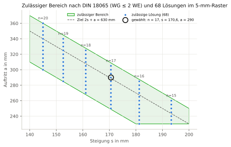
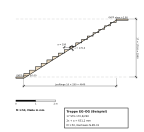

# Nachweisheft B5 – Treppe (DIN 18065)

## Deckblatt

| Merkmal | Wert |
|---|---|
| Projekt | Beispielhaus Holzrahmenbau |
| Gebäude | Einfamilienhaus (fiktiv) |
| Geschoss | EG |
| Parametermodell | daten/wandelement.json (SHA-256 dcdbed63cc3d9ae5…) |
| Grundstück | daten/grundstueck.json (SHA-256 a60954d2a172493d…) |
| Rechtsstand der Beispiele | 27.09.2026 |
| Hinweis | Beispielrechnung für eine wissenschaftliche Arbeit; keine Rechts- oder Normauskunft, kein geprüfter bautechnischer Nachweis. |
| Verfasser | Entwurfsgenerator (Beispiel), ohne Prüfvermerk |
| Gesamtergebnis | **[ERFÜLLT]** (1 erfüllt, 0 nicht erfüllt, 0 Hinweis) |
| Heft-Hash (SHA-256) | `862596797a7df4beb4e51fb57d0bfba326dd9844e2e8fd4832d9bb93c9e36e0e` |
| Zeitstempel | nicht gesetzt (deterministischer Lauf) |

Regelwerk-Profile:

- `DE-DIN18065-WG2WE` Version `0.1.0`

Regelquellen:

- DIN 18065:2020-08, Grenzwerte für Wohngebäude mit höchstens zwei Wohnungen (nach Recherche 02), Fassung 2020-08 [U]

## Inhaltsverzeichnis

| Nr. | ID | Titel | Status | η | Hash (Anfang) |
|---:|---|---|---|---:|---|
| 1 | [N-B5-01](#n-n-b5-01) | Treppenlauf gerade einläufig, Geschosshöhe 2,90 m | erfüllt | 0,972 | `7dc41095ed43` |

## N-B5-01 – Treppenlauf gerade einläufig, Geschosshöhe 2,90 m

**Ergebnis: [ERFÜLLT]** · maßgebende Ausnutzung η = 0,972

### Gegenstand

| Merkmal | Wert |
|---|---|
| Bezeichnung | notwendige Treppe EG–OG, gerade einläufig (kein IFC-Modell in B5; IfcStair folgt mit dem Gebäudegenerator) |
| IFC-GlobalId | `–` |
| IFC-Klasse | – |
| IFC-Datei (SHA-256) | – (–) |

### Regel

> Baurechtlich notwendige Treppe in Wohngebäuden mit höchstens zwei Wohnungen: Steigung 140 … 200 mm, Auftritt 230 … 370 mm, Schrittmaß 2s + a = 590 … 650 mm, nutzbare Laufbreite ≥ 800 mm.

Quelle: DIN 18065:2020-08, Grenzwerte für Wohngebäude mit höchstens zwei Wohnungen (nach Recherche 02) · Fassung: 2020-08 · Fundstelle: Tabelle der Grenzmaße (Tabellen nicht übernommen) · Prüfung am Primärtext: [U]  
Regelwerk-Profil: `DE-DIN18065-WG2WE` Version `0.1.0`

### Eingangsgrößen

| Größe | Symbol | Wert | u (k=1) | Art | Quelle |
|---|---|---:|---:|---|---|
| Geschosshöhe (OKFF bis OKFF) | $h_{\mathrm{G}}$ | 2900 mm | – | eingabe | Eingabe (Kommandozeile B5, Standard 2,90 m) |
| nutzbare Laufbreite | $b_{\mathrm{L}}$ | 900 mm | – | eingabe | Eingabe (Kommandozeile B5) |
| Fertigungsraster Auftritt | $r_{\mathrm{a}}$ | 5 mm | – | annahme | Annahme B5: übliches Raster im Treppenbau |
| Steigung min. | $s_{\mathrm{min}}$ | 140 mm | – | grenzwert | DIN 18065:2020-08, Grenzwerte für Wohngebäude mit höchstens zwei Wohnungen (nach Recherche 02); b5_treppe_din18065.GRENZEN |
| Steigung max. | $s_{\mathrm{max}}$ | 200 mm | – | grenzwert | DIN 18065:2020-08, Grenzwerte für Wohngebäude mit höchstens zwei Wohnungen (nach Recherche 02); b5_treppe_din18065.GRENZEN |
| Auftritt min. | $a_{\mathrm{min}}$ | 230 mm | – | grenzwert | DIN 18065:2020-08, Grenzwerte für Wohngebäude mit höchstens zwei Wohnungen (nach Recherche 02); b5_treppe_din18065.GRENZEN |
| Auftritt max. | $a_{\mathrm{max}}$ | 370 mm | – | grenzwert | DIN 18065:2020-08, Grenzwerte für Wohngebäude mit höchstens zwei Wohnungen (nach Recherche 02); b5_treppe_din18065.GRENZEN |
| Schrittmaß min. | $S_{\mathrm{min}}$ | 590 mm | – | grenzwert | DIN 18065:2020-08, Grenzwerte für Wohngebäude mit höchstens zwei Wohnungen (nach Recherche 02); b5_treppe_din18065.GRENZEN |
| Schrittmaß max. | $S_{\mathrm{max}}$ | 650 mm | – | grenzwert | DIN 18065:2020-08, Grenzwerte für Wohngebäude mit höchstens zwei Wohnungen (nach Recherche 02); b5_treppe_din18065.GRENZEN |
| Laufbreite min. | $b_{\mathrm{min}}$ | 800 mm | – | grenzwert | DIN 18065:2020-08, Grenzwerte für Wohngebäude mit höchstens zwei Wohnungen (nach Recherche 02); b5_treppe_din18065.GRENZEN |
| Zielwert Schrittmaß | $S_{\mathrm{Z}}$ | 630 mm | – | annahme | Vorgabe der Aufgabe (Rangfolge, keine Normanforderung) |

### Annahmen

- **Annahme:** Nur gerade einläufige Treppe; Kopfhöhe, Podeste, Wendelung und Maßtoleranzen sind nicht geprüft.
- **Annahme:** Bequemlichkeits- und Sicherheitsregel sind Faustregeln und dienen nur der Rangfolge.
- **Annahme:** Fertigungsraster Auftritt (r_a) = 5 mm: Annahme B5: übliches Raster im Treppenbau
- **Annahme:** Zielwert Schrittmaß (S_Z) = 630 mm: Vorgabe der Aufgabe (Rangfolge, keine Normanforderung)

### Rechengang

Gerechnet wird ungerundet. Angezeigte Zwischenwerte: 5 signifikante Stellen, Regel B (bei 5 betragsmäßig aufrunden) nach ISO 80000-1:2022 Anh. B.3; entspricht DIN 1333:1992-02; Begründung: Anzeige von Zwischenwerten; gerechnet wird ungerundet (vgl. DIN EN ISO 6946:2018-03, 6.7.1.1: mindestens drei Dezimalstellen).

**Schritt 1: kleinste Steigungszahl**

$$
n_{\mathrm{min}} = \left\lceil \frac{h_{\mathrm{G}}}{s_{\mathrm{max}}} \right\rceil
$$

$$
n_{\mathrm{min}} = \left\lceil \frac{2900\ \mathrm{mm}}{200\ \mathrm{mm}} \right\rceil = 15{,}000
$$

Ausdruck (maschinenlesbar): `ceil(h_G/s_max)`

**Schritt 2: größte Steigungszahl**

$$
n_{\mathrm{max}} = \left\lfloor \frac{h_{\mathrm{G}}}{s_{\mathrm{min}}} \right\rfloor
$$

$$
n_{\mathrm{max}} = \left\lfloor \frac{2900\ \mathrm{mm}}{140\ \mathrm{mm}} \right\rfloor = 20{,}000
$$

Ausdruck (maschinenlesbar): `floor(h_G/s_min)`

**Schritt 3: zulässige Lösungen im Suchraum**

Verfahren: vollständige Aufzählung n = n_min … n_max, a im Raster 5 mm, Filter nach allen Grenzwerten (exakte Arithmetik mit fractions.Fraction)

Ergebnis: $N_{\mathrm{L}}$ = 68

**Schritt 4: gewählte Steigungszahl**

Verfahren: lexikografische Rangfolge: |2s+a−630| (Toleranz ≤ halbe Rasterweite), |a−s−120|, |a+s−460|, Lauflänge

Ergebnis: $n$ = 17

**Schritt 5: gewählter Auftritt**

Verfahren: wie vor

Ergebnis: $a$ = 290 mm

**Schritt 6: Steigung (alle gleich)**

$$
s = \frac{h_{\mathrm{G}}}{n}
$$

$$
s = \frac{2900\ \mathrm{mm}}{17} = 170{,}59\ \mathrm{mm}
$$

Ausdruck (maschinenlesbar): `h_G/n`

**Schritt 7: Schrittmaß** (Schrittmaßregel 2s + a)

$$
S = 2 \cdot s + a
$$

$$
S = 2 \cdot 170{,}59\ \mathrm{mm} + 290\ \mathrm{mm} = 631{,}18\ \mathrm{mm}
$$

Ausdruck (maschinenlesbar): `2*s + a`

**Schritt 8: Lauflänge (n − 1 Auftritte)**

$$
l_{\mathrm{L}} = \left(n - 1\right) \cdot a
$$

$$
l_{\mathrm{L}} = \left(17 - 1\right) \cdot 290\ \mathrm{mm} = 4640{,}0\ \mathrm{mm}
$$

Ausdruck (maschinenlesbar): `(n - 1)*a`

**Schritt 9: Abweichung vom Zielschrittmaß**

$$
\mathrm{dS} = \left|S - S_{\mathrm{Z}}\right|
$$

$$
\mathrm{dS} = \left|631{,}18\ \mathrm{mm} - 630\ \mathrm{mm}\right| = 1{,}1765\ \mathrm{mm}
$$

Ausdruck (maschinenlesbar): `abs(S - S_Z)`

### Nachweis

| Kriterium | Ist | Vergleich | Grenzwert | η | Ergebnis | Normverweis |
|---|---:|:---:|---:|---:|---|---|
| Steigung ≥ min. | 170,6 mm | ≥ | 140 mm | 0,821 | erfüllt | DIN 18065:2020-08, Grenzwerte für Wohngebäude mit höchstens zwei Wohnungen (nach Recherche 02) |
| Steigung ≤ max. | 170,6 mm | ≤ | 200 mm | 0,853 | erfüllt | DIN 18065:2020-08, Grenzwerte für Wohngebäude mit höchstens zwei Wohnungen (nach Recherche 02) |
| Auftritt ≥ min. | 290 mm | ≥ | 230 mm | 0,794 | erfüllt | DIN 18065:2020-08, Grenzwerte für Wohngebäude mit höchstens zwei Wohnungen (nach Recherche 02) |
| Auftritt ≤ max. | 290 mm | ≤ | 370 mm | 0,784 | erfüllt | DIN 18065:2020-08, Grenzwerte für Wohngebäude mit höchstens zwei Wohnungen (nach Recherche 02) |
| Schrittmaß ≥ min. | 631,2 mm | ≥ | 590 mm | 0,935 | erfüllt | DIN 18065:2020-08, Grenzwerte für Wohngebäude mit höchstens zwei Wohnungen (nach Recherche 02) |
| Schrittmaß ≤ max. | 631,2 mm | ≤ | 650 mm | 0,972 | erfüllt | DIN 18065:2020-08, Grenzwerte für Wohngebäude mit höchstens zwei Wohnungen (nach Recherche 02) |
| Laufbreite ≥ min. | 900 mm | ≥ | 800 mm | 0,889 | erfüllt | DIN 18065:2020-08, Grenzwerte für Wohngebäude mit höchstens zwei Wohnungen (nach Recherche 02) |

Der Vergleich erfolgt mit ungerundeten Werten.

Rundung des Ergebnisses: 1 Dezimalstelle, Regel B (bei 5 betragsmäßig aufrunden) nach ISO 80000-1:2022 Anh. B.3; entspricht DIN 1333:1992-02.

### Gegenrechnung mit dem Rechenkern

| Größe | Rechenkern | Nachweis | Abweichung | Übereinstimmung |
|---|---|---:|---:|---|
| s | `b5_treppe_din18065.loese → s_mm (2 Dez.)` = 170,59 | 170,58823529411765 | 1.76e-03 | ja (Toleranz 5e-03) |
| S | `b5_treppe_din18065.loese → schrittmass_mm (2 Dez.)` = 631,18 | 631,1764705882354 | 3.53e-03 | ja (Toleranz 5e-03) |
| l_L | `b5_treppe_din18065.loese → lauflaenge_mm` = 4640 | 4640 | 0.00e+00 | ja (Toleranz 1e-09) |
| N_L | `ergebnisse.md: 68 Lösungen` = 68 | 68 | 0.00e+00 | ja (Toleranz 0e+00) |

### Hinweise

- Beispielrechnung für eine wissenschaftliche Arbeit; keine Rechts- oder Normauskunft, kein geprüfter bautechnischer Nachweis.

### Grafischer Nachweis

**Abbildung N-B5-01/schrittmass: Schrittmaß-Diagramm: alle zulässigen Lösungen**

Jede Spalte gehört zu einer Steigungszahl n (s = h/n); innerhalb der Spalte variiert a im Raster.

**Abbildung N-B5-01/schnitt: Treppenschnitt der gewählten Lösung (17 Steigungen)** (Maßstab 1:50)

Stufenprofil schematisch; Laufplatte und Stufenstärke nicht bemessen.

### Rückverfolgbarkeit

- Hash (SHA-256): `7dc41095ed4385399614491cdb7cfa8796f2222823fe6e3ca23ca0910e143085`
- Umfang: kanonisches JSON des Nachweises ohne die Felder hash, zeitstempel und umgebung
- Umgebung: Python 3.11.15, Modul nachweis 1.0.0, Einheiten: pint, Grafik: matplotlib, numpy 2.4.6, pint 0.25.3, matplotlib 3.11.2, shapely 2.1.2, ifcopenshell 0.8.5, ifctester 0.8.5
- Zeitstempel: nicht gesetzt (deterministischer Lauf)

